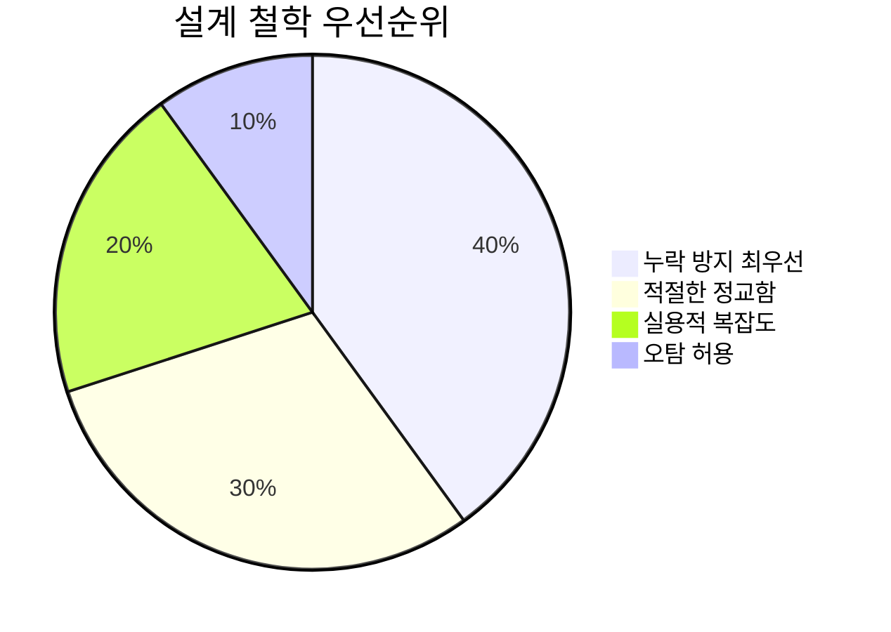
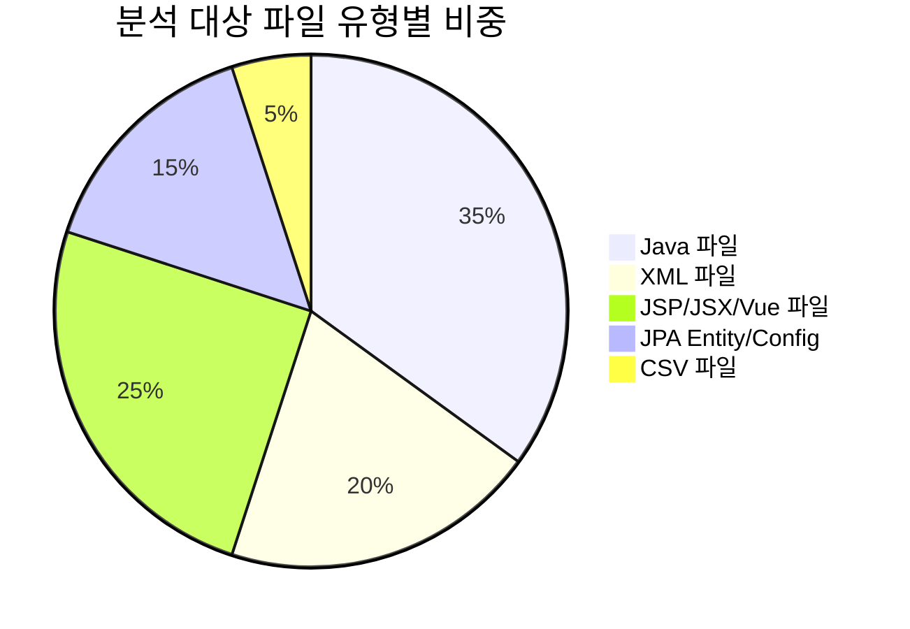
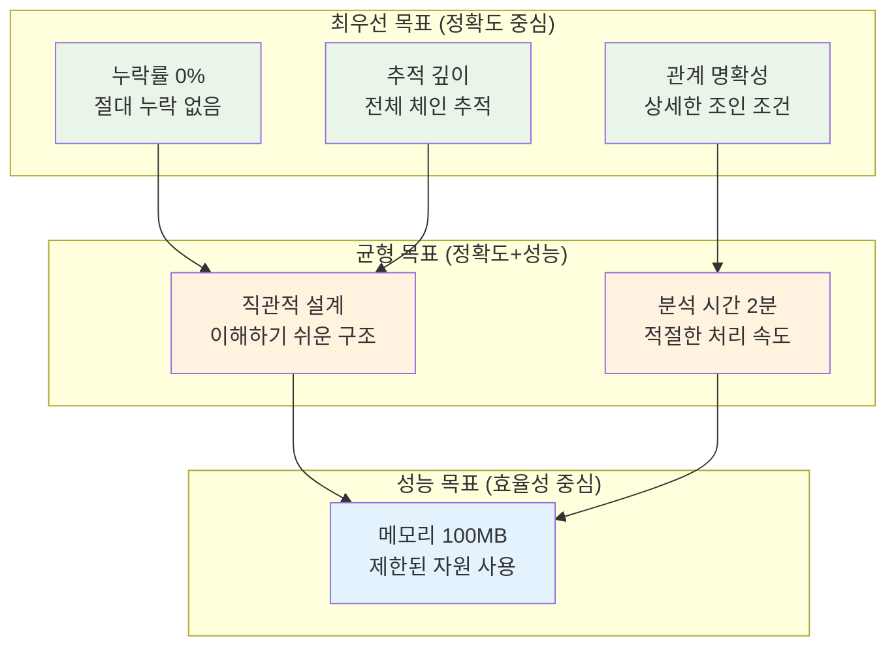
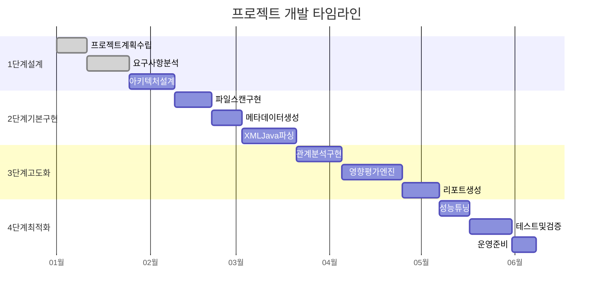

# SourceAnalyzer 프로젝트 개요 및 목적

## 프로젝트 배경

### 영향평가의 중요성
현대 소프트웨어 개발에서 **영향평가**는 안전한 시스템 변경을 위한 필수 과정입니다. 하나의 테이블이나 API를 수정할 때 어떤 파일들이 영향받는지 정확히 파악하지 못하면 운영 장애로 이어질 수 있습니다.

### 영향평가 시스템의 필요성
**영향평가**에 특화된 소스 분석 시스템이 필요합니다:

```
영향평가 시나리오:
"USERS 테이블을 수정하면 어떤 파일들이 영향받나?"

필요한 정보:
1. USERS 테이블을 사용하는 모든 SQL 쿼리
2. 해당 쿼리가 포함된 XML 파일  
3. 해당 XML을 호출하는 Java 메서드
4. 해당 메서드가 속한 Java 클래스
5. 해당 클래스를 호출하는 프론트엔드 파일
6. 테이블 간 조인 관계 (어떤 컬럼으로 연결되는가)
```

## 프로젝트 목적

### 핵심 목표
**영향평가에 최적화된 소스 분석 시스템 개발**

### 설계 철학 우선순위



1. **누락 방지 최우선**: 100% 이상 추출 (과도하더라도 누락은 절대 안됨)
2. **적절한 정교함**: 다양한 SQL 패턴 대응 (별칭, 동적 SQL 등)
3. **오탐 허용**: 중복과 오탐은 있어도 되지만 과도하면 안됨
4. **실용적 복잡도**: 목적 달성에 필요한 수준의 정교함

### 시스템 설계 원칙
```
1순위: 누락 방지 (최우선)
- 누락률 0% - 영향평가에서 절대 누락 없음
- 의심스러우면 포함하는 정책
- 오탐은 허용 가능 (과도한 검토는 하지만 장애는 없음)

2순위: 적절한 정교함  
- 다양한 SQL 패턴 대응 (JOIN, 서브쿼리, 동적 SQL 등)
- 테이블 별칭 처리
- 환경별 동적 테이블명 처리

3순위: 성능 및 유지보수성
- 합리적인 처리 시간
- 단순하고 이해하기 쉬운 코드
- 새로운 패턴 추가 용이성
```

## 시스템 범위

### 분석 대상 비율



- **Java 파일**: 클래스, 메서드, API 매핑, 문자열 SQL
- **XML 파일**: MyBatis 매퍼, SQL 쿼리, 동적 SQL, JPA 설정
- **JSP/JSX/Vue 파일**: 프론트엔드 페이지, API 호출, 컴포넌트
- **JPA Entity/Config**: JPA 엔티티, Repository, 설정 파일
- **CSV 파일**: 데이터베이스 스키마 (테이블, 컬럼)

### 생성할 메타데이터
```
고정 데이터 (CSV/파일 기반):
- projects: 프로젝트 정보
- files: 소스 파일 목록
- tables: 실제 DB 스키마 테이블  
- columns: 실제 DB 스키마 컬럼

동적 데이터 (소스 분석 기반):
- components: 클래스, 메서드, 쿼리, API 등 (INFERRED 포함)
- relationships: 컴포넌트 간 관계 (호출, 사용, 조인 등)
```

### 핵심 관계 유형
1. **파일 → 클래스**: Java 파일에 포함된 클래스들
2. **클래스 → 메서드**: 클래스에 속한 메서드들  
3. **메서드 → 쿼리**: 메서드에서 호출하는 SQL 쿼리
4. **쿼리 → 테이블**: 쿼리에서 접근하는 테이블
5. **테이블 → 컬럼**: 테이블에 속한 컬럼들
6. **테이블 ↔ 테이블**: 조인 관계 (어떤 컬럼으로 연결)
7. **프론트엔드 → API**: JSP/JSX/Vue에서 호출하는 API
8. **JPA Entity → 테이블**: JPA 엔티티와 데이터베이스 테이블 매핑
9. **JPA Repository → 쿼리**: JPA Repository 메서드와 생성되는 SQL 쿼리
10. **Vue 컴포넌트 → API**: Vue.js 컴포넌트에서 REST API 호출

## 시스템 목표

### 시스템 목표 우선순위 매트릭스



### 영향평가 정확도 목표
- **누락률**: 0% (절대 누락 없음 - 100% 이상 추출)
- **추적 깊이**: 프론트엔드부터 데이터베이스까지 전체 호출 체인
- **관계 명확성**: 테이블 간 조인 조건까지 상세 추적
- **오탐 허용**: 의심스러우면 포함 (과도하지 않은 선에서)

### 시스템 성능 목표  
- **분석 시간**: SampleSrc 프로젝트 2분 이내 완료
- **메모리 사용**: 100MB 이하
- **코드 복잡도**: 적절한 수준 (목적 달성에 필요한 만큼)

### 시스템 특성 목표
- **직관적 설계**: 신규 개발자도 빠른 이해 가능
- **확장성**: 새로운 프로젝트 추가 용이
- **안정성**: 부분 실패해도 정보 추출 가능

## 성공 기준

### 개발 단계별 타임라인



### 정량적 목표
- **처리 시간**: SampleSrc 프로젝트 2분 이내 완료
- **누락률**: 0% (절대 누락 없음)
- **추출률**: 100% 이상 (의심스러우면 포함)
- **메모리 사용량**: 100MB 이하
- **코드 라인 수**: 적절한 수준 (목적 달성에 필요한 만큼)

### 정성적 목표
- **직관적 이해**: 신규 개발자도 1일 내 이해 가능
- **확장 용이성**: 새로운 프로젝트 추가 30분 이내
- **영향평가 실용성**: 실제 운영 환경에서 활용 가능

---

**작성자**: SourceAnalyzer Team  
**작성일**: 2025-09-19  
**문서 버전**: 1.0  
**다음 문서**: [03_시스템_아키텍처_설계.md](./03_시스템_아키텍처_설계.md)
