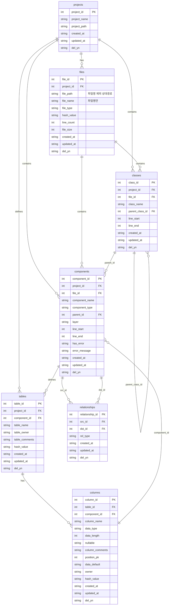
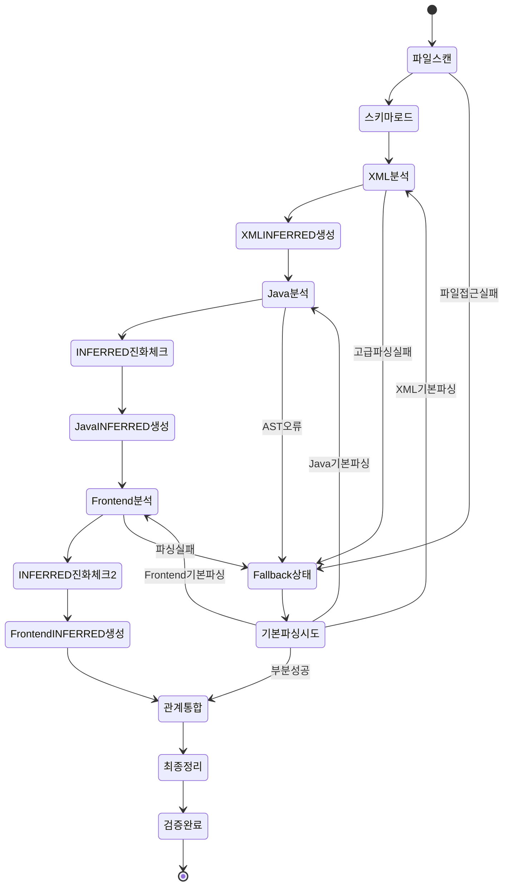
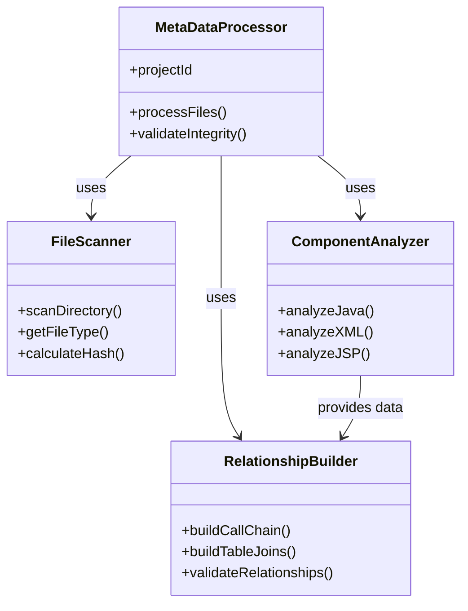
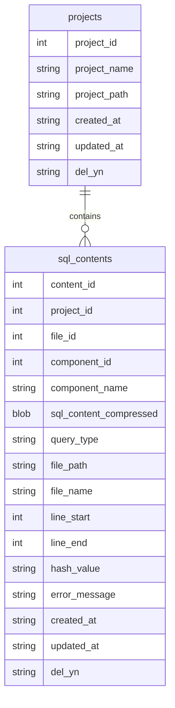

# SourceAnalyzer 메타데이터베이스 스키마 설계

## 문서 목적

이 문서는 **영향평가에 최적화된 SourceAnalyzer 시스템**의 메타데이터베이스 스키마 구조를 설명합니다.  
**설계 목적**: 소스 코드 컴포넌트 간 관계 추적 및 영향평가 지원  
**대상 독자**: 개발자, DBA, 시스템 아키텍트  

## 개요

SourceAnalyzer 시스템의 메타데이터베이스는 **영향평가**를 위한 소스 코드 관계 정보를 저장합니다. 프론트엔드부터 데이터베이스까지의 전체 호출 체인을 추적할 수 있도록 설계되었습니다.

**중요**: 
- **소스분석기**: SQLite 사용 (메타데이터 저장)
- **분석 대상 소스코드**: Oracle 사용 (분석 대상)

## 스키마 버전

- **버전**: v5.0 (영향평가 최적화)
- **설계 목적**: 영향평가 전용 메타데이터 관리
- **최적화 방향**: 불필요한 컬럼 제거, 핵심 관계 정보에 집중
- **시간대**: 한국 시간대(KST) 적용 (UTC+9)
- **최종 수정**: 2025-09-19

## ERD (Entity Relationship Diagram)



## 데이터베이스 구조

### 메타데이터베이스 (metadata.db)
**총 테이블 수**: 7개 (projects, files, classes, components, tables, columns, relationships)

### SQL Content 데이터베이스 (SqlContent.db)  
**총 테이블 수**: 2개 (projects, sql_contents)

## 메타데이터베이스 테이블 정의

### 1. projects (프로젝트 정보)

영향평가 대상 프로젝트의 기본 정보를 저장합니다.

| 컬럼명          | 데이터타입        | 제약조건                                  | 설명          |
| ------------ | ------------ | ------------------------------------- | ----------- |
| project_id   | INTEGER      | PRIMARY KEY, AUTOINCREMENT            | 프로젝트 고유 ID  |
| project_name | VARCHAR(100) | NOT NULL                              | 프로젝트명       |
| project_path | VARCHAR(500) | NOT NULL                              | 프로젝트 상대 경로 |
| created_at   | DATETIME     | DEFAULT (datetime('now', '+9 hours')) | 생성일시 (KST)  |
| updated_at   | DATETIME     | DEFAULT (datetime('now', '+9 hours')) | 수정일시 (KST)  |
| del_yn       | CHAR(1)      | DEFAULT 'N'                           | 삭제 여부 (Y/N) |

**최적화 포인트**: 영향평가에 필요한 핵심 정보만 저장

### 2. files (파일 정보)

영향평가 대상 소스 파일들의 정보를 저장합니다.

| 컬럼명           | 데이터타입        | 제약조건                                  | 설명                          |
| ------------- | ------------ | ------------------------------------- | --------------------------- |
| file_id       | INTEGER      | PRIMARY KEY, AUTOINCREMENT            | 파일 고유 ID                    |
| project_id    | INTEGER      | NOT NULL, FK                          | 프로젝트 ID                     |
| file_path     | VARCHAR(500) | NOT NULL                              | **파일명을 제외한 상대경로** (예: `src/main/java/com/example/controller`) |
| file_name     | VARCHAR(200) | NOT NULL                              | **파일명만** (예: `UserController.java`) |
| file_type     | VARCHAR(20)  | NOT NULL                              | 파일 타입 (java, xml, jsp, jsx 등) |
| hash_value    | VARCHAR(64)  | NOT NULL                              | 파일 내용 변경 감지용 해시값            |
| created_at    | DATETIME     | DEFAULT (datetime('now', '+9 hours')) | 생성일시 (KST)                 |
| updated_at    | DATETIME     | DEFAULT (datetime('now', '+9 hours')) | 수정일시 (KST)                 |
| del_yn        | CHAR(1)      | DEFAULT 'N'                           | 삭제 여부 (Y/N)                 |
| line_count    | INTEGER      |                                       | 파일 총 라인 수                   |
| file_size     | INTEGER      |                                       | 파일 크기 (바이트)                |

#### 경로 및 파일명 저장 규칙

**기존 메타데이터베이스 분석 결과를 바탕으로 한 저장 방식**:

1. **file_path**: 파일명을 제외한 상대경로만 저장
   - ✅ 올바른 예시: `src/main/java/com/example/controller`
   - ❌ 잘못된 예시: `src/main/java/com/example/controller/UserController.java`

2. **file_name**: 파일명만 저장 (확장자 포함)
   - ✅ 올바른 예시: `UserController.java`, `user-list.jsp`, `App.vue`
   - ❌ 잘못된 예시: `src/main/java/com/example/controller/UserController.java`

3. **실제 저장 예시** (기존 메타데이터베이스 기준):
   ```
   file_path: src\main\webapp\user
   file_name: list.jsp
   
   file_path: src\com\example\dynamicquery
   file_name: UserDao.java
   ```

#### 경로 구분자 통일 정책 (크로스플랫폼 대응)

**문제점**: 기존 메타데이터베이스에서 동일 파일이 두 가지 경로 구분자로 중복 저장됨
```
❌ 중복 저장 문제:
src/main/java/com/example/servlet/AdvancedReportServlet.java  (Unix 스타일)
src\main\java\com\example\servlet\AdvancedReportServlet.java  (Windows 스타일)
```

**통일 방안**: **Unix 스타일(`/`) 구분자로 통일**

**선택 이유**:
- ✅ **웹 표준**: HTTP URL, 웹 경로는 모두 `/` 사용
- ✅ **데이터베이스 호환성**: 대부분의 DB에서 `/`를 표준으로 사용  
- ✅ **크로스플랫폼 라이브러리**: Python, Java 등에서 `/`를 권장
- ✅ **Git 호환성**: Git은 내부적으로 `/` 사용
- ✅ **Linux/Unix 우선**: 운영환경(RHEL)이 Unix 기반

**구현 방법**:
1. **파일 저장 시**: `path_utils.normalize_path_separator(path, 'unix')` 호출
2. **데이터베이스 저장 전**: 모든 경로를 `/` 구분자로 정규화
3. **기존 데이터 마이그레이션**: 중복 제거 및 `/` 구분자로 통일

**정규화 후 예시**:
```
✅ 통일된 저장:
file_path: src/main/java/com/example/servlet
file_name: AdvancedReportServlet.java
```

**최적화 포인트**: 영향평가에 집중, 파일 추적에 필요한 정보만 포함, 경로와 파일명 분리로 중복 제거

### 3. classes (클래스 정보)

Java 클래스의 기본 정보를 저장합니다.

| 컬럼명             | 데이터타입        | 제약조건                                  | 설명              |
| --------------- | ------------ | ------------------------------------- | --------------- |
| class_id        | INTEGER      | PRIMARY KEY, AUTOINCREMENT            | 클래스 고유 ID       |
| project_id      | INTEGER      | NOT NULL, FK                          | 프로젝트 ID         |
| file_id         | INTEGER      | NOT NULL, FK                          | 파일 ID           |
| class_name      | VARCHAR(200) | NOT NULL                              | 클래스명            |
| parent_class_id | INTEGER      | FK                                    | 상속/구현 부모 클래스 ID |
| line_start      | INTEGER      |                                       | 시작 라인           |
| line_end        | INTEGER      |                                       | 종료 라인           |
| created_at      | DATETIME     | DEFAULT (datetime('now', '+9 hours')) | 생성일시 (KST)      |
| updated_at      | DATETIME     | DEFAULT (datetime('now', '+9 hours')) | 수정일시 (KST)      |
| del_yn          | CHAR(1)      | DEFAULT 'N'                           | 삭제 여부 (Y/N)     |

**최적화 포인트**: 클래스 상속 관계 추적에 필요한 핵심 정보만 포함

### 4. components (코드 구성 요소)

클래스, 메서드, 쿼리, 테이블 등 모든 구성요소를 통합 관리하는 핵심 테이블입니다.

| 컬럼명            | 데이터타입        | 제약조건                                  | 설명                                                                                              |
| -------------- | ------------ | ------------------------------------- | ----------------------------------------------------------------------------------------------- |
| component_id   | INTEGER      | PRIMARY KEY, AUTOINCREMENT            | 구성요소 고유 ID                                                                                      |
| project_id     | INTEGER      | NOT NULL, FK                          | 프로젝트 ID                                                                                         |
| file_id        | INTEGER      | NOT NULL, FK                          | 파일 ID                                                                                           |
| component_name | VARCHAR(200) | NOT NULL                              | 구성요소명                                                                                           |
| component_type | VARCHAR(20)  | NOT NULL                              | 구성요소 타입 (METHOD, SQL_SELECT, SQL_INSERT, SQL_UPDATE, SQL_DELETE, TABLE, COLUMN, API_URL). **Java/XML/JPA 모두에서 SQL_* 타입 생성 가능**. JSP/JSX/Vue 등 프론트엔드 파일은 files 테이블에만 저장. **JPA Repository 메서드는 SQL_* 타입으로 저장** |
| parent_id      | INTEGER      |                                       | 부모 컴포넌트 ID (COLUMN일때는 TABLE의 component_id, METHOD일때는 classes의 class_id)                                                                              |
| layer          | VARCHAR(30)  |                                       | 계층 (controller, service, mapper, model, dao, view, jsp, xml, db)                                |
| line_start     | INTEGER      |                                       | 시작 라인                                                                                           |
| line_end       | INTEGER      |                                       | 종료 라인                                                                                           |
| has_error      | CHAR(1)      | DEFAULT 'N'                           | 오류 여부 (Y/N)                                                                                     |
| error_message  | TEXT         |                                       | 오류 메시지                                                                                          |
| hash_value     | VARCHAR(64)  |                                       | 변경 감지용 해시값                                                                                      |
| created_at     | DATETIME     | DEFAULT (datetime('now', '+9 hours')) | 생성일시                                                                                            |
| updated_at     | DATETIME     | DEFAULT (datetime('now', '+9 hours')) | 수정일시                                                                                            |
| del_yn         | CHAR(1)      | DEFAULT 'N'                           | 삭제 여부 (Y/N)                                                                                     |
| api_url        | VARCHAR(500) |                                       | API URL (API_URL 타입일 때)                                                                        |
| call_method    | VARCHAR(10)  |                                       | HTTP 메서드 (GET, POST, PUT, DELETE)                                                               |
| class_name     | VARCHAR(200) |                                       | 클래스명 (백엔드 메서드 연결 시)                                                                      |
| method_name    | VARCHAR(200) |                                       | 메서드명 (백엔드 메서드 연결 시)                                                                      |

**외래키 관계:**
- `project_id` → `projects.project_id`
- `file_id` → `files.file_id`

**인덱스:**
- `ix_components_01`: (component_name, file_id, project_id) - UNIQUE

### 5. tables (데이터베이스 테이블 정보)

데이터베이스 테이블 정보를 저장하는 테이블입니다.

| 컬럼명            | 데이터타입        | 제약조건                                  | 설명          |
| -------------- | ------------ | ------------------------------------- | ----------- |
| table_id       | INTEGER      | PRIMARY KEY, AUTOINCREMENT            | 테이블 고유 ID   |
| project_id     | INTEGER      | NOT NULL, FK                          | 프로젝트 ID     |
| component_id   | INTEGER      | FK                                    | 구성요소 ID     |
| table_name     | VARCHAR(100) | NOT NULL                              | 테이블명        |
| table_owner    | VARCHAR(50)  | NOT NULL                              | 테이블 소유자     |
| table_comments | TEXT         |                                       | 테이블 코멘트     |
| hash_value     | VARCHAR(64)  | NOT NULL                              | 변경 감지용 해시값  |
| created_at     | DATETIME     | DEFAULT (datetime('now', '+9 hours')) | 생성일시        |
| updated_at     | DATETIME     | DEFAULT (datetime('now', '+9 hours')) | 수정일시        |
| del_yn         | CHAR(1)      | DEFAULT 'N'                           | 삭제 여부 (Y/N) |

**외래키 관계:**
- `project_id` → `projects.project_id`
- `component_id` → `components.component_id`

### 6. columns (데이터베이스 컬럼 정보)

데이터베이스 컬럼 정보를 저장하는 테이블입니다.

| 컬럼명             | 데이터타입        | 제약조건                                  | 설명                   |
| --------------- | ------------ | ------------------------------------- | -------------------- |
| column_id       | INTEGER      | PRIMARY KEY, AUTOINCREMENT            | 컬럼 고유 ID             |
| table_id        | INTEGER      | NOT NULL, FK                          | 테이블 ID               |
| component_id    | INTEGER      | FK                                    | 컴포넌트 ID (COLUMN 타입) |
| column_name     | VARCHAR(100) | NOT NULL                              | 컬럼명                  |
| data_type       | VARCHAR(50)  |                                       | 데이터 타입               |
| data_length     | INTEGER      |                                       | 데이터 길이               |
| nullable        | CHAR(1)      | DEFAULT 'Y'                           | NULL 허용 여부           |
| column_comments | TEXT         |                                       | 컬럼 코멘트               |
| position_pk     | INTEGER      |                                       | PK 순번 (null이면 PK 아님) |
| data_default    | TEXT         |                                       | 기본값                  |
| owner           | VARCHAR(50)  |                                       | 소유자                  |
| hash_value      | VARCHAR(64)  | NOT NULL                              | 변경 감지용 해시값           |
| created_at      | DATETIME     | DEFAULT (datetime('now', '+9 hours')) | 생성일시                 |
| updated_at      | DATETIME     | DEFAULT (datetime('now', '+9 hours')) | 수정일시                 |
| del_yn          | CHAR(1)      | DEFAULT 'N'                           | 삭제 여부 (Y/N)          |

**외래키 관계:**
- `table_id` → `tables.table_id`
- `component_id` → `components.component_id`

### 7. relationships (통합 관계 정보)

모든 컴포넌트 간 관계를 통합 관리하는 핵심 테이블입니다.

| 컬럼명             | 데이터타입       | 제약조건                                  | 설명                                                                                            |
| --------------- | ----------- | ------------------------------------- | --------------------------------------------------------------------------------------------- |
| relationship_id | INTEGER     | PRIMARY KEY, AUTOINCREMENT            | 관계 고유 ID                                                                                      |
| src_id          | INTEGER     | NOT NULL, FK                          | 소스 컴포넌트 ID (components 테이블 참조)                                                              |
| dst_id          | INTEGER     | NOT NULL, FK                          | 대상 컴포넌트 ID (components 테이블 참조)                                                              |
| rel_type        | VARCHAR(50) | NOT NULL                              | 관계 타입: 'CALL_METHOD'(API_URL->METHOD, METHOD->METHOD), 'CALL_QUERY'(METHOD->SQL/QUERY), 'USE_TABLE'(SQL/QUERY->TABLE), 'INHERITANCE'(클래스상속), 'JOIN_EXPLICIT'(명시적조인), 'JOIN_IMPLICIT'(암시적조인), 'FK'(외래키) 등 |
| created_at      | DATETIME    | DEFAULT (datetime('now', '+9 hours')) | 생성일시 (KST)                                                                                   |
| updated_at      | DATETIME    | DEFAULT (datetime('now', '+9 hours')) | 수정일시 (KST)                                                                                   |
| del_yn          | CHAR(1)     | DEFAULT 'N'                           | 삭제 여부 (Y/N)                                                                                   |

**최적화 포인트**: 영향평가에 필요한 핵심 관계 정보만 저장, 성능을 위한 단순 구조

#### 조인 조건 표현 방식 (핵심 설계)

**JOIN 관계의 src_id/dst_id 할당 규칙**:
```sql
-- 조인 관계는 항상 컬럼 컴포넌트 간의 관계로 저장
-- 조인 조건: users.user_id = orders.user_id
-- src_id, dst_id는 모두 COLUMN 타입의 component_id를 참조

INSERT INTO relationships (src_id, dst_id, rel_type) VALUES (
    (SELECT component_id FROM components WHERE component_name = 'user_id' AND parent_id = users_table_component_id),  -- PK 컬럼
    (SELECT component_id FROM components WHERE component_name = 'user_id' AND parent_id = orders_table_component_id), -- FK 컬럼  
    'JOIN_EXPLICIT'
);

-- JPA OneToMany 관계도 컬럼 기반으로 저장
-- User(1) → Order(N): users.user_id = orders.user_id
-- 1:N에서 1쪽 컬럼을 src_id, N쪽 컬럼을 dst_id에 할당

INSERT INTO relationships (src_id, dst_id, rel_type) VALUES (
    (SELECT component_id FROM components WHERE component_name = 'user_id' AND parent_id = users_table_component_id),  -- 1쪽 컬럼 (PK)
    (SELECT component_id FROM components WHERE component_name = 'user_id' AND parent_id = orders_table_component_id), -- N쪽 컬럼 (FK)
    'JOIN_EXPLICIT'
);
```

**PK/FK 구분이 불가능한 경우**:
```sql
-- 둘 다 PK가 아니거나 애매한 경우
-- component_id가 작은 쪽을 src_id에 할당 (중복 방지)

INSERT INTO relationships (src_id, dst_id, rel_type) VALUES (
    MIN(component_id_1, component_id_2),  -- 작은 ID를 src_id
    MAX(component_id_1, component_id_2),  -- 큰 ID를 dst_id
    'JOIN_EXPLICIT'
);
```

**조인 조건 해석 예시**:
```sql
-- SQL: SELECT * FROM users u JOIN orders o ON u.user_id = o.user_id
-- 
-- 1. 컬럼 컴포넌트 생성:
--    - users.user_id (component_id: 101, position_pk: 1) → PK
--    - orders.user_id (component_id: 201, position_pk: NULL) → FK
--
-- 2. 관계 생성 (src_id, dst_id는 컬럼의 component_id):
--    src_id: 101 (users.user_id 컬럼의 component_id)
--    dst_id: 201 (orders.user_id 컬럼의 component_id)
--    rel_type: 'JOIN_EXPLICIT'
--
-- 3. 중복 방지:
--    UNIQUE INDEX (src_id, dst_id, rel_type)로 동일 관계 중복 방지
--
-- 4. 조인 컬럼 정보 추출:
--    SELECT c1.component_name as src_column, c2.component_name as dst_column
--    FROM relationships r
--    JOIN components c1 ON r.src_id = c1.component_id
--    JOIN components c2 ON r.dst_id = c2.component_id
--    WHERE r.rel_type = 'JOIN_EXPLICIT'
```

**외래키 정보 처리**:
- 실제 외래키 제약조건은 잘 안 만들어짐
- SQL 쿼리의 조인 조건에서 관계 추론
- `position_pk` 컬럼으로 PK 여부 판단

## 설계 세부사항

### 메타데이터 처리 상태 다이어그램 (연관관계 중심)



### 테이블 검색 우선순위
테이블 검색 시 여러 건이 발견될 경우 다음 우선순위를 적용합니다:
```sql
ORDER BY CASE WHEN t.table_owner = 'UNKNOWN' THEN 1 ELSE 0 END, t.table_id
```
1. **실제 스키마 테이블 우선**: `table_owner`가 'UNKNOWN'이 아닌 것 (SAMPLE, PUBLIC, SCOTT 등)
2. **생성 순서**: 동일 조건일 경우 `table_id` 순서 (먼저 생성된 것)

### 클래스와 컴포넌트 관리 방식



**테이블 구조 관리**:
```
classes 테이블: Java 클래스 정보만 저장 (별도 관리)
- class_id, class_name, 상속관계(parent_class_id) 등

components 테이블: 클래스는 저장하지 않음
- 저장 타입: METHOD, QUERY, TABLE, COLUMN, API_URL
- component_name: 메서드명만 저장 (예: "findUserById")  
- parent_id 역할:
  - COLUMN일 때: TABLE의 component_id 참조
  - METHOD일 때: classes의 class_id 참조
- 클래스는 메서드를 담는 컨테이너 역할만 수행
```

### INFERRED 객체 생성 원칙
```
1. 테이블 검색: project_id, table_name으로 기존 테이블 확인
2. 검색 실패 시: INFERRED 테이블 생성 (table_owner='UNKNOWN')
3. 컬럼 생성: 조인 조건에서 발견된 컬럼만 생성 (복잡도 최소화)
4. 동적 테이블명: users_${environment} → USERS_ (동적 부분 제거)
```


### 에러 처리 정책
```
파싱 에러 발생 시:
- has_error='Y', error_message='상세 에러 사유' 저장
- 해당 파일/컴포넌트 건너뛰고 다음 처리 계속 진행
- 전체 처리 중단하지 않음 (부분 실패 허용)
```

### 메모리 관리 설정
```yaml
# config.yaml 추가 설정
memory_limits:
  max_memory_mb: 100  # 최대 메모리 사용량 (MB) - 영향평가 목적상 적절한 수준
```

### 동적 테이블명 처리 방식
```
동적 테이블명 정규화:
- users_${environment} → USERS_ (동적 부분 제거)
- orders_dev → ORDERS_ (환경 접미사 제거)
- 목적: 복잡도 낮춤, 하나의 테이블로 통합 처리
```

### JSP-API 연결 방식
```
JSP → API → Controller 연결:
1. JSP에서 API 호출 패턴 추출 (action="...", href="...", url: 등)
2. 설정 기반 패턴 매칭 (config/parser/jsp_keyword.yaml)
3. Controller 메서드와 단순 매칭 (정교한 URL 패턴 매칭 불필요)
4. 영향평가 목적상 단순한 수준으로 충분
```

### 메서드 오버로딩 처리
```
메서드 오버로딩 정책:
- component_name: 메서드명만 저장 (파라미터 정보 제외)
- 예: findUser(String id), findUser(String name, String email) → 둘 다 "findUser"
- 영향평가 목적상 파라미터 구분 불필요 (메서드명 수준에서 충분)
```

### 관계 중복 처리 방식
```
동일 관계 발견 시:
- File1 → Query1 → (USERS ↔ ORDERS 조인)
- File2 → Query2 → (USERS ↔ ORDERS 조인)

처리 결과:
- File→Query 관계: 2개 저장 (다른 파일이므로)
- 테이블 간 조인 관계: 기존 정보 참조 (중복 생성하지 않음)
- UNIQUE INDEX로 자동 중복 방지
```

### SqlContent.db 구조
```
복합 키 구조:
- PRIMARY KEY: (component_id, project_id) 조합
- content_id 별도 추가하지 않음
- 압축된 SQL 내용 저장으로 공간 효율성 확보
```


---

## 🗄️ SqlContent.db (별도 데이터베이스) - v4.0 신규 추가

### 개요

SQL 쿼리 내용을 gzip 압축하여 별도로 관리하는 데이터베이스입니다.

- **위치**: `./projects/{project_name}/SqlContent.db`
- **목적**: SQL 내용 압축 저장으로 메타DB 크기 최적화
- **압축 방식**: gzip 압축 (BLOB 형태)
- **지원 범위**: XML 파싱 쿼리 + Java StringBuilder 쿼리

### ERD (SqlContent.db)



### sql_contents 테이블 상세

SQL 쿼리 내용을 압축하여 저장하는 테이블입니다.

| 컬럼명 | 데이터타입 | 제약조건 | 설명 |
|--------|------------|----------|------|
| content_id | INTEGER | PRIMARY KEY, AUTOINCREMENT | SQL 내용 고유 ID |
| project_id | INTEGER | NOT NULL, FK | 프로젝트 ID |
| file_id | INTEGER | | 파일 ID (XML/Java 파일) |
| component_id | INTEGER | | 컴포넌트 ID (SQL_* 타입) |
| component_name | VARCHAR(200) | | 컴포넌트명 (쿼리 ID) |
| sql_content_compressed | BLOB | NOT NULL | **gzip 압축된 SQL 내용** |
| query_type | VARCHAR(20) | NOT NULL | 쿼리 타입 (SQL_SELECT, SQL_INSERT, SQL_UPDATE, SQL_DELETE, QUERY) |
| file_path | VARCHAR(500) | | 파일 경로 (XML/Java) |
| file_name | VARCHAR(200) | | 파일명 |
| line_start | INTEGER | | 시작 라인 (XML=1, Java=실제 라인) |
| line_end | INTEGER | | 종료 라인 (XML=1, Java=실제 라인) |
| hash_value | VARCHAR(64) | | SQL 내용 해시값 |
| error_message | TEXT | | 오류 메시지 |
| created_at | DATETIME | DEFAULT (datetime('now', '+9 hours')) | 생성일시 |
| updated_at | DATETIME | DEFAULT (datetime('now', '+9 hours')) | 수정일시 |
| del_yn | CHAR(1) | DEFAULT 'N' | 삭제 여부 (Y/N) |

**외래키 관계:**
- `project_id` → `projects.project_id`

### 압축 저장 방식

SQL 쿼리 내용은 gzip 압축을 통해 효율적으로 저장됩니다.

```python
# 압축 저장
import gzip
compressed_content = gzip.compress(sql_content.encode('utf-8'))

# 압축 해제
decompressed_content = gzip.decompress(compressed_content).decode('utf-8')
```

## 스키마 데이터 소스

### CSV 파일 구조
```
projects/{project_name}/db_schema/
├── ALL_TABLES.csv        # 테이블 정보
└── ALL_TAB_COLUMNS.csv   # 컬럼 정보
```

**참고**: CSV 파일 처리 세부사항은 [03_처리_플로우_설계.md](./03_처리_플로우_설계.md#2-3-3단계-스키마-정보-로드) 참조

## 스키마 사용 가이드

### 데이터 삽입 순서
1. **projects** → **files** → **components**
2. **tables** (CSV 스키마 정보 기반)
3. **columns** (CSV 스키마 정보 기반)  
4. **relationships** (components 기반)

### 주요 조회 패턴
- **프로젝트별 분석**: projects → files → components
- **파일별 분석**: files → components
- **API 호출 분석**: components (component_type = 'API_URL')
- **JPA 쿼리 분석**: components (component_type = 'SQL_SELECT/INSERT/UPDATE/DELETE' AND component_name LIKE 'JPA_%')
- **Vue 컴포넌트 분석**: files (file_type = 'vue') → components (component_type = 'API_URL' AND file_id = vue_file_id)
- **테이블별 분석**: tables → columns
- **컴포넌트 관계 분석**: relationships
- **JPA 조인관계 분석**: relationships (rel_type = 'JOIN_EXPLICIT')

### 스키마 특징
- **변경 감지**: 모든 테이블에 hash_value 컬럼으로 변경 감지
- **소프트 삭제**: del_yn 컬럼으로 논리적 삭제 지원
- **오류 추적**: components 테이블의 has_error, error_message로 오류 상태 관리 (CSV 처리 제외)
- **시간대**: 한국 시간대(KST) 적용 (UTC+9)

이 스키마는 SourceAnalyzer 시스템의 핵심 데이터 구조를 정의하며, 영향평가에 최적화된 메타데이터를 효율적으로 저장하고 조회할 수 있도록 설계되었습니다.

---

**작성자**: SourceAnalyzer Team  
**작성일**: 2025-09-19  
**문서 버전**: 1.0  
**관련 문서**: 
- [03_시스템_아키텍처_설계.md](./03_시스템_아키텍처_설계.md): Layer 분류 시스템
- [03_처리_플로우_설계.md](./03_처리_플로우_설계.md): API 호출 구조 및 처리 플로우
- [10_성능_최적화_가이드.md](./10_성능_최적화_가이드.md): 성능 최적화 특징
- [기능개선/INFERRED_쿼리_처리_개선방안.md](./기능개선/INFERRED_쿼리_처리_개선방안.md): INFERRED 쿼리 처리 개선
