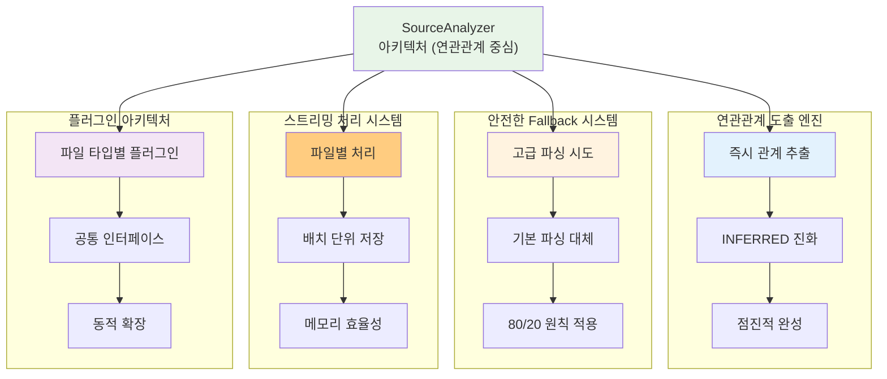
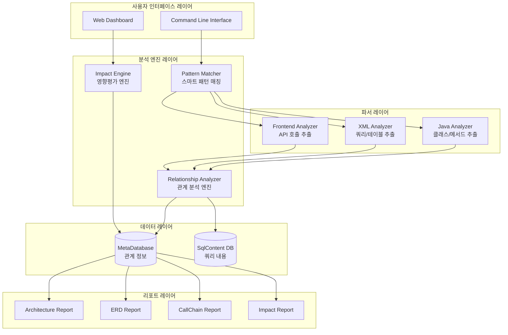
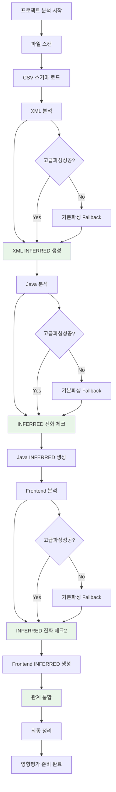
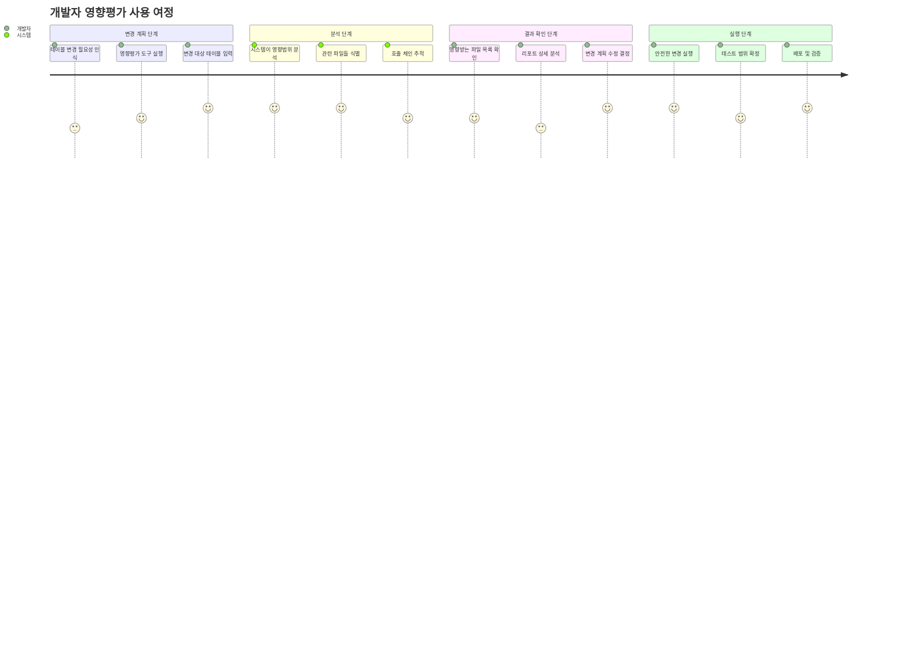
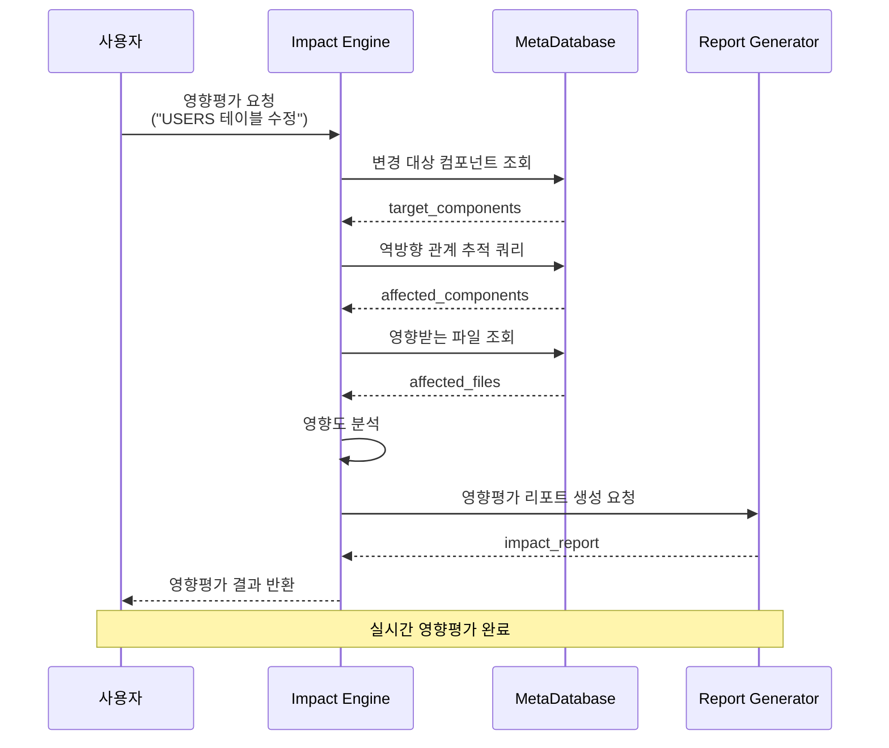
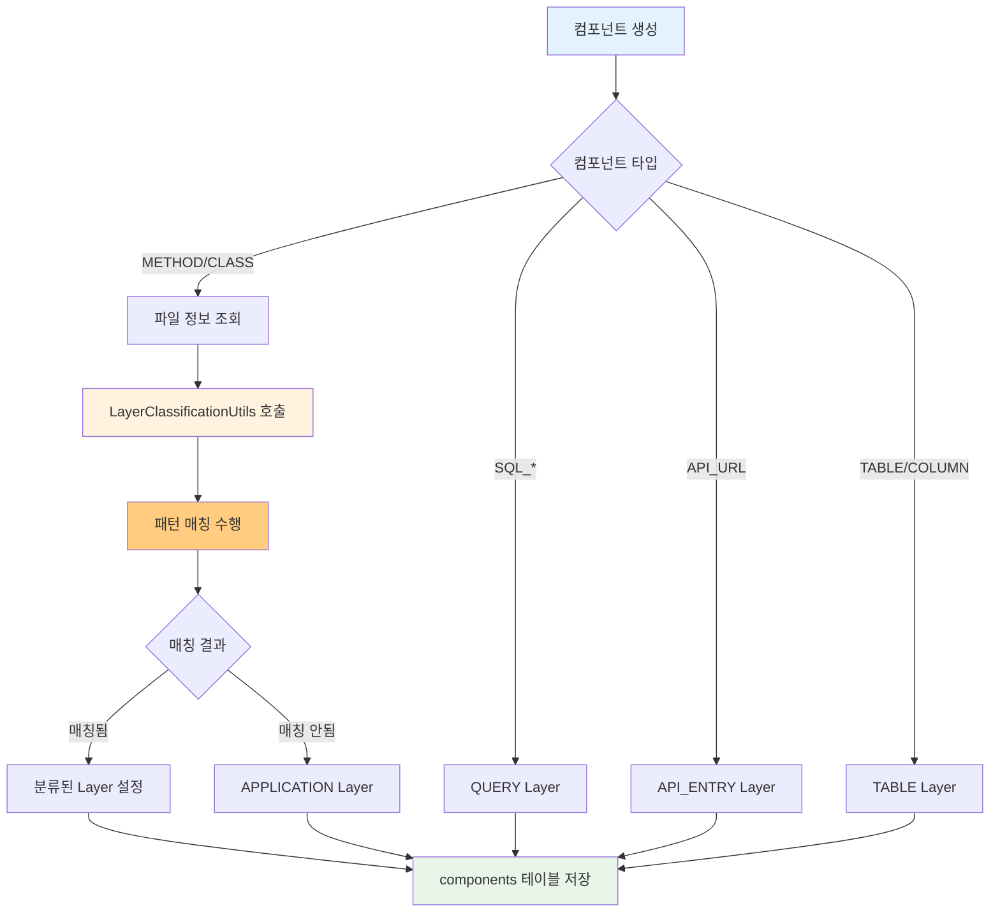
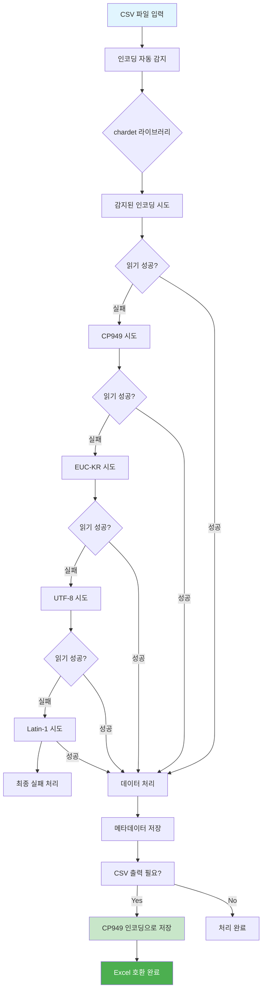

# SourceAnalyzer 시스템 아키텍처 설계

## 문서 목적

이 문서는 **영향평가 최적화 SourceAnalyzer 시스템**의 전체 아키텍처 설계를 설명합니다.  
**설계 컨셉**: 스마트 패턴 매칭 + 관계 중심 분석 + 영향평가 최적화  
**대상 독자**: 시스템 아키텍트, 개발 팀장, 개발자  

## 시스템 아키텍처 개요

### 핵심 설계 컨셉 구조도



### 영향평가 추적 플로우
```
영향평가 = 컴포넌트 간 관계 추적

Frontend (JSP/JSX) → API → Controller → Service → DAO → Query → Table → Column
                  ↑                                                    ↓
              영향평가 시                                           변경 지점
          역방향으로 추적                                        (테이블, API 등)
```

### 시스템 레이어 구조



## 핵심 컴포넌트 설계

### 1. 스마트 패턴 매처 (Pattern Matcher)

#### 설계 목적
다양한 소스 코드 패턴을 누락 없이 추출하는 핵심 엔진

#### 핵심 기능
```python
class SmartPatternMatcher:
    """영향평가 최적화 패턴 매처"""
    
    def __init__(self):
        # 테이블 추출 패턴들 (누락 방지)
        self.table_patterns = [
            r'(?:FROM|JOIN)\s+(\w+)(?:_\$\{[^}]+\})?\s+(\w+)',  # 표준 JOIN
            r'FROM\s+((?:\w+(?:_\$\{[^}]+\})?\s+\w+,?\s*)+)',   # Oracle 암시적
            r'(?:IN|EXISTS)\s*\(\s*SELECT[^)]+FROM\s+(\w+)',    # 서브쿼리
            r'"[^"]*FROM\s+(\w+)[^"]*"',                        # Java 문자열
        ]
        
        # 조인 조건 패턴들 (관계 추출)
        self.join_patterns = [
            r'(\w+)\.(\w+)\s*=\s*(\w+)\.(\w+)',                 # 기본 조인
            r'ON\s+(\w+)\.(\w+)\s*=\s*(\w+)\.(\w+)',           # 명시적 JOIN
            r'WHERE.*?(\w+)\.(\w+)\s*=\s*(\w+)\.(\w+)',        # 암시적 JOIN
        ]
    
    def extract_all_relationships(self, content: str, file_path: str) -> List[Dict]:
        """모든 패턴으로 관계 추출 - 누락 방지 우선"""
        
        relationships = []
        
        # 1. 모든 테이블 패턴 적용
        tables = self._extract_tables_with_all_patterns(content)
        
        # 2. 모든 조인 조건 패턴 적용  
        joins = self._extract_joins_with_all_patterns(content)
        
        # 3. 테이블 별칭 해석
        resolved_joins = self._resolve_table_aliases(joins, content)
        
        # 4. 명백한 오탐만 제거 (애매하면 포함)
        return self._filter_obvious_false_positives(resolved_joins)
```

### 2. 관계 분석 엔진 (Relationship Analyzer)

#### 설계 목적
추출된 컴포넌트들 간의 관계를 분석하여 메타데이터베이스에 저장

#### 핵심 기능
```python
class RelationshipAnalyzer:
    """컴포넌트 간 관계 분석 엔진"""
    
    def analyze_project_relationships(self, project_path: str) -> Dict:
        """프로젝트 전체 관계 분석"""
        
        # 1. 파일별 분석 결과 수집
        analysis_results = self._collect_analysis_results(project_path)
        
        # 2. 컴포넌트 관계 매트릭스 생성
        relationship_matrix = self._build_relationship_matrix(analysis_results)
        
        # 3. 호출 체인 구성
        call_chains = self._build_call_chains(relationship_matrix)
        
        # 4. 영향평가용 역방향 관계 생성
        impact_relationships = self._generate_impact_relationships(call_chains)
        
        return {
            'components': analysis_results['components'],
            'relationships': relationship_matrix,
            'call_chains': call_chains,
            'impact_relationships': impact_relationships
        }
```

### 3. 영향평가 엔진 (Impact Engine)

#### 설계 목적
메타데이터를 활용하여 실시간 영향평가 수행

#### 핵심 기능
```python
class ImpactEngine:
    """영향평가 전용 엔진"""
    
    def analyze_impact(self, change_target: str, change_type: str) -> Dict:
        """영향평가 분석"""
        
        # 1. 변경 대상 식별
        target_components = self._identify_target_components(change_target, change_type)
        
        # 2. 영향받는 컴포넌트 추적 (역방향)
        affected_components = self._trace_affected_components(target_components)
        
        # 3. 영향받는 파일 목록 생성
        affected_files = self._get_affected_files(affected_components)
        
        # 4. 영향도 분석 (직접/간접 영향)
        impact_analysis = self._analyze_impact_severity(affected_components)
        
        return {
            'change_target': change_target,
            'affected_files': affected_files,
            'impact_analysis': impact_analysis,
            'recommendation': self._generate_recommendations(impact_analysis)
        }
    
    def _trace_affected_components(self, target_components: List[str]) -> List[Dict]:
        """영향받는 컴포넌트 역방향 추적"""
        
        affected = []
        
        # 재귀적으로 역방향 관계 추적
        for target in target_components:
            # 1단계: 직접 사용하는 쿼리들
            direct_queries = self._find_queries_using_table(target)
            
            # 2단계: 해당 쿼리를 호출하는 메서드들
            methods = self._find_methods_calling_queries(direct_queries)
            
            # 3단계: 해당 메서드가 속한 클래스들
            classes = self._find_classes_containing_methods(methods)
            
            # 4단계: 해당 클래스를 호출하는 API들
            apis = self._find_apis_calling_classes(classes)
            
            # 5단계: 해당 API를 호출하는 프론트엔드들
            frontends = self._find_frontends_calling_apis(apis)
            
            affected.extend([direct_queries, methods, classes, apis, frontends])
        
        return affected
```

## 처리 플로우 설계

### 전체 처리 플로우 (연관관계 중심)



### 사용자 영향평가 여정



### 영향평가 플로우



## 시스템 특징

### 1. INFERRED 객체 동적 생성
```
실제 스키마 (CSV 기반):
- SAMPLE.USERS, SAMPLE.ORDERS 등 17개 테이블

INFERRED 객체 (SQL 분석 기반):  
- UNKNOWN.USER_ROLES (UserMapper.xml에서 추론)
- UNKNOWN.ROLES (UserMapper.xml에서 추론)
- UNKNOWN.PAYMENTS (DirectXmlQueryMapper.xml에서 추론)

처리 방식:
- 실제 스키마: 고정 데이터로 관리
- INFERRED 객체: 동적 생성 및 소스 추적
```

### 2. 관계 중심 설계
```
핵심 관계 유형:
1. CALLS: 메서드 → 메서드 호출
2. USES_TABLE: 쿼리 → 테이블 사용
3. JOINS_WITH: 테이블 ↔ 테이블 조인 (조인 조건 포함)
4. CALLS_API: 프론트엔드 → API 호출
5. CONTAINS: 파일 → 클래스/메서드 포함

영향평가 활용:
- 정방향: A가 B를 호출/사용하는 관계
- 역방향: B 변경 시 A가 영향받는 관계
```

### 3. 누락 방지 전략
```
다중 패턴 매칭 (100% 이상 추출):
- 패턴 1: 표준 JOIN (가장 확실한 관계)
- 패턴 2: Oracle 암시적 JOIN (Oracle 환경 대응)
- 패턴 3: 서브쿼리 (간접 관계까지 포함)
- 패턴 4: Java 문자열 SQL (동적 SQL까지 포함)

결과 통합 원칙:
- 모든 패턴 결과를 통합 (중복 허용 - 누락 방지 우선)
- 명백한 오탐만 제거 (애매하면 포함)
- 의심스러운 관계도 포함 (과도하지 않은 선에서)
- 소스 파일별 추적 정보 유지
```

## 성능 최적화 설계

### 1. 메모리 효율성
```python
class MemoryOptimizedProcessor:
    """메모리 효율적 처리"""
    
    def process_large_project(self, project_path: str):
        """대용량 프로젝트 스트리밍 처리"""
        
        # 파일별 스트리밍 처리 (전체 로드 방지)
        for file_path in self._scan_files(project_path):
            # 1. 파일 하나씩 처리
            analysis_result = self._analyze_single_file(file_path)
            
            # 2. 즉시 데이터베이스 저장
            self._save_to_database(analysis_result)
            
            # 3. 메모리 해제
            del analysis_result
```

### 2. 처리 속도 최적화
```python
class ProcessingOptimizer:
    """처리 속도 최적화"""
    
    def __init__(self):
        # 컴파일된 정규식 패턴 (재사용)
        self.compiled_patterns = self._compile_all_patterns()
        
        # 캐시된 테이블 별칭 매핑
        self.alias_cache = {}
    
    def fast_extract(self, content: str) -> Dict:
        """고속 추출 (컴파일된 패턴 사용)"""
        
        results = {}
        
        # 컴파일된 패턴으로 빠른 매칭
        for pattern_name, compiled_pattern in self.compiled_patterns.items():
            matches = compiled_pattern.findall(content)
            results[pattern_name] = matches
        
        return results
```

## 확장성 설계

### 1. 플러그인 아키텍처
```python
class AnalyzerPlugin:
    """분석기 플러그인 인터페이스"""
    
    def analyze(self, file_path: str) -> Dict:
        """파일 분석 (구현 필요)"""
        raise NotImplementedError
    
    def get_supported_extensions(self) -> List[str]:
        """지원하는 파일 확장자 (구현 필요)"""
        raise NotImplementedError

class JavaAnalyzerPlugin(AnalyzerPlugin):
    """Java 파일 분석 플러그인"""
    
    def analyze(self, file_path: str) -> Dict:
        # Java 분석 로직 구현
        pass
    
    def get_supported_extensions(self) -> List[str]:
        return ['.java']

# 새로운 언어 지원 시 플러그인만 추가
class PythonAnalyzerPlugin(AnalyzerPlugin):
    """Python 파일 분석 플러그인 (확장 예시)"""
    
    def get_supported_extensions(self) -> List[str]:
        return ['.py']
```

### 2. 설정 기반 확장
```yaml
# config/patterns.yaml
table_extraction_patterns:
  - name: "standard_join"
    pattern: "(?:FROM|JOIN)\\s+(\\w+)(?:_\\$\\{[^}]+\\})?\\s+(\\w+)"
    confidence: 0.95
  
  - name: "oracle_implicit"  
    pattern: "FROM\\s+((?:\\w+(?:_\\$\\{[^}]+\\})?\\s+\\w+,?\\s*)+)"
    confidence: 0.80

join_condition_patterns:
  - name: "basic_join"
    pattern: "(\\w+)\\.(\\w+)\\s*=\\s*(\\w+)\\.(\\w+)"
    confidence: 0.90
```

## 데이터 플로우 설계

### 입력 데이터
```
프로젝트 소스:
- Java 파일들 (클래스, 메서드, SQL)
- XML 파일들 (MyBatis 매퍼, 쿼리)
- JSP/JSX 파일들 (프론트엔드, API 호출)
- CSV 파일들 (DB 스키마 정보)
```

### 처리 과정
```
1. 파일 스캔 → files 테이블
2. CSV 로드 → tables/columns 테이블
3. 소스 분석 → components 테이블 (INFERRED 포함)
4. 관계 분석 → relationships 테이블
5. 영향평가 → 실시간 쿼리 결과
```

### 출력 데이터
```
영향평가 결과:
- 영향받는 파일 목록
- 영향도 분석 (직접/간접)
- 수정 권장사항
- 리스크 평가

시각화 리포트:
- Architecture Diagram (레이어별 구조)
- ERD (테이블 관계, INFERRED 포함)
- CallChain (호출 체인)
- Impact Report (영향평가 결과)
```

## 시스템 특징

### 1. 영향평가 전용 설계
- **목적 특화**: 영향평가를 위한 전용 설계
- **누락 방지**: 다중 패턴 매칭으로 모든 관계 추출
- **실시간 분석**: 메타데이터 기반 즉시 영향평가 가능

### 2. 실용적 아키텍처
- **적절한 복잡도**: 목적 달성에 필요한 수준의 정교함
- **유지보수성**: 단순하고 이해하기 쉬운 구조
- **확장성**: 플러그인 기반으로 새로운 언어/패턴 추가 용이

### 3. 성능 설계
- **스트리밍 처리**: 메모리 효율적 대용량 프로젝트 처리
- **캐시 활용**: 반복 작업 최소화
- **병렬 처리**: 파일별 독립 분석으로 병렬화 가능

## Layer 분류 시스템

### Layer 분류 기준

시스템의 아키텍처를 명확히 파악하기 위해 각 컴포넌트를 레이어별로 분류합니다.

#### Layer 분류 매핑

| 컴포넌트 타입 | Layer | 설명 | 예시 |
|---------------|-------|------|------|
| **FRONTEND** | FRONTEND | 프론트엔드 파일 | JSP, JSX, Vue 파일 |
| **API_URL** | API_ENTRY | API 엔드포인트 | /api/users:GET, /api/orders:POST |
| **METHOD** | CONTROLLER | HTTP 요청 처리 | UserController, OrderServlet |
| **METHOD** | SERVICE | 비즈니스 로직 | UserService, OrderManager |
| **METHOD** | REPOSITORY | 데이터 접근 | UserMapper, OrderDAO |
| **METHOD** | MODEL | 데이터 모델 | UserEntity, OrderVO |
| **METHOD** | UTIL | 유틸리티 | DateUtil, StringHelper |
| **SQL_*** | QUERY | SQL 쿼리 | SQL_SELECT, SQL_INSERT |
| **QUERY** | QUERY | 추론된 쿼리 | INFERRED 쿼리 |
| **TABLE** | TABLE | 데이터베이스 테이블 | USERS, ORDERS |
| **COLUMN** | TABLE | 테이블 컬럼 | USER_ID, ORDER_DATE |

#### 동적 Layer 분류 패턴

METHOD 컴포넌트는 다음 패턴으로 동적 분류됩니다:

**CONTROLLER Layer**:
- suffixes: controller, ctrl, servlet
- keywords: controller, servlet, Servlet, @Controller
- folder_patterns: *controller*, *ctrl*, *web*, *api*, *servlet*

**SERVICE Layer**:
- suffixes: service, svc, manager, facade
- keywords: service, business, logic, manager, facade
- folder_patterns: *service*, *business*, *logic*, *manager*, *facade*

**REPOSITORY Layer**:
- suffixes: dao, repository, repo, mapper
- keywords: dao, repository, mapper, data
- folder_patterns: *dao*, *repository*, *mapper*, *data*

**MODEL Layer**:
- suffixes: entity, model, vo, dto, domain
- keywords: entity, model, vo, dto, domain, bean
- folder_patterns: *model*, *entity*, *vo*, *dto*, *domain*, *bean*, *enums*

**UTIL Layer**:
- suffixes: util, utils, helper, common
- keywords: util, helper, common, tool
- folder_patterns: *util*, *helper*, *common*, *tool*

#### Layer 분류 우선순위

1. **폴더 구조 우선**: 파일 경로의 폴더명이 가장 정확한 분류 기준
2. **클래스명 키워드**: 클래스명에 포함된 키워드로 분류
3. **클래스명 접미사**: 클래스명 끝의 접미사로 분류
4. **기본값**: 분류되지 않은 경우 APPLICATION

### Layer 분류 구현 상세

#### 공통 함수: LayerClassificationUtils

Layer 분류 로직은 `util/layer_classification_utils.py`의 `LayerClassificationUtils` 클래스에서 중앙 관리됩니다.

**주요 메서드**:
- `get_component_layer()`: 컴포넌트 타입과 패턴을 기반으로 레이어 결정
- `classify_component_by_patterns()`: 패턴 매칭을 통한 동적 분류
- `get_layer_classification_patterns()`: 설정 파일에서 분류 패턴 로드

#### 컴포넌트별 Layer 설정 지점

**1. METHOD/CLASS 컴포넌트** (`java_loading.py`):
```python
# Layer 분류를 위한 파일 정보 조회
file_path, file_name = self._get_file_info_for_layer_classification(project_id, file_id)

# Layer 분류 수행 (공통함수 사용)
layer = self.layer_classifier.get_component_layer(
    component_type='METHOD',
    component_name=method_name,
    file_path=file_path,
    file_name=file_name
)
```

**2. SQL_* 컴포넌트** (`xml_loading.py`):
```python
component_data = {
    'layer': 'QUERY',  # SQL 컴포넌트는 QUERY layer
    # ... 기타 필드
}
```

**3. API_URL 컴포넌트** (`backend_entry_loading.py`):
```python
component_data = {
    'layer': 'API_ENTRY',  # API_URL은 API_ENTRY layer
    # ... 기타 필드
}
```

**4. TABLE/COLUMN 컴포넌트** (`file_loading.py`):
```python
component_data = {
    'layer': 'TABLE',  # TABLE/COLUMN은 TABLE layer
    # ... 기타 필드
}
```

#### 설정 파일: java_keyword.yaml

Layer 분류 패턴은 `config/parser/java_keyword.yaml`의 `layer_classification` 섹션에서 관리됩니다:

```yaml
layer_classification:
  controller:
    suffixes: ["controller", "ctrl", "servlet"]
    keywords: ["controller", "servlet", "Servlet", "@Controller"]
    folder_patterns: ["*controller*", "*ctrl*", "*web*", "*api*", "*servlet*"]
  service:
    suffixes: ["service", "svc", "manager", "facade"]
    keywords: ["service", "business", "logic", "manager", "facade"]
    folder_patterns: ["*service*", "*business*", "*logic*", "*manager*", "*facade*"]
  # ... 기타 레이어 패턴
```

#### Layer 분류 장점

1. **아키텍처 명확화**: 각 컴포넌트의 역할과 위치를 명확히 구분
2. **시각적 표현**: 레이어별 색상 구분으로 리포트 가독성 향상
3. **관계 분석**: 레이어간 호출 관계를 통한 아키텍처 패턴 분석
4. **확장성**: 새로운 레이어 패턴을 설정 파일에서 쉽게 추가 가능
5. **일관성**: 모든 컴포넌트에 동일한 분류 기준 적용

#### Layer 분류 처리 플로우



## CSV 파일 처리 아키텍처

### 인코딩 처리 전략



### 데이터 타입 처리 규칙

| 데이터 타입 | 처리 방식 | 예시 |
|------------|----------|------|
| `NUMBER(precision,scale)` | 따옴표 감싸기 | `"NUMBER(10,2)"` |
| `VARCHAR2(size)` | 그대로 유지 | `VARCHAR2(100)` |
| `DATE`, `CLOB` | 그대로 유지 | `DATE` |
| 특수문자 포함 | 자동 따옴표 처리 | `csv.QUOTE_MINIMAL` |

---

**작성자**: SourceAnalyzer Team  
**작성일**: 2025-09-19  
**문서 버전**: 1.0  
**이전 문서**: [01_프로젝트_개요_및_목적.md](./01_프로젝트_개요_및_목적.md)  
**다음 문서**: [04_XML_분석_구현서.md](./04_XML_분석_구현서.md)
