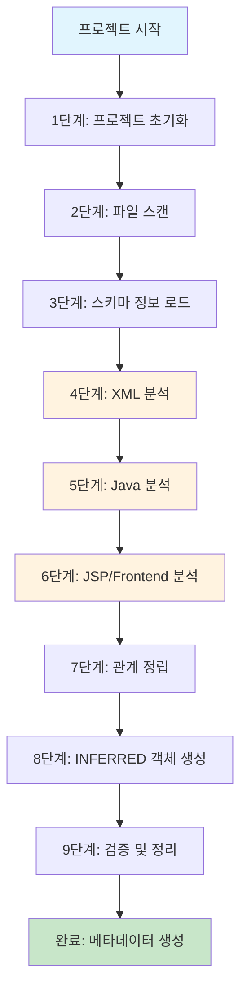
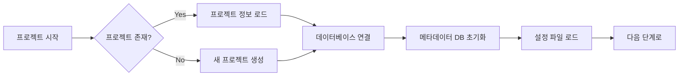
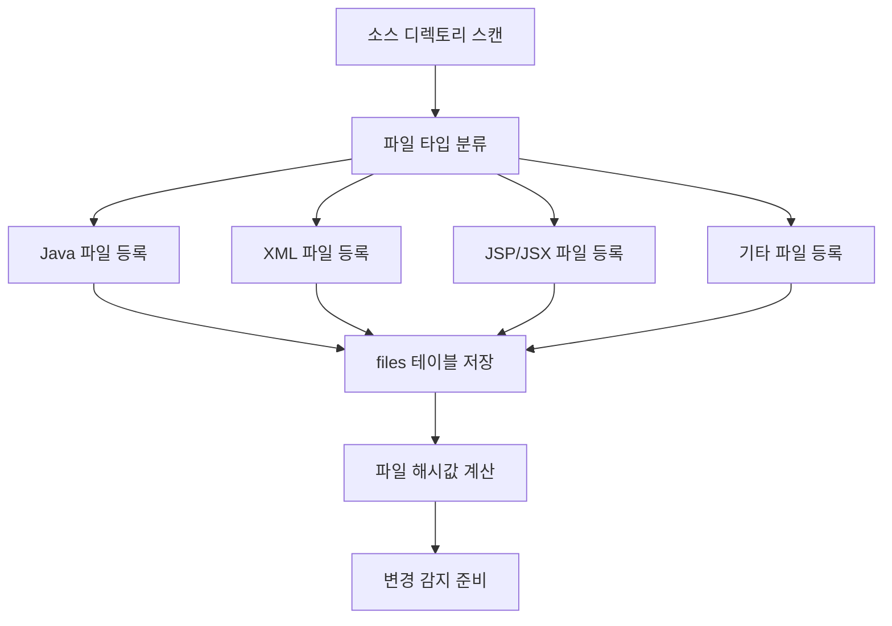
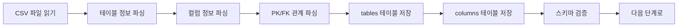
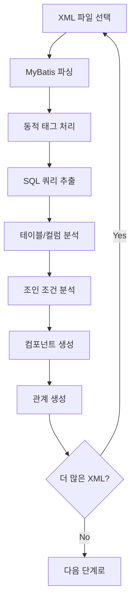
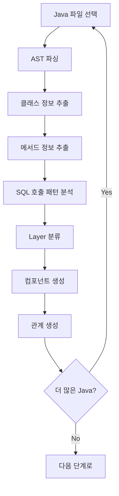
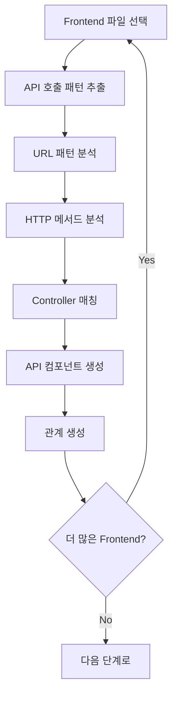
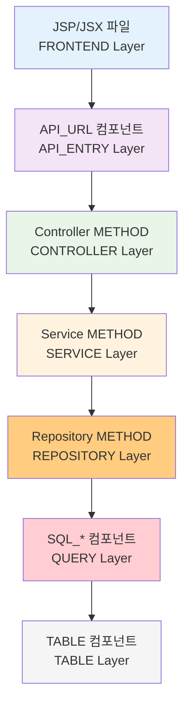

# SourceAnalyzer 처리 플로우 설계서

## 문서 정보
- **작성일**: 2025-09-19
- **버전**: v1.0
- **목적**: 소스 분석 및 메타데이터 생성 플로우 정의

## 1. 전체 처리 플로우

### 1.1 플로우 개요



### 1.2 단계별 처리 목적

| 단계 | 처리 내용 | 입력 | 출력 | 핵심 목표 |
|------|-----------|------|------|----------|
| 1단계 | 프로젝트 초기화 | 프로젝트명, 설정 | projects 테이블 | 메타데이터 저장소 준비 |
| 2단계 | 파일 스캔 | 소스 디렉토리 | files 테이블 | 모든 소스 파일 등록 |
| 3단계 | 스키마 정보 로드 | CSV 파일 | tables, columns 테이블 | 실제 스키마 정보 등록 |
| 4단계 | XML 분석 | MyBatis XML | SQL 컴포넌트, 관계 | 쿼리-테이블 관계 도출 |
| 5단계 | Java 분석 | Java 소스 | 클래스, 메서드, 관계 | 비즈니스 로직 구조 도출 |
| 6단계 | Frontend 분석 | JSP/JSX | API 호출 관계 | 프론트-백엔드 연결 |
| 7단계 | 관계 정립 | 모든 컴포넌트 | relationships 테이블 | 통합 관계 정보 구축 |
| 8단계 | INFERRED 생성 | 분석 결과 | INFERRED 객체 | 누락된 테이블/컬럼 보완 |
| 9단계 | 검증 및 정리 | 메타데이터 | 최종 메타데이터 | 일관성 검증, 중복 제거 |

## 2. 단계별 상세 플로우

### 2.1 1단계: 프로젝트 초기화



**처리 내용**:
- 프로젝트 등록 (projects 테이블)
- 메타데이터 DB 생성 (metadata.db, SqlContent.db)
- 설정 파일 로드 (config.yaml, parser 설정)

### 2.2 2단계: 파일 스캔



**처리 내용**:
- 재귀적 디렉토리 스캔
- 파일 타입별 분류 (Java, XML, JSP, JSX, etc.)
- files 테이블에 메타정보 저장
- 파일 해시값 계산 (변경 감지용)

### 2.3 3단계: 스키마 정보 로드



**처리 내용**:
- 실제 DB 스키마 정보 로드
- 테이블/컬럼 메타정보 저장
- PK/FK 관계 정보 저장

### 2.4 4단계: XML 분석



**처리 내용**:
- MyBatis XML 파싱
- 동적 태그 처리 (누락 방지)
- SQL 쿼리 추출 및 분석
- 테이블 간 조인 관계 도출

### 2.5 5단계: Java 분석



**처리 내용**:
- Java AST 파싱
- 클래스/메서드 구조 분석
- SQL 호출 패턴 분석 (MyBatis, StringBuilder)
- 아키텍처 Layer 분류

### 2.6 6단계: Frontend 분석



**처리 내용**:
- JSP/JSX 파일 분석
- API 호출 패턴 추출
- Controller 메서드와 매칭

## 3. 핵심 처리 원칙

### 3.1 누락 방지 원칙
```
- 의심스러우면 포함하는 정책
- 100% 이상 추출 목표 (과도하더라도 누락 없음)
- 에러 발생 시에도 처리 계속 진행
```

### 3.2 적절한 복잡도 유지
```
- 영향평가 목적에 필요한 수준까지만 분석
- 과도한 정교함보다는 실용적 접근
- 메모리 효율성 고려 (100MB 제한)
```

### 3.3 에러 처리 방침
```
- 부분 실패 허용 (전체 중단 없음)
- 에러 정보 기록 (has_error='Y', error_message)
- 처리 가능한 부분은 계속 진행
```

## 4. 성능 고려사항

### 4.1 메모리 관리
- 파일 단위 처리로 메모리 효율성 확보
- 대용량 파일은 스트리밍 처리
- 메모리 사용량 모니터링

### 4.2 처리 속도
- 병렬 처리 가능한 부분은 멀티스레딩
- 데이터베이스 배치 처리
- 불필요한 중복 처리 방지

### 4.3 확장성
- 새로운 파일 타입 추가 용이
- 파싱 로직 모듈화
- 설정 기반 확장 가능

## 10. 단순화된 API 호출 구조

### 10.1 API_URL 컴포넌트 구조

프론트엔드에서 호출하는 API 정보를 components 테이블에 통합하여 관리합니다.

| 컬럼명 | 설명 | 예시 |
|--------|------|------|
| component_type | API_URL | API_URL |
| component_name | API URL과 HTTP 메서드 조합 | /api/user-profile:GET |
| file_id | 프론트엔드 파일 ID (JSP/JSX) | 201 (JSP 파일 ID) |
| layer | API_ENTRY | API 엔드포인트 레이어 |

**핵심 개념**:
- **프론트엔드 API 호출 = 백엔드 API 진입점**: 동일한 URL이므로 중복 저장 불필요
- **file_id로 프론트 파일 연결**: JSP/JSX 파일에서 호출하는 API임을 명시
- **component_name에 모든 정보 포함**: URL:HTTP_METHOD 형태로 고유 식별
- **layer로 아키텍처 구분**: API_ENTRY 레이어로 명확한 역할 정의

### 10.2 API 호출 구조 다이어그램 (Layer 포함)



**Layer별 호출 체인 설명**:
1. **FRONTEND Layer**: JSP/JSX/Vue 프론트엔드 파일
2. **API_ENTRY Layer**: 프론트엔드에서 호출하는 API 엔드포인트 (/api/user-profile:GET)
3. **CONTROLLER Layer**: HTTP 요청을 처리하는 컨트롤러 메서드
4. **SERVICE Layer**: 비즈니스 로직을 처리하는 서비스 메서드
5. **REPOSITORY Layer**: 데이터 접근 로직을 처리하는 DAO/Mapper 메서드
6. **QUERY Layer**: 실제 SQL 쿼리 (SQL_SELECT, SQL_INSERT 등)
7. **TABLE Layer**: 데이터베이스 테이블 및 컬럼

### 10.3 관계 타입 (6가지 핵심 관계)

#### 1. 메서드 호출 관계
- **CALL_METHOD**: 컴포넌트에서 메서드로의 호출
  - 사용: src_id = 호출하는 컴포넌트, dst_id = 호출받는 METHOD
  - 예시: API_URL → METHOD, METHOD → METHOD (Controller → Service → DAO)
  - 구분: src_id의 component_type으로 호출 유형 판단

#### 2. 쿼리 호출 관계
- **CALL_QUERY**: 메서드에서 SQL 쿼리로의 호출
  - 사용: src_id = METHOD 컴포넌트, dst_id = SQL_* 또는 QUERY 컴포넌트
  - 예시: DAO 메서드에서 SQL 쿼리 호출

#### 3. 테이블 사용 관계
- **USE_TABLE**: SQL 쿼리에서 데이터베이스 테이블 사용
  - 사용: src_id = SQL_* 또는 QUERY 컴포넌트, dst_id = TABLE 컴포넌트
  - 예시: SELECT 쿼리에서 USERS 테이블 사용

#### 4. 상속 관계
- **INHERITANCE**: 클래스 상속 관계
  - 사용: src_id = 자식 클래스 컴포넌트, dst_id = 부모 클래스 컴포넌트
  - 예시: UserController extends BaseController

#### 5. 명시적 조인 관계
- **JOIN_EXPLICIT**: 명시적 조인 관계
  - 사용: src_id = SQL 쿼리 컴포넌트, dst_id = 조인되는 테이블 컴포넌트
  - 예시: SELECT * FROM A JOIN B ON A.id = B.id

#### 6. 암시적 조인 관계
- **JOIN_IMPLICIT**: 암시적 조인 관계
  - 사용: src_id = SQL 쿼리 컴포넌트, dst_id = 조인되는 테이블 컴포넌트
  - 예시: SELECT * FROM A, B WHERE A.id = B.id

**완전한 호출 체인 예시**:
```
JSP 파일 (file_id) 
    ↓
API_URL (/api/user-profile:GET)
    ↓ CALL_METHOD
METHOD (getUserProfile)
    ↓ CALL_METHOD
METHOD (UserService.getUser)
    ↓ CALL_METHOD
METHOD (UserDAO.findById)
    ↓ CALL_QUERY
SQL_SELECT (SELECT * FROM users WHERE id = ?)
    ↓ USE_TABLE
TABLE (USERS)
```

**CallChain Report 쿼리 구조**:
```sql
SELECT 
    ROW_NUMBER() OVER (ORDER BY jsp_file.file_name, api_url.component_name) as chain_id,
    jsp_file.file_name as jsp_file,
    api_url.component_name as api_url,
    class.class_name as class_name,
    method.component_name as method_name,
    xml_file.file_name as xml_file,
    sql.component_name as sql_name,
    sql.component_type as sql_type,
    GROUP_CONCAT(DISTINCT table.table_name) as related_tables
FROM files jsp_file
JOIN components api_url ON jsp_file.file_id = api_url.file_id
JOIN relationships r1 ON api_url.component_id = r1.src_id
JOIN components method ON r1.dst_id = method.component_id
JOIN classes class ON method.parent_id = class.class_id
JOIN relationships r2 ON method.component_id = r2.src_id
JOIN components sql ON r2.dst_id = sql.component_id
JOIN files xml_file ON sql.file_id = xml_file.file_id
LEFT JOIN relationships r3 ON sql.component_id = r3.src_id
LEFT JOIN tables table ON r3.dst_id = table.component_id
WHERE api_url.component_type = 'API_URL'
  AND r1.rel_type = 'CALL_METHOD'
  AND method.component_type = 'METHOD'
  AND r2.rel_type = 'CALL_QUERY'
  AND sql.component_type LIKE 'SQL_%'
  AND (r3.rel_type = 'USE_TABLE' OR r3.rel_type IS NULL)
GROUP BY jsp_file.file_name, api_url.component_name, class.class_name, 
         method.component_name, xml_file.file_name, sql.component_name, sql.component_type
```

**CallChain Report 결과 예시**:

| chain_id | jsp_file | api_url | class_name | method_name | xml_file | sql_name | sql_type | related_tables |
|----------|----------|---------|------------|-------------|----------|----------|----------|----------------|
| 1 | MicroserviceDashboard.jsp | /api/user-profile:GET | MicroserviceController | getUserProfile | UserMapper.xml | getUserById | SQL_SELECT | USERS, USER_PROFILES |
| 2 | UserList.jsp | /api/users:GET | UserController | getUsers | UserMapper.xml | getAllUsers | SQL_SELECT | USERS |

**모든 관계 타입 요약**:
- **CALL_METHOD**: 메서드 호출 관계 (API_URL → METHOD, METHOD → METHOD)
- **CALL_QUERY**: 쿼리 호출 관계 (METHOD → SQL_*/QUERY)
- **USE_TABLE**: 테이블 사용 관계 (SQL_*/QUERY → TABLE)
- **INHERITANCE**: 클래스 상속 관계 (자식 클래스 → 부모 클래스)
- **JOIN_EXPLICIT**: 명시적 조인 관계 (SQL → 조인 테이블)
- **JOIN_IMPLICIT**: 암시적 조인 관계 (SQL → 조인 테이블)

### 10.4 데이터 예시

```sql
-- API_URL 컴포넌트들
INSERT INTO components VALUES 
(1001, 1, 201, '/api/user-profile:GET', 'API_URL', NULL, 'FRONTEND', 74, 85, 'N', NULL, 'hash123', '2024-01-01', '2024-01-01', 'N'),
(1002, 1, 201, '/api/order-details:GET', 'API_URL', NULL, 'FRONTEND', 98, 109, 'N', NULL, 'hash456', '2024-01-01', '2024-01-01', 'N');

-- API 호출 관계
INSERT INTO relationships VALUES 
(1001, 2001, 'CALL_METHOD', 1.0, 'N', NULL, 'hash_rel1', '2024-01-01', '2024-01-01', 'N'),  -- API_URL → METHOD
(1002, 2002, 'CALL_METHOD', 1.0, 'N', NULL, 'hash_rel2', '2024-01-01', '2024-01-01', 'N');  -- API_URL → METHOD
```

**실제 데이터 구조**:
- **file_id: 201**: JSP 파일 ID (프론트엔드 파일)
- **component_name**: '/api/user-profile:GET' (URL:HTTP_METHOD 형태)
- **component_type**: 'API_URL' (프론트엔드 API 호출)
- **rel_type**: 'CALL_METHOD' (프론트엔드에서 백엔드로의 호출)

### 10.5 주요 개선사항

#### 1. 단순화된 구조
- **중복 제거**: 프론트엔드 API 호출 = 백엔드 API 진입점 (동일한 URL)
- **단일 컴포넌트**: API_URL 하나로 프론트엔드와 백엔드 연결
- **명확한 연결**: file_id로 프론트엔드 파일과 API_URL 연결

#### 2. 6가지 핵심 관계
- **CALL_METHOD**: 컴포넌트 → METHOD (API_URL → METHOD, METHOD → METHOD)
- **CALL_QUERY**: METHOD → SQL (메서드 → 쿼리)
- **USE_TABLE**: SQL → TABLE (쿼리 → 테이블)
- **INHERITANCE**: 클래스 상속 관계
- **JOIN_EXPLICIT**: 명시적 조인 관계
- **JOIN_IMPLICIT**: 암시적 조인 관계

#### 3. 직관적인 호출 체인
```
JSP 파일 → API_URL → METHOD → SQL → TABLE
```

#### 4. 확장성
- **새로운 컴포넌트 타입**: components 테이블에 새로운 component_type 추가 가능
- **유연한 관계**: relationships 테이블에서 다양한 관계 타입 지원

---

## 다음 단계
- [04_XML_분석_구현서.md](04_XML_분석_구현서.md): XML 분석 상세 구현
- [05_Java_분석_구현서.md](05_Java_분석_구현서.md): Java 분석 상세 구현
- [06_관계_정립_구현서.md](06_관계_정립_구현서.md): 컴포넌트 간 관계 정립
