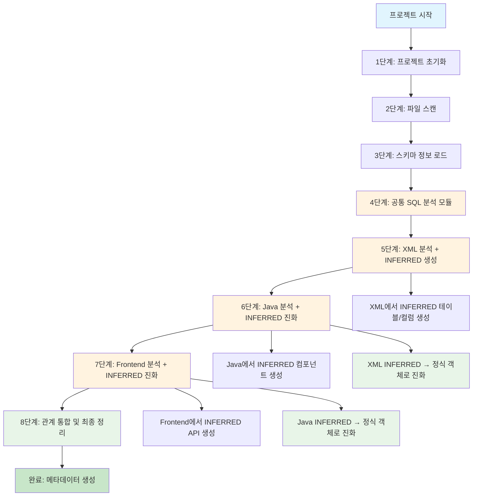
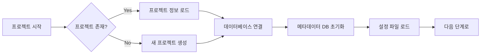
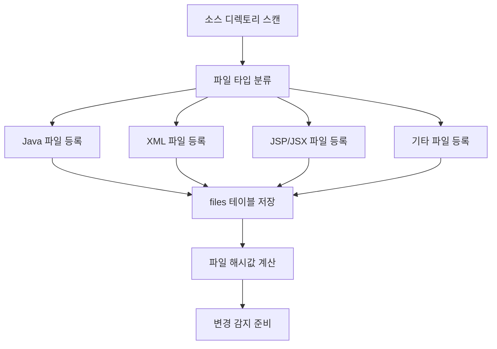
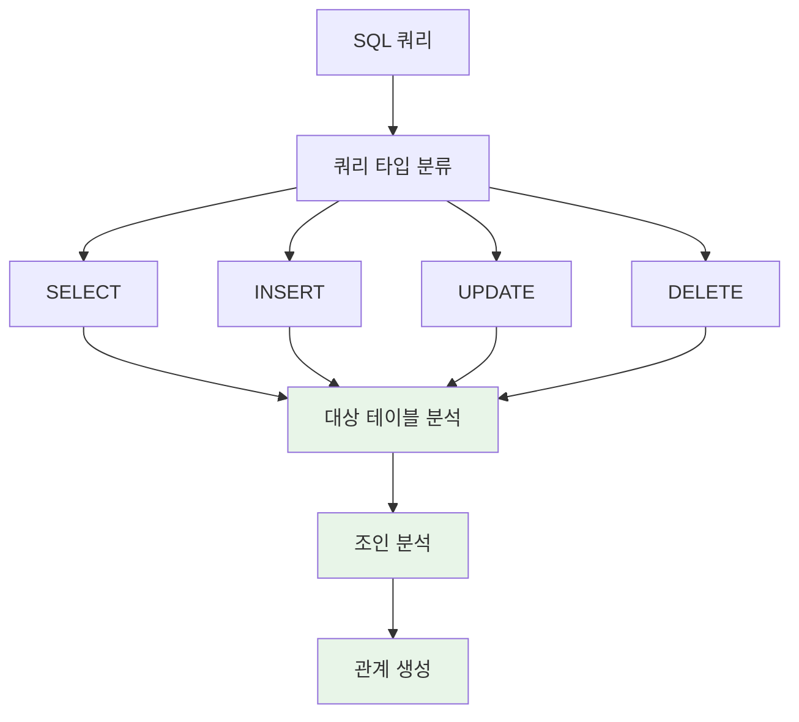
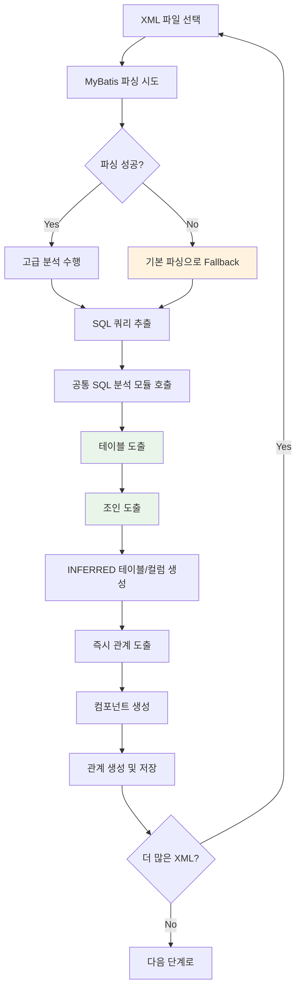
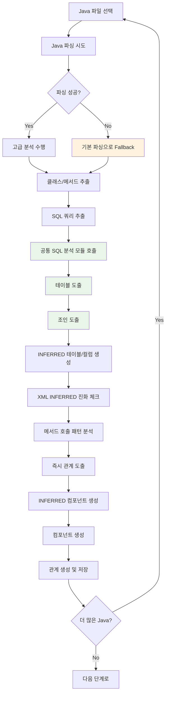
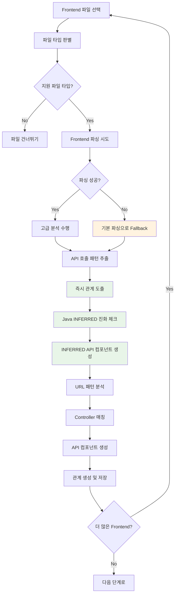
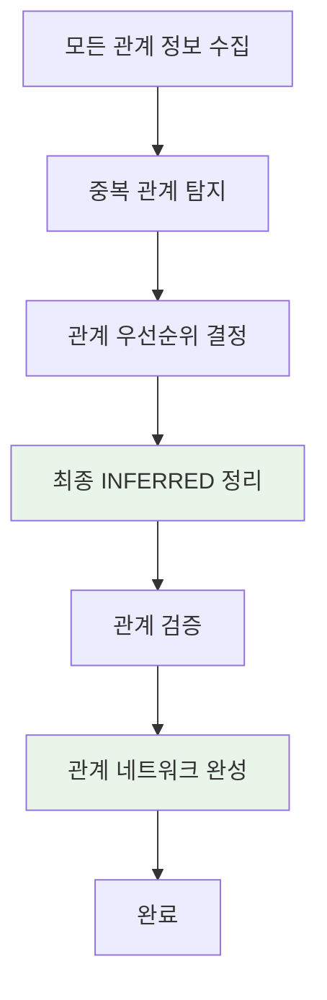
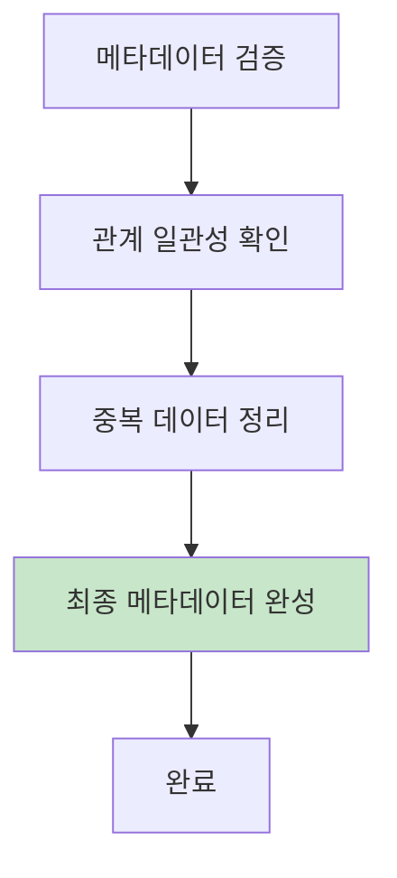
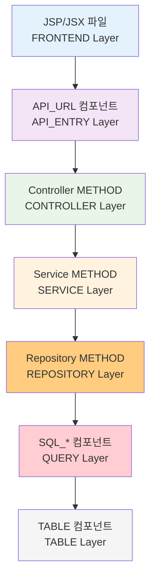

# SourceAnalyzer 처리 플로우 설계서

## 문서 정보
- **작성일**: 2025-09-19
- **버전**: v1.0
- **목적**: 소스 분석 및 메타데이터 생성 플로우 정의

## 1. 전체 처리 플로우 (연관관계 도출 중심)

### 1.1 플로우 개요



### 1.2 연관관계 도출 중심 설계 원칙

**핵심 철학**: 완벽한 파싱보다 연관관계 도출 우선
- **부분적 정보로도 충분한 관계 도출**: 파싱이 완벽하지 않아도 관계는 추출 가능
- **안전한 Fallback 메커니즘**: 고급 파싱 실패 시 기본 파싱으로 대체
- **점진적 관계 완성**: 파일별로 관계를 점진적으로 완성
- **80/20 원칙**: 80% 일반적 케이스의 안정적 지원 우선

### 1.3 INFERRED 객체 진화 메커니즘

**핵심 아이디어**: INFERRED 객체는 단계별로 진화하여 정식 객체가 됨

#### **진화 과정**
```
1. XML 분석 → INFERRED 테이블/컬럼 생성
   예: JOIN에서 발견된 "user_profile" 테이블을 INFERRED로 생성

2. Java 분석 → XML INFERRED가 실제 참조되면 정식 객체로 진화
   예: UserProfileDao.java에서 "user_profile" 테이블 참조 → INFERRED → 정식 테이블로 진화

3. Frontend 분석 → Java INFERRED가 실제 호출되면 정식 객체로 진화
   예: user-profile.js에서 UserProfileDao 호출 → INFERRED 컴포넌트 → 정식 컴포넌트로 진화
```

#### **진화 조건**
- **XML INFERRED → 정식 진화**: Java에서 실제 참조/사용
- **Java INFERRED → 정식 진화**: Frontend에서 실제 호출/사용
- **Frontend INFERRED → 정식 진화**: 다른 컴포넌트에서 실제 참조

#### **진화 후 처리**
- **INFERRED 플래그 제거**: `is_inferred = 'N'`으로 변경
- **관계 업데이트**: INFERRED 관계를 정식 관계로 변경
- **메타데이터 보완**: 실제 사용 패턴에 따른 추가 정보 수집

#### **구체적인 진화 예시**
```python
# 1. XML 분석 단계
# user-mapper.xml에서 JOIN 발견
def analyze_xml_file(xml_content):
    joins = extract_joins(xml_content)
    for join in joins:
        if not table_exists(join.table_name):
            # INFERRED 테이블 생성
            create_inferred_table(join.table_name, is_inferred='Y')
            create_inferred_columns(join.columns, is_inferred='Y')

# 2. Java 분석 단계
# UserProfileDao.java에서 user_profile 테이블 참조
def analyze_java_file(java_content):
    sql_calls = extract_sql_calls(java_content)
    for sql_call in sql_calls:
        table_name = extract_table_name(sql_call)
        if is_inferred_table(table_name):
            # INFERRED → 정식 객체로 진화
            evolve_inferred_to_formal(table_name)
            update_relationships(table_name, is_inferred='N')

# 3. Frontend 분석 단계
# user-profile.js에서 UserProfileDao 호출
def analyze_frontend_file(js_content):
    api_calls = extract_api_calls(js_content)
    for api_call in api_calls:
        component_name = extract_component_name(api_call)
        if is_inferred_component(component_name):
            # INFERRED → 정식 객체로 진화
            evolve_inferred_to_formal(component_name)
            update_relationships(component_name, is_inferred='N')
```

### 1.2 단계별 처리 목적

| 단계 | 처리 내용 | 입력 | 출력 | 핵심 목표 (연관관계 중심) |
|------|-----------|------|------|----------|
| 1단계 | 프로젝트 초기화 | 프로젝트명, 설정 | projects 테이블 | 메타데이터 저장소 준비 |
| 2단계 | 파일 스캔 | 소스 디렉토리 | files 테이블 | 모든 소스 파일 등록 |
| 3단계 | 스키마 정보 로드 | CSV 파일 | tables, columns 테이블 | 실제 스키마 정보 등록 |
| 4단계 | XML 분석 + INFERRED 생성 | MyBatis XML | SQL 컴포넌트, INFERRED 테이블/컬럼 | 조인에서 발견된 누락 테이블/컬럼 INFERRED로 생성 |
| 5단계 | Java 분석 + INFERRED 진화 | Java 소스 | 클래스, 메서드, INFERRED 컴포넌트 | XML INFERRED → 정식 객체 진화, 누락 컴포넌트 INFERRED 생성 |
| 6단계 | Frontend 분석 + INFERRED 진화 | JSP/JSX | API 호출, INFERRED API | Java INFERRED → 정식 객체 진화, 누락 API INFERRED 생성 |
| 7단계 | 관계 통합 및 최종 정리 | 모든 관계 정보 | relationships 테이블 | 관계 중복 제거, 최종 INFERRED 정리 |

## 2. 단계별 상세 플로우

### 2.1 1단계: 프로젝트 초기화



**처리 내용**:
- 프로젝트 등록 (projects 테이블)
- 메타데이터 DB 생성 (metadata.db, SqlContent.db)
- 설정 파일 로드 (config.yaml, parser 설정)

### 2.2 2단계: 파일 스캔



**처리 내용**:
- 재귀적 디렉토리 스캔
- 파일 타입별 분류 (Java, XML, JSP, JSX, etc.)
- files 테이블에 메타정보 저장
- 파일 해시값 계산 (변경 감지용)

### 2.3 3단계: 스키마 정보 로드


**처리 내용**:
- 실제 DB 스키마 정보 로드
- 테이블/컬럼 메타정보 저장
- PK/FK 관계 정보 저장

**CSV 파일 처리 정책**:
- 인코딩 처리: 자동 감지 (chardet) → cp949 → euc-kr → utf-8 → latin-1
- 데이터 타입: NUMBER(precision,scale) 따옴표 처리
- 파일 구조: ALL_TABLES.csv, ALL_TAB_COLUMNS.csv (CP949 인코딩)
- 오류 처리: 필수 필드 누락 시 조용히 기본값(UNKNOWN)으로 처리

**CSV 데이터 타입 파싱 로직**:
```python
def _parse_data_type(data_type_raw):
    """CSV 데이터 타입 파싱"""
    if not data_type_raw:
        return '', None
    
    # 괄호가 있는 경우: VARCHAR2(50) → type='VARCHAR2', length=50
    if '(' in data_type_raw and ')' in data_type_raw:
        type_part = data_type_raw.split('(')[0].strip()
        length_part = data_type_raw.split('(')[1].split(')')[0]
        
        # 쉼표가 있는 경우: NUMBER(10,2) → length=10 (첫 번째 숫자만)
        if ',' in length_part:
            length_part = length_part.split(',')[0]
        
        try:
            data_length = int(length_part) if length_part.isdigit() else None
        except ValueError:
            data_length = None
        
        return type_part, data_length
    
    # 괄호가 없는 경우: DATE, CLOB → length=None
    else:
        return data_type_raw.strip(), None

# 파싱 예시
# VARCHAR2(50) → data_type='VARCHAR2', data_length=50
# NUMBER(10,2) → data_type='NUMBER', data_length=10
# DATE → data_type='DATE', data_length=None
# CLOB → data_type='CLOB', data_length=None
# TIMESTAMP(6) → data_type='TIMESTAMP', data_length=6
```

**CSV 파일 경로 구조**:
```
./projects/{project_name}/db_schema/
├── ALL_TABLES.csv        # 테이블 정보
└── ALL_TAB_COLUMNS.csv   # 컬럼 정보
```

**CSV 데이터 매핑**:
- **ALL_TABLES.csv**: TABLE_NAME, OWNER, COMMENTS
- **ALL_TAB_COLUMNS.csv**: TABLE_NAME, COLUMN_NAME, DATA_TYPE, NULLABLE, COLUMN_COMMENTS, PK, OWNER

### 2.4 공통 SQL 쿼리 분석 모듈

**기능**: XML, Java 분석에서 공통으로 사용하는 SQL 쿼리 분석 및 INFERRED 테이블/컬럼 자동 생성

**공통화 원칙**:
- **쿼리 분석 → 테이블 도출 → 조인 도출**: XML, Java 분석에서 동일한 로직 사용
- **SQL 추출**: XML(MyBatis), Java(JDBC, JPA)에서 SQL 추출 후 공통 분석 모듈로 전달
- **INFERRED 생성**: 조인에서 발견된 누락 테이블/컬럼을 공통 모듈에서 생성

**SQL 쿼리 타입별 조인 분석 플로우**:



**SQL 조인 분석 패턴**:
```python
sql_analysis_patterns = {
    # 모든 SQL 타입에서 조인 분석 가능
    'explicit_joins': [
        r"(LEFT\s+(?:OUTER\s+)?JOIN)\s+([a-zA-Z_][a-zA-Z0-9_]*)(?:\s+([a-zA-Z_][a-zA-Z0-9_]*))?\s+ON\s+(.+?)(?=\s+(?:LEFT|RIGHT|FULL|INNER|CROSS|NATURAL|WHERE|GROUP|ORDER|$))",
        r"(INNER\s+JOIN)\s+([a-zA-Z_][a-zA-Z0-9_]*)(?:\s+([a-zA-Z_][a-zA-Z0-9_]*))?\s+ON\s+(.+?)(?=\s+(?:LEFT|RIGHT|FULL|INNER|CROSS|NATURAL|WHERE|GROUP|ORDER|$))",
        r"(RIGHT\s+(?:OUTER\s+)?JOIN)\s+([a-zA-Z_][a-zA-Z0-9_]*)(?:\s+([a-zA-Z_][a-zA-Z0-9_]*))?\s+ON\s+(.+?)(?=\s+(?:LEFT|RIGHT|FULL|INNER|CROSS|NATURAL|WHERE|GROUP|ORDER|$))"
    ],
    'implicit_joins': [
        r"([a-zA-Z_][a-zA-Z0-9_]*)\.([a-zA-Z_][a-zA-Z0-9_]*)\s*=\s*([a-zA-Z_][a-zA-Z0-9_]*)\.([a-zA-Z_][a-zA-Z0-9_]*)",
        r"([a-zA-Z_][a-zA-Z0-9_]*)\.([a-zA-Z_][a-zA-Z0-9_]*)\s*\(\+\)\s*=\s*([a-zA-Z_][a-zA-Z0-9_]*)\.([a-zA-Z_][a-zA-Z0-9_]*)"
    ],
    # INSERT/UPDATE/DELETE에서도 서브쿼리 조인 가능
    'subquery_joins': [
        r"WHERE\s+EXISTS\s*\(\s*SELECT\s+.*?\s+FROM\s+([a-zA-Z_][a-zA-Z0-9_]*)",
        r"WHERE\s+.*?\s+IN\s*\(\s*SELECT\s+.*?\s+FROM\s+([a-zA-Z_][a-zA-Z0-9_]*)",
        r"FROM\s+\(\s*SELECT\s+.*?\s+FROM\s+([a-zA-Z_][a-zA-Z0-9_]*)"
    ]
}

join_type_mapping = {
    r"LEFT\s+(?:OUTER\s+)?JOIN": "LEFT_JOIN",
    r"INNER\s+JOIN": "INNER_JOIN", 
    r"RIGHT\s+(?:OUTER\s+)?JOIN": "RIGHT_JOIN",
    r"FULL\s+OUTER\s+JOIN": "FULL_OUTER_JOIN",
    r"ORACLE_OUTER": "ORACLE_OUTER_JOIN"
}
```

**INFERRED 테이블/컬럼 생성 원칙**:
```python
def create_inferred_objects(join_relationships):
    """조인에서 발견된 테이블/컬럼 자동 생성"""
    
    for relationship in join_relationships:
        # 1. 테이블 검색: project_id, table_name으로 기존 테이블 확인
        existing_table = find_table_by_name(project_id, table_name)
        
        if not existing_table:
            # 2. 검색 실패 시: INFERRED 테이블 생성 (table_owner='UNKNOWN')
            inferred_table = create_inferred_table(
                table_name=table_name,
                table_owner='UNKNOWN',
                source_type='INFERRED',
                inferred_from=f"SQL JOIN in {file_path}"
            )
        
        # 3. 컬럼 생성: 조인 조건에서 발견된 컬럼만 생성 (복잡도 최소화)
        if join_condition_columns:
            for column_name in join_condition_columns:
                create_inferred_column(
                    table_id=inferred_table.table_id,
                    column_name=column_name,
                    data_type='VARCHAR',  # 기본 타입
                    nullable='Y',
                    source_type='INFERRED',
                    inferred_from=f"JOIN condition: {join_condition}"
                )
```

**구체적인 SQL 분석 구현**:

```python
def analyze_sql_query(sql_content, query_type):
    """모든 SQL 타입에 대한 조인 분석"""
    
    # 1. 쿼리 타입 분류
    query_type = classify_query_type(sql_content)
    
    # 2. 대상 테이블 분석 (모든 SQL 타입 공통)
    target_tables = extract_target_tables(sql_content, query_type)
    
    # 3. 조인 분석 (모든 SQL 타입에서 가능)
    join_relationships = analyze_joins_in_query(sql_content)
    
    # 4. 관계 생성
    relationships = create_sql_relationships(target_tables, join_relationships)
    
    return {
        'query_type': query_type,
        'target_tables': target_tables,
        'join_relationships': join_relationships,
        'relationships': relationships
    }

def extract_target_tables(sql_content, query_type):
    """쿼리 타입별 대상 테이블 추출"""
    
    if query_type == 'SELECT':
        # FROM 절에서 테이블 추출
        tables = extract_from_tables(sql_content)
    elif query_type == 'INSERT':
        # INSERT INTO 절에서 테이블 추출
        tables = extract_insert_tables(sql_content)
    elif query_type == 'UPDATE':
        # UPDATE 절에서 테이블 추출
        tables = extract_update_tables(sql_content)
    elif query_type == 'DELETE':
        # DELETE FROM 절에서 테이블 추출
        tables = extract_delete_tables(sql_content)
    
    return tables

def analyze_joins_in_query(sql_content):
    """모든 SQL 타입에서 조인 분석"""
    
    join_relationships = []
    
    # 1. 명시적 조인 분석
    explicit_joins = find_explicit_joins(sql_content)
    join_relationships.extend(explicit_joins)
    
    # 2. 암시적 조인 분석 (WHERE 절)
    implicit_joins = find_implicit_joins(sql_content)
    join_relationships.extend(implicit_joins)
    
    # 3. 서브쿼리 조인 분석 (INSERT/UPDATE/DELETE에서도 가능)
    subquery_joins = find_subquery_joins(sql_content)
    join_relationships.extend(subquery_joins)
    
    return join_relationships

# INSERT 예시: INSERT INTO orders SELECT ... FROM customers c JOIN products p
# UPDATE 예시: UPDATE orders o SET ... WHERE EXISTS (SELECT 1 FROM customers c WHERE ...)
# DELETE 예시: DELETE FROM orders WHERE order_id IN (SELECT order_id FROM ...)
```

**공통 SQL 쿼리 분석 모듈 구현**:

```python
class CommonSQLAnalyzer:
    """XML, Java 분석에서 공통으로 사용하는 SQL 쿼리 분석기"""
    
    def analyze_sql_from_source(self, sql_content, source_type, source_file):
        """소스에서 추출한 SQL을 공통 분석"""
        
        # 1. 쿼리 타입 분류
        query_type = self.classify_query_type(sql_content)
        
        # 2. 대상 테이블 분석
        target_tables = self.extract_target_tables(sql_content, query_type)
        
        # 3. 조인 분석
        join_relationships = self.analyze_joins_in_query(sql_content)
        
        # 4. INFERRED 테이블/컬럼 생성
        inferred_objects = self.create_inferred_objects(join_relationships, source_file)
        
        # 5. 관계 생성
        relationships = self.create_sql_relationships(target_tables, join_relationships, source_type)
        
        return {
            'query_type': query_type,
            'target_tables': target_tables,
            'join_relationships': join_relationships,
            'inferred_objects': inferred_objects,
            'relationships': relationships
        }
    
    def extract_sql_from_xml(self, xml_content):
        """XML에서 SQL 추출"""
        sql_queries = []
        
        # MyBatis XML에서 SQL 추출
        select_queries = extract_mybatis_selects(xml_content)
        insert_queries = extract_mybatis_inserts(xml_content)
        update_queries = extract_mybatis_updates(xml_content)
        delete_queries = extract_mybatis_deletes(xml_content)
        
        sql_queries.extend(select_queries + insert_queries + update_queries + delete_queries)
        
        return sql_queries
    
    def extract_sql_from_java(self, java_content):
        """Java에서 SQL 추출"""
        sql_queries = []
        
        # JDBC SQL 추출
        jdbc_queries = extract_jdbc_sql(java_content)
        
        # JPA Query Method 추출
        jpa_queries = extract_jpa_query_methods(java_content)
        
        # MyBatis Mapper 호출 추출
        mybatis_queries = extract_mybatis_mapper_calls(java_content)
        
        sql_queries.extend(jdbc_queries + jpa_queries + mybatis_queries)
        
        return sql_queries

# XML 분석에서 사용
def analyze_xml_with_common_sql(xml_content):
    """XML 분석 시 공통 SQL 분석 모듈 사용"""
    
    # 1. XML에서 SQL 추출
    sql_analyzer = CommonSQLAnalyzer()
    sql_queries = sql_analyzer.extract_sql_from_xml(xml_content)
    
    # 2. 각 SQL을 공통 분석 모듈로 분석
    analysis_results = []
    for sql_query in sql_queries:
        result = sql_analyzer.analyze_sql_from_source(
            sql_content=sql_query['sql'],
            source_type='XML',
            source_file=sql_query['file']
        )
        analysis_results.append(result)
    
    return analysis_results

# Java 분석에서 사용
def analyze_java_with_common_sql(java_content):
    """Java 분석 시 공통 SQL 분석 모듈 사용"""
    
    # 1. Java에서 SQL 추출
    sql_analyzer = CommonSQLAnalyzer()
    sql_queries = sql_analyzer.extract_sql_from_java(java_content)
    
    # 2. 각 SQL을 공통 분석 모듈로 분석
    analysis_results = []
    for sql_query in sql_queries:
        result = sql_analyzer.analyze_sql_from_source(
            sql_content=sql_query['sql'],
            source_type='JAVA',
            source_file=sql_query['file']
        )
        analysis_results.append(result)
    
    return analysis_results
```

**동적 테이블명 처리**:
```python
# 동적 테이블명 정규화: users_${environment} → USERS_ (동적 부분 제거)
def normalize_dynamic_table_name(table_name):
    import re
    # 환경별 테이블명 패턴 제거
    normalized = re.sub(r'_\$\{[^}]+\}', '_', table_name)
    normalized = re.sub(r'_\w+_env', '_', normalized)
    return normalized.upper()
```

### 2.5 5단계: XML 분석 + INFERRED 생성



**처리 내용 (연관관계 중심)**:
- MyBatis XML 파싱 (안전한 Fallback 포함)
- **SQL 쿼리 추출**: XML에서 SELECT, INSERT, UPDATE, DELETE 쿼리 추출
- **공통 SQL 분석 모듈 호출**: 추출된 SQL을 공통 분석 모듈로 전달
- **테이블 도출**: SQL에서 대상 테이블 식별
- **조인 도출**: 명시적/암시적 조인 조건 분석
- **INFERRED 테이블/컬럼 생성**: 조인에서 발견된 누락 테이블/컬럼 즉시 생성
- **즉시 관계 도출**: 테이블/조인 관계를 즉시 추출하여 저장

**고급파싱 vs 기본파싱 구체적 구현**:

```python
# 고급파싱 (Enhanced XML Parser)
def enhanced_xml_parsing(xml_content):
    """고급 MyBatis XML 파싱"""
    try:
        # 1. 동적 SQL 분석 (<if>, <choose>, <foreach>)
        dynamic_sql = extract_dynamic_sql(xml_content)
        
        # 2. Include 태그 분석 (재귀적)
        included_queries = resolve_includes(xml_content)
        
        # 3. 복잡한 JOIN 분석
        complex_joins = analyze_complex_joins(xml_content)
        
        # 4. 서브쿼리 분석
        subqueries = extract_subqueries(xml_content)
        
        return {
            'queries': dynamic_sql + included_queries,
            'joins': complex_joins,
            'subqueries': subqueries,
            'relationships': extract_all_relationships()
        }
    except Exception as e:
        # 고급파싱 실패 시 기본파싱으로 Fallback
        warning(f"고급파싱 실패: {e}")
        return basic_xml_parsing(xml_content)

# 기본파싱 (Basic XML Parser)
def basic_xml_parsing(xml_content):
    """기본 MyBatis XML 파싱 (안전한 Fallback)"""
    try:
        # 1. 단순 SELECT 문만 추출
        simple_selects = extract_simple_selects(xml_content)
        
        # 2. 기본 JOIN만 분석 (INNER JOIN, LEFT JOIN)
        basic_joins = extract_basic_joins(xml_content)
        
        # 3. 테이블명만 추출
        table_names = extract_table_names(xml_content)
        
        return {
            'queries': simple_selects,
            'joins': basic_joins,
            'tables': table_names,
            'relationships': extract_basic_relationships()
        }
    except Exception as e:
        # 기본파싱도 실패 시 최소한의 정보라도 추출
        error(f"기본파싱도 실패: {e}")
        return extract_minimal_info(xml_content)
```

### 2.6 6단계: Java 분석 + INFERRED 진화



**처리 내용 (INFERRED 진화 중심)**:
- Java AST 파싱 (안전한 Fallback 포함)
- **클래스/메서드 추출**: Java 코드에서 클래스와 메서드 정보 추출
- **SQL 쿼리 추출**: JDBC, JPA, MyBatis 호출에서 SQL 추출
- **공통 SQL 분석 모듈 호출**: 추출된 SQL을 공통 분석 모듈로 전달
- **테이블 도출**: SQL에서 대상 테이블 식별
- **조인 도출**: 명시적/암시적 조인 조건 분석
- **INFERRED 테이블/컬럼 생성**: 조인에서 발견된 누락 테이블/컬럼 즉시 생성
- **XML INFERRED 진화 체크**: XML에서 생성한 INFERRED 테이블/컬럼이 실제 참조되면 정식 객체로 진화
- **메서드 호출 패턴 분석**: 클래스/메서드 간 호출 관계 분석
- **즉시 관계 도출**: 모든 관계를 즉시 추출하여 저장
- **INFERRED 컴포넌트 생성**: 누락된 클래스/메서드를 INFERRED로 생성 (다음 단계에서 진화 대기)
- 아키텍처 Layer 분류

**고급파싱 vs 기본파싱 구체적 구현**:

```python
# 고급파싱 (Enhanced Java Parser)
def enhanced_java_parsing(java_content):
    """고급 Java AST 파싱"""
    try:
        # 1. 완전한 AST 분석
        ast_tree = parse_complete_ast(java_content)
        
        # 2. 복잡한 메서드 호출 체인 분석
        call_chains = analyze_method_call_chains(ast_tree)
        
        # 3. 어노테이션 기반 관계 분석
        annotation_relationships = extract_annotation_relationships(ast_tree)
        
        # 4. 제네릭 타입 분석
        generic_relationships = analyze_generic_types(ast_tree)
        
        return {
            'classes': extract_classes(ast_tree),
            'methods': extract_methods(ast_tree),
            'call_chains': call_chains,
            'annotations': annotation_relationships,
            'generics': generic_relationships
        }
    except Exception as e:
        warning(f"고급 Java 파싱 실패: {e}")
        return basic_java_parsing(java_content)

# 기본파싱 (Basic Java Parser)
def basic_java_parsing(java_content):
    """기본 Java 파싱 (안전한 Fallback)"""
    try:
        # 1. 정규식으로 클래스명만 추출
        class_names = extract_class_names_regex(java_content)
        
        # 2. 정규식으로 메서드명만 추출
        method_names = extract_method_names_regex(java_content)
        
        # 3. 단순 import 분석
        imports = extract_imports_regex(java_content)
        
        return {
            'classes': class_names,
            'methods': method_names,
            'imports': imports,
            'relationships': extract_basic_relationships()
        }
    except Exception as e:
        error(f"기본 Java 파싱도 실패: {e}")
        return extract_minimal_java_info(java_content)
```

### 2.7 7단계: Frontend 분석 + INFERRED 진화



**처리 내용 (INFERRED 진화 중심)**:
- JSP/JSX 파일 분석 (안전한 Fallback 포함)
- **즉시 관계 도출**: 파싱과 동시에 관계 추출
- **Java INFERRED 진화 체크**: Java에서 생성한 INFERRED 컴포넌트가 실제 호출되면 정식 객체로 진화
- API 호출 패턴 → 프론트엔드-백엔드 관계 즉시 생성
- **INFERRED API 컴포넌트 생성**: 누락된 API 엔드포인트를 INFERRED로 생성 (최종 단계에서 정리)
- Controller 메서드와 매칭

**고급파싱 vs 기본파싱 구체적 구현**:

```python
# 고급파싱 (Enhanced Frontend Parser)
def enhanced_frontend_parsing(js_content):
    """고급 JavaScript/TypeScript 파싱"""
    try:
        # 1. 완전한 AST 분석
        ast_tree = parse_js_ast(js_content)
        
        # 2. 복잡한 API 호출 체인 분석
        api_chains = analyze_api_call_chains(ast_tree)
        
        # 3. 비동기 처리 분석 (async/await, Promise)
        async_relationships = analyze_async_calls(ast_tree)
        
        # 4. 컴포넌트 간 관계 분석
        component_relationships = analyze_component_relationships(ast_tree)
        
        return {
            'components': extract_components(ast_tree),
            'api_calls': api_chains,
            'async_calls': async_relationships,
            'component_relations': component_relationships
        }
    except Exception as e:
        warning(f"고급 Frontend 파싱 실패: {e}")
        return basic_frontend_parsing(js_content)

# 기본파싱 (Basic Frontend Parser)
def basic_frontend_parsing(js_content):
    """기본 JavaScript 파싱 (안전한 Fallback)"""
    try:
        # 1. 정규식으로 API 호출만 추출
        api_calls = extract_api_calls_regex(js_content)
        
        # 2. 정규식으로 컴포넌트명만 추출
        component_names = extract_component_names_regex(js_content)
        
        # 3. 단순 import 분석
        imports = extract_imports_regex(js_content)
        
        return {
            'api_calls': api_calls,
            'components': component_names,
            'imports': imports,
            'relationships': extract_basic_relationships()
        }
    except Exception as e:
        error(f"기본 Frontend 파싱도 실패: {e}")
        return extract_minimal_frontend_info(js_content)
```

**안전한 Fallback 메커니즘**:

```python
def safe_parsing_with_fallback(file_content, file_type):
    """안전한 Fallback 메커니즘"""
    try:
        # 1차: 고급파싱 시도
        result = enhanced_parsing(file_content, file_type)
        info(f"고급파싱 성공: {file_type}")
        return result
    except ParsingError as e:
        warning(f"고급파싱 실패, 기본파싱으로 Fallback: {e}")
        try:
            # 2차: 기본파싱 시도
            result = basic_parsing(file_content, file_type)
            info(f"기본파싱 성공: {file_type}")
            return result
        except Exception as e2:
            error(f"기본파싱도 실패: {e2}")
            # 3차: 최소한의 정보라도 추출
            return extract_minimal_info(file_content, file_type)

def extract_minimal_info(file_content, file_type):
    """최소한의 정보라도 추출 (부분 성공)"""
    minimal_result = {
        'file_type': file_type,
        'file_size': len(file_content),
        'basic_components': [],
        'basic_relationships': [],
        'parsing_status': 'minimal_success'
    }
    
    # 파일명에서 클래스명 추출
    if file_type == 'java':
        class_name = extract_class_name_from_filename(file_content)
        minimal_result['basic_components'].append(class_name)
    
    # 최소한의 관계라도 생성
    minimal_result['basic_relationships'] = create_minimal_relationships()
    
    return minimal_result
```

### 2.8 8단계: 관계 통합 및 최종 정리



**처리 내용 (INFERRED 진화 완료)**:
- **중복 관계 제거**: 시스템 수준에서 중복 관계 방지
- **관계 우선순위 결정**: 동일한 관계의 우선순위 정리
- **최종 INFERRED 정리**: 진화되지 못한 INFERRED 객체들 정리 및 분류
- **관계 검증**: 생성된 관계의 일관성 확인
- **관계 네트워크 완성**: 최종 관계 네트워크 구축

### 2.9 9단계: 검증 및 정리



**처리 내용 (연관관계 중심)**:
- **관계 일관성 검증**: 생성된 관계의 정확성 확인
- **중복 데이터 정리**: 불필요한 중복 정보 제거
- **최종 메타데이터 완성**: 영향평가 준비 완료

### 2.10 공통 파일 처리 유틸리티

**기능**: 다중 인코딩 지원, 파일 타입 감지, 해시값 생성

**지원하는 파일 타입**:
```python
SUPPORTED_EXTENSIONS = {
    'java': ['.java'],
    'xml': ['.xml'],
    'jsp': ['.jsp'],
    'sql': ['.sql'],
    'csv': ['.csv'],
    'yaml': ['.yaml', '.yml'],
    'properties': ['.properties'],
    'txt': ['.txt'],
    'json': ['.json'],
    'vue': ['.vue'],
    'jsx': ['.jsx'],
    'tsx': ['.tsx'],
    'js': ['.js'],
    'ts': ['.ts']
}
```

**다중 인코딩 지원**:
```python
def read_file_with_encoding_fallback(file_path: str) -> str:
    """다중 인코딩으로 파일 읽기"""
    
    # 인코딩 우선순위: utf-8 → utf-8-sig → cp949 → euc-kr
    encodings = ['utf-8', 'utf-8-sig', 'cp949', 'euc-kr']
    
    for encoding in encodings:
        try:
            with open(file_path, 'r', encoding=encoding) as file:
                content = file.read()
                debug(f"파일 읽기 성공 ({encoding}): {file_path}")
                return content
        except UnicodeDecodeError:
            continue
        except Exception as e:
            handle_error(e, f"파일 읽기 실패: {file_path}")
    
    # 모든 인코딩 실패 시 에러 처리
    handle_error(Exception(f"모든 인코딩 시도 실패: {file_path}"), f"파일 인코딩 문제: {file_path}")
```

**파일 해시값 생성**:
```python
def get_file_hash(file_path: str) -> str:
    """파일 내용 기반 MD5 해시값 생성"""
    try:
        hash_md5 = hashlib.md5()
        with open(file_path, "rb") as f:
            for chunk in iter(lambda: f.read(4096), b""):
                hash_md5.update(chunk)
        return hash_md5.hexdigest()
    except Exception as e:
        handle_error(e, f"파일 해시 계산 실패: {file_path}")

def get_content_hash(content: str) -> str:
    """문자열 내용의 MD5 해시값 계산"""
    return hashlib.md5(content.encode('utf-8')).hexdigest()
```

**크로스플랫폼 경로 정규화**:
```python
def normalize_path_for_database(file_path: str) -> tuple[str, str]:
    """파일 경로를 데이터베이스 저장용으로 정규화
    
    Returns:
        tuple: (file_path, file_name) - Unix 스타일 구분자로 통일
    """
    import os
    
    # Unix 스타일(`/`) 구분자로 정규화 (크로스플랫폼 통일)
    normalized_path = normalize_path_separator(file_path, 'unix')
    
    # 파일명과 디렉토리 경로 분리
    file_name = os.path.basename(normalized_path)
    dir_path = os.path.dirname(normalized_path)
    
    return dir_path, file_name

# 사용 예시:
# 입력: "src\\main\\java\\com\\example\\controller\\UserController.java"
# 출력: ("src/main/java/com/example/controller", "UserController.java")

# 크로스플랫폼 경로 정규화 (Unix 스타일로 통일)
normalized_path = normalize_path_separator("src\\main\\java\\com\\example", 'unix')
# 결과: "src/main/java/com/example"
```

**파일 타입 감지**:
```python
def get_file_type(file_path: str) -> str:
    """파일 확장자로 타입 감지"""
    file_extension = Path(file_path).suffix.lower()
    
    for file_type, extensions in SUPPORTED_EXTENSIONS.items():
        if file_extension in extensions:
            return file_type
    
    return 'unknown'
```

### 2.7 SQL Content 관리 시스템

**기능**: 정제된 SQL 내용의 압축 저장, 프로젝트별 DB 관리, 배치 처리

**데이터베이스 구조**:
```sql
-- SQL Content 전용 데이터베이스 (SqlContent.db)
CREATE TABLE IF NOT EXISTS projects (
    project_id INTEGER PRIMARY KEY AUTOINCREMENT,
    project_name VARCHAR(100) NOT NULL,
    project_path VARCHAR(500) NOT NULL,
    created_at DATETIME DEFAULT (datetime('now', '+9 hours')),
    updated_at DATETIME DEFAULT (datetime('now', '+9 hours')),
    del_yn CHAR(1) DEFAULT 'N'
);

CREATE TABLE IF NOT EXISTS sql_contents (
    content_id INTEGER PRIMARY KEY AUTOINCREMENT,
    project_id INTEGER NOT NULL,
    file_id INTEGER,                         -- 파일 ID (XML파일 또는 Java파일)
    component_id INTEGER,                    -- 컴포넌트 ID (SQL_* 타입 또는 QUERY 타입)
    component_name VARCHAR(200),             -- 컴포넌트명 (쿼리 ID)
    sql_content_compressed BLOB NOT NULL,    -- gzip 압축된 정제된 SQL 내용
    query_type VARCHAR(20) NOT NULL,         -- 'SQL_SELECT', 'SQL_INSERT', 'SQL_UPDATE', 'SQL_DELETE', 'SQL_MERGE', 'QUERY'
    file_path VARCHAR(500),                  -- 파일 경로
    file_name VARCHAR(200),                  -- 파일명
    line_start INTEGER,                      -- 시작 라인
    line_end INTEGER,                        -- 종료 라인
    hash_value VARCHAR(64),                  -- SQL 내용 해시값
    error_message TEXT,                      -- 오류 메시지
    created_at DATETIME DEFAULT (datetime('now', '+9 hours')),
    updated_at DATETIME DEFAULT (datetime('now', '+9 hours')),
    del_yn CHAR(1) DEFAULT 'N',
    FOREIGN KEY (project_id) REFERENCES projects(project_id)
);
```

**gzip 압축 저장**:
```python
class SqlContentManager:
    """정제된 SQL 내용 관리 클래스"""
    
    def __init__(self, project_name: str):
        """프로젝트별 SqlContent.db 초기화"""
        self.project_name = project_name
        self.db_path = f"projects/{project_name}/SqlContent.db"
        self._initialize_database()
    
    def save_sql_content(self, sql_content: str, project_id: int, **kwargs) -> bool:
        """정제된 SQL 내용 저장 (gzip 압축)"""
        try:
            # gzip 압축
            compressed_content = self._compress_content(sql_content)
            
            # 데이터베이스에 저장
            sql_content_data = {
                'project_id': project_id,
                'file_id': kwargs.get('file_id'),
                'component_id': kwargs.get('component_id'),
                'sql_content_compressed': compressed_content,  # 압축된 BLOB
                'query_type': kwargs.get('query_type', 'UNKNOWN'),
                'file_path': kwargs.get('file_path'),
                'component_name': kwargs.get('component_name'),
                'file_name': kwargs.get('file_name'),
                'line_start': kwargs.get('line_start'),
                'line_end': kwargs.get('line_end'),
                'hash_value': kwargs.get('hash_value'),
                'error_message': kwargs.get('error_message'),
                'del_yn': 'N'
            }
            
            # UPSERT (hash_value 기반 변동분 감지)
            return self._upsert_sql_content(sql_content_data)
            
        except Exception as e:
            handle_error(e, "SQL 내용 저장 실패")
    
    def _compress_content(self, sql_content: str) -> bytes:
        """SQL 내용을 gzip으로 압축"""
        try:
            return gzip.compress(sql_content.encode('utf-8'))
        except Exception as e:
            app_logger.error(f"SQL 내용 압축 실패: {str(e)}")
            return sql_content.encode('utf-8')  # 압축 실패 시 원본 저장
    
    def _decompress_content(self, compressed_data: bytes) -> str:
        """압축된 SQL 내용을 gzip으로 압축 해제"""
        try:
            return gzip.decompress(compressed_data).decode('utf-8')
        except Exception as e:
            app_logger.error(f"SQL 내용 압축 해제 실패: {str(e)}")
            return compressed_data.decode('utf-8', errors='replace')
```

**배치 처리 및 효율성**:
```python
def _upsert_sql_content(self, sql_content_data: Dict[str, Any]) -> bool:
    """hash_value 기반 변동분 감지 UPSERT"""
    try:
        project_id = sql_content_data.get('project_id')
        component_id = sql_content_data.get('component_id')
        hash_value = sql_content_data.get('hash_value', '-')
        
        # 기존 데이터 조회 (hash_value 비교용)
        check_query = """
            SELECT content_id, hash_value, del_yn 
            FROM sql_contents 
            WHERE project_id = ? AND component_id = ?
        """
        existing_results = self.db_utils.execute_query(check_query, (project_id, component_id))
        
        if existing_results:
            existing_content_id, existing_hash, existing_del_yn = existing_results[0]
            
            # hash_value가 같으면 업데이트 불필요 (성능 최적화)
            if existing_hash == hash_value and existing_del_yn == 'N':
                app_logger.debug(f"SQL Content 변경 없음 (스킵): {sql_content_data.get('component_name', 'unknown')}")
                return True
            
            # hash_value가 다르면 UPSERT (기존 데이터 업데이트)
            update_query = """
                UPDATE sql_contents 
                SET file_id = ?, sql_content_compressed = ?, query_type = ?, 
                    file_path = ?, component_name = ?, file_name = ?, 
                    line_start = ?, line_end = ?, hash_value = ?, 
                    error_message = ?, del_yn = 'N'
                WHERE project_id = ? AND component_id = ?
            """
            # ... 업데이트 실행 ...
            
        else:
            # 기존 데이터가 없으면 INSERT
            success = self.db_utils.insert_record('sql_contents', sql_content_data)
            
        return success
        
    except Exception as e:
        handle_error(e, "SQL Content UPSERT 실패")
```

**삭제된 SQL Content 정리**:
```python
def cleanup_deleted_sql_contents(self, project_id: int, current_component_ids: List[int]) -> int:
    """삭제된 SQL Content 정리 (현재 존재하지 않는 component_id의 SQL Content를 삭제)"""
    try:
        if not current_component_ids:
            return 0
        
        # 삭제할 SQL Content 조회 (현재 component_id에 없는 것들)
        placeholders = ', '.join(['?' for _ in current_component_ids])
        select_query = f"""
            SELECT content_id, component_name 
            FROM sql_contents 
            WHERE project_id = ? AND component_id NOT IN ({placeholders}) AND del_yn = 'N'
        """
        
        # 삭제된 SQL Content를 del_yn = 'Y'로 업데이트 (소프트 삭제)
        delete_query = f"""
            UPDATE sql_contents 
            SET del_yn = 'Y', updated_at = CURRENT_TIMESTAMP
            WHERE project_id = ? AND component_id NOT IN ({placeholders}) AND del_yn = 'N'
        """
        
        # ... 실행 및 로깅 ...
        
    except Exception as e:
        app_logger.error(f"삭제된 SQL Content 정리 실패: {str(e)}")
        return 0
```

**데이터베이스 최적화 설정**:
```sql
-- SQLite 성능 최적화
PRAGMA journal_mode = WAL;        -- Write-Ahead Logging
PRAGMA synchronous = NORMAL;      -- 성능과 안정성 균형
PRAGMA cache_size = 10000;        -- 캐시 크기 증가
PRAGMA temp_store = MEMORY;       -- 임시 테이블을 메모리에 저장
PRAGMA foreign_keys = OFF;        -- 별도 DB이므로 외래키 제약조건 비활성화
```

### 2.8 시각화 리포트 생성 (인라인 리소스)

**기능**: CSS/JS 파일을 HTML에 인라인으로 포함하여 별도 파일 없이 뷰잉 가능

**인라인 리소스 포함 방식**:
```python
class InlineResourceManager:
    """인라인 리소스 관리 클래스"""
    
    def __init__(self):
        self.css_content = self._load_css_files()
        self.js_content = self._load_js_files()
    
    def _load_css_files(self) -> str:
        """CSS 파일들을 하나의 문자열로 로드"""
        css_files = [
            'reports/css/woori.css',  # 메인 스타일
            # 추가 CSS 파일들...
        ]
        
        combined_css = ""
        for css_file in css_files:
            try:
                with open(css_file, 'r', encoding='utf-8') as f:
                    combined_css += f.read() + "\n"
            except Exception as e:
                app_logger.warning(f"CSS 파일 로드 실패: {css_file} - {str(e)}")
        
        return combined_css
    
    def _load_js_files(self) -> str:
        """JavaScript 파일들을 하나의 문자열로 로드"""
        js_files = [
            'reports/js/jquery-3.6.0.min.js',
            'reports/js/cytoscape.min.js',
            'reports/js/dagre.min.js',
            'reports/js/cytoscape-dagre.js',
            'reports/js/cytoscape-fcose.js',
            'reports/js/jquery.qtip.min.js',
            # 추가 JS 파일들...
        ]
        
        combined_js = ""
        for js_file in js_files:
            try:
                with open(js_file, 'r', encoding='utf-8') as f:
                    combined_js += f.read() + "\n"
            except Exception as e:
                app_logger.warning(f"JS 파일 로드 실패: {js_file} - {str(e)}")
        
        return combined_js
    
    def generate_html_with_inline_resources(self, template_name: str, **kwargs) -> str:
        """인라인 리소스가 포함된 HTML 생성"""
        
        if template_name == 'callchain':
            return self._generate_callchain_html(**kwargs)
        elif template_name == 'erd':
            return self._generate_erd_html(**kwargs)
        elif template_name == 'architecture':
            return self._generate_architecture_html(**kwargs)
        # ... 다른 템플릿들
        
        return ""
    
    def _generate_callchain_html(self, project_name: str, timestamp: str, **kwargs) -> str:
        """CallChain Report HTML 생성 (인라인 리소스 포함)"""
        return f"""<!DOCTYPE html>
<html lang="ko">
<head>
    <meta charset="UTF-8">
    <meta name="viewport" content="width=device-width, initial-scale=1.0">
    <title>CallChain Report - {project_name}</title>
    <style>
        {self.css_content}
    </style>
</head>
<body class="callchain-body">
    <div class="callchain-container">
        <div class="callchain-header">
            <div class="header-left">
                <h1>CallChain Report</h1>
                <div class="subtitle">프로젝트: {project_name} | 생성일시: {timestamp}</div>
            </div>
            <div class="header-right">
                <button onclick="exportToCSV()" class="csv-export-btn">📊 CSV 다운로드</button>
            </div>
        </div>
        <!-- 콘텐츠 영역 -->
        <div class="callchain-content">
            <!-- 통계 카드들 -->
            <div class="callchain-stats">
                <!-- 통계 카드 HTML -->
            </div>
            <!-- 연계 체인 테이블 -->
            <div class="callchain-section">
                <div class="callchain-table-container">
                    <table id="chainTable" class="callchain-table">
                        <!-- 테이블 내용 -->
                    </table>
                </div>
            </div>
        </div>
    </div>
    
    <script>
        {self.js_content}
        
        // CallChain 전용 JavaScript
        function exportToCSV() {{
            // CSV 다운로드 로직
        }}
        
        function filterTable() {{
            // 테이블 필터링 로직
        }}
        
        // 초기화
        document.addEventListener('DOMContentLoaded', function() {{
            // 페이지 로드 시 실행할 초기화 코드
        }});
    </script>
</body>
</html>"""
    
    def _generate_erd_html(self, project_name: str, timestamp: str, **kwargs) -> str:
        """ERD Report HTML 생성 (인라인 리소스 포함)"""
        return f"""<!DOCTYPE html>
<html lang="ko">
<head>
    <meta charset="UTF-8">
    <meta name="viewport" content="width=device-width, initial-scale=1.0">
    <title>ERD Report - {project_name}</title>
    <style>
        {self.css_content}
        
        /* ERD 전용 스타일 */
        .erd-container {{
            width: 100%;
            height: 80vh;
            border: 1px solid var(--gray-300);
            border-radius: 8px;
            background: white;
        }}
        
        .erd-controls {{
            margin-bottom: 20px;
            text-align: center;
        }}
        
        .erd-controls button {{
            margin: 0 5px;
            padding: 8px 16px;
            border: none;
            border-radius: 4px;
            background: var(--primary-blue);
            color: white;
            cursor: pointer;
        }}
        
        .erd-controls button:hover {{
            background: var(--primary-dark);
        }}
    </style>
</head>
<body class="erd-body">
    <div class="erd-container">
        <div class="erd-header">
            <h1>ERD Report</h1>
            <div class="subtitle">프로젝트: {project_name} | 생성일시: {timestamp}</div>
        </div>
        
        <div class="erd-controls">
            <button onclick="fitToScreen()">화면에 맞춤</button>
            <button onclick="resetZoom()">초기화</button>
            <button onclick="exportAsPNG()">PNG 다운로드</button>
        </div>
        
        <div id="cy" class="erd-container"></div>
    </div>
    
    <script>
        {self.js_content}
        
        // ERD 전용 JavaScript
        let cy;
        
        function initERD() {{
            cy = cytoscape({{
                container: document.getElementById('cy'),
                elements: {kwargs.get('elements', [])},
                style: [
                    {{
                        selector: 'node',
                        style: {{
                            'background-color': '#1976d2',
                            'label': 'data(label)',
                            'text-valign': 'center',
                            'text-halign': 'center',
                            'color': 'white',
                            'font-size': '12px',
                            'font-weight': 'bold'
                        }}
                    }},
                    {{
                        selector: 'edge',
                        style: {{
                            'width': 2,
                            'line-color': '#666',
                            'target-arrow-color': '#666',
                            'target-arrow-shape': 'triangle'
                        }}
                    }}
                ],
                layout: {{
                    name: 'dagre',
                    rankDir: 'TB',
                    spacingFactor: 1.5
                }}
            }});
        }}
        
        function fitToScreen() {{
            if (cy) cy.fit();
        }}
        
        function resetZoom() {{
            if (cy) {{
                cy.zoom(1);
                cy.center();
            }}
        }}
        
        function exportAsPNG() {{
            if (cy) {{
                const pngBlob = cy.png({{output: 'blob'}});
                const url = URL.createObjectURL(pngBlob);
                const a = document.createElement('a');
                a.href = url;
                a.download = 'erd_diagram.png';
                a.click();
                URL.revokeObjectURL(url);
            }}
        }}
        
        // 초기화
        document.addEventListener('DOMContentLoaded', function() {{
            initERD();
        }});
    </script>
</body>
</html>"""
```

**오프라인 실행 장점**:
```python
def generate_standalone_report(self, report_type: str, output_path: str, **kwargs) -> bool:
    """독립 실행 가능한 리포트 생성"""
    try:
        # 인라인 리소스 관리자 초기화
        resource_manager = InlineResourceManager()
        
        # HTML 생성
        html_content = resource_manager.generate_html_with_inline_resources(
            report_type, **kwargs
        )
        
        # 단일 HTML 파일로 저장
        with open(output_path, 'w', encoding='utf-8') as f:
            f.write(html_content)
        
        app_logger.info(f"독립 실행 가능한 리포트 생성 완료: {output_path}")
        return True
        
    except Exception as e:
        handle_error(e, f"리포트 생성 실패: {output_path}")
        return False
```

**리소스 포함 방식**:
1. **CSS 인라인**: `<style>` 태그 내에 모든 CSS 코드 포함
2. **JavaScript 인라인**: `<script>` 태그 내에 모든 JS 코드 포함
3. **외부 의존성 제거**: CDN 링크 제거, 모든 라이브러리 로컬 포함
4. **단일 파일**: 하나의 HTML 파일로 모든 기능 포함

### 2.9 공통 로깅 시스템

**기능**: 소스파일명과 라인번호가 포함된 로그 출력, 에러 발생 시 상세한 스택 트레이스

**로깅 시스템 구조**:
```python
class SourceAnalyzerLogger:
    """SourceAnalyzer 전용 로거 클래스"""
    
    def __init__(self, logger_name: str = "SourceAnalyzer"):
        """로거 초기화"""
        self.logger_name = logger_name
        self.logger = logging.getLogger(logger_name)
        self.log_file_path = self._get_log_file_path()
        self._setup_logger()
    
    def _get_log_file_path(self) -> str:
        """로그 파일 경로 생성 (타임스탬프 포함)"""
        timestamp = datetime.now().strftime('%Y%m%d_%H%M%S')
        return f"logs/SourceAnalyzer_{timestamp}.log"
    
    def _setup_logger(self):
        """로거 설정 - 파일명:라인번호 포함 포맷터"""
        try:
            # 로그 디렉토리 생성
            os.makedirs("logs", exist_ok=True)
            
            # 파일 핸들러
            file_handler = logging.FileHandler(
                self.log_file_path,
                encoding='utf-8'
            )
            file_handler.setLevel(logging.INFO)
            
            # 콘솔 핸들러
            console_handler = logging.StreamHandler(sys.stdout)
            console_handler.setLevel(logging.INFO)
            
            # 포맷터 (파일명:라인번호 포함)
            formatter = logging.Formatter(
                '%(asctime)s - %(name)s - %(levelname)s - %(filename)s:%(lineno)d - %(message)s'
            )
            file_handler.setFormatter(formatter)
            console_handler.setFormatter(formatter)
            
            self.logger.addHandler(file_handler)
            self.logger.addHandler(console_handler)
            self.logger.setLevel(logging.INFO)
            
        except Exception as e:
            print(f"로깅 시스템 초기화 실패: {e}")
            sys.exit(1)
```

**로그 출력 함수들 (stacklevel=2로 실제 호출자 표시)**:
```python
def debug(self, message: str) -> None:
    """DEBUG 레벨 로그 - 실제 호출한 파일명:라인번호 표시"""
    try:
        # stacklevel=2: debug() -> 실제 호출한 코드 (logger.py의 debug 메서드를 건너뛰고 실제 호출자로 이동)
        self.logger.debug(message, stacklevel=2)
    except RecursionError:
        # Recursion limit 초과시 print로 fallback
        print(f"[DEBUG] {message}")

def info(self, message: str) -> None:
    """INFO 레벨 로그"""
    try:
        self.logger.info(message, stacklevel=2)
    except RecursionError:
        print(f"[INFO] {message}")

def warning(self, message: str) -> None:
    """WARNING 레벨 로그"""
    try:
        self.logger.warning(message, stacklevel=2)
    except RecursionError:
        print(f"[WARNING] {message}")

def error(self, message: str) -> None:
    """ERROR 레벨 로그"""
    try:
        self.logger.error(message, stacklevel=2)
    except RecursionError:
        print(f"[ERROR] {message}")
```

**에러 처리 함수 (상세한 스택 트레이스 포함)**:
```python
def handle_error(self, 
                error: Exception, 
                custom_message: Optional[str] = None,
                exit_code: int = 1) -> None:
    """
    에러 로그 기록 후 프로그램 종료
    - 에러 발생한 파일명:라인번호 표시
    - 해당 라인의 코드 내용 표시
    - 전체 스택 트레이스 표시
    """
    try:
        # 스택 트레이스에서 라인번호 추출
        tb = traceback.extract_tb(error.__traceback__)
    except RecursionError:
        self.logger.error(f"[ERROR] RecursionError in traceback processing")
        tb = None
    
    if tb:
        # 가장 최근 프레임 (에러 발생 위치)
        frame = tb[-1]
        filename = frame.filename
        line_number = frame.lineno
        function_name = frame.name
        code_line = frame.line
        
        # 에러 메시지 구성
        error_msg = f"FATAL ERROR at {filename}:{line_number} in {function_name}()"
        if code_line:
            error_msg += f"\nCode: {code_line.strip()}"
        
        if custom_message:
            error_msg += f"\nMessage: {custom_message}"
        
        error_msg += f"\nException: {type(error).__name__}: {str(error)}"
        
        # 스택 트레이스 추가
        error_msg += f"\nStack Trace:\n{traceback.format_exc()}"
        
    else:
        # 스택 트레이스가 없는 경우
        error_msg = f"FATAL ERROR: {type(error).__name__}: {str(error)}"
        if custom_message:
            error_msg += f"\nMessage: {custom_message}"
    
    # 에러 로그 기록
    self.logger.error(error_msg)
    
    # 프로그램 종료
    self.logger.error(f"\n[FATAL ERROR] 프로그램이 에러로 인해 종료됩니다. (종료코드: {exit_code})")
    self.logger.error(f"자세한 내용은 로그 파일을 확인하세요: {self.log_file_path}")
    sys.exit(exit_code)
```

**편의 함수들 (전역 사용)**:
```python
# 전역 로거 인스턴스
app_logger = SourceAnalyzerLogger()

# 편의 함수들
def debug(message: str) -> None:
    """DEBUG 로그 편의 함수"""
    try:
        app_logger.logger.debug(message, stacklevel=2)
    except RecursionError:
        print(f"[DEBUG] {message}")

def info(message: str) -> None:
    """INFO 로그 편의 함수"""
    try:
        app_logger.logger.info(message, stacklevel=2)
    except RecursionError:
        print(f"[INFO] {message}")

def warning(message: str) -> None:
    """WARNING 로그 편의 함수"""
    try:
        app_logger.logger.warning(message, stacklevel=2)
    except RecursionError:
        print(f"[WARNING] {message}")

def error(message: str) -> None:
    """ERROR 로그 편의 함수"""
    try:
        app_logger.logger.error(message, stacklevel=2)
    except RecursionError:
        print(f"[ERROR] {message}")

def handle_error(error: Exception, 
                custom_message: Optional[str] = None,
                exit_code: int = 1) -> None:
    """전역 에러 처리 함수"""
    app_logger.handle_error(error, custom_message, exit_code)
```

**로그 출력 예시**:
```
2024-01-15 14:30:25,123 - SourceAnalyzer - INFO - java_parser.py:45 - Java 파일 분석 시작: UserService.java
2024-01-15 14:30:25,156 - SourceAnalyzer - DEBUG - java_parser.py:67 - 클래스 발견: com.example.service.UserService
2024-01-15 14:30:25,189 - SourceAnalyzer - WARNING - xml_parser.py:123 - XML 파싱 경고: 잘못된 태그 구조
2024-01-15 14:30:25,234 - SourceAnalyzer - ERROR - java_parser.py:89 - FATAL ERROR at java_parser.py:89 in _parse_method()
Code: method_name = method.get('name')
Message: 메서드 이름을 찾을 수 없습니다
Exception: AttributeError: 'NoneType' object has no attribute 'get'
Stack Trace:
Traceback (most recent call last):
  File "java_parser.py", line 89, in _parse_method
    method_name = method.get('name')
AttributeError: 'NoneType' object has no attribute 'get'
```

**사용 방법**:
```python
from util.logger import debug, info, warning, error, handle_error

# 일반 로그
info("파일 분석 시작")
debug("클래스 발견: UserService")
warning("XML 파싱 경고: 잘못된 태그 구조")

# 에러 처리
try:
    # 위험한 작업
    result = risky_operation()
except Exception as e:
    handle_error(e, "위험한 작업 실패")  # 프로그램 종료
```

### 2.11 크로스플랫폼 대응 (Windows/RHEL)

**기능**: Windows 개발환경과 RHEL 운영환경 간의 호환성 보장

**경로 처리 크로스플랫폼 대응**:
```python
class PathUtils:
    """크로스플랫폼 경로 처리 유틸리티"""
    
    def normalize_path_separator(self, path: str, target_platform: str = 'auto') -> str:
        """
        경로 구분자를 플랫폼에 맞게 정규화
        
        Args:
            path: 정규화할 경로
            target_platform: 대상 플랫폼 ('windows', 'unix', 'auto')
            
        Returns:
            정규화된 경로
        """
        try:
            if not path:
                return ""
            
            if target_platform == 'auto':
                # 현재 플랫폼에 맞게 정규화
                return os.path.normpath(path)
            elif target_platform == 'windows':
                # Windows 스타일로 변환 (\)
                return path.replace('/', '\\')
            elif target_platform == 'unix':
                # Unix 스타일로 변환 (/) - 데이터베이스 저장용 표준
                return path.replace('\\', '/')
            else:
                return os.path.normpath(path)
                
        except Exception as e:
            handle_error(e, f"경로 구분자 정규화 실패: {path}")
            return path
    
    # 크로스플랫폼 경로 정규화 (Unix 스타일로 통일)
    normalized_path = normalize_path_separator("src\\main\\java\\com\\example", 'unix')
    # 결과: "src/main/java/com/example"
    
    def is_cross_platform_path(self, path: str) -> bool:
        """
        크로스플랫폼 경로인지 확인 (Windows와 Unix 구분자가 혼재)
        
        Args:
            path: 확인할 경로
            
        Returns:
            크로스플랫폼 경로 여부
        """
        try:
            if not path:
                return False
            
            # Windows와 Unix 구분자가 모두 있는지 확인
            has_windows_sep = '\\' in path
            has_unix_sep = '/' in path
            
            return has_windows_sep and has_unix_sep
            
        except Exception as e:
            handle_error(e, f"크로스플랫폼 경로 확인 실패: {path}")
            return False
    
    def convert_to_windows_path(self, path: str) -> str:
        """
        Unix 경로를 Windows 스타일로 변환
        
        Args:
            path: 변환할 경로
            
        Returns:
            Windows 스타일 경로
        """
        return path.replace('/', '\\')
    
    def convert_to_unix_path(self, path: str) -> str:
        """
        Windows 경로를 Unix 스타일로 변환
        
        Args:
            path: 변환할 경로
            
        Returns:
            Unix 스타일 경로
        """
        return path.replace('\\', '/')
```

**플랫폼별 경로 정규화**:
```python
def normalize_for_platform(self, path: str) -> str:
    """현재 플랫폼에 맞게 경로 정규화"""
    try:
        # 현재 플랫폼 감지
        import platform
        current_platform = platform.system().lower()
        
        if current_platform == 'windows':
            # Windows: 백슬래시 사용, 대소문자 구분 안함
            normalized = os.path.normpath(path)
            return normalized.replace('/', '\\')
        else:
            # Linux/RHEL: 슬래시 사용, 대소문자 구분
            normalized = os.path.normpath(path)
            return normalized.replace('\\', '/')
            
    except Exception as e:
        handle_error(e, f"플랫폼별 경로 정규화 실패: {path}")
        return path
```

**파일 시스템 크로스플랫폼 대응**:
```python
class CrossPlatformFileUtils:
    """크로스플랫폼 파일 처리 유틸리티"""
    
    def __init__(self):
        self.platform = platform.system().lower()
        self.is_windows = self.platform == 'windows'
        self.is_linux = self.platform == 'linux'
    
    def get_temp_dir(self) -> str:
        """플랫폼별 임시 디렉토리 경로 반환"""
        if self.is_windows:
            # Windows: %TEMP% 환경변수 사용
            return os.environ.get('TEMP', os.environ.get('TMP', 'C:\\Temp'))
        else:
            # Linux/RHEL: /tmp 사용
            return '/tmp'
    
    def get_home_dir(self) -> str:
        """플랫폼별 홈 디렉토리 경로 반환"""
        if self.is_windows:
            # Windows: %USERPROFILE% 사용
            return os.environ.get('USERPROFILE', 'C:\\Users\\Default')
        else:
            # Linux/RHEL: $HOME 사용
            return os.environ.get('HOME', '/home/user')
    
    def create_directory(self, path: str) -> bool:
        """플랫폼별 디렉토리 생성"""
        try:
            # 경로 정규화
            normalized_path = os.path.normpath(path)
            
            # 디렉토리 생성 (parents=True로 상위 디렉토리도 함께 생성)
            os.makedirs(normalized_path, exist_ok=True)
            
            # 권한 설정 (Linux/RHEL에서만)
            if self.is_linux:
                # 실행 권한 추가 (755)
                os.chmod(normalized_path, 0o755)
            
            return True
            
        except Exception as e:
            handle_error(e, f"디렉토리 생성 실패: {path}")
            return False
    
    def get_file_permissions(self, file_path: str) -> str:
        """플랫폼별 파일 권한 정보 반환"""
        try:
            if self.is_windows:
                # Windows: 간단한 읽기/쓰기 정보만
                if os.access(file_path, os.R_OK):
                    return "readable"
                elif os.access(file_path, os.W_OK):
                    return "writable"
                else:
                    return "no_access"
            else:
                # Linux/RHEL: 8진수 권한 표시
                stat_info = os.stat(file_path)
                return oct(stat_info.st_mode)[-3:]
                
        except Exception as e:
            error(f"파일 권한 확인 실패: {file_path} - {str(e)}")
            return "unknown"
```

**인코딩 크로스플랫폼 대응**:
```python
def get_platform_encoding(self) -> str:
    """플랫폼별 기본 인코딩 반환"""
    if self.is_windows:
        # Windows: CP949 (한글 지원)
        return 'cp949'
    else:
        # Linux/RHEL: UTF-8
        return 'utf-8'

def read_file_cross_platform(self, file_path: str) -> str:
    """크로스플랫폼 파일 읽기"""
    try:
        # 플랫폼별 기본 인코딩 시도
        default_encoding = self.get_platform_encoding()
        
        # 인코딩 시도 순서
        encodings = [default_encoding, 'utf-8', 'utf-8-sig', 'cp949', 'euc-kr', 'latin-1']
        
        for encoding in encodings:
            try:
                with open(file_path, 'r', encoding=encoding) as f:
                    content = f.read()
                    debug(f"파일 읽기 성공 ({encoding}): {file_path}")
                    return content
            except UnicodeDecodeError:
                continue
            except Exception as e:
                handle_error(e, f"파일 읽기 실패: {file_path}")
        
        # 모든 인코딩 실패 시 에러 처리
        handle_error(Exception(f"모든 인코딩 시도 실패: {file_path}"), f"파일 인코딩 문제: {file_path}")
        
    except Exception as e:
        handle_error(e, f"크로스플랫폼 파일 읽기 실패: {file_path}")
```

**데이터베이스 연결 크로스플랫폼 대응**:
```python
def get_database_config(self) -> Dict[str, str]:
    """플랫폼별 데이터베이스 연결 설정"""
    config = {}
    
    if self.is_windows:
        # Windows 개발환경
        config.update({
            'host': 'localhost',
            'port': '1521',
            'service_name': 'XE',
            'encoding': 'utf-8',
            'nls_lang': 'KOREAN_KOREA.UTF8'
        })
    else:
        # Linux/RHEL 운영환경
        config.update({
            'host': os.environ.get('DB_HOST', 'localhost'),
            'port': os.environ.get('DB_PORT', '1521'),
            'service_name': os.environ.get('DB_SERVICE', 'ORCL'),
            'encoding': 'utf-8',
            'nls_lang': 'KOREAN_KOREA.UTF8'
        })
    
    return config
```

**실행 환경 감지**:
```python
def detect_environment(self) -> Dict[str, Any]:
    """실행 환경 정보 감지"""
    try:
        import platform
        
        env_info = {
            'platform': platform.system(),
            'platform_version': platform.version(),
            'architecture': platform.architecture()[0],
            'python_version': platform.python_version(),
            'is_windows': platform.system().lower() == 'windows',
            'is_linux': platform.system().lower() == 'linux',
            'is_rhel': self._is_rhel_system(),
            'working_directory': os.getcwd(),
            'environment_variables': dict(os.environ)
        }
        
        info(f"실행 환경 감지: {env_info['platform']} {env_info['platform_version']}")
        return env_info
        
    except Exception as e:
        handle_error(e, "실행 환경 감지 실패")

def _is_rhel_system(self) -> bool:
    """RHEL 시스템인지 확인"""
    try:
        if not self.is_linux:
            return False
        
        # /etc/redhat-release 파일 확인
        if os.path.exists('/etc/redhat-release'):
            with open('/etc/redhat-release', 'r') as f:
                content = f.read().lower()
                return 'red hat' in content or 'rhel' in content
        
        # /etc/os-release 파일 확인
        if os.path.exists('/etc/os-release'):
            with open('/etc/os-release', 'r') as f:
                content = f.read().lower()
                return 'redhat' in content or 'rhel' in content
        
        return False
        
    except Exception as e:
        error(f"RHEL 시스템 확인 실패: {str(e)}")
        return False
```

**크로스플랫폼 테스트**:
```python
def test_cross_platform_compatibility(self) -> bool:
    """크로스플랫폼 호환성 테스트"""
    try:
        test_cases = [
            # 경로 처리 테스트
            ('projects/{project_name}/config', 'projects\\{project_name}\\config'),
            ('logs/analysis.log', 'logs\\analysis.log'),
            ('temp/output.txt', 'temp\\output.txt'),
            
            # 파일 시스템 테스트
            ('temp/cross_platform_test', 'temp\\cross_platform_test'),
        ]
        
        for unix_path, windows_path in test_cases:
            # Unix 스타일 경로 정규화
            normalized_unix = self.normalize_path_separator(unix_path, 'unix')
            
            # Windows 스타일 경로 정규화
            normalized_windows = self.normalize_path_separator(windows_path, 'windows')
            
            # 현재 플랫폼에 맞게 정규화
            current_normalized = self.normalize_path_separator(unix_path, 'auto')
            
            debug(f"경로 정규화 테스트: {unix_path} -> {current_normalized}")
        
        info("크로스플랫폼 호환성 테스트 완료")
        return True
        
    except Exception as e:
        handle_error(e, "크로스플랫폼 호환성 테스트 실패")
        return False
```

### 2.12 스트리밍 기반 관계 정립 시스템

**기능**: 대용량 기업용 프로젝트를 위한 스트리밍 방식 관계 정립 (메모리 효율적)

**스트리밍 처리 구조**:
```python
class StreamingRelationshipBuilder:
    """스트리밍 기반 관계 정립 클래스"""
    
    def __init__(self):
        self.db_utils = DatabaseUtils("meta_data.db")
        self.batch_size = 1000     # 배치 처리 크기
        self.max_memory_mb = 100   # 최대 메모리 사용량 (MB)
        self.temp_cache = {}       # 임시 캐시 (배치 단위)
    
    def establish_relationships_streaming(self, project_name: str) -> bool:
        """스트리밍 방식 관계 정립 (대용량 프로젝트 대응)"""
        try:
            info("스트리밍 관계 정립 시작")
            
            # 1단계: Frontend → Backend 관계 정립 (배치 처리)
            self._establish_frontend_backend_streaming()
            
            # 2단계: Backend → Database 관계 정립 (배치 처리)
            self._establish_backend_database_streaming()
            
            # 3단계: Database 테이블 간 관계 정립 (배치 처리)
            self._establish_database_relationships_streaming()
            
            info("스트리밍 관계 정립 완료")
            return True
            
        except Exception as e:
            handle_error(e, "스트리밍 관계 정립 실패")
            return False
    
    def _establish_frontend_backend_streaming(self) -> None:
        """Frontend → Backend 관계 정립 (스트리밍)"""
        try:
            info("Frontend-Backend 관계 정립 시작 (스트리밍)")
            
            # Frontend 컴포넌트를 배치 단위로 처리
            offset = 0
            while True:
                # 배치 단위로 Frontend 컴포넌트 조회
                query = """
                    SELECT component_id, component_name, file_path, api_calls
                    FROM components 
                    WHERE type IN ('VUE', 'REACT', 'JAVASCRIPT', 'TYPESCRIPT')
                    ORDER BY component_id
                    LIMIT ? OFFSET ?
                """
                frontend_batch = self.db_utils.execute_query(query, (self.batch_size, offset))
                
                if not frontend_batch:
                    break
                
                # 각 Frontend 컴포넌트의 API 호출 분석
                for frontend_comp in frontend_batch:
                    api_calls = json.loads(frontend_comp.get('api_calls', '[]'))
                    
                    for api_call in api_calls:
                        # Backend 메서드 찾기 (DB에서 직접 조회)
                        backend_method = self._find_backend_method_from_db(api_call.get('url'))
                        
                        if backend_method:
                            # 관계 생성 및 즉시 DB 저장
                            relationship = {
                                'src_id': frontend_comp['component_id'],
                                'dst_id': backend_method['component_id'],
                                'rel_type': 'CALLS_API',
                                'api_url': api_call.get('url'),
                                'http_method': api_call.get('method', 'GET')
                            }
                            self.db_utils.insert_record('relationships', relationship)
                
                offset += self.batch_size
                info(f"Frontend-Backend 관계 정립 진행: {offset}개 처리")
            
            info("Frontend-Backend 관계 정립 완료")
            
        except Exception as e:
            error(f"Frontend-Backend 관계 정립 실패: {str(e)}")
    
    def _establish_backend_database_streaming(self) -> None:
        """Backend → Database 관계 정립 (스트리밍)"""
        try:
            info("Backend-Database 관계 정립 시작 (스트리밍)")
            
            # Backend 컴포넌트를 배치 단위로 처리
            offset = 0
            while True:
                # 배치 단위로 Backend 컴포넌트 조회
                query = """
                    SELECT component_id, component_name, file_path, sql_queries
                    FROM components 
                    WHERE type IN ('JAVA_METHOD', 'JSP')
                    ORDER BY component_id
                    LIMIT ? OFFSET ?
                """
                backend_batch = self.db_utils.execute_query(query, (self.batch_size, offset))
                
                if not backend_batch:
                    break
                
                # 각 Backend 컴포넌트의 SQL 쿼리 분석
                for backend_comp in backend_batch:
                    sql_queries = json.loads(backend_comp.get('sql_queries', '[]'))
                    
                    for query_info in sql_queries:
                        # SQL에서 테이블 정보 추출
                        tables = self._extract_tables_from_sql(query_info.get('sql'))
                        
                        for table_name in tables:
                            # 테이블 컴포넌트 찾기
                            table_comp = self._find_table_component(table_name)
                            
                            if table_comp:
                                # 관계 생성 및 즉시 DB 저장
                                relationship = {
                                    'src_id': backend_comp['component_id'],
                                    'dst_id': table_comp['component_id'],
                                    'rel_type': 'QUERIES_TABLE',
                                    'query_type': query_info.get('type', 'SELECT'),
                                    'sql_content': query_info.get('sql')
                                }
                                self.db_utils.insert_record('relationships', relationship)
                
                offset += self.batch_size
                info(f"Backend-Database 관계 정립 진행: {offset}개 처리")
            
            info("Backend-Database 관계 정립 완료")
            
        except Exception as e:
            error(f"Backend-Database 관계 정립 실패: {str(e)}")
    
    def _establish_database_relationships_streaming(self) -> None:
        """Database 테이블 간 관계 정립 (스트리밍)"""
        try:
            info("Database 관계 정립 시작 (스트리밍)")
            
            # 테이블 컴포넌트를 배치 단위로 처리
            offset = 0
            while True:
                # 배치 단위로 테이블 컴포넌트 조회
                query = """
                    SELECT component_id, component_name, table_name, columns
                    FROM components 
                    WHERE type = 'TABLE'
                    ORDER BY component_id
                    LIMIT ? OFFSET ?
                """
                table_batch = self.db_utils.execute_query(query, (self.batch_size, offset))
                
                if not table_batch:
                    break
                
                # 각 테이블의 컬럼 정보 분석
                for table_comp in table_batch:
                    columns = json.loads(table_comp.get('columns', '[]'))
                    
                    for column in columns:
                        # 외래키 관계 찾기
                        if column.get('is_foreign_key'):
                            referenced_table = column.get('referenced_table')
                            referenced_column = column.get('referenced_column')
                            
                            if referenced_table and referenced_column:
                                # 참조 테이블 컴포넌트 찾기
                                ref_table_comp = self._find_table_component(referenced_table)
                                
                                if ref_table_comp:
                                    # 관계 생성 및 즉시 DB 저장
                                    relationship = {
                                        'src_id': table_comp['component_id'],
                                        'dst_id': ref_table_comp['component_id'],
                                        'rel_type': 'FOREIGN_KEY',
                                        'src_column': column.get('column_name'),
                                        'dst_column': referenced_column
                                    }
                                    self.db_utils.insert_record('relationships', relationship)
                
                offset += self.batch_size
                info(f"Database 관계 정립 진행: {offset}개 처리")
            
            info("Database 관계 정립 완료")
            
        except Exception as e:
            error(f"Database 관계 정립 실패: {str(e)}")
    
    def _find_backend_method_from_db(self, api_url: str) -> Optional[Dict[str, Any]]:
        """DB에서 Backend 메서드 찾기"""
        try:
            # URL 패턴으로 Backend 메서드 매칭
            query = """
                SELECT component_id, component_name, file_path
                FROM components 
                WHERE type = 'JAVA_METHOD' 
                AND (api_mapping LIKE ? OR file_path LIKE ?)
                LIMIT 1
            """
            pattern = f"%{api_url}%"
            results = self.db_utils.execute_query(query, (pattern, pattern))
            
            return results[0] if results else None
            
        except Exception as e:
            error(f"Backend 메서드 찾기 실패: {str(e)}")
            return None
    
    def _find_table_component(self, table_name: str) -> Optional[Dict[str, Any]]:
        """DB에서 테이블 컴포넌트 찾기"""
        try:
            query = """
                SELECT component_id, component_name, table_name
                FROM components 
                WHERE type = 'TABLE' AND table_name = ?
                LIMIT 1
            """
            results = self.db_utils.execute_query(query, (table_name,))
            
            return results[0] if results else None
            
        except Exception as e:
            error(f"테이블 컴포넌트 찾기 실패: {str(e)}")
            return None
    
    def _extract_tables_from_sql(self, sql: str) -> List[str]:
        """SQL에서 테이블명 추출"""
        try:
            import re
            
            # FROM, JOIN, UPDATE, INSERT INTO 등의 테이블명 추출
            table_patterns = [
                r'FROM\s+(\w+)',
                r'JOIN\s+(\w+)',
                r'UPDATE\s+(\w+)',
                r'INSERT\s+INTO\s+(\w+)',
                r'DELETE\s+FROM\s+(\w+)'
            ]
            
            tables = set()
            for pattern in table_patterns:
                matches = re.findall(pattern, sql.upper())
                tables.update(matches)
            
            return list(tables)
            
        except Exception as e:
            error(f"SQL 테이블 추출 실패: {str(e)}")
            return []
    
**기업용 프로젝트 대응 전략**:
```python
class EnterpriseProjectHandler:
    """기업용 대규모 프로젝트 처리 클래스"""
    
    def __init__(self):
        self.relationship_builder = StreamingRelationshipBuilder()
        self.progress_tracker = ProgressTracker()
        self.memory_monitor = MemoryMonitor()
    
    def process_enterprise_project(self, project_name: str) -> bool:
        """기업용 프로젝트 처리"""
        try:
            info(f"기업용 프로젝트 처리 시작: {project_name}")
            
            # 1단계: 프로젝트 규모 파악
            project_stats = self._analyze_project_scale(project_name)
            info(f"프로젝트 규모: {project_stats['files_count']}개 파일, {project_stats['components_count']}개 컴포넌트")
            
            # 2단계: 배치 크기 동적 조정
            self._adjust_batch_size(project_stats)
            
            # 3단계: 스트리밍 관계 정립
            self.relationship_builder.establish_relationships_streaming(project_name)
            
            # 4단계: 진행 상황 모니터링
            self.progress_tracker.track_progress(project_name)
            
            info("기업용 프로젝트 처리 완료")
            return True
            
        except Exception as e:
            handle_error(e, f"기업용 프로젝트 처리 실패: {project_name}")
            return False
    
    def _analyze_project_scale(self, project_name: str) -> Dict[str, int]:
        """프로젝트 규모 분석"""
        try:
            # 파일 수 조회
            files_count_query = "SELECT COUNT(*) as count FROM files WHERE project_name = ?"
            files_result = self.relationship_builder.db_utils.execute_query(files_count_query, (project_name,))
            files_count = files_result[0]['count'] if files_result else 0
            
            # 컴포넌트 수 조회
            components_count_query = "SELECT COUNT(*) as count FROM components WHERE project_name = ?"
            components_result = self.relationship_builder.db_utils.execute_query(components_count_query, (project_name,))
            components_count = components_result[0]['count'] if components_result else 0
            
            return {
                'files_count': files_count,
                'components_count': components_count,
                'estimated_relationships': files_count * 2  # 추정 관계 수
            }
            
        except Exception as e:
            error(f"프로젝트 규모 분석 실패: {str(e)}")
            return {'files_count': 0, 'components_count': 0, 'estimated_relationships': 0}
    
    def _adjust_batch_size(self, project_stats: Dict[str, int]) -> None:
        """배치 크기 동적 조정"""
        try:
            components_count = project_stats['components_count']
            
            # 프로젝트 규모에 따른 배치 크기 조정
            if components_count < 1000:
                batch_size = 100      # 소규모 프로젝트
            elif components_count < 10000:
                batch_size = 500      # 중규모 프로젝트
            elif components_count < 100000:
                batch_size = 1000     # 대규모 프로젝트
            else:
                batch_size = 2000     # 초대규모 프로젝트
            
            self.relationship_builder.batch_size = batch_size
            info(f"배치 크기 조정: {batch_size} (컴포넌트 수: {components_count})")
            
        except Exception as e:
            error(f"배치 크기 조정 실패: {str(e)}")
    
    def get_memory_usage_stats(self) -> Dict[str, Any]:
        """메모리 사용량 통계"""
        try:
            import psutil
            import os
            
            process = psutil.Process(os.getpid())
            memory_info = process.memory_info()
            
            return {
                'process_memory_mb': memory_info.rss / 1024 / 1024,
                'virtual_memory_mb': memory_info.vms / 1024 / 1024,
                'memory_percent': process.memory_percent(),
                'available_memory_mb': psutil.virtual_memory().available / 1024 / 1024
            }
            
        except Exception as e:
            error(f"메모리 통계 조회 실패: {str(e)}")
            return {}
```
    
**성능 비교 및 장점**:
```python
# 기존 방식 (메모리 캐싱) - 소규모 프로젝트용
class MemoryCacheApproach:
    def establish_relationships(self):
        # 모든 파싱 결과를 메모리에 로드
        all_files = self.cache['files']        # 수만 개 파일
        all_components = self.cache['components']  # 수십만 개 컴포넌트
        # 메모리 사용량: 수 GB

# 새로운 방식 (스트리밍) - 기업용 프로젝트용  
class StreamingApproach:
    def establish_relationships_streaming(self):
        # 배치 단위로 처리 (1000개씩)
        offset = 0
        while True:
            batch = db_utils.execute_query("SELECT * FROM components LIMIT 1000 OFFSET ?", (offset,))
            if not batch:
                break
            # 관계 정립 및 즉시 DB 저장
            self._process_batch(batch)
            offset += 1000
        # 메모리 사용량: 수십 MB
```

**실제 성능 수치**:
- **소규모 프로젝트** (1,000개 파일): 메모리 캐싱 방식 적합
- **중규모 프로젝트** (10,000개 파일): 스트리밍 방식 권장
- **대규모 프로젝트** (100,000개 파일): 스트리밍 방식 필수
- **초대규모 프로젝트** (1,000,000개 파일): 스트리밍 + 분할 처리
    
    def _calculate_size(self, obj: Any) -> int:
        """객체 크기 계산 (대략적)"""
        try:
            import sys
            return sys.getsizeof(obj)
        except:
            return 1024  # 기본값
    
    def _cleanup_cache(self) -> None:
        """캐시 정리 (LRU 방식)"""
        try:
            # 메모리 사용량이 80% 초과 시 정리
            if self.memory_usage > self.max_memory_mb * 0.8 * 1024 * 1024:
                # 오래된 캐시 항목 20% 제거
                cleanup_count = len(self.cache['files']) // 5
                
                # 파일 캐시에서 오래된 항목 제거
                file_items = list(self.cache['files'].items())
                for i in range(min(cleanup_count, len(file_items))):
                    file_path, result = file_items[i]
                    del self.cache['files'][file_path]
                    self.memory_usage -= self._calculate_size(result)
                
                # 컴포넌트 캐시에서 오래된 항목 제거
                component_items = list(self.cache['components'].items())
                for i in range(min(cleanup_count, len(component_items))):
                    component_id, result = component_items[i]
                    del self.cache['components'][component_id]
                    self.memory_usage -= self._calculate_size(result)
                
                info(f"캐시 정리 완료: {cleanup_count}개 항목 제거, 메모리 사용량: {self.memory_usage / 1024 / 1024:.2f}MB")
                
        except Exception as e:
            error(f"캐시 정리 실패: {str(e)}")
    
    def get_cache_stats(self) -> Dict[str, Any]:
        """캐시 통계 정보 반환"""
        return {
            'files_count': len(self.cache['files']),
            'components_count': len(self.cache['components']),
            'relationships_count': len(self.cache['relationships']),
            'memory_usage_mb': self.memory_usage / 1024 / 1024,
            'max_memory_mb': self.max_memory_mb
        }
```

**파싱 단계별 캐싱 전략**:
```python
class ParsingPipeline:
    """파싱 파이프라인 (캐싱 포함)"""
    
    def __init__(self):
        self.cache = ParsingResultCache()
        self.parsers = {
            'xml': XMLParser(),
            'java': JavaParser(),
            'jsp': JSPParser(),
            'vue': VueParser(),
            'react': ReactParser(),
            'javascript': JavaScriptParser(),
            'typescript': TypeScriptParser()
        }
    
    def parse_all_files(self, project_name: str) -> bool:
        """모든 파일 파싱 및 캐싱"""
        try:
            # 1단계: XML 파일 파싱 및 캐싱
            info("1단계: XML 파일 파싱 시작")
            xml_files = self._get_xml_files(project_name)
            for file_path in xml_files:
                result = self.parsers['xml'].parse(file_path)
                self.cache.store_file_result(file_path, result)
            
            # 2단계: Java 파일 파싱 및 캐싱
            info("2단계: Java 파일 파싱 시작")
            java_files = self._get_java_files(project_name)
            for file_path in java_files:
                result = self.parsers['java'].parse(file_path)
                self.cache.store_file_result(file_path, result)
                
                # 컴포넌트별로도 캐싱
                for component in result.get('components', []):
                    component_id = component.get('component_id')
                    self.cache.store_component_result(component_id, component)
            
            # 3단계: Frontend 파일 파싱 및 캐싱
            info("3단계: Frontend 파일 파싱 시작")
            frontend_files = self._get_frontend_files(project_name)
            for file_path in frontend_files:
                file_type = self._detect_file_type(file_path)
                if file_type in self.parsers:
                    result = self.parsers[file_type].parse(file_path)
                    self.cache.store_file_result(file_path, result)
                    
                    # API 호출 관계도 캐싱
                    for api_call in result.get('api_calls', []):
                        rel_id = f"{file_path}:{api_call.get('url')}"
                        self.cache.store_relationship(rel_id, api_call)
            
            # 캐시 통계 출력
            stats = self.cache.get_cache_stats()
            info(f"파싱 완료 - 캐시 통계: {stats}")
            
            return True
            
        except Exception as e:
            handle_error(e, "파일 파싱 실패")
            return False
    
    def establish_relationships(self, project_name: str) -> bool:
        """관계 정립 (캐시된 결과 활용)"""
        try:
            info("관계 정립 시작 - 캐시된 파싱 결과 활용")
            
            # 캐시에서 모든 관계 정보 수집
            all_relationships = self.cache.get_all_relationships()
            
            # 1. Frontend → Backend API 관계 정립
            self._establish_frontend_backend_relationships()
            
            # 2. Backend → Database 관계 정립
            self._establish_backend_database_relationships()
            
            # 3. Database 테이블 간 관계 정립
            self._establish_database_relationships()
            
            info("관계 정립 완료")
            return True
            
        except Exception as e:
            handle_error(e, "관계 정립 실패")
            return False
    
    def _establish_frontend_backend_relationships(self) -> None:
        """Frontend → Backend API 관계 정립"""
        try:
            # 캐시에서 Frontend 컴포넌트 조회
            frontend_components = []
            for component_id, component in self.cache.cache['components'].items():
                if component.get('type') in ['VUE', 'REACT', 'JAVASCRIPT', 'TYPESCRIPT']:
                    frontend_components.append(component)
            
            # API 호출 패턴 매칭
            for frontend_comp in frontend_components:
                api_calls = frontend_comp.get('api_calls', [])
                for api_call in api_calls:
                    # Backend 메서드 찾기
                    backend_method = self._find_backend_method(api_call.get('url'))
                    if backend_method:
                        # 관계 생성
                        rel_id = f"frontend_{frontend_comp['component_id']}_backend_{backend_method['component_id']}"
                        relationship = {
                            'src_id': frontend_comp['component_id'],
                            'dst_id': backend_method['component_id'],
                            'rel_type': 'CALLS_API',
                            'api_url': api_call.get('url'),
                            'http_method': api_call.get('method', 'GET')
                        }
                        self.cache.store_relationship(rel_id, relationship)
                        
        except Exception as e:
            error(f"Frontend-Backend 관계 정립 실패: {str(e)}")
    
    def _establish_backend_database_relationships(self) -> None:
        """Backend → Database 관계 정립"""
        try:
            # 캐시에서 Backend 컴포넌트 조회
            backend_components = []
            for component_id, component in self.cache.cache['components'].items():
                if component.get('type') in ['JAVA_METHOD', 'JSP']:
                    backend_components.append(component)
            
            # SQL 쿼리 패턴 매칭
            for backend_comp in backend_components:
                sql_queries = backend_comp.get('sql_queries', [])
                for query in sql_queries:
                    # 테이블 정보 추출
                    tables = self._extract_tables_from_query(query.get('sql'))
                    for table_name in tables:
                        # 관계 생성
                        rel_id = f"backend_{backend_comp['component_id']}_table_{table_name}"
                        relationship = {
                            'src_id': backend_comp['component_id'],
                            'dst_id': f"TABLE_{table_name}",
                            'rel_type': 'QUERIES_TABLE',
                            'query_type': query.get('type', 'SELECT'),
                            'sql_content': query.get('sql')
                        }
                        self.cache.store_relationship(rel_id, relationship)
                        
        except Exception as e:
            error(f"Backend-Database 관계 정립 실패: {str(e)}")
```

**메모리 사용량 모니터링**:
```python
def monitor_memory_usage(self) -> None:
    """메모리 사용량 모니터링"""
    try:
        import psutil
        import os
        
        # 프로세스 메모리 사용량
        process = psutil.Process(os.getpid())
        memory_info = process.memory_info()
        memory_mb = memory_info.rss / 1024 / 1024
        
        # 캐시 메모리 사용량
        cache_stats = self.cache.get_cache_stats()
        
        info(f"메모리 사용량 - 프로세스: {memory_mb:.2f}MB, 캐시: {cache_stats['memory_usage_mb']:.2f}MB")
        
        # 메모리 사용량이 80% 초과 시 경고
        if memory_mb > self.max_memory_mb * 0.8:
            warning(f"메모리 사용량 경고: {memory_mb:.2f}MB (최대: {self.max_memory_mb}MB)")
            self.cache._cleanup_cache()
            
    except Exception as e:
        error(f"메모리 모니터링 실패: {str(e)}")
```


## 3. 핵심 처리 원칙 (연관관계 중심)

### 3.1 연관관계 우선 원칙
```
- 완벽한 파싱보다 연관관계 도출 우선
- 부분적 정보로도 충분한 관계 추출
- 파싱 실패해도 관계는 추출 가능
- 관계가 있으면 에러가 있어도 유용함
```

### 3.2 안전한 Fallback 메커니즘
```
- 고급 파싱 실패 시 기본 파싱으로 대체
- 개별 파일 실패가 전체 시스템에 영향 없음
- 80/20 원칙: 80% 일반적 케이스의 안정적 지원
- 설정 기반 제한으로 안전장치 확보
```

### 3.3 점진적 관계 완성
```
- 파일별로 관계를 점진적으로 완성
- 메모리 캐싱 대신 스트리밍 방식
- 배치 단위로 관계 정립 및 즉시 저장
- 대용량 프로젝트에서도 안정적 처리
```

### 3.4 실용적 접근
```
- 이론적 최적화보다 실무적 효용성 추구
- 사용자가 체감할 수 있는 개선 효과 우선
- 복잡한 기술보다 단순하고 확실한 개선
- 즉시 적용 가능한 실질적 해결책
```

## 4. 성능 고려사항 (연관관계 중심)

### 4.1 메모리 효율적 관계 처리
- **스트리밍 방식**: 대용량 프로젝트에서 메모리 효율적 처리
- **배치 처리**: 관계를 작은 단위로 나누어 처리
- **즉시 저장**: 관계 생성 즉시 DB에 저장하여 메모리 절약
- **메모리 모니터링**: 실시간 메모리 사용량 추적

### 4.2 관계 정립 최적화
- **점진적 관계 완성**: 파일별로 관계를 점진적으로 완성
- **중복 방지**: 시스템 수준에서 중복 관계 방지
- **인덱스 활용**: 관계 조회 성능 최적화
- **캐시 전략**: 자주 사용되는 관계 정보 캐싱

### 4.3 안정성 우선 설계
- **Fallback 메커니즘**: 파싱 실패 시 안전한 대체 처리
- **부분 실패 허용**: 개별 파일 실패가 전체에 영향 없음
- **설정 기반 제한**: 복잡한 케이스는 제한적으로 처리
- **예측 가능한 성능**: 확장 시 선형적 자원 증가 보장

## 10. 단순화된 API 호출 구조

### 10.1 API_URL 컴포넌트 구조

프론트엔드에서 호출하는 API 정보를 components 테이블에 통합하여 관리합니다.

| 컬럼명 | 설명 | 예시 |
|--------|------|------|
| component_type | API_URL | API_URL |
| component_name | API URL과 HTTP 메서드 조합 | /api/user-profile:GET |
| file_id | 프론트엔드 파일 ID (JSP/JSX) | 201 (JSP 파일 ID) |
| layer | API_ENTRY | API 엔드포인트 레이어 |

**핵심 개념**:
- **프론트엔드 API 호출 = 백엔드 API 진입점**: 동일한 URL이므로 중복 저장 불필요
- **file_id로 프론트 파일 연결**: JSP/JSX 파일에서 호출하는 API임을 명시
- **component_name에 모든 정보 포함**: URL:HTTP_METHOD 형태로 고유 식별
- **layer로 아키텍처 구분**: API_ENTRY 레이어로 명확한 역할 정의

### 10.2 API 호출 구조 다이어그램 (Layer 포함)



**Layer별 호출 체인 설명**:
1. **FRONTEND Layer**: JSP/JSX/Vue 프론트엔드 파일
2. **API_ENTRY Layer**: 프론트엔드에서 호출하는 API 엔드포인트 (/api/user-profile:GET)
3. **CONTROLLER Layer**: HTTP 요청을 처리하는 컨트롤러 메서드
4. **SERVICE Layer**: 비즈니스 로직을 처리하는 서비스 메서드
5. **REPOSITORY Layer**: 데이터 접근 로직을 처리하는 DAO/Mapper 메서드
6. **QUERY Layer**: 실제 SQL 쿼리 (SQL_SELECT, SQL_INSERT 등)
7. **TABLE Layer**: 데이터베이스 테이블 및 컬럼

### 10.3 관계 타입 (6가지 핵심 관계)

#### 1. 메서드 호출 관계
- **CALL_METHOD**: 컴포넌트에서 메서드로의 호출
  - 사용: src_id = 호출하는 컴포넌트, dst_id = 호출받는 METHOD
  - 예시: API_URL → METHOD, METHOD → METHOD (Controller → Service → DAO)
  - 구분: src_id의 component_type으로 호출 유형 판단

#### 2. 쿼리 호출 관계
- **CALL_QUERY**: 메서드에서 SQL 쿼리로의 호출
  - 사용: src_id = METHOD 컴포넌트, dst_id = SQL_* 또는 QUERY 컴포넌트
  - 예시: DAO 메서드에서 SQL 쿼리 호출

#### 3. 테이블 사용 관계
- **USE_TABLE**: SQL 쿼리에서 데이터베이스 테이블 사용
  - 사용: src_id = SQL_* 또는 QUERY 컴포넌트, dst_id = TABLE 컴포넌트
  - 예시: SELECT 쿼리에서 USERS 테이블 사용

#### 4. 상속 관계
- **INHERITANCE**: 클래스 상속 관계
  - 사용: src_id = 자식 클래스 컴포넌트, dst_id = 부모 클래스 컴포넌트
  - 예시: UserController extends BaseController

#### 5. 명시적 조인 관계
- **JOIN_EXPLICIT**: 명시적 조인 관계
  - 사용: src_id = SQL 쿼리 컴포넌트, dst_id = 조인되는 테이블 컴포넌트
  - 예시: SELECT * FROM A JOIN B ON A.id = B.id

#### 6. 암시적 조인 관계
- **JOIN_IMPLICIT**: 암시적 조인 관계
  - 사용: src_id = SQL 쿼리 컴포넌트, dst_id = 조인되는 테이블 컴포넌트
  - 예시: SELECT * FROM A, B WHERE A.id = B.id

**완전한 호출 체인 예시**:
```
JSP 파일 (file_id) 
    ↓
API_URL (/api/user-profile:GET)
    ↓ CALL_METHOD
METHOD (getUserProfile)
    ↓ CALL_METHOD
METHOD (UserService.getUser)
    ↓ CALL_METHOD
METHOD (UserDAO.findById)
    ↓ CALL_QUERY
SQL_SELECT (SELECT * FROM users WHERE id = ?)
    ↓ USE_TABLE
TABLE (USERS)
```

**CallChain Report 쿼리 구조**:
```sql
SELECT 
    ROW_NUMBER() OVER (ORDER BY jsp_file.file_name, api_url.component_name) as chain_id,
    jsp_file.file_name as jsp_file,
    api_url.component_name as api_url,
    class.class_name as class_name,
    method.component_name as method_name,
    xml_file.file_name as xml_file,
    sql.component_name as sql_name,
    sql.component_type as sql_type,
    GROUP_CONCAT(DISTINCT table.table_name) as related_tables
FROM files jsp_file
JOIN components api_url ON jsp_file.file_id = api_url.file_id
JOIN relationships r1 ON api_url.component_id = r1.src_id
JOIN components method ON r1.dst_id = method.component_id
JOIN classes class ON method.parent_id = class.class_id
JOIN relationships r2 ON method.component_id = r2.src_id
JOIN components sql ON r2.dst_id = sql.component_id
JOIN files xml_file ON sql.file_id = xml_file.file_id
LEFT JOIN relationships r3 ON sql.component_id = r3.src_id
LEFT JOIN tables table ON r3.dst_id = table.component_id
WHERE api_url.component_type = 'API_URL'
  AND r1.rel_type = 'CALL_METHOD'
  AND method.component_type = 'METHOD'
  AND r2.rel_type = 'CALL_QUERY'
  AND sql.component_type LIKE 'SQL_%'
  AND (r3.rel_type = 'USE_TABLE' OR r3.rel_type IS NULL)
GROUP BY jsp_file.file_name, api_url.component_name, class.class_name, 
         method.component_name, xml_file.file_name, sql.component_name, sql.component_type
```

**CallChain Report 결과 예시**:

| chain_id | jsp_file | api_url | class_name | method_name | xml_file | sql_name | sql_type | related_tables |
|----------|----------|---------|------------|-------------|----------|----------|----------|----------------|
| 1 | MicroserviceDashboard.jsp | /api/user-profile:GET | MicroserviceController | getUserProfile | UserMapper.xml | getUserById | SQL_SELECT | USERS, USER_PROFILES |
| 2 | UserList.jsp | /api/users:GET | UserController | getUsers | UserMapper.xml | getAllUsers | SQL_SELECT | USERS |

**모든 관계 타입 요약**:
- **CALL_METHOD**: 메서드 호출 관계 (API_URL → METHOD, METHOD → METHOD)
- **CALL_QUERY**: 쿼리 호출 관계 (METHOD → SQL_*/QUERY)
- **USE_TABLE**: 테이블 사용 관계 (SQL_*/QUERY → TABLE)
- **INHERITANCE**: 클래스 상속 관계 (자식 클래스 → 부모 클래스)
- **JOIN_EXPLICIT**: 명시적 조인 관계 (SQL → 조인 테이블)
- **JOIN_IMPLICIT**: 암시적 조인 관계 (SQL → 조인 테이블)

### 10.4 데이터 예시

```sql
-- API_URL 컴포넌트들
INSERT INTO components VALUES 
(1001, 1, 201, '/api/user-profile:GET', 'API_URL', NULL, 'FRONTEND', 74, 85, 'N', NULL, 'hash123', '2024-01-01', '2024-01-01', 'N'),
(1002, 1, 201, '/api/order-details:GET', 'API_URL', NULL, 'FRONTEND', 98, 109, 'N', NULL, 'hash456', '2024-01-01', '2024-01-01', 'N');

-- API 호출 관계
INSERT INTO relationships VALUES 
(1001, 2001, 'CALL_METHOD', 1.0, 'N', NULL, 'hash_rel1', '2024-01-01', '2024-01-01', 'N'),  -- API_URL → METHOD
(1002, 2002, 'CALL_METHOD', 1.0, 'N', NULL, 'hash_rel2', '2024-01-01', '2024-01-01', 'N');  -- API_URL → METHOD
```

**실제 데이터 구조**:
- **file_id: 201**: JSP 파일 ID (프론트엔드 파일)
- **component_name**: '/api/user-profile:GET' (URL:HTTP_METHOD 형태)
- **component_type**: 'API_URL' (프론트엔드 API 호출)
- **rel_type**: 'CALL_METHOD' (프론트엔드에서 백엔드로의 호출)

### 10.5 주요 개선사항

#### 1. 단순화된 구조
- **중복 제거**: 프론트엔드 API 호출 = 백엔드 API 진입점 (동일한 URL)
- **단일 컴포넌트**: API_URL 하나로 프론트엔드와 백엔드 연결
- **명확한 연결**: file_id로 프론트엔드 파일과 API_URL 연결

#### 2. 6가지 핵심 관계
- **CALL_METHOD**: 컴포넌트 → METHOD (API_URL → METHOD, METHOD → METHOD)
- **CALL_QUERY**: METHOD → SQL (메서드 → 쿼리)
- **USE_TABLE**: SQL → TABLE (쿼리 → 테이블)
- **INHERITANCE**: 클래스 상속 관계
- **JOIN_EXPLICIT**: 명시적 조인 관계
- **JOIN_IMPLICIT**: 암시적 조인 관계

#### 3. 직관적인 호출 체인
```
JSP 파일 → API_URL → METHOD → SQL → TABLE
```

#### 4. 확장성
- **새로운 컴포넌트 타입**: components 테이블에 새로운 component_type 추가 가능
- **유연한 관계**: relationships 테이블에서 다양한 관계 타입 지원

---

## 다음 단계
- [04_XML_분석_구현서.md](04_XML_분석_구현서.md): XML 분석 상세 구현
- [05_Java_분석_구현서.md](05_Java_분석_구현서.md): Java 분석 상세 구현
- [06_관계_정립_구현서.md](06_관계_정립_구현서.md): 컴포넌트 간 관계 정립
