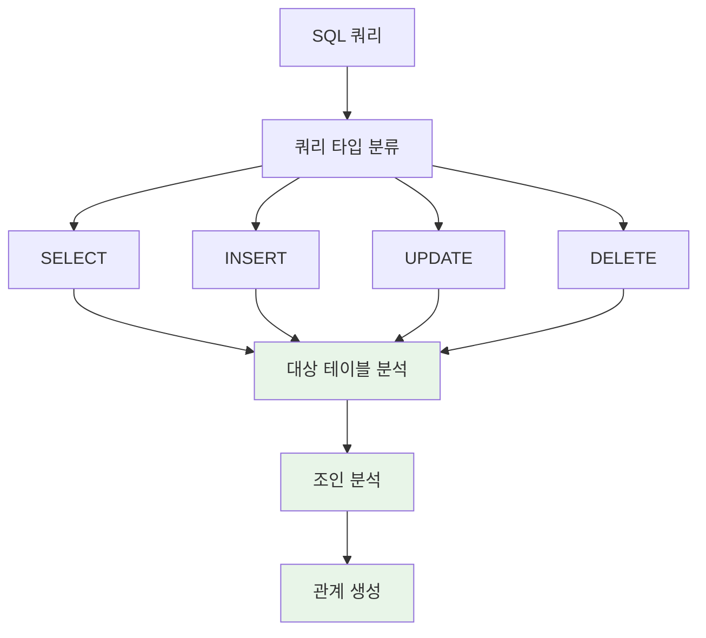

# 공통 SQL 분석 모듈 설계서

## 문서 정보
- **작성일**: 2025-01-17
- **버전**: v1.0
- **목적**: XML, Java 분석에서 공통으로 사용하는 SQL 쿼리 분석 모듈 설계

## 1. 모듈 개요

### 1.1 목적
XML(MyBatis), Java(JDBC, JPA) 분석에서 추출된 SQL 쿼리를 공통으로 분석하여 일관성 있는 테이블/조인 관계를 도출하고 INFERRED 객체를 생성하는 모듈

### 1.2 핵심 기능
- **SQL 쿼리 분석**: SELECT, INSERT, UPDATE, DELETE 모든 타입 지원
- **테이블 도출**: SQL에서 대상 테이블 식별
- **조인 도출**: 명시적/암시적 조인 조건 분석
- **INFERRED 생성**: 조인에서 발견된 누락 테이블/컬럼 자동 생성
- **관계 생성**: 테이블/컬럼 간 관계 정보 생성

### 1.3 공통화 원칙
- **쿼리 분석 → 테이블 도출 → 조인 도출**: XML, Java 분석에서 동일한 로직 사용
- **SQL 추출**: XML(MyBatis), Java(JDBC, JPA)에서 SQL 추출 후 공통 분석 모듈로 전달
- **INFERRED 생성**: 조인에서 발견된 누락 테이블/컬럼을 공통 모듈에서 생성

## 2. SQL 쿼리 타입별 조인 분석 플로우



## 3. SQL 조인 분석 패턴

### 3.1 명시적 조인 패턴
```python
explicit_joins = [
    r"(LEFT\s+(?:OUTER\s+)?JOIN)\s+([a-zA-Z_][a-zA-Z0-9_]*)(?:\s+([a-zA-Z_][a-zA-Z0-9_]*))?\s+ON\s+(.+?)(?=\s+(?:LEFT|RIGHT|FULL|INNER|CROSS|NATURAL|WHERE|GROUP|ORDER|$))",
    r"(INNER\s+JOIN)\s+([a-zA-Z_][a-zA-Z0-9_]*)(?:\s+([a-zA-Z_][a-zA-Z0-9_]*))?\s+ON\s+(.+?)(?=\s+(?:LEFT|RIGHT|FULL|INNER|CROSS|NATURAL|WHERE|GROUP|ORDER|$))",
    r"(RIGHT\s+(?:OUTER\s+)?JOIN)\s+([a-zA-Z_][a-zA-Z0-9_]*)(?:\s+([a-zA-Z_][a-zA-Z0-9_]*))?\s+ON\s+(.+?)(?=\s+(?:LEFT|RIGHT|FULL|INNER|CROSS|NATURAL|WHERE|GROUP|ORDER|$))"
]
```

### 3.2 암시적 조인 패턴
```python
implicit_joins = [
    r"([a-zA-Z_][a-zA-Z0-9_]*)\.([a-zA-Z_][a-zA-Z0-9_]*)\s*=\s*([a-zA-Z_][a-zA-Z0-9_]*)\.([a-zA-Z_][a-zA-Z0-9_]*)",
    r"([a-zA-Z_][a-zA-Z0-9_]*)\.([a-zA-Z_][a-zA-Z0-9_]*)\s*\(\+\)\s*=\s*([a-zA-Z_][a-zA-Z0-9_]*)\.([a-zA-Z_][a-zA-Z0-9_]*)"
]
```

### 3.3 서브쿼리 조인 패턴
```python
subquery_joins = [
    r"WHERE\s+EXISTS\s*\(\s*SELECT\s+.*?\s+FROM\s+([a-zA-Z_][a-zA-Z0-9_]*)",
    r"WHERE\s+.*?\s+IN\s*\(\s*SELECT\s+.*?\s+FROM\s+([a-zA-Z_][a-zA-Z0-9_]*)",
    r"FROM\s+\(\s*SELECT\s+.*?\s+FROM\s+([a-zA-Z_][a-zA-Z0-9_]*)"
]
```

## 4. 공통 SQL 쿼리 분석 모듈 구현

### 4.1 메인 분석기 클래스
```python
class CommonSQLAnalyzer:
    """XML, Java 분석에서 공통으로 사용하는 SQL 쿼리 분석기"""
    
    def analyze_sql_from_source(self, sql_content, source_type, source_file):
        """소스에서 추출한 SQL을 공통 분석"""
        
        # 1. 쿼리 타입 분류
        query_type = self.classify_query_type(sql_content)
        
        # 2. 대상 테이블 분석
        target_tables = self.extract_target_tables(sql_content, query_type)
        
        # 3. 조인 분석
        join_relationships = self.analyze_joins_in_query(sql_content)
        
        # 4. INFERRED 테이블/컬럼 생성
        inferred_objects = self.create_inferred_objects(join_relationships, source_file)
        
        # 5. 관계 생성
        relationships = self.create_sql_relationships(target_tables, join_relationships, source_type)
        
        return {
            'query_type': query_type,
            'target_tables': target_tables,
            'join_relationships': join_relationships,
            'inferred_objects': inferred_objects,
            'relationships': relationships
        }
```

### 4.2 XML에서 SQL 추출
```python
def extract_sql_from_xml(self, xml_content):
    """XML에서 SQL 추출"""
    sql_queries = []
    
    # MyBatis XML에서 SQL 추출
    select_queries = extract_mybatis_selects(xml_content)
    insert_queries = extract_mybatis_inserts(xml_content)
    update_queries = extract_mybatis_updates(xml_content)
    delete_queries = extract_mybatis_deletes(xml_content)
    
    sql_queries.extend(select_queries + insert_queries + update_queries + delete_queries)
    
    return sql_queries
```

### 4.3 Java에서 SQL 추출
```python
def extract_sql_from_java(self, java_content):
    """Java에서 SQL 추출"""
    sql_queries = []
    
    # JDBC SQL 추출
    jdbc_queries = extract_jdbc_sql(java_content)
    
    # JPA Query Method 추출
    jpa_queries = extract_jpa_query_methods(java_content)
    
    # MyBatis Mapper 호출 추출
    mybatis_queries = extract_mybatis_mapper_calls(java_content)
    
    sql_queries.extend(jdbc_queries + jpa_queries + mybatis_queries)
    
    return sql_queries
```

## 5. INFERRED 객체 생성 원칙

### 5.1 생성 조건
1. **테이블 검색**: project_id, table_name으로 기존 테이블 확인
2. **검색 실패 시**: INFERRED 테이블 생성 (table_owner='UNKNOWN')
3. **컬럼 생성**: 조인 조건에서 발견된 컬럼만 생성 (복잡도 최소화)
4. **동적 테이블명**: users_${environment} → USERS_ (동적 부분 제거)

### 5.2 생성 예시
```python
def create_inferred_objects(join_relationships, source_file):
    """조인에서 발견된 테이블/컬럼 자동 생성"""
    
    for relationship in join_relationships:
        # 1. 테이블 검색: project_id, table_name으로 기존 테이블 확인
        existing_table = find_table_by_name(project_id, table_name)
        
        if not existing_table:
            # 2. 검색 실패 시: INFERRED 테이블 생성 (table_owner='UNKNOWN')
            inferred_table = create_inferred_table(
                table_name=table_name,
                table_owner='UNKNOWN',
                source_type='INFERRED',
                inferred_from=f"SQL JOIN in {source_file}"
            )
        
        # 3. 컬럼 생성: 조인 조건에서 발견된 컬럼만 생성 (복잡도 최소화)
        if join_condition_columns:
            for column_name in join_condition_columns:
                create_inferred_column(
                    table_id=inferred_table.table_id,
                    column_name=column_name,
                    data_type='VARCHAR',  # 기본 타입
                    nullable='Y',
                    source_type='INFERRED',
                    inferred_from=f"JOIN condition: {join_condition}"
                )
```

## 6. 실제 SQL 예시

### 6.1 INSERT with JOIN
```sql
INSERT INTO orders (order_id, customer_id, product_id)
SELECT o.order_id, c.customer_id, p.product_id
FROM customers c
JOIN products p ON c.category = p.category
WHERE c.status = 'ACTIVE'
```

### 6.2 UPDATE with EXISTS
```sql
UPDATE orders o
SET o.status = 'COMPLETED'
WHERE EXISTS (
    SELECT 1 FROM customers c
    JOIN payments p ON c.customer_id = p.customer_id
    WHERE c.customer_id = o.customer_id
    AND p.status = 'PAID'
)
```

### 6.3 DELETE with IN
```sql
DELETE FROM orders
WHERE order_id IN (
    SELECT o.order_id
    FROM orders o
    JOIN customers c ON o.customer_id = c.customer_id
    WHERE c.status = 'INACTIVE'
)
```

## 7. XML/Java 분석에서 사용법

### 7.1 XML 분석에서 사용
```python
def analyze_xml_with_common_sql(xml_content):
    """XML 분석 시 공통 SQL 분석 모듈 사용"""
    
    # 1. XML에서 SQL 추출
    sql_analyzer = CommonSQLAnalyzer()
    sql_queries = sql_analyzer.extract_sql_from_xml(xml_content)
    
    # 2. 각 SQL을 공통 분석 모듈로 분석
    analysis_results = []
    for sql_query in sql_queries:
        result = sql_analyzer.analyze_sql_from_source(
            sql_content=sql_query['sql'],
            source_type='XML',
            source_file=sql_query['file']
        )
        analysis_results.append(result)
    
    return analysis_results
```

### 7.2 Java 분석에서 사용
```python
def analyze_java_with_common_sql(java_content):
    """Java 분석 시 공통 SQL 분석 모듈 사용"""
    
    # 1. Java에서 SQL 추출
    sql_analyzer = CommonSQLAnalyzer()
    sql_queries = sql_analyzer.extract_sql_from_java(java_content)
    
    # 2. 각 SQL을 공통 분석 모듈로 분석
    analysis_results = []
    for sql_query in sql_queries:
        result = sql_analyzer.analyze_sql_from_source(
            sql_content=sql_query['sql'],
            source_type='JAVA',
            source_file=sql_query['file']
        )
        analysis_results.append(result)
    
    return analysis_results
```

## 8. 장점 및 효과

### 8.1 코드 중복 제거
- XML, Java에서 동일한 SQL 분석 로직 재사용
- 개발 및 유지보수 비용 절약

### 8.2 일관성 보장
- 동일한 SQL에 대해 동일한 분석 결과 보장
- INFERRED 객체 생성 로직 통일

### 8.3 확장성
- 새로운 소스 타입 추가 시 공통 모듈 재사용 가능
- SQL 분석 로직 개선 시 모든 소스 타입에 자동 적용

### 8.4 테스트 용이성
- 공통 모듈만 테스트하면 모든 소스 타입 커버
- SQL 분석 로직의 품질 향상

## 9. 성능 고려사항

### 9.1 메모리 효율성
- SQL 분석 결과를 즉시 DB에 저장
- 메모리 누수 방지를 위한 적절한 리소스 해제

### 9.2 처리 속도
- 정규식 패턴 최적화
- 자주 사용되는 SQL 패턴에 대한 캐싱

### 9.3 오류 처리
- 잘못된 SQL 문법에 대한 안전한 처리
- 부분 분석 결과라도 활용하는 Fallback 메커니즘
