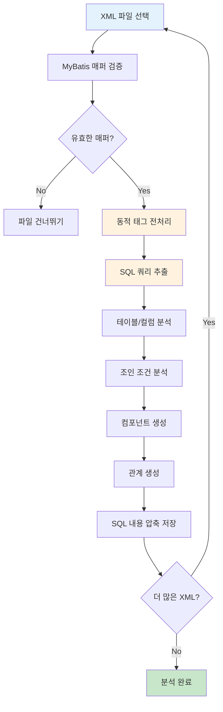
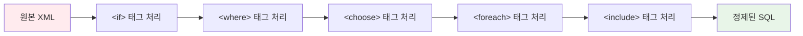
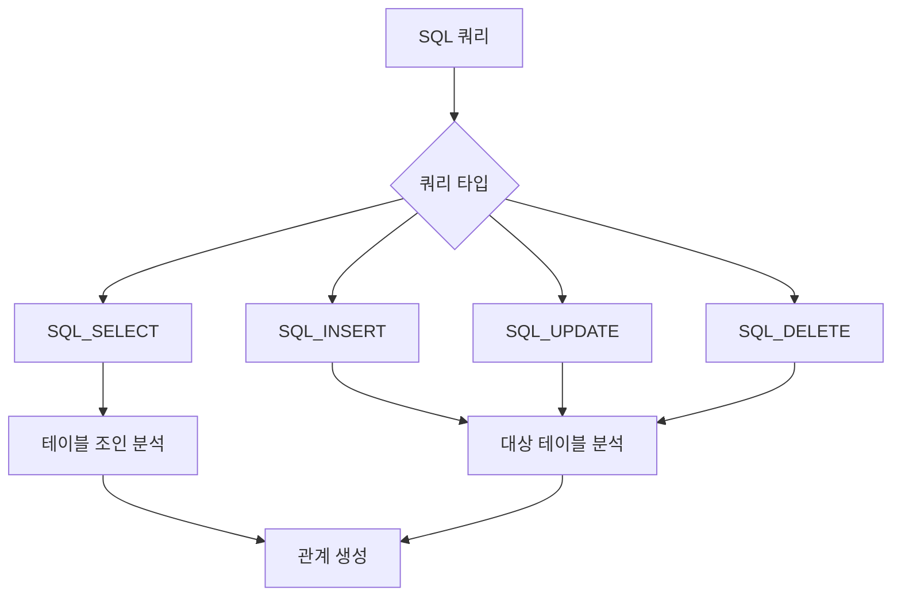
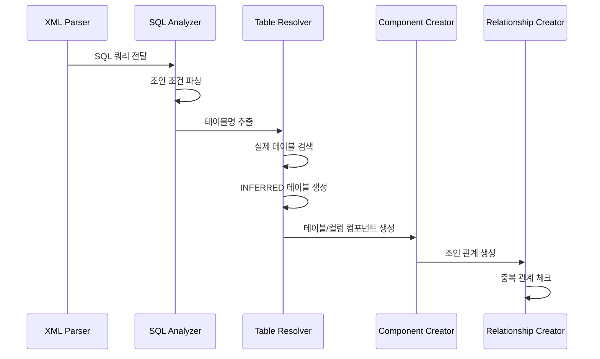
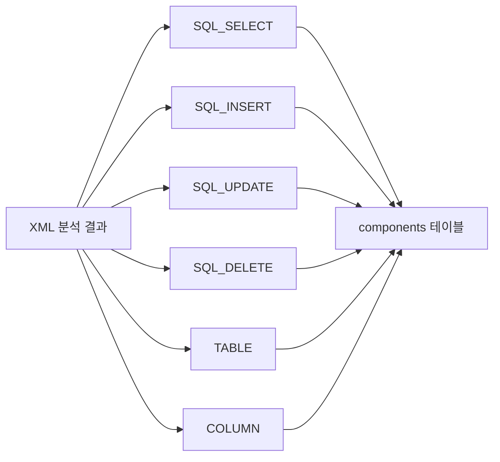
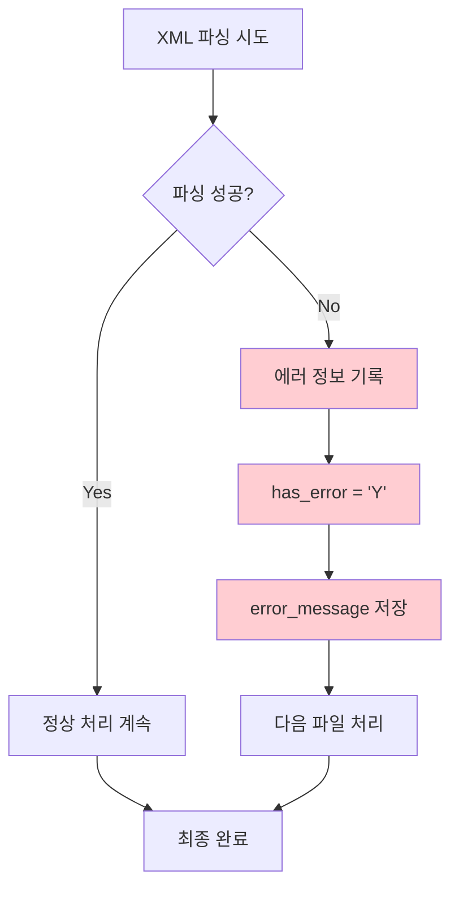

# XML 분석 구현서

## 문서 정보
- **작성일**: 2025-09-19
- **버전**: v1.0
- **목적**: MyBatis XML 파일 분석 및 메타데이터 추출

## 1. XML 분석 개요

### 1.1 분석 목적
- MyBatis XML 매퍼 파일에서 SQL 쿼리 추출
- 테이블 간 조인 관계 도출
- 동적 SQL 태그 처리를 통한 누락 방지

### 1.2 처리 대상 파일
```
대상 파일: *.xml (MyBatis 매퍼)
위치: src/main/resources/mybatis/mapper/
패턴: **/*Mapper.xml, **/*mapper.xml
```

## 2. XML 분석 플로우

### 2.1 전체 처리 플로우



### 2.2 동적 태그 처리 플로우



## 3. 동적 태그 처리 상세

### 3.1 처리 원칙
```
누락 방지 우선: 모든 조건부 내용을 포함
적절한 복잡도: 과도한 시뮬레이션 없이 목적 달성
실용적 접근: 영향평가에 필요한 수준까지만
```

### 3.2 태그별 처리 방식

#### `<if>` 태그 처리
```xml
<!-- 원본 -->
<if test="includeOrders == 'Y'">
    LEFT JOIN orders o ON u.user_id = o.user_id
</if>

<!-- 처리 결과 -->
LEFT JOIN orders o ON u.user_id = o.user_id
```

#### `<where>` 태그 처리
```xml
<!-- 원본 -->
<where>
    <if test="name != null">AND product_name = #{name}</if>
    <if test="status != null">AND status = #{status}</if>
</where>

<!-- 처리 결과 -->
WHERE AND product_name = #{name} AND status = #{status}
```

#### `<choose>` 태그 처리
```xml
<!-- 원본 -->
<choose>
    <when test="searchType == 'name'">AND u.name LIKE #{keyword}</when>
    <when test="searchType == 'email'">AND u.email LIKE #{keyword}</when>
    <otherwise>AND (u.name LIKE #{keyword} OR u.email LIKE #{keyword})</otherwise>
</choose>

<!-- 처리 결과 (모든 분기 포함) -->
AND u.name LIKE #{keyword} AND u.email LIKE #{keyword} AND (u.name LIKE #{keyword} OR u.email LIKE #{keyword})
```

### 3.3 처리 알고리즘

```python
def process_dynamic_tags(sql_content: str) -> str:
    """동적 태그 처리 - 누락 방지 우선"""
    
    # 1. <include> 태그 먼저 처리 (참조 해결)
    sql_content = resolve_include_tags(sql_content)
    
    # 2. <if> 태그: 조건 제거, 내용 유지
    sql_content = re.sub(r'<if[^>]*>(.*?)</if>', r'\1', 
                        sql_content, flags=re.DOTALL)
    
    # 3. <where> 태그: WHERE 키워드 추가
    sql_content = re.sub(r'<where>(.*?)</where>', r'WHERE \1', 
                        sql_content, flags=re.DOTALL)
    
    # 4. <choose> 관련 태그: 모든 분기 포함
    sql_content = re.sub(r'<when[^>]*>(.*?)</when>', r'\1', 
                        sql_content, flags=re.DOTALL)
    sql_content = re.sub(r'<otherwise>(.*?)</otherwise>', r'\1', 
                        sql_content, flags=re.DOTALL)
    sql_content = re.sub(r'<choose>(.*?)</choose>', r'\1', 
                        sql_content, flags=re.DOTALL)
    
    # 5. <foreach> 태그: 단순 처리
    sql_content = re.sub(r'<foreach[^>]*>(.*?)</foreach>', r'(\1)', 
                        sql_content, flags=re.DOTALL)
    
    return sql_content
```

## 4. SQL 쿼리 분석

### 4.1 쿼리 타입 분류



### 4.2 테이블 추출 패턴

#### 표준 JOIN 패턴
```sql
-- 패턴 1: INNER JOIN
SELECT * FROM users u 
INNER JOIN orders o ON u.user_id = o.user_id

-- 패턴 2: LEFT JOIN
SELECT * FROM users u 
LEFT JOIN user_profiles p ON u.user_id = p.user_id
```

#### Oracle 암시적 JOIN 패턴
```sql
-- 패턴 3: 암시적 조인
SELECT * FROM users u, orders o, products p
WHERE u.user_id = o.user_id 
  AND o.product_id = p.product_id
```

#### 서브쿼리 패턴
```sql
-- 패턴 4: 서브쿼리
SELECT * FROM users u 
WHERE u.user_id IN (
    SELECT o.user_id FROM orders o WHERE o.status = 'ACTIVE'
)
```

## 5. 테이블 관계 분석

### 5.1 조인 조건 추출 플로우



### 5.2 INFERRED 객체 생성

#### 테이블 생성 조건
```python
def create_inferred_table(project_id: int, table_name: str) -> int:
    """INFERRED 테이블 생성"""
    
    # 1. 실제 테이블 검색
    existing_table = search_existing_table(project_id, table_name)
    if existing_table:
        return existing_table.table_id
    
    # 2. INFERRED 테이블 생성
    table_data = {
        'project_id': project_id,
        'table_name': normalize_table_name(table_name),  # users_dev -> USERS_
        'table_owner': 'UNKNOWN',  # INFERRED 표시
        'table_comments': f'INFERRED from SQL analysis'
    }
    
    return create_table_component(table_data)
```

#### 컬럼 생성 조건
```python
def create_inferred_columns(table_id: int, join_conditions: list) -> list:
    """조인 조건에서 컬럼 생성"""
    
    created_columns = []
    
    for condition in join_conditions:
        # u.user_id = o.user_id 형태 파싱
        left_col = condition['left_column']   # user_id
        right_col = condition['right_column'] # user_id
        
        # 각 테이블에 해당 컬럼 생성 (존재하지 않는 경우만)
        for table_alias, column_name in [(condition['left_table'], left_col),
                                        (condition['right_table'], right_col)]:
            if not column_exists(table_id, column_name):
                col_data = {
                    'table_id': table_id,
                    'column_name': column_name,
                    'data_type': 'UNKNOWN',
                    'nullable': 'Y'
                }
                created_columns.append(create_column_component(col_data))
    
    return created_columns
```

## 6. 컴포넌트 생성

### 6.1 컴포넌트 타입별 생성



### 6.2 SQL 컴포넌트 생성 예시

```python
def create_sql_component(query_info: dict) -> int:
    """SQL 컴포넌트 생성"""
    
    component_data = {
        'project_id': query_info['project_id'],
        'file_id': query_info['file_id'],
        'component_name': query_info['query_id'],  # selectUserById
        'component_type': query_info['query_type'], # SQL_SELECT
        'layer': 'QUERY',
        'line_start': query_info.get('line_start', 1),
        'line_end': query_info.get('line_end', 1)
    }
    
    component_id = insert_component(component_data)
    
    # SQL 내용 압축 저장
    store_compressed_sql_content(
        component_id=component_id,
        sql_content=query_info['processed_sql'],
        file_info=query_info
    )
    
    return component_id
```

## 7. 관계 생성

### 7.1 관계 타입별 생성

#### 조인 관계 생성
```python
def create_join_relationships(join_conditions: list) -> None:
    """조인 관계 생성"""
    
    for condition in join_conditions:
        # PK/FK 우선순위 결정
        src_column_id, dst_column_id = determine_pk_fk_priority(
            condition['left_column_id'], 
            condition['right_column_id']
        )
        
        # 관계 생성 (중복 방지)
        relationship_data = {
            'src_id': src_column_id,   # PK 컬럼 (또는 작은 ID)
            'dst_id': dst_column_id,   # FK 컬럼 (또는 큰 ID)
            'rel_type': 'JOIN_EXPLICIT' if condition['join_type'] == 'explicit' 
                       else 'JOIN_IMPLICIT'
        }
        
        create_relationship_if_not_exists(relationship_data)
```

#### 쿼리-테이블 관계 생성
```python
def create_query_table_relationships(query_component_id: int, 
                                   table_component_ids: list) -> None:
    """쿼리-테이블 사용 관계 생성"""
    
    for table_id in table_component_ids:
        relationship_data = {
            'src_id': query_component_id,
            'dst_id': table_id,
            'rel_type': 'USE_TABLE'
        }
        
        create_relationship_if_not_exists(relationship_data)
```

## 8. 에러 처리

### 8.1 에러 처리 방침
```
부분 실패 허용: 하나의 XML 파일 오류가 전체를 중단시키지 않음
에러 기록: has_error='Y', error_message로 상세 정보 저장
처리 계속: 가능한 부분은 계속 처리하여 누락 최소화
```

### 8.2 에러 처리 플로우



## 9. 성능 최적화

### 9.1 메모리 관리
- 파일별 순차 처리로 메모리 사용량 제한
- 대용량 SQL 내용은 압축 저장
- 불필요한 객체 즉시 해제

### 9.2 처리 속도
- 정규식 컴파일 재사용
- 데이터베이스 배치 삽입
- 중복 검색 최소화

---

## 다음 단계
- [05_Java_분석_구현서.md](05_Java_분석_구현서.md): Java 파일 분석 상세 구현
- [06_관계_정립_구현서.md](06_관계_정립_구현서.md): 컴포넌트 간 관계 정립
