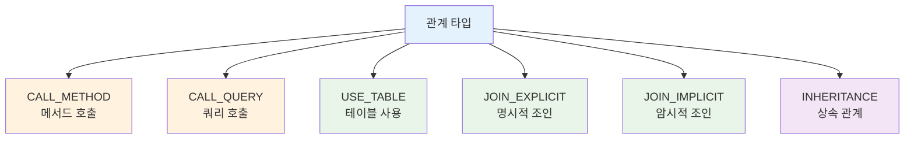
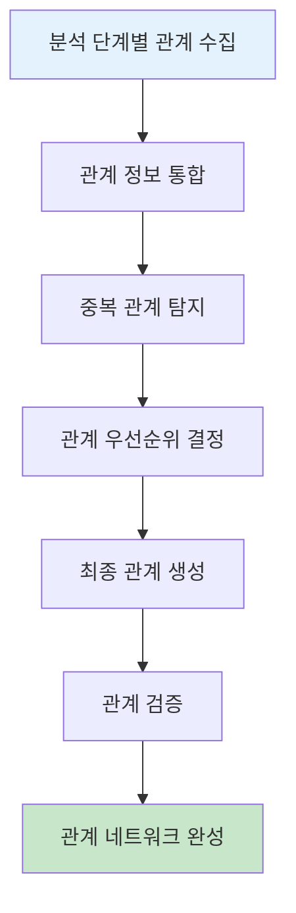
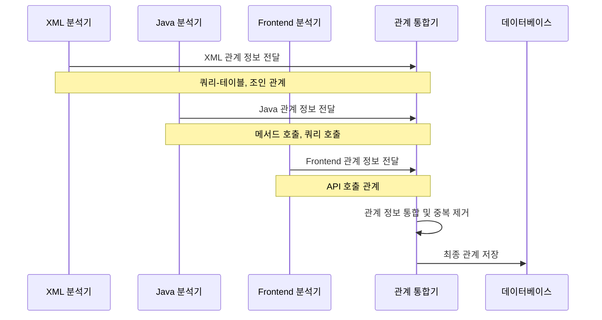
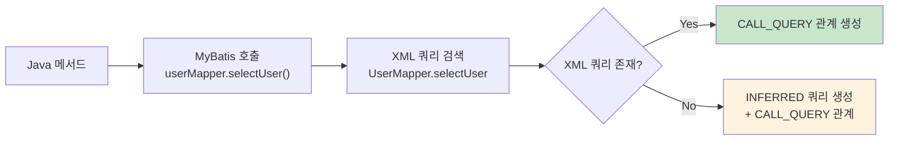
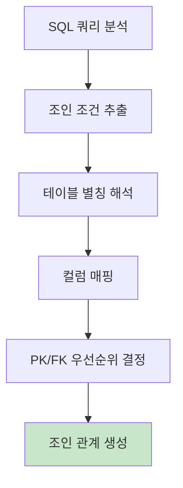
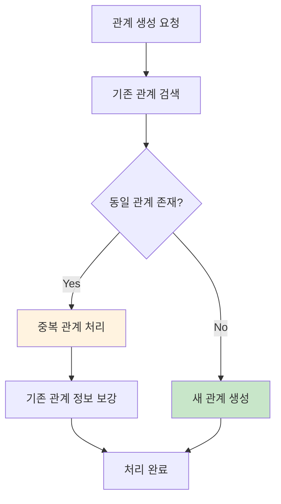
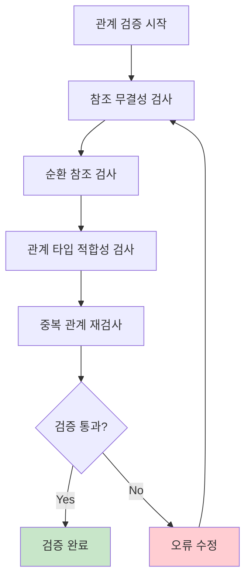
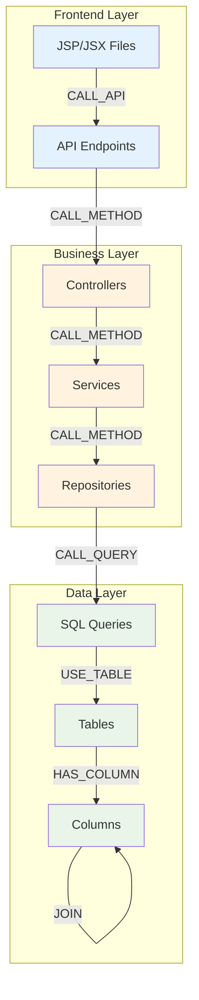

# 관계 정립 구현서

## 문서 정보
- **작성일**: 2025-09-19
- **버전**: v1.0
- **목적**: 컴포넌트 간 관계 정립 및 통합 관리

## 1. 관계 정립 개요

### 1.1 관계 정립 목적
- 분산된 관계 정보를 통합 관리
- 중복 관계 제거 및 일관성 확보
- 영향평가를 위한 관계 네트워크 구축

### 1.2 관계 타입 정의



## 2. 관계 정립 플로우

### 2.1 전체 처리 플로우



### 2.2 관계 수집 시퀀스



## 3. 관계별 정립 상세

### 3.1 메서드 호출 관계 (CALL_METHOD)

#### 관계 생성 조건
```
- Controller -> Service
- Service -> Repository/DAO
- Util 클래스 메서드 호출
- 동일 클래스 내 메서드 호출
```

#### 관계 생성 알고리즘
```python
def establish_method_call_relationships(project_id: int) -> None:
    """메서드 호출 관계 정립"""
    
    # 1. 모든 메서드 컴포넌트 조회
    method_components = get_method_components(project_id)
    
    for method in method_components:
        # 2. 해당 메서드의 호출 패턴 분석
        called_methods = analyze_method_calls_in_source(method)
        
        for called_method_signature in called_methods:
            # 3. 호출되는 메서드 컴포넌트 검색
            target_method = find_method_component_by_signature(
                project_id, called_method_signature
            )
            
            if target_method:
                # 4. 관계 생성 (중복 방지)
                create_relationship_if_not_exists({
                    'src_id': method.component_id,
                    'dst_id': target_method.component_id,
                    'rel_type': 'CALL_METHOD'
                })
```

### 3.2 쿼리 호출 관계 (CALL_QUERY)

#### Java -> XML 쿼리 연결


#### 관계 생성 구현
```python
def establish_query_call_relationships(project_id: int) -> None:
    """쿼리 호출 관계 정립"""
    
    # 1. Java 메서드의 MyBatis 호출 패턴 분석
    java_methods = get_java_methods_with_mybatis_calls(project_id)
    
    for method in java_methods:
        for mybatis_call in method.mybatis_calls:
            # 2. XML에서 해당 쿼리 검색
            xml_query = find_xml_query_component(
                project_id, 
                mybatis_call.namespace,  # UserMapper
                mybatis_call.query_id    # selectUserById
            )
            
            if xml_query:
                # 3. 실제 XML 쿼리와 연결
                create_relationship_if_not_exists({
                    'src_id': method.component_id,
                    'dst_id': xml_query.component_id,
                    'rel_type': 'CALL_QUERY'
                })
            else:
                # 4. INFERRED 쿼리 생성 후 연결
                inferred_query = create_inferred_query_component({
                    'project_id': project_id,
                    'file_id': method.file_id,
                    'component_name': f"{mybatis_call.namespace}.{mybatis_call.query_id}",
                    'component_type': 'QUERY',
                    'layer': 'QUERY'
                })
                
                create_relationship_if_not_exists({
                    'src_id': method.component_id,
                    'dst_id': inferred_query.component_id,
                    'rel_type': 'CALL_QUERY'
                })
```

### 3.3 테이블 사용 관계 (USE_TABLE)

#### 쿼리 -> 테이블 관계
```python
def establish_table_usage_relationships(project_id: int) -> None:
    """테이블 사용 관계 정립"""
    
    # 1. 모든 쿼리 컴포넌트 조회 (SQL_*, QUERY 타입)
    query_components = get_query_components(project_id)
    
    for query in query_components:
        # 2. 쿼리에서 사용된 테이블 추출
        used_tables = extract_tables_from_query(query)
        
        for table_name in used_tables:
            # 3. 테이블 컴포넌트 검색/생성
            table_component = find_or_create_table_component(
                project_id, table_name
            )
            
            # 4. 쿼리 -> 테이블 관계 생성
            create_relationship_if_not_exists({
                'src_id': query.component_id,
                'dst_id': table_component.component_id,
                'rel_type': 'USE_TABLE'
            })
```

### 3.4 조인 관계 (JOIN_EXPLICIT, JOIN_IMPLICIT)

#### 조인 조건 분석 플로우


#### 조인 관계 생성 구현
```python
def establish_join_relationships(project_id: int) -> None:
    """조인 관계 정립"""
    
    # 1. 모든 SELECT 쿼리 조회
    select_queries = get_select_query_components(project_id)
    
    for query in select_queries:
        # 2. SQL 내용에서 조인 조건 추출
        join_conditions = extract_join_conditions_from_sql(query.sql_content)
        
        for condition in join_conditions:
            # 3. 조인되는 컬럼 컴포넌트 검색/생성
            left_column = find_or_create_column_component(
                project_id, condition.left_table, condition.left_column
            )
            right_column = find_or_create_column_component(
                project_id, condition.right_table, condition.right_column
            )
            
            # 4. PK/FK 우선순위에 따른 관계 생성
            src_id, dst_id = determine_join_priority(left_column, right_column)
            
            create_relationship_if_not_exists({
                'src_id': src_id,
                'dst_id': dst_id,
                'rel_type': condition.join_type  # JOIN_EXPLICIT or JOIN_IMPLICIT
            })

def determine_join_priority(col1: ColumnComponent, 
                          col2: ColumnComponent) -> Tuple[int, int]:
    """조인 관계의 src_id, dst_id 우선순위 결정"""
    
    # 1. PK 컬럼을 src_id로 우선 배치
    if col1.is_primary_key and not col2.is_primary_key:
        return col1.component_id, col2.component_id
    elif col2.is_primary_key and not col1.is_primary_key:
        return col2.component_id, col1.component_id
    
    # 2. 둘 다 PK이거나 둘 다 PK가 아닌 경우: component_id가 작은 것을 src_id로
    if col1.component_id < col2.component_id:
        return col1.component_id, col2.component_id
    else:
        return col2.component_id, col1.component_id
```

## 4. 중복 관계 처리

### 4.1 중복 관계 탐지



### 4.2 중복 처리 전략

#### 파일별 중복 허용 관계
```python
def handle_file_level_duplicates():
    """파일 수준에서 중복 허용하는 관계"""
    
    # File -> Query 관계: 같은 쿼리라도 다른 파일에서 호출하면 별도 저장
    # 예: File1 -> selectUser, File2 -> selectUser (둘 다 저장)
    
    duplicate_allowed_types = [
        'CALL_QUERY',  # 메서드 -> 쿼리 호출
        'USE_TABLE'    # 쿼리 -> 테이블 사용 (파일별로 다를 수 있음)
    ]
    
    return duplicate_allowed_types
```

#### 시스템 수준 중복 방지 관계
```python
def handle_system_level_duplicates():
    """시스템 수준에서 중복 방지하는 관계"""
    
    # Table <-> Table 조인 관계: 동일한 조인 조건은 1개만 저장
    # 예: users.user_id = orders.user_id (여러 쿼리에서 발견되어도 1개만)
    
    duplicate_prevented_types = [
        'JOIN_EXPLICIT',   # 명시적 조인
        'JOIN_IMPLICIT',   # 암시적 조인
        'INHERITANCE'      # 클래스 상속
    ]
    
    return duplicate_prevented_types
```

### 4.3 중복 제거 구현

```python
def create_relationship_if_not_exists(relationship_data: dict) -> bool:
    """중복 방지 관계 생성"""
    
    rel_type = relationship_data['rel_type']
    
    # 1. 중복 방지 대상인지 확인
    if rel_type in get_duplicate_prevented_types():
        # 시스템 수준 중복 검사
        existing_rel = find_existing_relationship(
            relationship_data['src_id'],
            relationship_data['dst_id'], 
            rel_type
        )
        
        if existing_rel:
            # 이미 존재하는 관계 - 생성하지 않음
            return False
    
    # 2. 새 관계 생성
    insert_relationship(relationship_data)
    return True

def find_existing_relationship(src_id: int, dst_id: int, rel_type: str) -> dict:
    """기존 관계 검색"""
    
    query = """
    SELECT * FROM relationships 
    WHERE src_id = ? AND dst_id = ? AND rel_type = ? AND del_yn = 'N'
    """
    
    return execute_query(query, [src_id, dst_id, rel_type])
```

## 5. 관계 검증

### 5.1 관계 일관성 검증



### 5.2 검증 항목별 구현

#### 참조 무결성 검증
```python
def validate_referential_integrity(project_id: int) -> List[dict]:
    """참조 무결성 검증"""
    
    errors = []
    
    # 1. src_id, dst_id가 유효한 component_id인지 검사
    invalid_refs = execute_query("""
        SELECT r.relationship_id, r.src_id, r.dst_id, r.rel_type
        FROM relationships r
        LEFT JOIN components c1 ON r.src_id = c1.component_id
        LEFT JOIN components c2 ON r.dst_id = c2.component_id
        WHERE r.project_id = ? 
          AND (c1.component_id IS NULL OR c2.component_id IS NULL)
    """, [project_id])
    
    for invalid_ref in invalid_refs:
        errors.append({
            'type': 'INVALID_REFERENCE',
            'relationship_id': invalid_ref['relationship_id'],
            'message': f"Invalid component reference in {invalid_ref['rel_type']} relationship"
        })
    
    return errors
```

#### 순환 참조 검증
```python
def validate_circular_references(project_id: int) -> List[dict]:
    """순환 참조 검증"""
    
    errors = []
    
    # 상속 관계에서 순환 참조 검사
    inheritance_cycles = detect_inheritance_cycles(project_id)
    
    for cycle in inheritance_cycles:
        errors.append({
            'type': 'CIRCULAR_INHERITANCE',
            'cycle_path': cycle,
            'message': f"Circular inheritance detected: {' -> '.join(cycle)}"
        })
    
    return errors

def detect_inheritance_cycles(project_id: int) -> List[List[str]]:
    """상속 관계 순환 참조 탐지"""
    
    # 그래프 구성
    inheritance_graph = build_inheritance_graph(project_id)
    
    # DFS로 순환 참조 탐지
    cycles = []
    visited = set()
    rec_stack = set()
    
    def dfs(node, path):
        if node in rec_stack:
            # 순환 참조 발견
            cycle_start = path.index(node)
            cycles.append(path[cycle_start:] + [node])
            return
        
        if node in visited:
            return
        
        visited.add(node)
        rec_stack.add(node)
        
        for child in inheritance_graph.get(node, []):
            dfs(child, path + [child])
        
        rec_stack.remove(node)
    
    for root in inheritance_graph.keys():
        if root not in visited:
            dfs(root, [root])
    
    return cycles
```

## 6. 관계 네트워크 완성

### 6.1 관계 네트워크 구조



### 6.2 영향평가를 위한 관계 최적화

```python
def optimize_relationships_for_impact_analysis(project_id: int) -> None:
    """영향평가를 위한 관계 최적화"""
    
    # 1. 관계 경로 인덱싱
    create_relationship_path_indexes(project_id)
    
    # 2. 자주 사용되는 관계 캐싱
    cache_frequent_relationships(project_id)
    
    # 3. 영향 범위별 관계 그룹핑
    group_relationships_by_impact_scope(project_id)

def create_relationship_path_indexes(project_id: int) -> None:
    """관계 경로 인덱스 생성"""
    
    # 성능 최적화를 위한 인덱스 생성
    indexes = [
        "CREATE INDEX IF NOT EXISTS idx_rel_src_type ON relationships(src_id, rel_type)",
        "CREATE INDEX IF NOT EXISTS idx_rel_dst_type ON relationships(dst_id, rel_type)", 
        "CREATE INDEX IF NOT EXISTS idx_rel_project ON relationships(project_id, del_yn)"
    ]
    
    for index_sql in indexes:
        execute_query(index_sql)
```

## 7. 성능 최적화

### 7.1 관계 생성 최적화

```python
def optimize_relationship_creation():
    """관계 생성 성능 최적화"""
    
    # 1. 배치 삽입 사용
    def batch_create_relationships(relationships: List[dict], batch_size: int = 1000):
        for i in range(0, len(relationships), batch_size):
            batch = relationships[i:i + batch_size]
            batch_insert_relationships(batch)
    
    # 2. 중복 검사 최적화
    def optimize_duplicate_check():
        # 메모리 캐시 사용으로 중복 검사 속도 향상
        relationship_cache = {}
        
        def is_duplicate_cached(src_id, dst_id, rel_type):
            key = f"{src_id}_{dst_id}_{rel_type}"
            return key in relationship_cache
    
    # 3. 트랜잭션 최적화
    def optimize_transactions():
        # 관계 타입별로 트랜잭션 분리
        with transaction():
            create_method_call_relationships()
        
        with transaction():
            create_query_relationships()
        
        with transaction():
            create_join_relationships()
```

---

## 다음 단계
- [07_Frontend_분석_구현서.md](07_Frontend_분석_구현서.md): JSP/Frontend 분석 구현
- [09_영향평가_활용_가이드.md](09_영향평가_활용_가이드.md): 구축된 메타데이터 활용 방안
