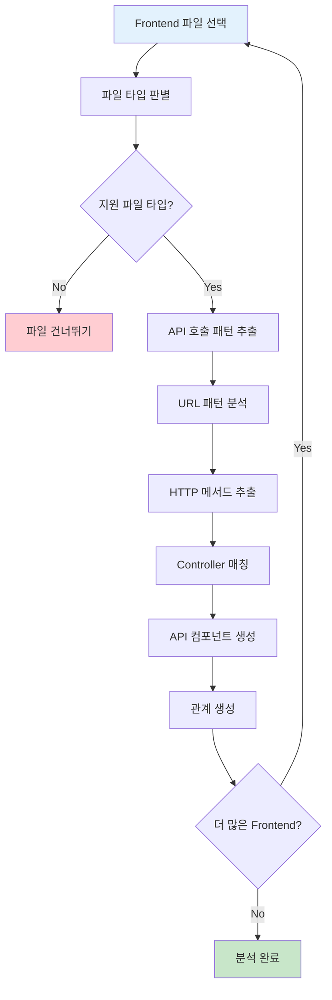
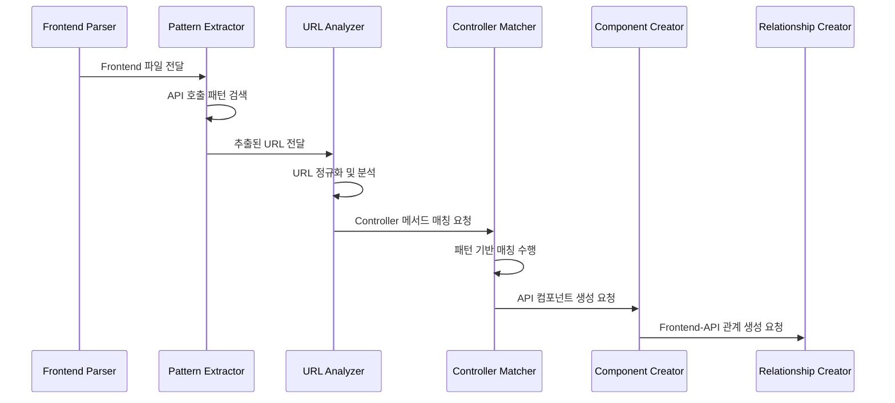
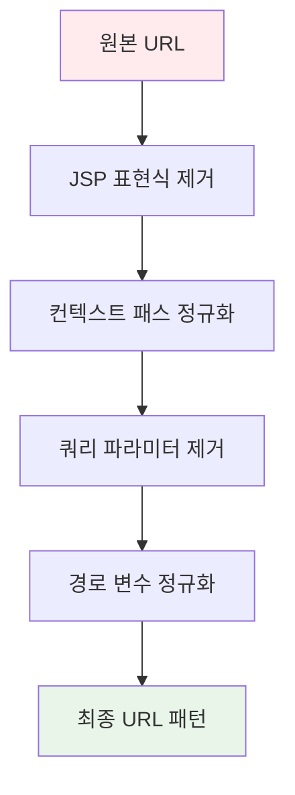
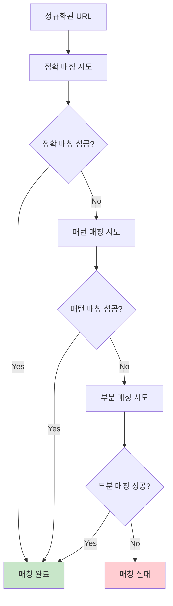
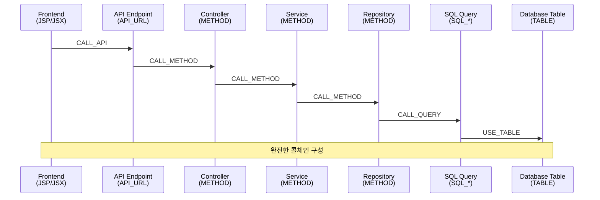
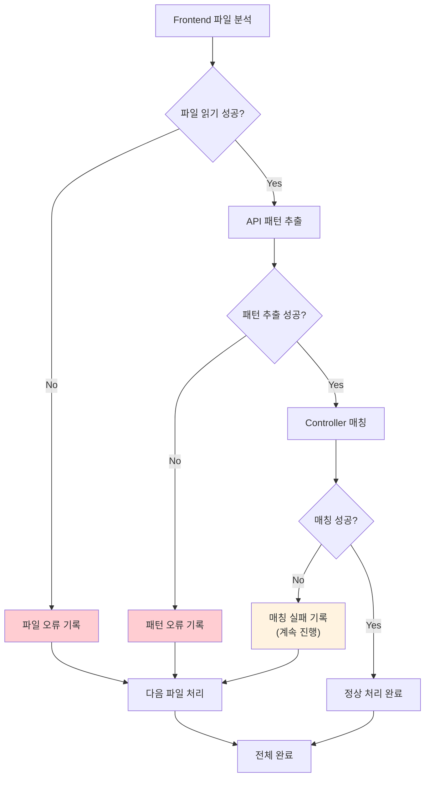

# Frontend 분석 구현서

## 문서 정보
- **작성일**: 2025-09-19
- **버전**: v1.0
- **목적**: JSP/JSX 등 프론트엔드 파일 분석 및 API 연결

## 1. Frontend 분석 개요

### 1.1 분석 목적
- 프론트엔드에서 백엔드 API 호출 패턴 추출
- Frontend -> Backend 연결 관계 구축
- 전체 콜체인 완성을 위한 시작점 제공

### 1.2 처리 대상 파일
```
대상 파일: *.jsp, *.jsx, *.js, *.vue
위치: src/main/webapp/, src/main/resources/static/
패턴: **/*.jsp, **/*.jsx, **/*.js, **/*.vue
```

## 2. Frontend 분석 플로우

### 2.1 전체 처리 플로우



### 2.2 API 호출 추출 시퀀스



## 3. API 호출 패턴 추출

### 3.1 JSP 파일 패턴

#### 폼 액션 패턴
```jsp
<!-- 패턴 1: form action -->
<form action="/user/save" method="post">
<form action="${pageContext.request.contextPath}/user/update" method="post">

<!-- 패턴 2: AJAX 호출 -->
$.ajax({
    url: '/api/users',
    type: 'GET',
    success: function(data) { ... }
});

<!-- 패턴 3: 링크 href -->
<a href="/user/list">사용자 목록</a>
<a href="<c:url value='/user/detail'/>">상세보기</a>
```

#### JSP 패턴 추출 구현
```python
def extract_jsp_api_patterns(jsp_content: str) -> List[dict]:
    """JSP 파일에서 API 호출 패턴 추출"""
    
    api_calls = []
    
    # 1. form action 패턴
    form_patterns = [
        r'<form[^>]+action\s*=\s*["\']([^"\']+)["\'][^>]*method\s*=\s*["\'](\w+)["\']',
        r'<form[^>]+method\s*=\s*["\'](\w+)["\'][^>]*action\s*=\s*["\']([^"\']+)["\']'
    ]
    
    for pattern in form_patterns:
        matches = re.finditer(pattern, jsp_content, re.IGNORECASE)
        for match in matches:
            if 'action' in pattern:
                url, method = match.groups()
            else:
                method, url = match.groups()
            
            api_calls.append({
                'type': 'FORM_ACTION',
                'url': clean_jsp_url(url),
                'method': method.upper(),
                'line': get_line_number(jsp_content, match.start())
            })
    
    # 2. AJAX 호출 패턴
    ajax_patterns = [
        r'\$\.ajax\s*\(\s*\{[^}]*url\s*:\s*["\']([^"\']+)["\'][^}]*type\s*:\s*["\'](\w+)["\']',
        r'\$\.ajax\s*\(\s*\{[^}]*type\s*:\s*["\'](\w+)["\'][^}]*url\s*:\s*["\']([^"\']+)["\']'
    ]
    
    for pattern in ajax_patterns:
        matches = re.finditer(pattern, jsp_content, re.IGNORECASE | re.DOTALL)
        for match in matches:
            if 'url.*type' in pattern:
                url, method = match.groups()
            else:
                method, url = match.groups()
            
            api_calls.append({
                'type': 'AJAX_CALL',
                'url': clean_jsp_url(url),
                'method': method.upper(),
                'line': get_line_number(jsp_content, match.start())
            })
    
    # 3. 링크 href 패턴 (GET 요청)
    href_pattern = r'<a[^>]+href\s*=\s*["\']([^"\']+)["\']'
    matches = re.finditer(href_pattern, jsp_content, re.IGNORECASE)
    for match in matches:
        url = clean_jsp_url(match.group(1))
        
        api_calls.append({
            'type': 'LINK_HREF',
            'url': url,
            'method': 'GET',
            'line': get_line_number(jsp_content, match.start())
        })
    
    return api_calls

def clean_jsp_url(raw_url: str) -> str:
    """JSP URL 정리"""
    
    # JSP 표현식 제거
    url = re.sub(r'\$\{[^}]+\}', '', raw_url)
    url = re.sub(r'<c:url[^>]*value\s*=\s*["\']([^"\']+)["\'][^>]*/?>', r'\1', url)
    
    # 컨텍스트 패스 정규화
    url = re.sub(r'^\$\{pageContext\.request\.contextPath\}', '', url)
    
    # 앞뒤 공백 제거 및 정규화
    url = url.strip()
    if not url.startswith('/'):
        url = '/' + url
    
    return url
```

### 3.2 JSX/JavaScript 패턴

#### React/Vue API 호출 패턴
```javascript
// 패턴 1: fetch API
fetch('/api/users', {
    method: 'GET',
    headers: { 'Content-Type': 'application/json' }
});

// 패턴 2: axios 호출
axios.get('/api/users');
axios.post('/api/users', userData);

// 패턴 3: jQuery AJAX
$.get('/api/users');
$.post('/api/users', userData);
```

#### JSX 패턴 추출 구현
```python
def extract_jsx_api_patterns(jsx_content: str) -> List[dict]:
    """JSX/JS 파일에서 API 호출 패턴 추출"""
    
    api_calls = []
    
    # 1. fetch API 패턴
    fetch_pattern = r'fetch\s*\(\s*["\']([^"\']+)["\'](?:\s*,\s*\{[^}]*method\s*:\s*["\'](\w+)["\'])?'
    matches = re.finditer(fetch_pattern, jsx_content, re.IGNORECASE)
    for match in matches:
        url = match.group(1)
        method = match.group(2) if match.group(2) else 'GET'
        
        api_calls.append({
            'type': 'FETCH_API',
            'url': url,
            'method': method.upper(),
            'line': get_line_number(jsx_content, match.start())
        })
    
    # 2. axios 패턴
    axios_patterns = [
        (r'axios\.get\s*\(\s*["\']([^"\']+)["\']', 'GET'),
        (r'axios\.post\s*\(\s*["\']([^"\']+)["\']', 'POST'),
        (r'axios\.put\s*\(\s*["\']([^"\']+)["\']', 'PUT'),
        (r'axios\.delete\s*\(\s*["\']([^"\']+)["\']', 'DELETE')
    ]
    
    for pattern, method in axios_patterns:
        matches = re.finditer(pattern, jsx_content, re.IGNORECASE)
        for match in matches:
            api_calls.append({
                'type': 'AXIOS_CALL',
                'url': match.group(1),
                'method': method,
                'line': get_line_number(jsx_content, match.start())
            })
    
    # 3. jQuery AJAX 패턴
    jquery_patterns = [
        (r'\$\.get\s*\(\s*["\']([^"\']+)["\']', 'GET'),
        (r'\$\.post\s*\(\s*["\']([^"\']+)["\']', 'POST')
    ]
    
    for pattern, method in jquery_patterns:
        matches = re.finditer(pattern, jsx_content, re.IGNORECASE)
        for match in matches:
            api_calls.append({
                'type': 'JQUERY_AJAX',
                'url': match.group(1),
                'method': method,
                'line': get_line_number(jsx_content, match.start())
            })
    
    return api_calls
```

## 4. URL 패턴 분석 및 정규화

### 4.1 URL 정규화 플로우



### 4.2 URL 정규화 구현

```python
def normalize_api_url(raw_url: str) -> str:
    """API URL 정규화"""
    
    # 1. JSP/JSX 표현식 제거
    url = remove_expression_patterns(raw_url)
    
    # 2. 컨텍스트 패스 정규화
    url = normalize_context_path(url)
    
    # 3. 쿼리 파라미터 제거
    url = remove_query_parameters(url)
    
    # 4. 경로 변수 정규화
    url = normalize_path_variables(url)
    
    # 5. 최종 정리
    url = url.strip().rstrip('/')
    if not url.startswith('/'):
        url = '/' + url
    
    return url

def remove_expression_patterns(url: str) -> str:
    """JSP/JSX 표현식 제거"""
    
    # JSP 표현식 제거
    url = re.sub(r'\$\{[^}]+\}', '', url)
    url = re.sub(r'<%[^%]*%>', '', url)
    
    # JSX 표현식 제거
    url = re.sub(r'\{[^}]*\}', '', url)
    
    # JSTL 태그 제거
    url = re.sub(r'<c:url[^>]*value\s*=\s*["\']([^"\']+)["\'][^>]*/?>', r'\1', url)
    
    return url

def normalize_path_variables(url: str) -> str:
    """경로 변수 정규화"""
    
    # Spring MVC 경로 변수: /user/{id} -> /user/*
    url = re.sub(r'\{[^}]+\}', '*', url)
    
    # 숫자 패턴: /user/123 -> /user/*
    url = re.sub(r'/\d+(?=/|$)', '/*', url)
    
    return url
```

## 5. Controller 매칭

### 5.1 매칭 전략



### 5.2 Controller 매칭 구현

```python
def match_controller_method(api_url: str, http_method: str, 
                          project_id: int) -> dict:
    """Controller 메서드 매칭"""
    
    # 1. 정확 매칭 시도
    exact_match = find_exact_controller_match(api_url, http_method, project_id)
    if exact_match:
        return exact_match
    
    # 2. 패턴 매칭 시도
    pattern_match = find_pattern_controller_match(api_url, http_method, project_id)
    if pattern_match:
        return pattern_match
    
    # 3. 부분 매칭 시도
    partial_match = find_partial_controller_match(api_url, http_method, project_id)
    if partial_match:
        return partial_match
    
    # 4. 매칭 실패
    return None

def find_exact_controller_match(api_url: str, http_method: str, 
                              project_id: int) -> dict:
    """정확 매칭 검색"""
    
    # API_URL 컴포넌트에서 정확히 일치하는 것 검색
    query = """
    SELECT c.component_id, c.component_name, c.class_name, c.method_name
    FROM components c
    WHERE c.project_id = ?
      AND c.component_type = 'API_URL'
      AND c.api_url = ?
      AND c.call_method = ?
      AND c.del_yn = 'N'
    """
    
    result = execute_query(query, [project_id, api_url, http_method])
    return result[0] if result else None

def find_pattern_controller_match(api_url: str, http_method: str,
                                project_id: int) -> dict:
    """패턴 매칭 검색"""
    
    # 경로 변수가 포함된 패턴 매칭
    # /user/* 패턴이 /user/123과 매칭되는지 확인
    
    query = """
    SELECT c.component_id, c.component_name, c.class_name, c.method_name, c.api_url
    FROM components c
    WHERE c.project_id = ?
      AND c.component_type = 'API_URL'
      AND c.call_method = ?
      AND c.del_yn = 'N'
    """
    
    api_components = execute_query(query, [project_id, http_method])
    
    for component in api_components:
        if is_url_pattern_match(component['api_url'], api_url):
            return component
    
    return None

def is_url_pattern_match(pattern_url: str, target_url: str) -> bool:
    """URL 패턴 매칭 검사"""
    
    # 패턴을 정규식으로 변환
    # /user/* -> /user/[^/]+
    # /user/*/orders -> /user/[^/]+/orders
    
    regex_pattern = pattern_url.replace('*', '[^/]+')
    regex_pattern = f"^{regex_pattern}$"
    
    return re.match(regex_pattern, target_url) is not None
```

## 6. API 컴포넌트 생성

### 6.1 API 컴포넌트 구조

```python
class ApiComponent:
    """API 컴포넌트 정보"""
    
    def __init__(self):
        self.component_name: str = ""     # GET_/api/users
        self.api_url: str = ""            # /api/users
        self.call_method: str = ""        # GET, POST, PUT, DELETE
        self.class_name: str = ""         # UserController
        self.method_name: str = ""        # getUserList
        self.layer: str = "API_ENTRY"     # 고정값
```

### 6.2 API 컴포넌트 생성 구현

```python
def create_api_component(api_call: dict, matched_controller: dict,
                        project_id: int, file_id: int) -> int:
    """API 컴포넌트 생성"""
    
    # 1. 컴포넌트명 생성
    component_name = f"{api_call['method']}_{api_call['url']}"
    
    # 2. 기존 API 컴포넌트 검색
    existing_component = find_existing_api_component(
        project_id, api_call['url'], api_call['method']
    )
    
    if existing_component:
        return existing_component.component_id
    
    # 3. 새 API 컴포넌트 생성
    component_data = {
        'project_id': project_id,
        'file_id': file_id,
        'component_name': component_name,
        'component_type': 'API_URL',
        'layer': 'API_ENTRY',
        'line_start': api_call.get('line', 1),
        'line_end': api_call.get('line', 1),
        'api_url': api_call['url'],
        'call_method': api_call['method'],
        'class_name': matched_controller.get('class_name') if matched_controller else None,
        'method_name': matched_controller.get('method_name') if matched_controller else None
    }
    
    component_id = insert_component(component_data)
    
    return component_id
```

## 7. 관계 생성

### 7.1 Frontend-API 관계

```python
def create_frontend_api_relationships(frontend_file_id: int,
                                    api_component_ids: List[int]) -> None:
    """Frontend -> API 관계 생성"""
    
    for api_component_id in api_component_ids:
        # Frontend 파일 -> API 호출 관계
        relationship_data = {
            'src_id': frontend_file_id,  # files.file_id (특별 케이스)
            'dst_id': api_component_id,
            'rel_type': 'CALL_API'
        }
        
        create_relationship_if_not_exists(relationship_data)
```

### 7.2 API-Controller 관계

```python
def create_api_controller_relationships(api_component_id: int,
                                      matched_controller: dict) -> None:
    """API -> Controller 메서드 관계 생성"""
    
    if not matched_controller:
        return
    
    # Controller 메서드 컴포넌트 검색
    controller_method = find_controller_method_component(
        matched_controller['class_name'],
        matched_controller['method_name']
    )
    
    if controller_method:
        relationship_data = {
            'src_id': api_component_id,
            'dst_id': controller_method.component_id,
            'rel_type': 'CALL_METHOD'
        }
        
        create_relationship_if_not_exists(relationship_data)
```

## 8. 콜체인 연결 완성

### 8.1 전체 콜체인 구조



### 8.2 콜체인 검증

```python
def validate_complete_call_chain(project_id: int) -> dict:
    """완전한 콜체인 검증"""
    
    validation_result = {
        'complete_chains': 0,
        'incomplete_chains': 0,
        'missing_links': []
    }
    
    # 1. Frontend 시작점 조회
    frontend_files = get_frontend_files(project_id)
    
    for frontend_file in frontend_files:
        # 2. 각 Frontend에서 시작하는 콜체인 추적
        chains = trace_call_chains_from_frontend(frontend_file.file_id)
        
        for chain in chains:
            if is_complete_chain(chain):
                validation_result['complete_chains'] += 1
            else:
                validation_result['incomplete_chains'] += 1
                validation_result['missing_links'].append({
                    'frontend_file': frontend_file.file_name,
                    'chain': chain,
                    'missing_link': find_missing_link(chain)
                })
    
    return validation_result

def trace_call_chains_from_frontend(frontend_file_id: int) -> List[dict]:
    """Frontend에서 시작하는 콜체인 추적"""
    
    chains = []
    
    # 재귀적으로 관계를 따라가며 콜체인 구성
    def trace_recursive(current_id, current_type, chain_path):
        # 현재 컴포넌트에서 나가는 관계 조회
        outgoing_relations = get_outgoing_relationships(current_id)
        
        if not outgoing_relations:
            # 체인 종료
            chains.append(chain_path.copy())
            return
        
        for relation in outgoing_relations:
            new_path = chain_path + [relation]
            trace_recursive(relation['dst_id'], relation['dst_type'], new_path)
    
    # Frontend 파일에서 시작
    trace_recursive(frontend_file_id, 'FILE', [])
    
    return chains
```

## 9. 에러 처리 및 성능 최적화

### 9.1 에러 처리 방침



### 9.2 성능 최적화

```python
def optimize_frontend_analysis():
    """Frontend 분석 성능 최적화"""
    
    # 1. 패턴 컴파일 재사용
    compiled_patterns = {
        'jsp_form': re.compile(r'<form[^>]+action\s*=\s*["\']([^"\']+)["\']'),
        'jsx_fetch': re.compile(r'fetch\s*\(\s*["\']([^"\']+)["\']'),
        'ajax_call': re.compile(r'\$\.ajax\s*\([^}]+url\s*:\s*["\']([^"\']+)["\']')
    }
    
    # 2. Controller 매칭 캐시
    controller_cache = {}
    
    def get_cached_controller_match(url, method):
        cache_key = f"{url}_{method}"
        if cache_key not in controller_cache:
            controller_cache[cache_key] = match_controller_method(url, method)
        return controller_cache[cache_key]
    
    # 3. 배치 처리
    def process_frontend_files_in_batch(files, batch_size=50):
        for i in range(0, len(files), batch_size):
            batch = files[i:i + batch_size]
            process_frontend_batch(batch)
```

---

## 다음 단계
- [09_영향평가_활용_가이드.md](09_영향평가_활용_가이드.md): 구축된 메타데이터 활용 방안
- [08_리포트_생성_구현서.md](08_리포트_생성_구현서.md): 분석 결과 리포트 생성
