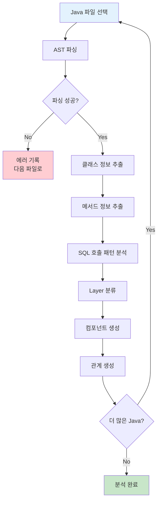
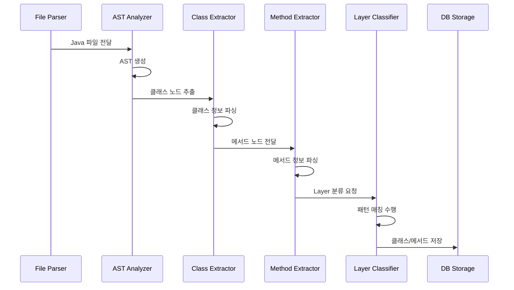
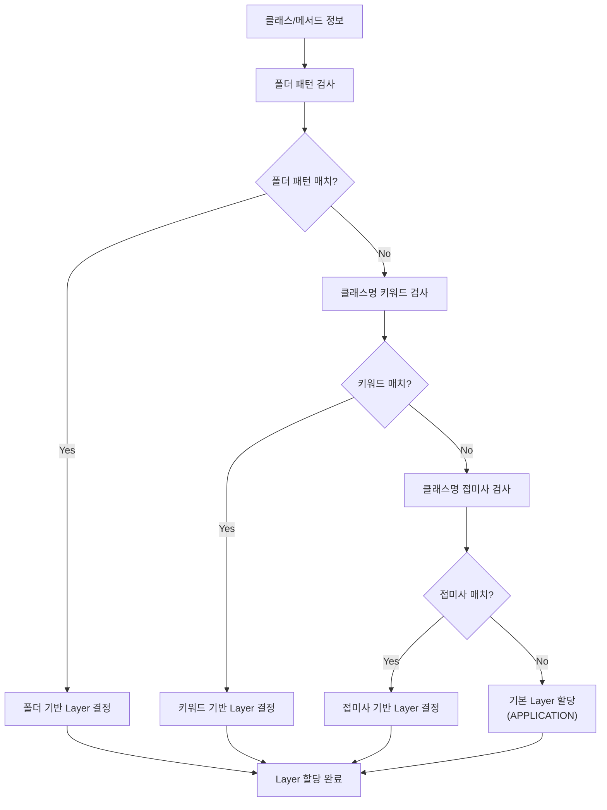
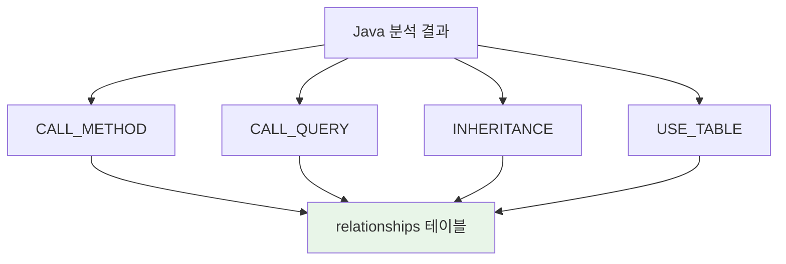
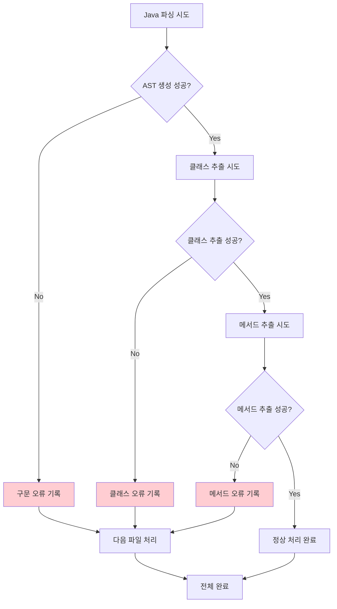

# Java 분석 구현서

## 문서 정보
- **작성일**: 2025-09-19
- **버전**: v1.0
- **목적**: Java 소스 파일 분석 및 메타데이터 추출

## 1. Java 분석 개요

### 1.1 분석 목적
- Java 클래스/메서드 구조 분석
- SQL 호출 패턴 추출
- 아키텍처 Layer 분류
- 비즈니스 로직 관계 도출

### 1.2 처리 대상 파일
```
대상 파일: *.java
위치: src/main/java/, src/test/java/
패턴: **/*.java
```

## 2. Java 분석 플로우

### 2.1 전체 처리 플로우



### 2.2 클래스 분석 플로우



## 3. 클래스 정보 추출

### 3.1 클래스 메타정보 추출

```python
class ClassInfo:
    """클래스 정보 구조체"""
    
    def __init__(self):
        self.class_name: str = ""           # UserController
        self.package_name: str = ""         # com.example.controller
        self.full_class_name: str = ""      # com.example.controller.UserController
        self.parent_class: str = None       # 상속 클래스
        self.interfaces: List[str] = []     # 구현 인터페이스
        self.annotations: List[str] = []    # @Controller, @Service 등
        self.modifiers: List[str] = []      # public, abstract 등
        self.line_start: int = 0
        self.line_end: int = 0
```

### 3.2 클래스 추출 알고리즘

```python
def extract_class_info(ast_node) -> ClassInfo:
    """AST에서 클래스 정보 추출"""
    
    class_info = ClassInfo()
    
    # 기본 정보 추출
    class_info.class_name = ast_node.name
    class_info.package_name = extract_package_name(ast_node)
    class_info.full_class_name = f"{class_info.package_name}.{class_info.class_name}"
    
    # 상속/구현 정보
    if ast_node.extends:
        class_info.parent_class = ast_node.extends.name
    
    if ast_node.implements:
        class_info.interfaces = [impl.name for impl in ast_node.implements]
    
    # 어노테이션 정보
    class_info.annotations = [ann.name for ann in ast_node.annotations]
    
    # 위치 정보
    class_info.line_start = ast_node.position.line
    class_info.line_end = calculate_end_line(ast_node)
    
    return class_info
```

## 4. 메서드 정보 추출

### 4.1 메서드 메타정보 추출

```python
class MethodInfo:
    """메서드 정보 구조체"""
    
    def __init__(self):
        self.method_name: str = ""          # findUserById
        self.return_type: str = ""          # User, void
        self.parameters: List[dict] = []    # [{type: String, name: id}]
        self.annotations: List[str] = []    # @RequestMapping, @Transactional
        self.modifiers: List[str] = []      # public, static
        self.sql_calls: List[dict] = []     # SQL 호출 정보
        self.method_calls: List[str] = []   # 다른 메서드 호출
        self.line_start: int = 0
        self.line_end: int = 0
```

### 4.2 SQL 호출 패턴 분석

#### MyBatis 호출 패턴
```java
// 패턴 1: Mapper 인터페이스 호출
userMapper.selectUserById(userId);
userMapper.findUsersByCondition(searchDto);

// 패턴 2: SqlSession 직접 호출
sqlSession.selectOne("com.example.UserMapper.selectUserById", userId);
sqlSession.selectList("com.example.UserMapper.findUsers", params);
```

#### StringBuilder SQL 패턴
```java
// 패턴 3: StringBuilder로 SQL 구성
StringBuilder query = new StringBuilder();
query.append("SELECT u.user_id, u.username ");
query.append("FROM users u ");
query.append("WHERE u.status = 'ACTIVE'");
```

### 4.3 SQL 호출 추출 알고리즘

```python
def extract_sql_calls(method_node) -> List[dict]:
    """메서드에서 SQL 호출 패턴 추출"""
    
    sql_calls = []
    
    # 1. MyBatis Mapper 호출 패턴
    mapper_calls = extract_mapper_calls(method_node)
    sql_calls.extend(mapper_calls)
    
    # 2. SqlSession 직접 호출 패턴
    session_calls = extract_sqlsession_calls(method_node)
    sql_calls.extend(session_calls)
    
    # 3. StringBuilder SQL 패턴
    stringbuilder_sqls = extract_stringbuilder_sql(method_node)
    sql_calls.extend(stringbuilder_sqls)
    
    return sql_calls

def extract_mapper_calls(method_node) -> List[dict]:
    """Mapper 인터페이스 호출 추출"""
    
    calls = []
    
    for call in method_node.method_invocations:
        if is_mapper_call(call):
            call_info = {
                'call_type': 'MAPPER',
                'mapper_interface': call.expression.type,  # UserMapper
                'method_name': call.name,                  # selectUserById
                'line_number': call.position.line
            }
            calls.append(call_info)
    
    return calls

def extract_stringbuilder_sql(method_node) -> List[dict]:
    """StringBuilder SQL 패턴 추출"""
    
    sql_statements = []
    
    # StringBuilder 변수 추적
    sb_variables = track_stringbuilder_variables(method_node)
    
    for var_name, statements in sb_variables.items():
        # append() 호출들을 연결하여 완전한 SQL 구성
        combined_sql = combine_append_statements(statements)
        
        if is_sql_statement(combined_sql):
            sql_info = {
                'call_type': 'STRINGBUILDER',
                'variable_name': var_name,
                'sql_content': combined_sql,
                'sql_type': determine_sql_type(combined_sql),  # SELECT, INSERT 등
                'line_start': statements[0]['line'],
                'line_end': statements[-1]['line']
            }
            sql_statements.append(sql_info)
    
    return sql_statements
```

## 5. Layer 분류 시스템

### 5.1 Layer 분류 플로우



### 5.2 Layer 분류 패턴

#### CONTROLLER Layer 패턴
```yaml
# config/parser/java_keyword.yaml
layer_patterns:
  CONTROLLER:
    folder_patterns:
      - "*controller*"
      - "*ctrl*" 
      - "*web*"
      - "*api*"
      - "*servlet*"
    class_suffixes:
      - "Controller"
      - "Ctrl" 
      - "Servlet"
    keywords:
      - "controller"
      - "servlet"
      - "@Controller"
      - "@RestController"
```

#### SERVICE Layer 패턴
```yaml
  SERVICE:
    folder_patterns:
      - "*service*"
      - "*business*"
      - "*logic*"
      - "*manager*"
    class_suffixes:
      - "Service"
      - "ServiceImpl"
      - "Manager"
      - "Facade"
    keywords:
      - "service"
      - "business"
      - "logic"
      - "@Service"
```

### 5.3 Layer 분류 구현

```python
class LayerClassifier:
    """Layer 분류기"""
    
    def __init__(self, config_path: str):
        self.patterns = self.load_layer_patterns(config_path)
    
    def classify_component(self, class_info: ClassInfo, 
                          file_path: str) -> str:
        """컴포넌트 Layer 분류"""
        
        # 1. 폴더 패턴 우선 검사
        layer = self.classify_by_folder_pattern(file_path)
        if layer:
            return layer
        
        # 2. 클래스명 키워드 검사
        layer = self.classify_by_class_keywords(class_info)
        if layer:
            return layer
        
        # 3. 클래스명 접미사 검사
        layer = self.classify_by_class_suffix(class_info)
        if layer:
            return layer
        
        # 4. 기본값
        return 'APPLICATION'
    
    def classify_by_folder_pattern(self, file_path: str) -> str:
        """폴더 패턴으로 분류"""
        
        file_path_lower = file_path.lower()
        
        for layer, patterns in self.patterns.items():
            for pattern in patterns.get('folder_patterns', []):
                if pattern.strip('*') in file_path_lower:
                    return layer
        
        return None
```

## 6. 컴포넌트 생성

### 6.1 클래스 컴포넌트 생성

```python
def create_class_component(class_info: ClassInfo, 
                          project_id: int, file_id: int) -> int:
    """클래스 컴포넌트 생성"""
    
    # classes 테이블에 클래스 정보 저장
    class_data = {
        'project_id': project_id,
        'file_id': file_id,
        'class_name': class_info.class_name,
        'full_class_name': class_info.full_class_name,
        'package_name': class_info.package_name,
        'parent_class': class_info.parent_class,
        'line_start': class_info.line_start,
        'line_end': class_info.line_end
    }
    
    class_id = insert_class(class_data)
    
    # 상속 관계 생성 (parent_class가 있는 경우)
    if class_info.parent_class:
        create_inheritance_relationship(class_id, class_info.parent_class)
    
    return class_id
```

### 6.2 메서드 컴포넌트 생성

```python
def create_method_component(method_info: MethodInfo, 
                           class_id: int, project_id: int, 
                           file_id: int, layer: str) -> int:
    """메서드 컴포넌트 생성"""
    
    # components 테이블에 메서드 정보 저장
    component_data = {
        'project_id': project_id,
        'file_id': file_id,
        'component_name': method_info.method_name,  # 파라미터 제외, 메서드명만
        'component_type': 'METHOD',
        'parent_id': class_id,  # classes.class_id 참조
        'layer': layer,
        'line_start': method_info.line_start,
        'line_end': method_info.line_end
    }
    
    method_component_id = insert_component(component_data)
    
    # SQL 호출이 있는 경우 INFERRED 쿼리 생성
    for sql_call in method_info.sql_calls:
        create_inferred_query_component(sql_call, method_component_id, 
                                      project_id, file_id)
    
    return method_component_id
```

### 6.3 INFERRED 쿼리 생성

```python
def create_inferred_query_component(sql_call: dict, 
                                  method_component_id: int,
                                  project_id: int, file_id: int) -> int:
    """Java에서 호출하는 INFERRED 쿼리 생성"""
    
    if sql_call['call_type'] == 'MAPPER':
        # MyBatis Mapper 호출
        query_name = f"{sql_call['mapper_interface']}.{sql_call['method_name']}"
        query_type = 'QUERY'  # 정확한 SQL 타입을 알 수 없음
        
    elif sql_call['call_type'] == 'STRINGBUILDER':
        # StringBuilder SQL
        query_name = f"StringBuilder_SQL_{sql_call['variable_name']}"
        query_type = sql_call['sql_type']  # SQL_SELECT, SQL_INSERT 등
        
    # INFERRED 쿼리 컴포넌트 생성
    query_component_data = {
        'project_id': project_id,
        'file_id': file_id,  # Java 파일
        'component_name': query_name,
        'component_type': query_type,
        'layer': 'QUERY',
        'line_start': sql_call['line_start'],
        'line_end': sql_call['line_end']
    }
    
    query_component_id = insert_component(query_component_data)
    
    # 메서드 -> 쿼리 관계 생성
    create_call_relationship(method_component_id, query_component_id, 'CALL_QUERY')
    
    # StringBuilder SQL인 경우 SQL 내용 저장
    if sql_call['call_type'] == 'STRINGBUILDER':
        store_compressed_sql_content(
            component_id=query_component_id,
            sql_content=sql_call['sql_content'],
            file_info={'file_id': file_id, 'line_start': sql_call['line_start']}
        )
    
    return query_component_id
```

## 7. 관계 생성

### 7.1 관계 타입별 생성



### 7.2 메서드 호출 관계

```python
def create_method_call_relationships(caller_method_id: int, 
                                   method_calls: List[str]) -> None:
    """메서드 호출 관계 생성"""
    
    for called_method in method_calls:
        # 호출되는 메서드 컴포넌트 검색
        called_method_id = find_method_component(called_method)
        
        if called_method_id:
            relationship_data = {
                'src_id': caller_method_id,
                'dst_id': called_method_id,
                'rel_type': 'CALL_METHOD'
            }
            
            create_relationship_if_not_exists(relationship_data)
```

### 7.3 상속 관계

```python
def create_inheritance_relationship(child_class_id: int, 
                                  parent_class_name: str) -> None:
    """클래스 상속 관계 생성"""
    
    # 부모 클래스 검색
    parent_class_id = find_class_by_name(parent_class_name)
    
    if parent_class_id:
        relationship_data = {
            'src_id': child_class_id,
            'dst_id': parent_class_id,
            'rel_type': 'INHERITANCE'
        }
        
        create_relationship_if_not_exists(relationship_data)
```

## 8. 에러 처리 및 성능 최적화

### 8.1 에러 처리 전략



### 8.2 성능 최적화

#### 메모리 관리
```python
def optimize_memory_usage():
    """메모리 사용량 최적화"""
    
    # 1. 파일별 순차 처리
    for java_file in java_files:
        process_single_java_file(java_file)
        gc.collect()  # 명시적 가비지 컬렉션
    
    # 2. AST 캐시 제한
    if ast_cache_size > MAX_CACHE_SIZE:
        clear_ast_cache()
    
    # 3. 배치 처리
    if pending_components_count > BATCH_SIZE:
        flush_pending_components()
```

#### 처리 속도 향상
```python
def optimize_processing_speed():
    """처리 속도 최적화"""
    
    # 1. 정규식 컴파일 재사용
    compiled_patterns = compile_all_patterns()
    
    # 2. 데이터베이스 배치 삽입
    batch_insert_components(pending_components)
    
    # 3. 인덱스 활용 최적화
    optimize_database_queries()
```


---

## 다음 단계
- [06_관계_정립_구현서.md](06_관계_정립_구현서.md): 컴포넌트 간 관계 정립
- [07_Frontend_분석_구현서.md](07_Frontend_분석_구현서.md): JSP/Frontend 분석 구현
