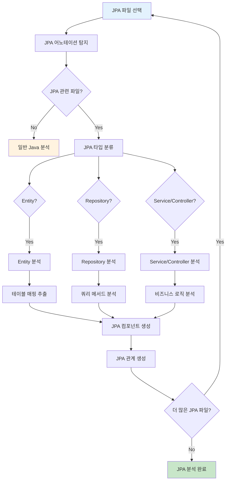
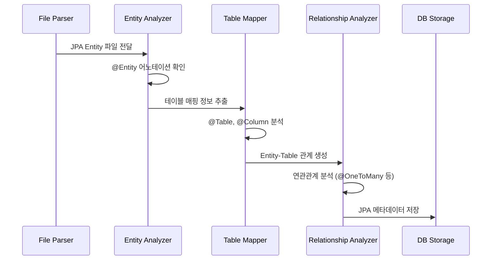
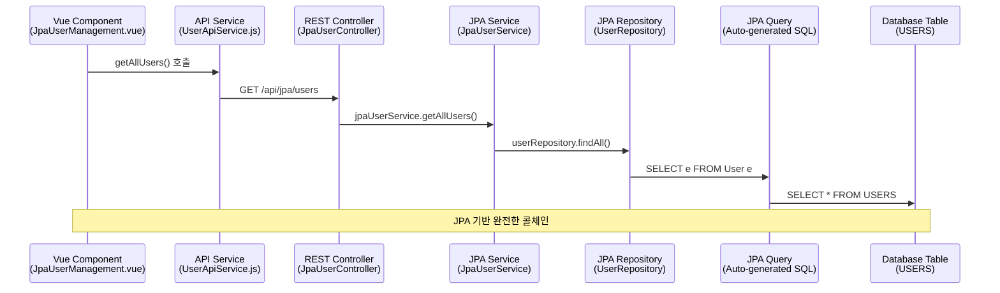
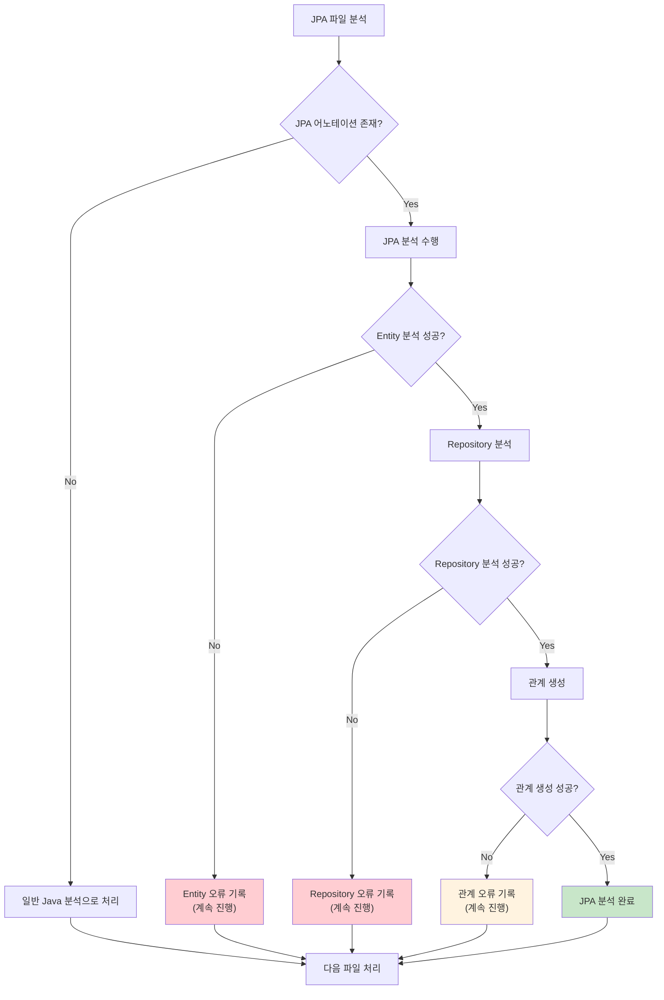

# JPA 분석 구현서

## 문서 정보
- **작성일**: 2025-09-20
- **버전**: v1.0
- **목적**: JPA Entity, Repository, Service 분석 및 메타데이터 추출

## 1. JPA 분석 개요

### 1.1 분석 목적
- JPA Entity와 데이터베이스 테이블 매핑 관계 추출
- JPA Repository 메서드와 자동 생성 SQL 쿼리 연결
- JPA 기반 서비스 레이어 분석
- 프론트엔드에서 테이블까지 완전한 연결 구조 구축

### 1.2 처리 대상 파일
```
대상 파일: *.java (JPA 관련)
위치: src/main/java/com/example/jpa/
패턴: 
  - **/*Entity.java
  - **/*Repository.java  
  - **/*Service.java
  - **/*Controller.java
  - **/entity/*.java
  - **/repository/*.java
  - **/service/*.java
  - **/controller/*.java
```

### 1.3 지원하는 JPA 기술 스택
```
JPA 구현체:
- Hibernate (주요)
- EclipseLink (선택적)

Spring Data JPA:
- JpaRepository 인터페이스
- Query Methods
- @Query 어노테이션
- Native Queries

JPA 어노테이션:
- @Entity, @Table, @Column
- @Id, @GeneratedValue
- @OneToMany, @ManyToOne, @OneToOne, @ManyToMany
- @JoinColumn, @JoinTable
```

## 2. JPA 분석 플로우

### 2.1 전체 처리 플로우



### 2.2 JPA Entity 분석 시퀀스



## 3. JPA Entity 분석

### 3.1 Entity 정보 추출

```python
class JpaEntityInfo:
    """JPA Entity 정보 구조체"""
    
    def __init__(self):
        self.entity_name: str = ""              # User
        self.table_name: str = ""               # USERS
        self.schema_name: str = ""              # SAMPLE (선택적)
        self.entity_class: str = ""             # com.example.jpa.entity.User
        self.primary_key_fields: List[str] = [] # userId
        self.columns: List[dict] = []           # 컬럼 매핑 정보
        self.relationships: List[dict] = []     # 연관관계 정보
        self.indexes: List[dict] = []           # 인덱스 정보
        self.line_start: int = 0
        self.line_end: int = 0
```

### 3.2 Entity 분석 구현

```python
def analyze_jpa_entity(java_content: str, file_path: str) -> JpaEntityInfo:
    """JPA Entity 분석"""
    
    entity_info = JpaEntityInfo()
    
    # 1. @Entity 어노테이션 확인
    entity_annotation = extract_entity_annotation(java_content)
    if not entity_annotation:
        return None
    
    # 2. 클래스명 추출
    entity_info.entity_name = extract_class_name(java_content)
    entity_info.entity_class = get_full_class_name(file_path, entity_info.entity_name)
    
    # 3. @Table 어노테이션에서 테이블명 추출
    table_annotation = extract_table_annotation(java_content)
    if table_annotation:
        entity_info.table_name = table_annotation.get('name', entity_info.entity_name.upper())
        entity_info.schema_name = table_annotation.get('schema')
    else:
        # 기본 네이밍 전략: Entity명을 대문자로
        entity_info.table_name = entity_info.entity_name.upper()
    
    # 4. 필드 및 컬럼 매핑 분석
    entity_info.columns = extract_column_mappings(java_content)
    
    # 5. 기본키 필드 추출
    entity_info.primary_key_fields = extract_primary_key_fields(java_content)
    
    # 6. 연관관계 분석
    entity_info.relationships = extract_jpa_relationships(java_content)
    
    # 7. 인덱스 정보 추출
    entity_info.indexes = extract_table_indexes(table_annotation)
    
    return entity_info

def extract_table_annotation(java_content: str) -> dict:
    """@Table 어노테이션 정보 추출"""
    
    # @Table(name = "USERS", schema = "SAMPLE")
    table_pattern = r'@Table\s*\(\s*([^)]+)\s*\)'
    match = re.search(table_pattern, java_content, re.IGNORECASE | re.DOTALL)
    
    if not match:
        return None
    
    annotation_content = match.group(1)
    table_info = {}
    
    # name 속성 추출
    name_match = re.search(r'name\s*=\s*["\']([^"\']+)["\']', annotation_content)
    if name_match:
        table_info['name'] = name_match.group(1)
    
    # schema 속성 추출
    schema_match = re.search(r'schema\s*=\s*["\']([^"\']+)["\']', annotation_content)
    if schema_match:
        table_info['schema'] = schema_match.group(1)
    
    # indexes 속성 추출
    indexes_match = re.search(r'indexes\s*=\s*\{([^}]+)\}', annotation_content)
    if indexes_match:
        table_info['indexes'] = parse_index_annotations(indexes_match.group(1))
    
    return table_info

def extract_column_mappings(java_content: str) -> List[dict]:
    """필드-컬럼 매핑 정보 추출"""
    
    columns = []
    
    # @Column 어노테이션이 있는 필드들 추출
    field_pattern = r'@Column\s*\(([^)]+)\)\s*\n\s*(?:private|protected|public)\s+(\w+(?:<[^>]+>)?)\s+(\w+);'
    matches = re.finditer(field_pattern, java_content, re.IGNORECASE | re.DOTALL)
    
    for match in matches:
        annotation_content = match.group(1)
        field_type = match.group(2)
        field_name = match.group(3)
        
        column_info = {
            'field_name': field_name,
            'field_type': field_type,
            'column_name': extract_column_name(annotation_content, field_name),
            'nullable': extract_nullable(annotation_content),
            'unique': extract_unique(annotation_content),
            'length': extract_length(annotation_content),
            'precision': extract_precision(annotation_content),
            'scale': extract_scale(annotation_content)
        }
        
        columns.append(column_info)
    
    return columns

def extract_jpa_relationships(java_content: str) -> List[dict]:
    """JPA 연관관계 정보 추출"""
    
    relationships = []
    
    # 연관관계 어노테이션 패턴들
    relationship_patterns = [
        (r'@OneToMany\s*\(([^)]+)\)\s*\n\s*(?:private|protected|public)\s+List<(\w+)>\s+(\w+);', 'OneToMany'),
        (r'@ManyToOne\s*\(([^)]+)\)\s*\n\s*(?:private|protected|public)\s+(\w+)\s+(\w+);', 'ManyToOne'),
        (r'@OneToOne\s*\(([^)]+)\)\s*\n\s*(?:private|protected|public)\s+(\w+)\s+(\w+);', 'OneToOne'),
        (r'@ManyToMany\s*\(([^)]+)\)\s*\n\s*(?:private|protected|public)\s+List<(\w+)>\s+(\w+);', 'ManyToMany')
    ]
    
    for pattern, rel_type in relationship_patterns:
        matches = re.finditer(pattern, java_content, re.IGNORECASE | re.DOTALL)
        
        for match in matches:
            if rel_type in ['OneToMany', 'ManyToMany']:
                annotation_content = match.group(1)
                target_entity = match.group(2)
                field_name = match.group(3)
            else:
                annotation_content = match.group(1)
                target_entity = match.group(2)
                field_name = match.group(3)
            
            relationship_info = {
                'relationship_type': rel_type,
                'field_name': field_name,
                'target_entity': target_entity,
                'mapped_by': extract_mapped_by(annotation_content),
                'join_column': extract_join_column(annotation_content),
                'cascade': extract_cascade(annotation_content),
                'fetch_type': extract_fetch_type(annotation_content)
            }
            
            relationships.append(relationship_info)
    
    return relationships
```

## 4. JPA Repository 분석

### 4.1 Repository 정보 추출

```python
class JpaRepositoryInfo:
    """JPA Repository 정보 구조체"""
    
    def __init__(self):
        self.repository_name: str = ""          # UserRepository
        self.entity_class: str = ""             # User
        self.id_type: str = ""                  # Long
        self.extends_interface: str = ""        # JpaRepository
        self.query_methods: List[dict] = []     # 쿼리 메서드들
        self.custom_queries: List[dict] = []    # @Query 어노테이션 쿼리들
        self.native_queries: List[dict] = []    # Native SQL 쿼리들
        self.modifying_queries: List[dict] = [] # @Modifying 쿼리들
```

### 4.2 Repository 분석 구현

```python
def analyze_jpa_repository(java_content: str, file_path: str) -> JpaRepositoryInfo:
    """JPA Repository 분석"""
    
    repository_info = JpaRepositoryInfo()
    
    # 1. Repository 인터페이스 확인
    if not is_jpa_repository_interface(java_content):
        return None
    
    # 2. Repository 기본 정보 추출
    repository_info.repository_name = extract_interface_name(java_content)
    repository_info.extends_interface = extract_extends_interface(java_content)
    
    # 3. Generic 타입 정보 추출 (JpaRepository<User, Long>)
    generic_types = extract_repository_generic_types(java_content)
    if generic_types:
        repository_info.entity_class = generic_types[0]
        repository_info.id_type = generic_types[1] if len(generic_types) > 1 else "Long"
    
    # 4. 쿼리 메서드 분석
    repository_info.query_methods = extract_query_methods(java_content)
    
    # 5. @Query 어노테이션 쿼리 분석
    repository_info.custom_queries = extract_custom_queries(java_content)
    
    # 6. Native SQL 쿼리 분석
    repository_info.native_queries = extract_native_queries(java_content)
    
    # 7. @Modifying 쿼리 분석
    repository_info.modifying_queries = extract_modifying_queries(java_content)
    
    return repository_info

def extract_query_methods(java_content: str) -> List[dict]:
    """JPA 쿼리 메서드 추출"""
    
    query_methods = []
    
    # JPA 쿼리 메서드 패턴들
    query_method_patterns = [
        # findBy 패턴
        r'(\w+)\s+findBy(\w+)\s*\(([^)]*)\)\s*;',
        # findAll 패턴  
        r'(\w+)\s+findAll(\w*)\s*\(([^)]*)\)\s*;',
        # count 패턴
        r'long\s+countBy(\w+)\s*\(([^)]*)\)\s*;',
        # exists 패턴
        r'boolean\s+existsBy(\w+)\s*\(([^)]*)\)\s*;',
        # delete 패턴
        r'(?:void|long)\s+deleteBy(\w+)\s*\(([^)]*)\)\s*;'
    ]
    
    for pattern in query_method_patterns:
        matches = re.finditer(pattern, java_content, re.IGNORECASE | re.DOTALL)
        
        for match in matches:
            if 'findBy' in pattern:
                return_type = match.group(1)
                condition_part = match.group(2)
                parameters = match.group(3)
                method_name = f"findBy{condition_part}"
            elif 'findAll' in pattern:
                return_type = match.group(1)
                suffix = match.group(2)
                parameters = match.group(3)
                method_name = f"findAll{suffix}"
            elif 'countBy' in pattern:
                return_type = "long"
                condition_part = match.group(1)
                parameters = match.group(2)
                method_name = f"countBy{condition_part}"
            elif 'existsBy' in pattern:
                return_type = "boolean"
                condition_part = match.group(1)
                parameters = match.group(2)
                method_name = f"existsBy{condition_part}"
            elif 'deleteBy' in pattern:
                return_type = "void"
                condition_part = match.group(1)
                parameters = match.group(2)
                method_name = f"deleteBy{condition_part}"
            
            # JPA 쿼리 메서드를 SQL로 변환
            generated_sql = convert_query_method_to_sql(method_name, parameters, return_type)
            
            query_method = {
                'method_name': method_name,
                'return_type': return_type,
                'parameters': parse_method_parameters(parameters),
                'generated_sql': generated_sql,
                'query_type': determine_query_type(method_name),
                'line': get_line_number(java_content, match.start())
            }
            
            query_methods.append(query_method)
    
    return query_methods

def convert_query_method_to_sql(method_name: str, parameters: str, return_type: str) -> str:
    """JPA 쿼리 메서드를 SQL로 변환"""
    
    # 기본 SQL 템플릿
    if method_name.startswith('findBy'):
        sql_template = "SELECT e FROM {entity} e WHERE "
        condition_part = method_name[6:]  # findBy 제거
    elif method_name.startswith('countBy'):
        sql_template = "SELECT COUNT(e) FROM {entity} e WHERE "
        condition_part = method_name[7:]  # countBy 제거
    elif method_name.startswith('existsBy'):
        sql_template = "SELECT CASE WHEN COUNT(e) > 0 THEN true ELSE false END FROM {entity} e WHERE "
        condition_part = method_name[8:]  # existsBy 제거
    elif method_name.startswith('deleteBy'):
        sql_template = "DELETE FROM {entity} e WHERE "
        condition_part = method_name[8:]  # deleteBy 제거
    else:
        return f"-- Generated SQL for {method_name}"
    
    # 조건 부분을 SQL WHERE 절로 변환
    where_conditions = convert_condition_to_sql(condition_part, parameters)
    
    return sql_template + where_conditions

def convert_condition_to_sql(condition_part: str, parameters: str) -> str:
    """조건 부분을 SQL WHERE 절로 변환"""
    
    # JPA 쿼리 메서드 키워드 매핑
    keyword_mapping = {
        'And': ' AND ',
        'Or': ' OR ',
        'Between': ' BETWEEN ',
        'LessThan': ' < ',
        'LessThanEqual': ' <= ',
        'GreaterThan': ' > ',
        'GreaterThanEqual': ' >= ',
        'Like': ' LIKE ',
        'NotLike': ' NOT LIKE ',
        'StartingWith': ' LIKE ',
        'EndingWith': ' LIKE ',
        'Containing': ' LIKE ',
        'IsNull': ' IS NULL',
        'IsNotNull': ' IS NOT NULL',
        'NotNull': ' IS NOT NULL',
        'In': ' IN ',
        'NotIn': ' NOT IN ',
        'True': ' = true',
        'False': ' = false'
    }
    
    # 조건 문자열을 SQL로 변환
    sql_condition = condition_part
    for keyword, sql_op in keyword_mapping.items():
        sql_condition = sql_condition.replace(keyword, sql_op)
    
    # 파라미터와 매칭
    param_list = parse_method_parameters(parameters)
    for i, param in enumerate(param_list):
        sql_condition = sql_condition.replace(f":{param['name']}", f"?{i+1}")
    
    return sql_condition

def extract_custom_queries(java_content: str) -> List[dict]:
    """@Query 어노테이션 쿼리 추출"""
    
    custom_queries = []
    
    # @Query 어노테이션 패턴
    query_pattern = r'@Query\s*\(\s*(?:value\s*=\s*)?["\']([^"\']+)["\'](?:\s*,\s*nativeQuery\s*=\s*(true|false))?\s*\)\s*\n\s*(?:[\w\s<>,\[\]]+)\s+(\w+)\s*\('
    
    matches = re.finditer(query_pattern, java_content, re.IGNORECASE | re.DOTALL)
    
    for match in matches:
        query_sql = match.group(1)
        is_native = match.group(2) == 'true' if match.group(2) else False
        method_name = match.group(3)
        
        # SQL 쿼리 정리
        cleaned_sql = clean_jpql_query(query_sql)
        
        # 테이블 추출
        tables = extract_tables_from_sql(cleaned_sql, is_native)
        
        custom_query = {
            'method_name': method_name,
            'query_sql': cleaned_sql,
            'is_native_query': is_native,
            'query_type': determine_sql_query_type(cleaned_sql),
            'tables': tables,
            'line': get_line_number(java_content, match.start())
        }
        
        custom_queries.append(custom_query)
    
    return custom_queries

def clean_jpql_query(raw_query: str) -> str:
    """JPQL 쿼리 정리"""
    
    # 여러 줄 쿼리를 한 줄로 정리
    query = re.sub(r'\s+', ' ', raw_query.strip())
    
    # Java 문자열 연결 제거 (" + ")
    query = re.sub(r'"\s*\+\s*"', '', query)
    
    # 이스케이프 문자 처리
    query = query.replace('\\"', '"')
    query = query.replace('\\n', ' ')
    
    return query.strip()
```

## 5. JPA Service/Controller 분석

### 5.1 JPA 기반 Service 분석

```python
def analyze_jpa_service(java_content: str, file_path: str) -> dict:
    """JPA Service 클래스 분석"""
    
    service_info = {
        'service_name': extract_class_name(java_content),
        'autowired_repositories': extract_autowired_repositories(java_content),
        'transactional_methods': extract_transactional_methods(java_content),
        'repository_calls': extract_repository_method_calls(java_content)
    }
    
    return service_info

def extract_autowired_repositories(java_content: str) -> List[dict]:
    """@Autowired Repository 필드 추출"""
    
    repositories = []
    
    # @Autowired Repository 패턴
    autowired_pattern = r'@Autowired\s*\n\s*(?:private|protected)\s+(\w+Repository)\s+(\w+);'
    
    matches = re.finditer(autowired_pattern, java_content, re.IGNORECASE | re.DOTALL)
    
    for match in matches:
        repository_type = match.group(1)
        field_name = match.group(2)
        
        repository_info = {
            'repository_type': repository_type,
            'field_name': field_name,
            'line': get_line_number(java_content, match.start())
        }
        
        repositories.append(repository_info)
    
    return repositories

def extract_repository_method_calls(java_content: str) -> List[dict]:
    """Repository 메서드 호출 추출"""
    
    method_calls = []
    
    # Repository 메서드 호출 패턴
    call_patterns = [
        r'(\w+Repository)\s*\.\s*(\w+)\s*\(',
        r'this\.(\w+)\s*\.\s*(\w+)\s*\('
    ]
    
    for pattern in call_patterns:
        matches = re.finditer(pattern, java_content, re.IGNORECASE)
        
        for match in matches:
            if 'Repository' in pattern:
                repository_name = match.group(1)
                method_name = match.group(2)
            else:
                repository_field = match.group(1)
                method_name = match.group(2)
                repository_name = resolve_repository_name(repository_field, java_content)
            
            method_call = {
                'repository_name': repository_name,
                'method_name': method_name,
                'line': get_line_number(java_content, match.start())
            }
            
            method_calls.append(method_call)
    
    return method_calls
```

## 6. JPA 컴포넌트 생성

### 6.1 JPA Entity 컴포넌트 생성

```python
def create_jpa_entity_component(entity_info: JpaEntityInfo, 
                               project_id: int, file_id: int) -> int:
    """JPA Entity 컴포넌트 생성"""
    
    # 1. Entity 컴포넌트 생성
    entity_component_data = {
        'project_id': project_id,
        'file_id': file_id,
        'component_name': entity_info.entity_name,
        'component_type': 'CLASS',
        'layer': 'MODEL',
        'class_name': entity_info.entity_name,
        'line_start': entity_info.line_start,
        'line_end': entity_info.line_end,
        'description': f"JPA Entity: {entity_info.table_name}"
    }
    
    entity_component_id = insert_component(entity_component_data)
    
    # 2. Entity-Table 매핑 관계 생성
    table_component = find_table_component(project_id, entity_info.table_name)
    if table_component:
        create_entity_table_relationship(entity_component_id, table_component.component_id)
    
    # 3. 컬럼 매핑 관계 생성
    for column_info in entity_info.columns:
        column_component = find_column_component(project_id, entity_info.table_name, column_info['column_name'])
        if column_component:
            create_entity_column_relationship(entity_component_id, column_component.component_id, column_info)
    
    return entity_component_id

def create_jpa_repository_component(repository_info: JpaRepositoryInfo,
                                   project_id: int, file_id: int) -> int:
    """JPA Repository 컴포넌트 생성"""
    
    # 1. Repository 인터페이스 컴포넌트 생성
    repository_component_data = {
        'project_id': project_id,
        'file_id': file_id,
        'component_name': repository_info.repository_name,
        'component_type': 'CLASS',
        'layer': 'REPOSITORY',
        'class_name': repository_info.repository_name,
        'description': f"JPA Repository for {repository_info.entity_class}"
    }
    
    repository_component_id = insert_component(repository_component_data)
    
    # 2. 쿼리 메서드 컴포넌트들 생성
    for query_method in repository_info.query_methods:
        create_jpa_query_method_component(query_method, repository_component_id, project_id, file_id)
    
    # 3. @Query 어노테이션 쿼리 컴포넌트들 생성
    for custom_query in repository_info.custom_queries:
        create_jpa_custom_query_component(custom_query, repository_component_id, project_id, file_id)
    
    return repository_component_id

def create_jpa_query_method_component(query_method: dict, repository_id: int,
                                     project_id: int, file_id: int) -> int:
    """JPA 쿼리 메서드 컴포넌트 생성"""
    
    # 1. 메서드 컴포넌트 생성
    method_component_data = {
        'project_id': project_id,
        'file_id': file_id,
        'component_name': query_method['method_name'],
        'component_type': 'METHOD',
        'layer': 'REPOSITORY',
        'method_name': query_method['method_name'],
        'line_start': query_method['line'],
        'line_end': query_method['line'],
        'description': f"JPA Query Method: {query_method['generated_sql']}"
    }
    
    method_component_id = insert_component(method_component_data)
    
    # 2. 자동 생성 SQL 쿼리 컴포넌트 생성
    sql_component_data = {
        'project_id': project_id,
        'file_id': file_id,
        'component_name': f"JPA_QUERY_{query_method['method_name']}",
        'component_type': 'SQL_SELECT',  # 쿼리 타입에 따라 변경
        'layer': 'QUERY',
        'sql_content': query_method['generated_sql'],
        'sql_type': query_method['query_type'],
        'description': f"Auto-generated SQL for {query_method['method_name']}"
    }
    
    sql_component_id = insert_component(sql_component_data)
    
    # 3. Method -> SQL 관계 생성
    create_method_sql_relationship(method_component_id, sql_component_id)
    
    # 4. SQL -> Table 관계 생성 (생성된 SQL에서 테이블 추출)
    tables = extract_tables_from_generated_sql(query_method['generated_sql'])
    for table_name in tables:
        table_component = find_table_component(project_id, table_name)
        if table_component:
            create_sql_table_relationship(sql_component_id, table_component.component_id)
    
    return method_component_id
```

## 7. JPA 관계 생성

### 7.1 JPA 관계 매핑

```python
def create_jpa_relationships(project_id: int) -> None:
    """JPA 관련 모든 관계 생성"""
    
    # 1. Entity-Table 관계
    create_entity_table_relationships(project_id)
    
    # 2. Repository-Entity 관계
    create_repository_entity_relationships(project_id)
    
    # 3. Service-Repository 관계
    create_service_repository_relationships(project_id)
    
    # 4. Controller-Service 관계
    create_controller_service_relationships(project_id)
    
    # 5. API_URL-METHOD 관계 (REST API 엔드포인트와 Controller 메서드 연결)
    create_api_url_method_relationships(project_id)
    
    # 6. JPA 연관관계 (Entity 간 테이블 조인관계)
    create_jpa_entity_relationships(project_id)

def create_entity_table_relationships(project_id: int) -> None:
    """Entity-Table 관계 생성"""
    
    # JPA Entity 컴포넌트들 조회
    entity_query = """
    SELECT c.component_id, c.component_name, c.description
    FROM components c
    WHERE c.project_id = ?
      AND c.component_type = 'CLASS'
      AND c.layer = 'MODEL'
      AND c.description LIKE 'JPA Entity:%'
      AND c.del_yn = 'N'
    """
    
    entities = execute_query(entity_query, [project_id])
    
    for entity in entities:
        # Entity 설명에서 테이블명 추출
        table_name = extract_table_name_from_description(entity['description'])
        
        # 해당 테이블 컴포넌트 검색
        table_component = find_table_component(project_id, table_name)
        
        if table_component:
            relationship_data = {
                'src_id': entity['component_id'],
                'dst_id': table_component.component_id,
                'rel_type': 'MAPS_TO_TABLE',
                'description': f"JPA Entity {entity['component_name']} maps to table {table_name}"
            }
            
            create_relationship_if_not_exists(relationship_data)

def create_api_url_method_relationships(project_id: int) -> None:
    """API_URL-METHOD 관계 생성 (REST API 엔드포인트와 Controller 메서드 연결)"""
    
    # API_URL 컴포넌트들 조회
    api_url_query = """
    SELECT c.component_id, c.component_name, c.file_id
    FROM components c
    WHERE c.project_id = ?
      AND c.component_type = 'API_URL'
      AND c.layer = 'API_ENTRY'
      AND c.del_yn = 'N'
    """
    
    api_urls = execute_query(api_url_query, [project_id])
    
    for api_url in api_urls:
        # API_URL 컴포넌트명에서 URL과 HTTP 메서드 분리
        # 예: "/api/jpa/users:GET" → url="/api/jpa/users", method="GET"
        component_name = api_url['component_name']
        if ':' in component_name:
            url_pattern, http_method = component_name.rsplit(':', 1)
        else:
            continue
        
        # 해당 API를 처리하는 Controller 메서드 검색
        controller_method_query = """
        SELECT c.component_id, c.component_name, c.class_name, c.method_name
        FROM components c
        WHERE c.project_id = ?
          AND c.component_type = 'METHOD'
          AND c.layer = 'CONTROLLER'
          AND (c.class_name LIKE '%Controller' OR c.class_name LIKE '%RestController')
          AND c.del_yn = 'N'
        """
        
        controller_methods = execute_query(controller_method_query, [project_id])
        
        for method in controller_methods:
            # URL 패턴 매칭 (기존 backend_entry_loading.py 로직 활용)
            if is_api_method_match(url_pattern, http_method, method):
                # API_URL → METHOD 관계 생성
                relationship_data = {
                    'src_id': api_url['component_id'],
                    'dst_id': method['component_id'],
                    'rel_type': 'CALLS_METHOD',
                    'description': f"API {url_pattern}:{http_method} calls {method['class_name']}.{method['method_name']}",
                    'api_url': url_pattern,
                    'http_method': http_method
                }
                
                create_relationship_if_not_exists(relationship_data)
                app_logger.debug(f"API_URL-METHOD 관계 생성: {component_name} → {method['class_name']}.{method['method_name']}")

def create_jpa_entity_join_relationships(project_id: int) -> None:
    """JPA Entity 연관관계에서 테이블 조인관계 도출 (src_id, dst_id 방식)"""
    
    # JPA Entity 컴포넌트들 조회
    entity_query = """
    SELECT c.component_id, c.component_name, c.file_id, c.description
    FROM components c
    WHERE c.project_id = ?
      AND c.component_type = 'CLASS'
      AND c.layer = 'MODEL'
      AND c.description LIKE 'JPA Entity:%'
      AND c.del_yn = 'N'
    """
    
    entities = execute_query(entity_query, [project_id])
    
    for entity in entities:
        # Entity 파일에서 연관관계 어노테이션 분석
        entity_file_path = get_file_path_by_id(entity['file_id'])
        if not entity_file_path:
            continue
            
        with open(entity_file_path, 'r', encoding='utf-8') as f:
            java_content = f.read()
        
        # JPA 연관관계 추출
        relationships = extract_jpa_relationships(java_content)
        
        for rel in relationships:
            # 연관관계에서 조인관계 도출
            join_relationship = derive_join_relationship_from_jpa(entity, rel, project_id)
            
            if join_relationship:
                create_table_join_relationship(join_relationship)

def derive_join_relationship_from_jpa(entity: dict, jpa_relationship: dict, project_id: int) -> dict:
    """JPA 연관관계에서 테이블 조인관계 도출 (1:N에서 1쪽이 src_id)"""
    
    # 현재 Entity의 테이블명 추출
    current_table = extract_table_name_from_entity_description(entity['description'])
    
    # 연관 Entity의 테이블명 추출
    target_entity_name = jpa_relationship['target_entity']
    target_table = find_table_name_for_entity(target_entity_name, project_id)
    
    if not current_table or not target_table:
        return None
    
    # 테이블 컴포넌트 ID 조회
    current_table_id = find_table_component_id(project_id, current_table)
    target_table_id = find_table_component_id(project_id, target_table)
    
    if not current_table_id or not target_table_id:
        return None
    
    # 관계 타입에 따른 src_id, dst_id 결정 (1:N에서 1쪽이 src_id)
    if jpa_relationship['relationship_type'] == 'OneToMany':
        # 1:N 관계: User(1) → Order(N)
        # 1쪽이 src_id, N쪽이 dst_id
        src_id = current_table_id  # USERS 테이블 (1쪽)
        dst_id = target_table_id   # ORDERS 테이블 (N쪽)
        join_column = jpa_relationship.get('join_column', 'USER_ID')
        
    elif jpa_relationship['relationship_type'] == 'ManyToOne':
        # N:1 관계: Order(N) → User(1)
        # 1쪽이 src_id, N쪽이 dst_id
        src_id = target_table_id   # USERS 테이블 (1쪽)
        dst_id = current_table_id  # ORDERS 테이블 (N쪽)
        join_column = jpa_relationship.get('join_column', 'USER_ID')
        
    elif jpa_relationship['relationship_type'] == 'OneToOne':
        # 1:1 관계: JoinColumn이 있는 쪽이 dst_id (FK 소유)
        if jpa_relationship.get('join_column'):
            src_id = target_table_id   # 참조되는 테이블 (PK 소유)
            dst_id = current_table_id  # 참조하는 테이블 (FK 소유)
            join_column = jpa_relationship['join_column']
        else:
            # mappedBy가 있는 경우 반대편이 FK 소유
            src_id = current_table_id
            dst_id = target_table_id
            join_column = 'ID'
            
    else:
        # ManyToMany는 중간 테이블이 필요하므로 별도 처리
        app_logger.debug(f"ManyToMany 관계는 현재 지원하지 않음: {entity['component_name']} ↔ {target_entity_name}")
        return None
    
    return {
        'src_id': src_id,
        'dst_id': dst_id,
        'rel_type': 'JOINS_WITH',
        'description': f"JPA {jpa_relationship['relationship_type']}: {current_table}.{join_column} = {target_table}.{join_column}",
        'join_condition': f"{current_table}.{join_column} = {target_table}.{join_column}",
        'relationship_type': jpa_relationship['relationship_type'],
        'join_column': join_column,
        'mapped_by': jpa_relationship.get('mapped_by'),
        'cascade_type': jpa_relationship.get('cascade'),
        'fetch_type': jpa_relationship.get('fetch_type')
    }

def create_table_join_relationship(join_relationship: dict) -> None:
    """테이블 조인관계 생성"""
    
    # 중복 관계 확인
    existing_relationship = check_existing_join_relationship(
        join_relationship['src_id'], 
        join_relationship['dst_id'],
        join_relationship['join_column']
    )
    
    if not existing_relationship:
        create_relationship_if_not_exists(join_relationship)
        app_logger.info(f"JPA 조인관계 생성: {join_relationship['description']}")
    else:
        app_logger.debug(f"JPA 조인관계 이미 존재: {join_relationship['description']}")

def check_existing_join_relationship(src_id: int, dst_id: int, join_column: str) -> bool:
    """기존 조인관계 존재 여부 확인"""
    
    query = """
    SELECT COUNT(*) as cnt
    FROM relationships r
    WHERE r.src_id = ?
      AND r.dst_id = ?
      AND r.rel_type = 'JOINS_WITH'
      AND (r.join_column = ? OR r.join_condition LIKE ?)
      AND r.del_yn = 'N'
    """
    
    result = execute_query(query, [src_id, dst_id, join_column, f"%{join_column}%"])
    return result[0]['cnt'] > 0 if result else False

def create_repository_entity_relationships(project_id: int) -> None:
    """Repository-Entity 관계 생성"""
    
    # JPA Repository 컴포넌트들 조회
    repository_query = """
    SELECT c.component_id, c.component_name, c.description
    FROM components c
    WHERE c.project_id = ?
      AND c.component_type = 'CLASS'
      AND c.layer = 'REPOSITORY'
      AND c.component_name LIKE '%Repository'
      AND c.del_yn = 'N'
    """
    
    repositories = execute_query(repository_query, [project_id])
    
    for repository in repositories:
        # Repository 설명에서 Entity 클래스명 추출
        entity_name = extract_entity_name_from_repository_description(repository['description'])
        
        # 해당 Entity 컴포넌트 검색
        entity_component = find_entity_component(project_id, entity_name)
        
        if entity_component:
            relationship_data = {
                'src_id': repository['component_id'],
                'dst_id': entity_component.component_id,
                'rel_type': 'MANAGES_ENTITY',
                'description': f"Repository {repository['component_name']} manages entity {entity_name}"
            }
            
            create_relationship_if_not_exists(relationship_data)
```

## 8. JPA 메타데이터 생성 전략

### 8.1 JPA 컴포넌트 타입 분류

```python
JPA_COMPONENT_MAPPING = {
    # JPA Entity
    'JPA_ENTITY': {
        'component_type': 'CLASS',
        'layer': 'MODEL',
        'patterns': ['@Entity', 'entity package']
    },
    
    # JPA Repository
    'JPA_REPOSITORY': {
        'component_type': 'CLASS', 
        'layer': 'REPOSITORY',
        'patterns': ['extends JpaRepository', 'Repository interface']
    },
    
    # JPA Query Method
    'JPA_QUERY_METHOD': {
        'component_type': 'METHOD',
        'layer': 'REPOSITORY', 
        'patterns': ['findBy*', 'countBy*', 'existsBy*']
    },
    
    # JPA Custom Query
    'JPA_CUSTOM_QUERY': {
        'component_type': 'SQL_SELECT',  # 쿼리 타입에 따라
        'layer': 'QUERY',
        'patterns': ['@Query annotation']
    },
    
    # JPA Service
    'JPA_SERVICE': {
        'component_type': 'CLASS',
        'layer': 'SERVICE',
        'patterns': ['@Service', '@Transactional']
    }
}
```

### 8.2 JPA SQL 쿼리 생성 규칙

```python
def generate_jpa_sql_metadata(repository_info: JpaRepositoryInfo, 
                             entity_info: JpaEntityInfo) -> List[dict]:
    """JPA Repository에서 SQL 메타데이터 생성"""
    
    sql_metadata = []
    
    # 1. 쿼리 메서드 기반 SQL 생성
    for query_method in repository_info.query_methods:
        sql_data = {
            'component_name': f"JPA_AUTO_{query_method['method_name']}",
            'component_type': map_query_type_to_component_type(query_method['query_type']),
            'layer': 'QUERY',
            'sql_content': query_method['generated_sql'],
            'sql_type': query_method['query_type'],
            'source_method': query_method['method_name'],
            'source_repository': repository_info.repository_name,
            'target_entity': repository_info.entity_class,
            'target_table': entity_info.table_name,
            'is_auto_generated': True,
            'description': f"Auto-generated SQL for JPA method {query_method['method_name']}"
        }
        
        sql_metadata.append(sql_data)
    
    # 2. @Query 어노테이션 기반 SQL 생성
    for custom_query in repository_info.custom_queries:
        sql_data = {
            'component_name': f"JPA_CUSTOM_{custom_query['method_name']}",
            'component_type': map_query_type_to_component_type(custom_query['query_type']),
            'layer': 'QUERY',
            'sql_content': custom_query['query_sql'],
            'sql_type': custom_query['query_type'],
            'source_method': custom_query['method_name'],
            'source_repository': repository_info.repository_name,
            'is_native_query': custom_query['is_native_query'],
            'is_auto_generated': False,
            'description': f"Custom JPA query for method {custom_query['method_name']}"
        }
        
        sql_metadata.append(sql_data)
    
    return sql_metadata

def map_query_type_to_component_type(query_type: str) -> str:
    """쿼리 타입을 컴포넌트 타입으로 매핑"""
    
    type_mapping = {
        'SELECT': 'SQL_SELECT',
        'INSERT': 'SQL_INSERT', 
        'UPDATE': 'SQL_UPDATE',
        'DELETE': 'SQL_DELETE',
        'COUNT': 'SQL_SELECT',
        'EXISTS': 'SQL_SELECT'
    }
    
    return type_mapping.get(query_type, 'SQL_SELECT')
```

## 9. JPA 연결 구조 완성

### 9.1 JPA 기반 콜체인 구조



### 9.2 JPA 메타데이터 연결 검증

```python
def validate_jpa_metadata_connections(project_id: int) -> dict:
    """JPA 메타데이터 연결 검증"""
    
    validation_result = {
        'entity_table_mappings': 0,
        'repository_entity_mappings': 0,
        'query_method_sql_mappings': 0,
        'complete_jpa_chains': 0,
        'missing_connections': []
    }
    
    # 1. Entity-Table 매핑 검증
    entities = get_jpa_entities(project_id)
    for entity in entities:
        if has_table_mapping(entity):
            validation_result['entity_table_mappings'] += 1
        else:
            validation_result['missing_connections'].append({
                'type': 'ENTITY_TABLE',
                'entity': entity.component_name,
                'issue': 'No table mapping found'
            })
    
    # 2. Repository-Entity 매핑 검증
    repositories = get_jpa_repositories(project_id)
    for repository in repositories:
        if has_entity_mapping(repository):
            validation_result['repository_entity_mappings'] += 1
        else:
            validation_result['missing_connections'].append({
                'type': 'REPOSITORY_ENTITY',
                'repository': repository.component_name,
                'issue': 'No entity mapping found'
            })
    
    # 3. Query Method-SQL 매핑 검증
    query_methods = get_jpa_query_methods(project_id)
    for method in query_methods:
        if has_generated_sql(method):
            validation_result['query_method_sql_mappings'] += 1
        else:
            validation_result['missing_connections'].append({
                'type': 'METHOD_SQL',
                'method': method.component_name,
                'issue': 'No generated SQL found'
            })
    
    # 4. 완전한 JPA 체인 검증
    complete_chains = validate_complete_jpa_chains(project_id)
    validation_result['complete_jpa_chains'] = len(complete_chains)
    
    return validation_result
```

## 10. 에러 처리 및 성능 최적화

### 10.1 JPA 분석 에러 처리



### 10.2 JPA 분석 성능 최적화

```python
class JpaAnalysisOptimizer:
    """JPA 분석 성능 최적화"""
    
    def __init__(self):
        # JPA 어노테이션 패턴 컴파일
        self.jpa_patterns = {
            'entity': re.compile(r'@Entity\s*(?:\([^)]*\))?'),
            'table': re.compile(r'@Table\s*\(\s*([^)]+)\s*\)'),
            'column': re.compile(r'@Column\s*\(\s*([^)]+)\s*\)'),
            'id': re.compile(r'@Id\s*'),
            'generated_value': re.compile(r'@GeneratedValue\s*(?:\([^)]*\))?'),
            'one_to_many': re.compile(r'@OneToMany\s*\(\s*([^)]+)\s*\)'),
            'many_to_one': re.compile(r'@ManyToOne\s*(?:\([^)]*\))?'),
            'repository': re.compile(r'extends\s+JpaRepository<([^>]+)>'),
            'query': re.compile(r'@Query\s*\(\s*(?:value\s*=\s*)?["\']([^"\']+)["\']')
        }
        
        # Entity-Table 매핑 캐시
        self.entity_table_cache = {}
        
        # Repository-Entity 매핑 캐시  
        self.repository_entity_cache = {}
    
    def fast_jpa_analysis(self, java_content: str, file_path: str) -> dict:
        """고속 JPA 분석"""
        
        analysis_result = {
            'is_jpa_file': False,
            'jpa_type': None,
            'entities': [],
            'repositories': [],
            'query_methods': [],
            'custom_queries': []
        }
        
        # 1. JPA 파일 여부 빠른 확인
        if not self._is_jpa_file_fast(java_content):
            return analysis_result
        
        analysis_result['is_jpa_file'] = True
        
        # 2. JPA 타입 분류
        jpa_type = self._classify_jpa_type_fast(java_content)
        analysis_result['jpa_type'] = jpa_type
        
        # 3. 타입별 분석 수행
        if jpa_type == 'ENTITY':
            analysis_result['entities'] = self._analyze_entities_fast(java_content)
        elif jpa_type == 'REPOSITORY':
            analysis_result['repositories'] = self._analyze_repositories_fast(java_content)
            analysis_result['query_methods'] = self._analyze_query_methods_fast(java_content)
            analysis_result['custom_queries'] = self._analyze_custom_queries_fast(java_content)
        
        return analysis_result
    
    def _is_jpa_file_fast(self, java_content: str) -> bool:
        """JPA 파일 여부 빠른 확인"""
        
        jpa_indicators = [
            '@Entity', '@Repository', 'JpaRepository', 
            '@OneToMany', '@ManyToOne', '@Query'
        ]
        
        return any(indicator in java_content for indicator in jpa_indicators)
```

## 11. JPA 설정 파일 분석

### 11.1 application.properties 분석

```python
def analyze_jpa_configuration(properties_content: str) -> dict:
    """JPA 설정 분석"""
    
    jpa_config = {
        'datasource': {},
        'jpa_properties': {},
        'hibernate_properties': {},
        'connection_pool': {}
    }
    
    # 데이터소스 설정 추출
    datasource_patterns = {
        'url': r'spring\.datasource\.url\s*=\s*(.+)',
        'username': r'spring\.datasource\.username\s*=\s*(.+)',
        'driver': r'spring\.datasource\.driver-class-name\s*=\s*(.+)'
    }
    
    for key, pattern in datasource_patterns.items():
        match = re.search(pattern, properties_content)
        if match:
            jpa_config['datasource'][key] = match.group(1).strip()
    
    # JPA 설정 추출
    jpa_patterns = {
        'dialect': r'spring\.jpa\.database-platform\s*=\s*(.+)',
        'show_sql': r'spring\.jpa\.show-sql\s*=\s*(.+)',
        'ddl_auto': r'spring\.jpa\.hibernate\.ddl-auto\s*=\s*(.+)'
    }
    
    for key, pattern in jpa_patterns.items():
        match = re.search(pattern, properties_content)
        if match:
            jpa_config['jpa_properties'][key] = match.group(1).strip()
    
    return jpa_config
```

## 12. 다음 단계

### 12.1 Vue.js 분석 연동
- Vue.js 컴포넌트 분석기와 연동
- Vue → JPA REST API 연결 관계 구축
- 프론트엔드에서 테이블까지 완전한 추적 체인 완성

### 12.2 통합 테스트
- 프로젝트의 JPA 샘플 소스 분석 테스트
- 메타데이터 생성 검증
- 영향평가 시나리오 테스트

---

**작성자**: SourceAnalyzer Team  
**작성일**: 2025-09-20  
**문서 버전**: 1.0  
**이전 문서**: [05_Java_분석_구현서.md](./05_Java_분석_구현서.md)  
**다음 문서**: [12_Vue_분석_구현서.md](./12_Vue_분석_구현서.md)
