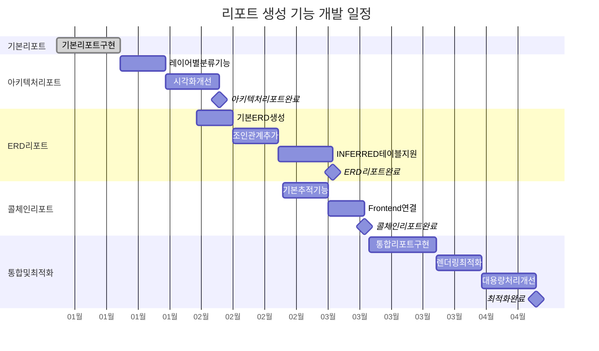
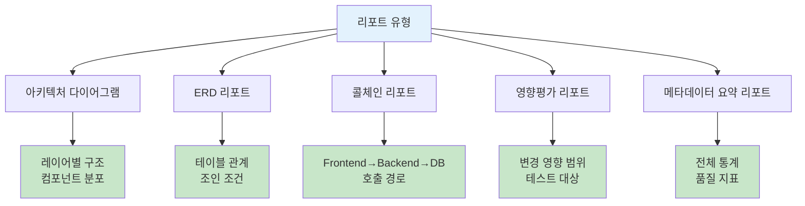
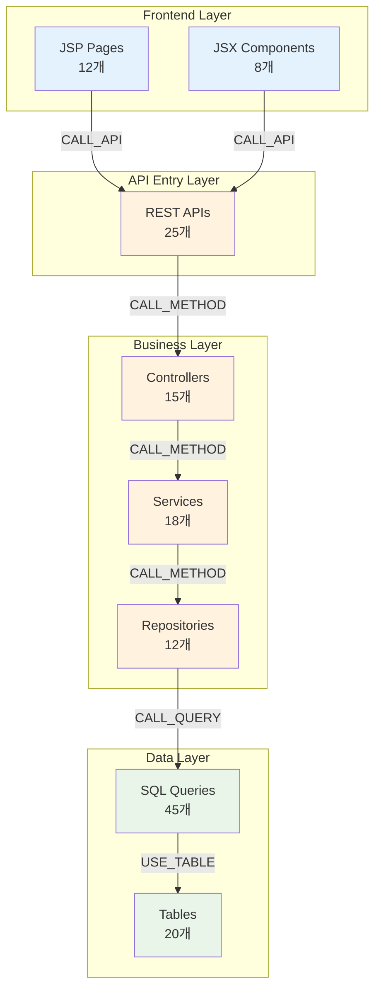
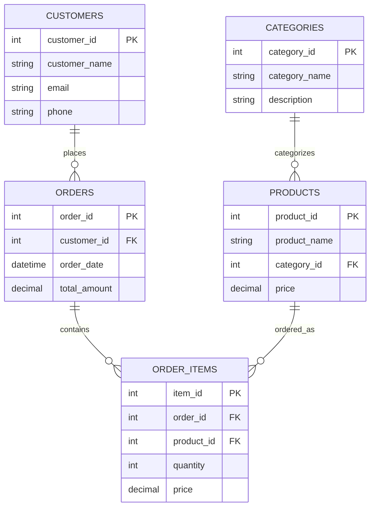
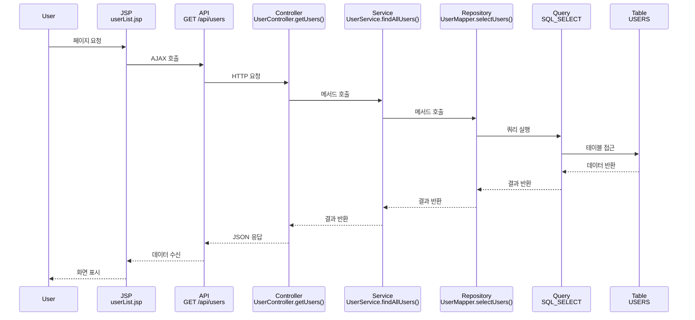
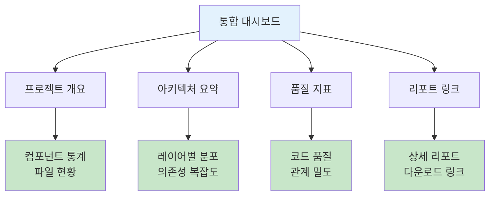
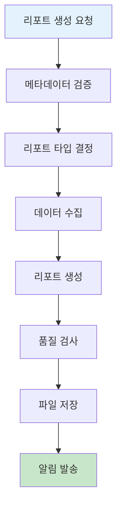

# 리포트 생성 구현서

## 문서 정보
- **작성일**: 2025-09-19
- **버전**: v1.0
- **목적**: 분석 결과를 시각화한 다양한 리포트 생성

## 리포트 생성 개발 일정



## 1. 리포트 생성 개요

### 1.1 리포트 생성 목적
- 메타데이터 분석 결과의 시각적 표현
- 아키텍처 구조 파악 및 문서화
- 영향평가 및 의사결정 지원

### 1.2 리포트 유형



## 2. 아키텍처 다이어그램 생성

### 2.1 아키텍처 다이어그램 구조



### 2.2 아키텍처 다이어그램 생성기

```python
class ArchitectureDiagramGenerator:
    """아키텍처 다이어그램 생성기"""
    
    def __init__(self, project_id: int):
        self.project_id = project_id
        self.layer_stats = self.collect_layer_statistics()
        
    def generate_architecture_diagram(self, output_path: str) -> str:
        """아키텍처 다이어그램 HTML 생성"""
        
        html_template = """
        <!DOCTYPE html>
        <html>
        <head>
            <title>아키텍처 다이어그램 - {project_name}</title>
            <meta charset="utf-8">
            <script src="https://unpkg.com/cytoscape@3.21.0/dist/cytoscape.min.js"></script>
            <script src="https://unpkg.com/dagre@0.8.5/dist/dagre.min.js"></script>
            <script src="https://unpkg.com/cytoscape-dagre@2.4.0/cytoscape-dagre.js"></script>
            <style>
                body {{ font-family: 'Malgun Gothic', sans-serif; margin: 0; padding: 20px; }}
                .header {{ background: #2196F3; color: white; padding: 20px; border-radius: 5px; margin-bottom: 20px; }}
                .diagram-container {{ 
                    width: 100%; height: 600px; border: 1px solid #ddd; 
                    border-radius: 5px; margin-bottom: 20px;
                }}
                .stats-container {{ 
                    display: flex; gap: 20px; flex-wrap: wrap; margin-bottom: 20px;
                }}
                .stat-card {{ 
                    background: #f5f5f5; padding: 15px; border-radius: 5px; 
                    border-left: 4px solid #2196F3; min-width: 150px;
                }}
                .layer-legend {{ 
                    display: flex; gap: 15px; flex-wrap: wrap; padding: 15px; 
                    background: #f9f9f9; border-radius: 5px;
                }}
                .legend-item {{ 
                    display: flex; align-items: center; gap: 8px;
                }}
                .legend-color {{ 
                    width: 20px; height: 20px; border-radius: 3px;
                }}
            </style>
        </head>
        <body>
            <div class="header">
                <h1>시스템 아키텍처 다이어그램</h1>
                <p><strong>프로젝트:</strong> {project_name}</p>
                <p><strong>생성일시:</strong> {generation_date}</p>
            </div>
            
            <div class="stats-container">
                {layer_stats_cards}
            </div>
            
            <div class="layer-legend">
                <div class="legend-item">
                    <div class="legend-color" style="background: #e3f2fd;"></div>
                    <span>Frontend Layer</span>
                </div>
                <div class="legend-item">
                    <div class="legend-color" style="background: #fff3e0;"></div>
                    <span>Business Layer</span>
                </div>
                <div class="legend-item">
                    <div class="legend-color" style="background: #e8f5e8;"></div>
                    <span>Data Layer</span>
                </div>
            </div>
            
            <div id="cy" class="diagram-container"></div>
            
            <script>
                const elements = {architecture_elements};
                
                const cy = cytoscape({{
                    container: document.getElementById('cy'),
                    elements: elements,
                    style: {architecture_styles},
                    layout: {{
                        name: 'dagre',
                        rankDir: 'TB',
                        spacingFactor: 1.5,
                        nodeSep: 100,
                        rankSep: 150
                    }}
                }});
                
                // 노드 클릭 이벤트
                cy.on('tap', 'node', function(evt) {{
                    const node = evt.target;
                    const data = node.data();
                    alert(`Layer: ${{data.layer}}\\nComponents: ${{data.count}}개\\nType: ${{data.componentType}}`);
                }});
            </script>
        </body>
        </html>
        """
        
        # 템플릿 데이터 준비
        template_data = self.prepare_architecture_template_data()
        
        # HTML 생성
        html_content = html_template.format(**template_data)
        
        # 파일 저장
        with open(output_path, 'w', encoding='utf-8') as f:
            f.write(html_content)
        
        return output_path
    
    def collect_layer_statistics(self) -> dict:
        """레이어별 통계 수집"""
        
        query = """
        SELECT 
            layer,
            component_type,
            COUNT(*) as count
        FROM components 
        WHERE project_id = ? AND del_yn = 'N'
        GROUP BY layer, component_type
        ORDER BY layer, component_type
        """
        
        results = execute_query(query, [self.project_id])
        
        # 레이어별 통계 정리
        layer_stats = {}
        for row in results:
            layer = row['layer']
            comp_type = row['component_type']
            count = row['count']
            
            if layer not in layer_stats:
                layer_stats[layer] = {}
            
            layer_stats[layer][comp_type] = count
        
        return layer_stats
```

## 3. ERD 리포트 생성

### 3.1 ERD 구조 분석



### 3.2 ERD 생성기 구현

```python
class ERDGenerator:
    """ERD 리포트 생성기"""
    
    def __init__(self, project_id: int):
        self.project_id = project_id
        
    def generate_erd_report(self, output_path: str) -> str:
        """ERD HTML 리포트 생성"""
        
        # 1. 테이블 정보 수집
        tables_data = self.collect_tables_data()
        
        # 2. 관계 정보 수집
        relationships_data = self.collect_table_relationships()
        
        # 3. Mermaid ERD 코드 생성
        mermaid_erd = self.generate_mermaid_erd(tables_data, relationships_data)
        
        # 4. HTML 템플릿 적용
        html_content = self.create_erd_html(mermaid_erd, tables_data, relationships_data)
        
        # 5. 파일 저장
        with open(output_path, 'w', encoding='utf-8') as f:
            f.write(html_content)
        
        return output_path
    
    def collect_tables_data(self) -> List[dict]:
        """테이블 정보 수집"""
        
        query = """
        SELECT DISTINCT
            t.table_id,
            t.table_name,
            t.table_owner,
            t.table_comments,
            COUNT(c.column_id) as column_count,
            SUM(CASE WHEN c.position_pk IS NOT NULL THEN 1 ELSE 0 END) as pk_count
        FROM tables t
        LEFT JOIN columns c ON t.table_id = c.table_id AND c.del_yn = 'N'
        WHERE t.project_id = ? AND t.del_yn = 'N'
        GROUP BY t.table_id, t.table_name, t.table_owner, t.table_comments
        ORDER BY t.table_name
        """
        
        tables = execute_query(query, [self.project_id])
        
        # 각 테이블의 컬럼 정보 수집
        for table in tables:
            table['columns'] = self.get_table_columns(table['table_id'])
        
        return tables
    
    def get_table_columns(self, table_id: int) -> List[dict]:
        """테이블 컬럼 정보 조회"""
        
        query = """
        SELECT 
            column_name,
            data_type,
            data_length,
            nullable,
            position_pk,
            column_comments
        FROM columns
        WHERE table_id = ? AND del_yn = 'N'
        ORDER BY 
            CASE WHEN position_pk IS NOT NULL THEN 0 ELSE 1 END,
            position_pk,
            column_name
        """
        
        return execute_query(query, [table_id])
    
    def generate_mermaid_erd(self, tables_data: List[dict], 
                           relationships_data: List[dict]) -> str:
        """Mermaid ERD 코드 생성"""
        
        erd_lines = ["erDiagram"]
        
        # 1. 테이블 정의
        for table in tables_data:
            table_name = table['table_name']
            
            # 테이블 시작
            erd_lines.append(f"    {table_name} {{")
            
            # 컬럼 정의
            for column in table['columns']:
                col_name = column['column_name']
                data_type = self.normalize_data_type(column['data_type'])
                
                # PK 표시
                pk_suffix = " PK" if column['position_pk'] is not None else ""
                
                erd_lines.append(f"        {data_type} {col_name}{pk_suffix}")
            
            # 테이블 종료
            erd_lines.append("    }")
            erd_lines.append("")
        
        # 2. 관계 정의
        for rel in relationships_data:
            src_table = rel['src_table']
            dst_table = rel['dst_table']
            relationship_type = self.determine_relationship_symbol(rel)
            join_column = rel['join_column']
            
            erd_lines.append(f"    {src_table} {relationship_type} {dst_table} : \"{join_column}\"")
        
        return "\n".join(erd_lines)
    
    def normalize_data_type(self, data_type: str) -> str:
        """데이터 타입 정규화 (Mermaid 호환)"""
        
        if not data_type or data_type == 'UNKNOWN':
            return "string"
        
        data_type_upper = data_type.upper()
        
        # 숫자 타입
        if any(t in data_type_upper for t in ['INT', 'NUMBER', 'DECIMAL', 'FLOAT']):
            return "int"
        
        # 날짜 타입
        if any(t in data_type_upper for t in ['DATE', 'TIME', 'TIMESTAMP']):
            return "datetime"
        
        # 기본은 문자열
        return "string"
```

## 4. 콜체인 리포트 생성

### 4.1 콜체인 시각화 구조



### 4.2 콜체인 생성기 구현

```python
class CallChainGenerator:
    """콜체인 리포트 생성기"""
    
    def __init__(self, project_id: int):
        self.project_id = project_id
        
    def generate_call_chain_report(self, output_path: str) -> str:
        """콜체인 HTML 리포트 생성"""
        
        # 1. 완전한 콜체인 수집
        complete_chains = self.collect_complete_call_chains()
        
        # 2. 주요 콜체인 선별
        major_chains = self.select_major_call_chains(complete_chains)
        
        # 3. 시퀀스 다이어그램 생성
        sequence_diagrams = self.generate_sequence_diagrams(major_chains)
        
        # 4. HTML 리포트 생성
        html_content = self.create_call_chain_html(sequence_diagrams, complete_chains)
        
        # 5. 파일 저장
        with open(output_path, 'w', encoding='utf-8') as f:
            f.write(html_content)
        
        return output_path
    
    def collect_complete_call_chains(self) -> List[dict]:
        """완전한 콜체인 수집"""
        
        complete_chains = []
        
        # 1. Frontend 시작점 조회
        frontend_files = self.get_frontend_entry_points()
        
        for frontend in frontend_files:
            # 2. 각 Frontend에서 시작하는 콜체인 추적
            chains = self.trace_call_chain_from_frontend(frontend['file_id'])
            
            for chain in chains:
                if self.is_complete_chain(chain):
                    complete_chains.append({
                        'frontend_file': frontend['file_name'],
                        'chain_path': chain,
                        'chain_depth': len(chain),
                        'end_tables': self.extract_end_tables(chain)
                    })
        
        return complete_chains
    
    def trace_call_chain_from_frontend(self, frontend_file_id: int) -> List[List[dict]]:
        """Frontend에서 시작하는 콜체인 추적"""
        
        chains = []
        
        def trace_recursive(current_id: int, current_type: str, 
                          chain_path: List[dict], visited: set):
            
            # 무한 루프 방지
            if current_id in visited or len(chain_path) > 10:
                return
            
            visited.add(current_id)
            
            # 현재 컴포넌트에서 나가는 관계 조회
            outgoing_relations = self.get_outgoing_relationships(current_id, current_type)
            
            if not outgoing_relations:
                # 체인 종료 - 완전한 체인인지 확인
                if len(chain_path) >= 3:  # 최소 Frontend -> API -> Method
                    chains.append(chain_path.copy())
                return
            
            for relation in outgoing_relations:
                new_component = self.get_component_info(
                    relation['dst_id'], relation['dst_type']
                )
                
                new_path = chain_path + [new_component]
                new_visited = visited.copy()
                
                trace_recursive(
                    relation['dst_id'], 
                    relation['dst_type'], 
                    new_path, 
                    new_visited
                )
        
        # Frontend 파일에서 시작
        frontend_component = {'component_id': frontend_file_id, 'type': 'FILE'}
        trace_recursive(frontend_file_id, 'FILE', [frontend_component], set())
        
        return chains
    
    def generate_sequence_diagrams(self, major_chains: List[dict]) -> List[str]:
        """시퀀스 다이어그램 생성"""
        
        sequence_diagrams = []
        
        for chain_info in major_chains:
            chain_path = chain_info['chain_path']
            
            # Mermaid 시퀀스 다이어그램 생성
            diagram_lines = ["sequenceDiagram"]
            
            # 참여자 정의
            participants = self.extract_participants(chain_path)
            for participant in participants:
                diagram_lines.append(f"    participant {participant['alias']} as {participant['name']}")
            
            diagram_lines.append("")
            
            # 호출 관계 정의
            for i in range(len(chain_path) - 1):
                current = chain_path[i]
                next_comp = chain_path[i + 1]
                
                current_alias = self.get_participant_alias(current)
                next_alias = self.get_participant_alias(next_comp)
                
                # 호출 타입에 따른 화살표 결정
                arrow_type = self.determine_arrow_type(current, next_comp)
                
                diagram_lines.append(
                    f"    {current_alias}{arrow_type}{next_alias}: {self.get_call_description(current, next_comp)}"
                )
            
            # 반환 관계 정의 (역순)
            for i in range(len(chain_path) - 1, 0, -1):
                current = chain_path[i]
                prev_comp = chain_path[i - 1]
                
                current_alias = self.get_participant_alias(current)
                prev_alias = self.get_participant_alias(prev_comp)
                
                diagram_lines.append(f"    {current_alias}-->>+{prev_alias}: 결과 반환")
            
            sequence_diagrams.append("\n".join(diagram_lines))
        
        return sequence_diagrams
```

## 5. 통합 리포트 대시보드

### 5.1 대시보드 구조



### 5.2 대시보드 생성기

```python
class DashboardGenerator:
    """통합 대시보드 생성기"""
    
    def __init__(self, project_id: int):
        self.project_id = project_id
        self.project_info = self.get_project_info()
        
    def generate_dashboard(self, output_path: str) -> str:
        """통합 대시보드 생성"""
        
        # 1. 전체 통계 수집
        overall_stats = self.collect_overall_statistics()
        
        # 2. 품질 지표 계산
        quality_metrics = self.calculate_quality_metrics()
        
        # 3. 차트 데이터 준비
        chart_data = self.prepare_chart_data()
        
        # 4. HTML 대시보드 생성
        html_content = self.create_dashboard_html(
            overall_stats, quality_metrics, chart_data
        )
        
        # 5. 파일 저장
        with open(output_path, 'w', encoding='utf-8') as f:
            f.write(html_content)
        
        return output_path
    
    def collect_overall_statistics(self) -> dict:
        """전체 통계 수집"""
        
        stats = {}
        
        # 파일 통계
        stats['files'] = self.get_file_statistics()
        
        # 컴포넌트 통계
        stats['components'] = self.get_component_statistics()
        
        # 테이블 통계
        stats['tables'] = self.get_table_statistics()
        
        # 관계 통계
        stats['relationships'] = self.get_relationship_statistics()
        
        return stats
    
    def calculate_quality_metrics(self) -> dict:
        """품질 지표 계산"""
        
        metrics = {}
        
        # 1. 컴포넌트 밀도 (파일당 평균 컴포넌트 수)
        metrics['component_density'] = self.calculate_component_density()
        
        # 2. 관계 복잡도 (컴포넌트당 평균 관계 수)
        metrics['relationship_complexity'] = self.calculate_relationship_complexity()
        
        # 3. 레이어 분리도 (레이어 간 의존성 비율)
        metrics['layer_separation'] = self.calculate_layer_separation()
        
        # 4. 테이블 활용도 (쿼리에서 사용되는 테이블 비율)
        metrics['table_utilization'] = self.calculate_table_utilization()
        
        # 5. API 커버리지 (Frontend에서 호출되는 API 비율)
        metrics['api_coverage'] = self.calculate_api_coverage()
        
        return metrics
    
    def create_dashboard_html(self, overall_stats: dict, 
                            quality_metrics: dict, chart_data: dict) -> str:
        """대시보드 HTML 생성"""
        
        html_template = """
        <!DOCTYPE html>
        <html>
        <head>
            <title>SourceAnalyzer 대시보드 - {project_name}</title>
            <meta charset="utf-8">
            <script src="https://cdn.jsdelivr.net/npm/chart.js"></script>
            <style>
                body {{ 
                    font-family: 'Malgun Gothic', sans-serif; 
                    margin: 0; padding: 20px; background: #f5f5f5; 
                }}
                .header {{ 
                    background: linear-gradient(135deg, #667eea 0%, #764ba2 100%);
                    color: white; padding: 30px; border-radius: 10px; 
                    margin-bottom: 30px; text-align: center;
                }}
                .dashboard-grid {{ 
                    display: grid; grid-template-columns: repeat(auto-fit, minmax(300px, 1fr));
                    gap: 20px; margin-bottom: 30px;
                }}
                .card {{ 
                    background: white; padding: 20px; border-radius: 10px;
                    box-shadow: 0 2px 10px rgba(0,0,0,0.1);
                }}
                .card h3 {{ 
                    margin: 0 0 15px 0; color: #333; 
                    border-bottom: 2px solid #667eea; padding-bottom: 10px;
                }}
                .stat-grid {{ 
                    display: grid; grid-template-columns: repeat(2, 1fr); gap: 15px;
                }}
                .stat-item {{ 
                    text-align: center; padding: 15px; 
                    background: #f8f9fa; border-radius: 8px;
                }}
                .stat-number {{ 
                    font-size: 2em; font-weight: bold; color: #667eea;
                }}
                .stat-label {{ 
                    font-size: 0.9em; color: #666; margin-top: 5px;
                }}
                .chart-container {{ 
                    position: relative; height: 300px; margin: 20px 0;
                }}
                .quality-meter {{ 
                    display: flex; align-items: center; margin: 10px 0;
                }}
                .meter-bar {{ 
                    flex: 1; height: 20px; background: #e0e0e0; 
                    border-radius: 10px; margin: 0 15px; position: relative;
                }}
                .meter-fill {{ 
                    height: 100%; border-radius: 10px;
                    background: linear-gradient(90deg, #ff6b6b, #feca57, #48dbfb, #0abde3);
                }}
                .report-links {{ 
                    display: grid; grid-template-columns: repeat(auto-fit, minmax(200px, 1fr));
                    gap: 15px;
                }}
                .report-link {{ 
                    display: block; padding: 15px; text-align: center;
                    background: #667eea; color: white; text-decoration: none;
                    border-radius: 8px; transition: background 0.3s;
                }}
                .report-link:hover {{ background: #5a6fd8; }}
            </style>
        </head>
        <body>
            <div class="header">
                <h1>📊 SourceAnalyzer 대시보드</h1>
                <p><strong>프로젝트:</strong> {project_name}</p>
                <p><strong>분석 완료일:</strong> {analysis_date}</p>
            </div>
            
            <div class="dashboard-grid">
                <!-- 프로젝트 개요 -->
                <div class="card">
                    <h3>📋 프로젝트 개요</h3>
                    <div class="stat-grid">
                        <div class="stat-item">
                            <div class="stat-number">{total_files}</div>
                            <div class="stat-label">전체 파일</div>
                        </div>
                        <div class="stat-item">
                            <div class="stat-number">{total_components}</div>
                            <div class="stat-label">전체 컴포넌트</div>
                        </div>
                        <div class="stat-item">
                            <div class="stat-number">{total_tables}</div>
                            <div class="stat-label">데이터베이스 테이블</div>
                        </div>
                        <div class="stat-item">
                            <div class="stat-number">{total_relationships}</div>
                            <div class="stat-label">관계</div>
                        </div>
                    </div>
                </div>
                
                <!-- 레이어별 분포 -->
                <div class="card">
                    <h3>🏗️ 아키텍처 레이어</h3>
                    <div class="chart-container">
                        <canvas id="layerChart"></canvas>
                    </div>
                </div>
                
                <!-- 품질 지표 -->
                <div class="card">
                    <h3>⭐ 품질 지표</h3>
                    {quality_metrics_html}
                </div>
                
                <!-- 파일 타입별 분포 -->
                <div class="card">
                    <h3>📁 파일 타입 분포</h3>
                    <div class="chart-container">
                        <canvas id="fileTypeChart"></canvas>
                    </div>
                </div>
            </div>
            
            <!-- 상세 리포트 링크 -->
            <div class="card">
                <h3>📑 상세 리포트</h3>
                <div class="report-links">
                    <a href="architecture_diagram.html" class="report-link">
                        🏛️ 아키텍처 다이어그램
                    </a>
                    <a href="erd_report.html" class="report-link">
                        🗃️ ERD 리포트
                    </a>
                    <a href="call_chain_report.html" class="report-link">
                        🔗 콜체인 리포트
                    </a>
                    <a href="impact_analysis.html" class="report-link">
                        📊 영향평가 도구
                    </a>
                </div>
            </div>
            
            <script>
                // 레이어 차트
                const layerCtx = document.getElementById('layerChart').getContext('2d');
                new Chart(layerCtx, {{
                    type: 'doughnut',
                    data: {layer_chart_data},
                    options: {{
                        responsive: true,
                        maintainAspectRatio: false,
                        plugins: {{
                            legend: {{
                                position: 'bottom'
                            }}
                        }}
                    }}
                }});
                
                // 파일 타입 차트
                const fileTypeCtx = document.getElementById('fileTypeChart').getContext('2d');
                new Chart(fileTypeCtx, {{
                    type: 'bar',
                    data: {file_type_chart_data},
                    options: {{
                        responsive: true,
                        maintainAspectRatio: false,
                        scales: {{
                            y: {{
                                beginAtZero: true
                            }}
                        }}
                    }}
                }});
            </script>
        </body>
        </html>
        """
        
        # 템플릿 데이터 준비
        template_data = self.prepare_dashboard_template_data(
            overall_stats, quality_metrics, chart_data
        )
        
        return html_template.format(**template_data)
```

## 6. 리포트 자동화 및 스케줄링

### 6.1 리포트 생성 파이프라인



### 6.2 자동화 스크립트

```python
class ReportAutomationManager:
    """리포트 자동화 관리자"""
    
    def __init__(self):
        self.generators = {
            'architecture': ArchitectureDiagramGenerator,
            'erd': ERDGenerator,
            'callchain': CallChainGenerator,
            'dashboard': DashboardGenerator
        }
    
    def generate_all_reports(self, project_id: int, output_dir: str) -> dict:
        """모든 리포트 생성"""
        
        results = {
            'success': [],
            'failed': [],
            'total_time': 0
        }
        
        start_time = time.time()
        
        try:
            # 출력 디렉토리 생성
            os.makedirs(output_dir, exist_ok=True)
            
            # 각 리포트 생성
            for report_type, generator_class in self.generators.items():
                try:
                    generator = generator_class(project_id)
                    output_path = os.path.join(output_dir, f"{report_type}_report.html")
                    
                    # 리포트 생성
                    result_path = generator.generate_report(output_path)
                    
                    results['success'].append({
                        'type': report_type,
                        'path': result_path,
                        'size': os.path.getsize(result_path)
                    })
                    
                except Exception as e:
                    results['failed'].append({
                        'type': report_type,
                        'error': str(e)
                    })
            
            results['total_time'] = time.time() - start_time
            
            # 성공 시 대시보드 생성
            if results['success']:
                dashboard_generator = DashboardGenerator(project_id)
                dashboard_path = os.path.join(output_dir, "index.html")
                dashboard_generator.generate_dashboard(dashboard_path)
                
                results['dashboard_path'] = dashboard_path
            
        except Exception as e:
            results['fatal_error'] = str(e)
        
        return results
    
    def schedule_report_generation(self, project_id: int, schedule: str):
        """리포트 생성 스케줄링"""
        
        # 크론 스케줄 형태로 리포트 자동 생성 설정
        # 예: "0 2 * * *" (매일 새벽 2시)
        
        import schedule
        
        def job():
            output_dir = f"./reports/{project_id}/{datetime.now().strftime('%Y%m%d_%H%M%S')}"
            self.generate_all_reports(project_id, output_dir)
        
        schedule.every().day.at("02:00").do(job)
```

---

## 다음 단계
- [10_성능_최적화_가이드.md](10_성능_최적화_가이드.md): 시스템 성능 최적화 방안
