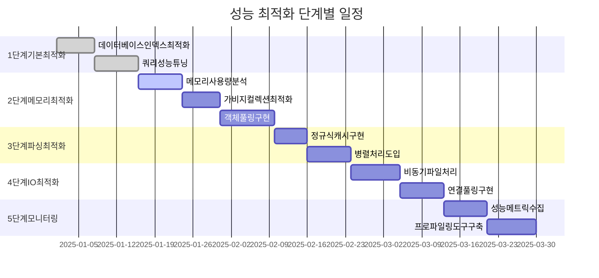
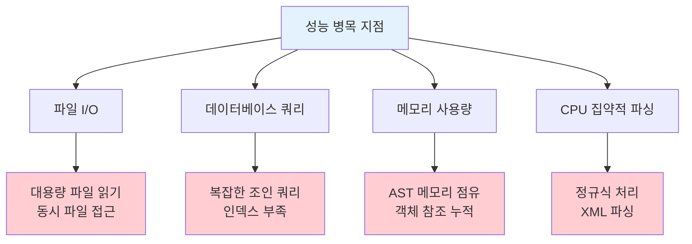
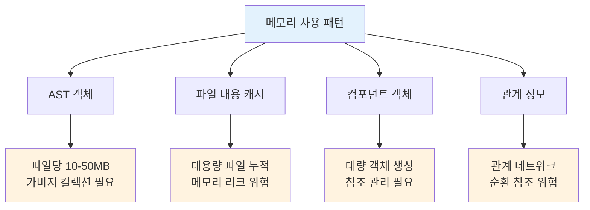

# 성능 최적화 가이드

## 문서 정보
- **작성일**: 2025-09-19
- **버전**: v1.0
- **목적**: SourceAnalyzer 시스템의 성능 최적화 방안

## 1. 성능 최적화 개요

### 1.1 최적화 목표
- 메타데이터 생성 속도 향상
- 메모리 사용량 최적화
- 영향평가 응답 시간 단축
- 대용량 프로젝트 처리 능력 확보

### 1.2 성능 최적화 로드맵



### 1.2 성능 병목 지점



## 2. 데이터베이스 최적화

### 2.1 인덱스 최적화

#### 핵심 성능 인덱스
```sql
-- 1. 관계 검색 최적화
CREATE INDEX IF NOT EXISTS idx_rel_src_type_del 
ON relationships(src_id, rel_type, del_yn);

CREATE INDEX IF NOT EXISTS idx_rel_dst_type_del 
ON relationships(dst_id, rel_type, del_yn);

-- 2. 컴포넌트 검색 최적화
CREATE INDEX IF NOT EXISTS idx_comp_project_type_name 
ON components(project_id, component_type, component_name, del_yn);

CREATE INDEX IF NOT EXISTS idx_comp_file_type 
ON components(file_id, component_type, del_yn);

-- 3. 테이블 검색 최적화
CREATE INDEX IF NOT EXISTS idx_table_project_name 
ON tables(project_id, table_name, del_yn);

CREATE INDEX IF NOT EXISTS idx_table_owner_name 
ON tables(table_owner, table_name, del_yn);

-- 4. 컬럼 검색 최적화
CREATE INDEX IF NOT EXISTS idx_column_table_name 
ON columns(table_id, column_name, del_yn);

-- 5. 파일 검색 최적화
CREATE INDEX IF NOT EXISTS idx_file_project_type_path 
ON files(project_id, file_type, file_path, del_yn);
```

#### 복합 인덱스 전략
```python
def create_performance_indexes(connection):
    """성능 최적화 인덱스 생성"""
    
    performance_indexes = [
        # 영향평가용 복합 인덱스
        """CREATE INDEX IF NOT EXISTS idx_impact_analysis 
           ON relationships(src_id, dst_id, rel_type, del_yn)""",
        
        # 콜체인 추적용 인덱스
        """CREATE INDEX IF NOT EXISTS idx_call_chain 
           ON components(project_id, component_type, layer, parent_id, del_yn)""",
        
        # 테이블 조인 분석용 인덱스
        """CREATE INDEX IF NOT EXISTS idx_table_joins 
           ON relationships(rel_type, src_id, dst_id) 
           WHERE rel_type IN ('JOIN_EXPLICIT', 'JOIN_IMPLICIT')""",
        
        # 파일별 컴포넌트 조회용 인덱스
        """CREATE INDEX IF NOT EXISTS idx_file_components 
           ON components(file_id, component_type, line_start, del_yn)"""
    ]
    
    for index_sql in performance_indexes:
        connection.execute(index_sql)
        print(f"Created index: {index_sql.split('idx_')[1].split(' ')[0]}")
```

### 2.2 쿼리 최적화

#### 영향평가 쿼리 최적화
```python
def get_table_impact_optimized(table_name: str, project_id: int) -> List[dict]:
    """최적화된 테이블 영향평가 쿼리"""
    
    # 기존: 여러 번의 쿼리 실행
    # 최적화: 단일 CTE 쿼리로 통합
    
    optimized_query = """
    WITH RECURSIVE impact_chain AS (
        -- 1. 테이블을 사용하는 직접 쿼리
        SELECT DISTINCT
            q.component_id,
            q.component_name,
            q.component_type,
            q.layer,
            f.file_name,
            1 as depth,
            'DIRECT_QUERY' as impact_type
        FROM components q
        INNER JOIN relationships r ON q.component_id = r.src_id
        INNER JOIN components t ON r.dst_id = t.component_id
        INNER JOIN files f ON q.file_id = f.file_id
        WHERE q.project_id = ?
          AND q.component_type IN ('SQL_SELECT', 'SQL_INSERT', 'SQL_UPDATE', 'SQL_DELETE', 'QUERY')
          AND r.rel_type = 'USE_TABLE'
          AND t.component_type = 'TABLE'
          AND UPPER(t.component_name) = UPPER(?)
          AND q.del_yn = 'N' AND r.del_yn = 'N' AND t.del_yn = 'N'
        
        UNION ALL
        
        -- 2. 쿼리를 호출하는 메서드 (재귀)
        SELECT DISTINCT
            m.component_id,
            m.component_name,
            m.component_type,
            m.layer,
            f.file_name,
            ic.depth + 1,
            CASE 
                WHEN m.layer = 'CONTROLLER' THEN 'CONTROLLER_METHOD'
                WHEN m.layer = 'SERVICE' THEN 'SERVICE_METHOD'
                WHEN m.layer = 'REPOSITORY' THEN 'REPOSITORY_METHOD'
                ELSE 'OTHER_METHOD'
            END as impact_type
        FROM impact_chain ic
        INNER JOIN relationships r ON ic.component_id = r.dst_id
        INNER JOIN components m ON r.src_id = m.component_id
        INNER JOIN files f ON m.file_id = f.file_id
        WHERE r.rel_type = 'CALL_QUERY'
          AND m.component_type = 'METHOD'
          AND ic.depth < 5  -- 최대 깊이 제한
          AND m.del_yn = 'N' AND r.del_yn = 'N'
    )
    SELECT * FROM impact_chain
    ORDER BY depth, impact_type, component_name
    """
    
    return execute_query(optimized_query, [project_id, table_name])
```

#### 배치 처리 최적화
```python
def batch_insert_components(components: List[dict], batch_size: int = 1000):
    """컴포넌트 배치 삽입 최적화"""
    
    insert_sql = """
    INSERT INTO components (
        project_id, file_id, component_name, component_type, 
        parent_id, layer, line_start, line_end, 
        api_url, call_method, class_name, method_name,
        created_at, updated_at
    ) VALUES (?, ?, ?, ?, ?, ?, ?, ?, ?, ?, ?, ?, ?, ?)
    """
    
    with get_db_connection() as conn:
        conn.execute("BEGIN TRANSACTION")
        
        try:
            for i in range(0, len(components), batch_size):
                batch = components[i:i + batch_size]
                
                # 배치 데이터 준비
                batch_data = []
                for comp in batch:
                    batch_data.append((
                        comp['project_id'], comp['file_id'], comp['component_name'],
                        comp['component_type'], comp.get('parent_id'),
                        comp.get('layer'), comp.get('line_start'), comp.get('line_end'),
                        comp.get('api_url'), comp.get('call_method'),
                        comp.get('class_name'), comp.get('method_name'),
                        datetime.now(), datetime.now()
                    ))
                
                # 배치 실행
                conn.executemany(insert_sql, batch_data)
                
                # 진행 상황 로그
                print(f"Inserted batch {i//batch_size + 1}: {len(batch)} components")
            
            conn.execute("COMMIT")
            
        except Exception as e:
            conn.execute("ROLLBACK")
            raise e
```

## 3. 메모리 최적화

### 3.1 메모리 사용 패턴 분석



### 3.2 메모리 최적화 구현

#### 메모리 모니터링
```python
import psutil
import gc
from typing import Optional

class MemoryManager:
    """메모리 관리자"""
    
    def __init__(self, max_memory_mb: int = 100):
        self.max_memory_mb = max_memory_mb
        self.current_memory_mb = 0
        
    def get_current_memory_usage(self) -> float:
        """현재 메모리 사용량 조회 (MB)"""
        
        process = psutil.Process()
        memory_info = process.memory_info()
        return memory_info.rss / 1024 / 1024  # MB 단위
    
    def check_memory_limit(self) -> bool:
        """메모리 한계 검사"""
        
        current_usage = self.get_current_memory_usage()
        
        if current_usage > self.max_memory_mb:
            print(f"Memory limit exceeded: {current_usage:.1f}MB > {self.max_memory_mb}MB")
            return False
        
        return True
    
    def force_garbage_collection(self):
        """강제 가비지 컬렉션"""
        
        before_memory = self.get_current_memory_usage()
        
        # 가비지 컬렉션 실행
        collected = gc.collect()
        
        after_memory = self.get_current_memory_usage()
        freed_memory = before_memory - after_memory
        
        print(f"GC: Collected {collected} objects, freed {freed_memory:.1f}MB")
        
        return freed_memory

# 전역 메모리 관리자
memory_manager = MemoryManager()
```

#### 스트리밍 파일 처리
```python
def process_large_file_streaming(file_path: str, chunk_size: int = 1024*1024) -> None:
    """대용량 파일 스트리밍 처리"""
    
    def process_chunk(chunk: str) -> None:
        """청크 단위 처리"""
        
        # 메모리 사용량 체크
        if not memory_manager.check_memory_limit():
            memory_manager.force_garbage_collection()
        
        # 청크 처리 로직
        # ...
        
        # 처리 완료 후 명시적 메모리 해제
        del chunk
    
    try:
        with open(file_path, 'r', encoding='utf-8') as f:
            buffer = ""
            
            while True:
                chunk = f.read(chunk_size)
                if not chunk:
                    break
                
                buffer += chunk
                
                # 완전한 구문 단위로 처리 (예: 메서드, 클래스 단위)
                while True:
                    complete_unit, buffer = extract_complete_unit(buffer)
                    if not complete_unit:
                        break
                    
                    process_chunk(complete_unit)
    
    except MemoryError:
        print(f"Memory error processing {file_path}")
        memory_manager.force_garbage_collection()
        raise
```

#### 객체 풀링
```python
class ComponentPool:
    """컴포넌트 객체 풀"""
    
    def __init__(self, pool_size: int = 1000):
        self.pool_size = pool_size
        self.available_components = []
        self.used_components = set()
    
    def get_component(self) -> dict:
        """컴포넌트 객체 획득"""
        
        if self.available_components:
            component = self.available_components.pop()
        else:
            component = self.create_new_component()
        
        self.used_components.add(id(component))
        return component
    
    def return_component(self, component: dict):
        """컴포넌트 객체 반환"""
        
        component_id = id(component)
        if component_id in self.used_components:
            # 컴포넌트 초기화
            component.clear()
            
            # 풀에 반환
            if len(self.available_components) < self.pool_size:
                self.available_components.append(component)
            
            self.used_components.remove(component_id)
    
    def create_new_component(self) -> dict:
        """새 컴포넌트 생성"""
        
        return {
            'component_id': None,
            'project_id': None,
            'file_id': None,
            'component_name': '',
            'component_type': '',
            'parent_id': None,
            'layer': '',
            'line_start': 0,
            'line_end': 0
        }

# 전역 컴포넌트 풀
component_pool = ComponentPool()
```

## 4. 파싱 성능 최적화

### 4.1 정규식 최적화

#### 정규식 컴파일 캐시
```python
import re
from functools import lru_cache

class RegexCache:
    """정규식 컴파일 캐시"""
    
    def __init__(self):
        self._compiled_patterns = {}
    
    @lru_cache(maxsize=100)
    def get_compiled_pattern(self, pattern: str, flags: int = 0) -> re.Pattern:
        """컴파일된 정규식 패턴 조회"""
        
        cache_key = f"{pattern}_{flags}"
        
        if cache_key not in self._compiled_patterns:
            self._compiled_patterns[cache_key] = re.compile(pattern, flags)
        
        return self._compiled_patterns[cache_key]
    
    def search(self, pattern: str, text: str, flags: int = 0) -> Optional[re.Match]:
        """캐시된 패턴으로 검색"""
        
        compiled_pattern = self.get_compiled_pattern(pattern, flags)
        return compiled_pattern.search(text)
    
    def findall(self, pattern: str, text: str, flags: int = 0) -> List[str]:
        """캐시된 패턴으로 전체 검색"""
        
        compiled_pattern = self.get_compiled_pattern(pattern, flags)
        return compiled_pattern.findall(text)

# 전역 정규식 캐시
regex_cache = RegexCache()
```

#### 최적화된 패턴 매칭
```python
def extract_sql_patterns_optimized(content: str) -> List[dict]:
    """최적화된 SQL 패턴 추출"""
    
    # 1. 사전 필터링으로 불필요한 처리 제거
    if 'SELECT' not in content.upper() and 'INSERT' not in content.upper():
        return []
    
    # 2. 단계별 패턴 매칭 (복잡한 패턴을 단순한 패턴들로 분해)
    sql_patterns = []
    
    # 2-1. 기본 SQL 키워드 검색
    sql_keywords = regex_cache.get_compiled_pattern(
        r'\b(SELECT|INSERT|UPDATE|DELETE)\b', 
        re.IGNORECASE
    )
    
    keyword_matches = list(sql_keywords.finditer(content))
    if not keyword_matches:
        return []
    
    # 2-2. 각 키워드 위치에서 상세 분석
    for match in keyword_matches:
        start_pos = match.start()
        
        # 해당 위치에서 완전한 SQL 문장 추출
        sql_statement = extract_complete_sql_statement(content, start_pos)
        
        if sql_statement:
            sql_patterns.append({
                'type': match.group(1).upper(),
                'content': sql_statement,
                'line': get_line_number(content, start_pos)
            })
    
    return sql_patterns

def extract_complete_sql_statement(content: str, start_pos: int) -> Optional[str]:
    """완전한 SQL 문장 추출 (최적화된 버전)"""
    
    # 세미콜론 또는 문자열 종료까지 추출
    end_patterns = [';', '\"', '\'', ')', '}']
    
    current_pos = start_pos
    quote_char = None
    paren_depth = 0
    
    while current_pos < len(content):
        char = content[current_pos]
        
        # 따옴표 처리
        if char in ['\'', '\"'] and quote_char is None:
            quote_char = char
        elif char == quote_char:
            quote_char = None
        
        # 괄호 깊이 추적
        elif quote_char is None:
            if char == '(':
                paren_depth += 1
            elif char == ')':
                paren_depth -= 1
            elif char == ';' and paren_depth == 0:
                # SQL 문장 종료
                return content[start_pos:current_pos + 1].strip()
        
        current_pos += 1
    
    # 파일 끝까지 도달
    return content[start_pos:current_pos].strip()
```

### 4.2 병렬 처리 최적화

#### 파일별 병렬 처리
```python
import multiprocessing as mp
from concurrent.futures import ProcessPoolExecutor, as_completed
import threading

class ParallelProcessor:
    """병렬 처리기"""
    
    def __init__(self, max_workers: Optional[int] = None):
        self.max_workers = max_workers or mp.cpu_count()
        self.processed_files = 0
        self.total_files = 0
        self.lock = threading.Lock()
    
    def process_files_parallel(self, file_list: List[str], 
                             process_func: callable) -> List[dict]:
        """파일 병렬 처리"""
        
        self.total_files = len(file_list)
        results = []
        
        with ProcessPoolExecutor(max_workers=self.max_workers) as executor:
            # 작업 제출
            future_to_file = {
                executor.submit(process_func, file_path): file_path 
                for file_path in file_list
            }
            
            # 결과 수집
            for future in as_completed(future_to_file):
                file_path = future_to_file[future]
                
                try:
                    result = future.result()
                    results.append(result)
                    
                    # 진행 상황 업데이트
                    with self.lock:
                        self.processed_files += 1
                        progress = (self.processed_files / self.total_files) * 100
                        print(f"Progress: {progress:.1f}% ({self.processed_files}/{self.total_files})")
                
                except Exception as e:
                    print(f"Error processing {file_path}: {e}")
                    results.append({'error': str(e), 'file_path': file_path})
        
        return results

def process_single_file_optimized(file_path: str) -> dict:
    """단일 파일 최적화 처리"""
    
    try:
        # 메모리 효율적인 파일 읽기
        with open(file_path, 'r', encoding='utf-8') as f:
            content = f.read()
        
        # 파일 타입별 최적화된 처리
        if file_path.endswith('.java'):
            result = process_java_file_optimized(content, file_path)
        elif file_path.endswith('.xml'):
            result = process_xml_file_optimized(content, file_path)
        elif file_path.endswith('.jsp'):
            result = process_jsp_file_optimized(content, file_path)
        else:
            result = {'file_path': file_path, 'components': []}
        
        # 메모리 해제
        del content
        
        return result
    
    except Exception as e:
        return {'file_path': file_path, 'error': str(e), 'components': []}
```

## 5. I/O 최적화

### 5.1 파일 시스템 최적화

#### 비동기 파일 처리
```python
import asyncio
import aiofiles
from pathlib import Path

class AsyncFileProcessor:
    """비동기 파일 처리기"""
    
    def __init__(self, max_concurrent_files: int = 10):
        self.max_concurrent_files = max_concurrent_files
        self.semaphore = asyncio.Semaphore(max_concurrent_files)
    
    async def process_files_async(self, file_paths: List[str]) -> List[dict]:
        """파일 비동기 처리"""
        
        tasks = []
        
        for file_path in file_paths:
            task = asyncio.create_task(self.process_single_file_async(file_path))
            tasks.append(task)
        
        # 모든 파일 처리 완료 대기
        results = await asyncio.gather(*tasks, return_exceptions=True)
        
        # 예외 처리
        processed_results = []
        for i, result in enumerate(results):
            if isinstance(result, Exception):
                processed_results.append({
                    'file_path': file_paths[i],
                    'error': str(result),
                    'components': []
                })
            else:
                processed_results.append(result)
        
        return processed_results
    
    async def process_single_file_async(self, file_path: str) -> dict:
        """단일 파일 비동기 처리"""
        
        async with self.semaphore:
            try:
                # 비동기 파일 읽기
                async with aiofiles.open(file_path, 'r', encoding='utf-8') as f:
                    content = await f.read()
                
                # CPU 집약적 작업은 별도 스레드에서 처리
                result = await asyncio.get_event_loop().run_in_executor(
                    None, self.process_content_sync, content, file_path
                )
                
                return result
            
            except Exception as e:
                return {
                    'file_path': file_path,
                    'error': str(e),
                    'components': []
                }
    
    def process_content_sync(self, content: str, file_path: str) -> dict:
        """동기 내용 처리 (CPU 집약적 작업)"""
        
        # 실제 파싱 로직
        return process_file_content(content, file_path)

# 사용 예시
async def main():
    processor = AsyncFileProcessor()
    file_paths = get_all_source_files()
    results = await processor.process_files_async(file_paths)
    return results
```

### 5.2 데이터베이스 I/O 최적화

#### 연결 풀링
```python
import sqlite3
import threading
from queue import Queue, Empty
from contextlib import contextmanager

class ConnectionPool:
    """데이터베이스 연결 풀"""
    
    def __init__(self, db_path: str, pool_size: int = 10):
        self.db_path = db_path
        self.pool_size = pool_size
        self.pool = Queue(maxsize=pool_size)
        self.lock = threading.Lock()
        
        # 초기 연결 생성
        for _ in range(pool_size):
            conn = sqlite3.connect(db_path, check_same_thread=False)
            conn.row_factory = sqlite3.Row  # dict-like 접근
            self.pool.put(conn)
    
    @contextmanager
    def get_connection(self):
        """연결 획득 (컨텍스트 매니저)"""
        
        conn = None
        try:
            # 연결 획득 (타임아웃 5초)
            conn = self.pool.get(timeout=5)
            yield conn
        
        except Empty:
            # 풀에서 연결을 가져올 수 없는 경우 새로 생성
            conn = sqlite3.connect(self.db_path, check_same_thread=False)
            conn.row_factory = sqlite3.Row
            yield conn
        
        finally:
            if conn:
                try:
                    # 연결을 풀에 반환
                    self.pool.put_nowait(conn)
                except:
                    # 풀이 가득 찬 경우 연결 종료
                    conn.close()
    
    def close_all(self):
        """모든 연결 종료"""
        
        while not self.pool.empty():
            try:
                conn = self.pool.get_nowait()
                conn.close()
            except Empty:
                break

# 전역 연결 풀
db_pool = ConnectionPool('metadata.db')
```

## 6. 성능 모니터링

### 6.1 성능 메트릭 수집

```python
import time
import psutil
from dataclasses import dataclass
from typing import Dict, List

@dataclass
class PerformanceMetrics:
    """성능 메트릭"""
    
    operation: str
    start_time: float
    end_time: float
    duration: float
    memory_before: float
    memory_after: float
    memory_peak: float
    cpu_percent: float
    files_processed: int
    components_created: int
    relationships_created: int

class PerformanceMonitor:
    """성능 모니터"""
    
    def __init__(self):
        self.metrics: List[PerformanceMetrics] = []
        self.current_operation = None
        
    def start_operation(self, operation_name: str) -> None:
        """작업 시작"""
        
        self.current_operation = {
            'name': operation_name,
            'start_time': time.time(),
            'memory_before': self.get_memory_usage(),
            'memory_peak': self.get_memory_usage(),
            'files_processed': 0,
            'components_created': 0,
            'relationships_created': 0
        }
    
    def end_operation(self) -> PerformanceMetrics:
        """작업 종료"""
        
        if not self.current_operation:
            return None
        
        end_time = time.time()
        memory_after = self.get_memory_usage()
        
        metrics = PerformanceMetrics(
            operation=self.current_operation['name'],
            start_time=self.current_operation['start_time'],
            end_time=end_time,
            duration=end_time - self.current_operation['start_time'],
            memory_before=self.current_operation['memory_before'],
            memory_after=memory_after,
            memory_peak=self.current_operation['memory_peak'],
            cpu_percent=psutil.cpu_percent(),
            files_processed=self.current_operation['files_processed'],
            components_created=self.current_operation['components_created'],
            relationships_created=self.current_operation['relationships_created']
        )
        
        self.metrics.append(metrics)
        self.current_operation = None
        
        return metrics
    
    def update_counters(self, files: int = 0, components: int = 0, relationships: int = 0):
        """카운터 업데이트"""
        
        if self.current_operation:
            self.current_operation['files_processed'] += files
            self.current_operation['components_created'] += components
            self.current_operation['relationships_created'] += relationships
            
            # 메모리 피크 업데이트
            current_memory = self.get_memory_usage()
            if current_memory > self.current_operation['memory_peak']:
                self.current_operation['memory_peak'] = current_memory
    
    def get_memory_usage(self) -> float:
        """메모리 사용량 조회 (MB)"""
        
        process = psutil.Process()
        return process.memory_info().rss / 1024 / 1024
    
    def generate_performance_report(self) -> str:
        """성능 리포트 생성"""
        
        if not self.metrics:
            return "No performance metrics available"
        
        report_lines = ["=== Performance Report ===\n"]
        
        total_duration = sum(m.duration for m in self.metrics)
        total_files = sum(m.files_processed for m in self.metrics)
        total_components = sum(m.components_created for m in self.metrics)
        
        report_lines.append(f"Total Duration: {total_duration:.2f} seconds")
        report_lines.append(f"Total Files Processed: {total_files}")
        report_lines.append(f"Total Components Created: {total_components}")
        report_lines.append(f"Processing Speed: {total_files/total_duration:.1f} files/sec")
        report_lines.append("")
        
        # 작업별 상세 정보
        for metrics in self.metrics:
            report_lines.append(f"Operation: {metrics.operation}")
            report_lines.append(f"  Duration: {metrics.duration:.2f}s")
            report_lines.append(f"  Memory: {metrics.memory_before:.1f}MB -> {metrics.memory_after:.1f}MB (peak: {metrics.memory_peak:.1f}MB)")
            report_lines.append(f"  Files: {metrics.files_processed}")
            report_lines.append(f"  Components: {metrics.components_created}")
            report_lines.append(f"  Speed: {metrics.files_processed/metrics.duration:.1f} files/sec")
            report_lines.append("")
        
        return "\n".join(report_lines)

# 전역 성능 모니터
performance_monitor = PerformanceMonitor()
```

### 6.2 성능 프로파일링

```python
import cProfile
import pstats
from functools import wraps

def profile_function(func):
    """함수 프로파일링 데코레이터"""
    
    @wraps(func)
    def wrapper(*args, **kwargs):
        profiler = cProfile.Profile()
        profiler.enable()
        
        try:
            result = func(*args, **kwargs)
        finally:
            profiler.disable()
            
            # 프로파일 결과 저장
            stats = pstats.Stats(profiler)
            stats.sort_stats('cumulative')
            stats.print_stats(20)  # 상위 20개 함수
        
        return result
    
    return wrapper

# 사용 예시
@profile_function
def analyze_project_performance(project_id: int):
    """프로젝트 분석 (성능 프로파일링)"""
    
    performance_monitor.start_operation("project_analysis")
    
    try:
        # 실제 분석 로직
        result = analyze_project(project_id)
        
        return result
    
    finally:
        metrics = performance_monitor.end_operation()
        print(f"Analysis completed in {metrics.duration:.2f} seconds")
```

## 7. 스키마 설계 최적화

### 7.1 데이터베이스 스키마 최적화 특징

SourceAnalyzer 시스템의 메타데이터베이스는 다음과 같은 성능 최적화 특징을 가지고 있습니다:

#### 핵심 최적화 설계
1. **변경 감지**: 모든 테이블에 hash_value 컬럼으로 변경 감지
2. **소프트 삭제**: del_yn 컬럼으로 논리적 삭제 지원
3. **오류 추적**: has_error, error_message로 오류 상태 관리
4. **인덱스 최적화**: 자주 조회되는 컬럼 조합에 인덱스 생성
5. **중복 방지**: UNIQUE 인덱스로 데이터 무결성 보장

#### 사용 가이드

**데이터 삽입 순서**:
1. projects → files → components
2. tables (components 기반)
3. columns (tables 기반)
4. relationships (components 기반)

**조회 패턴**:
- **프로젝트별 분석**: projects → files → components
- **파일별 분석**: files → components
- **API 호출 분석**: components (component_type = 'API_URL')
- **테이블별 분석**: tables → columns
- **컴포넌트 관계 분석**: relationships

### 7.2 메타데이터베이스 성능 튜닝

#### 필수 인덱스 전략
```sql
-- 관계 검색 최적화
CREATE INDEX IF NOT EXISTS idx_rel_src_type_del 
ON relationships(src_id, rel_type, del_yn);

CREATE INDEX IF NOT EXISTS idx_rel_dst_type_del 
ON relationships(dst_id, rel_type, del_yn);

-- 컴포넌트 검색 최적화
CREATE INDEX IF NOT EXISTS idx_comp_project_type_name 
ON components(project_id, component_type, component_name, del_yn);

-- 테이블 검색 최적화
CREATE INDEX IF NOT EXISTS idx_table_project_name 
ON tables(project_id, table_name, del_yn);
```

#### 쿼리 최적화 패턴
- 항상 del_yn = 'N' 조건 포함
- project_id 기반 파티셔닝 활용
- 복합 인덱스를 활용한 커버링 인덱스 전략
- LIMIT과 ORDER BY 조합 시 인덱스 순서 고려

---

**작성자**: SourceAnalyzer Team  
**작성일**: 2025-09-19  
**문서 버전**: 1.0  
**이전 문서**: [09_영향평가_활용_가이드.md](09_영향평가_활용_가이드.md)
