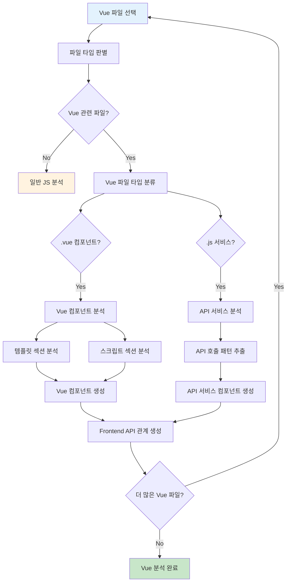
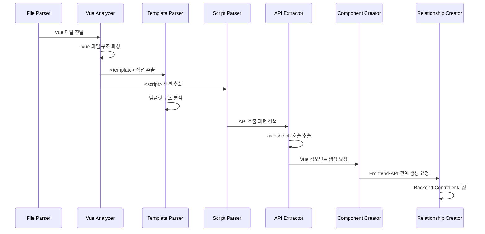
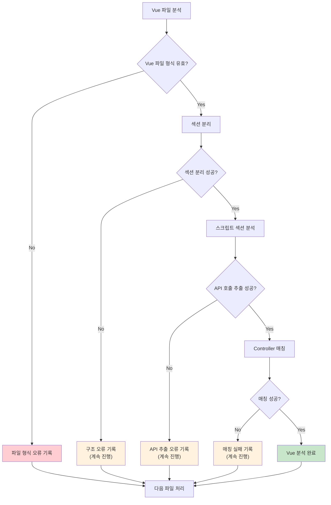

# Vue.js 분석 구현서

## 문서 정보
- **작성일**: 2025-09-20
- **버전**: v1.0
- **목적**: Vue.js 컴포넌트 및 API 서비스 분석, 메타데이터 추출

## 1. Vue.js 분석 개요

### 1.1 분석 목적
- Vue.js 컴포넌트 구조 분석
- API 호출 패턴 추출 (axios, fetch 등)
- Vue 서비스 모듈 분석
- Frontend → Backend 연결 관계 구축
- 프론트엔드에서 테이블까지 완전한 추적 체인 완성

### 1.2 처리 대상 파일
```
대상 파일: *.vue, *.js (Vue 관련)
위치: src/main/webapp/vue/, src/main/resources/static/vue/
패턴: 
  - **/*.vue (Vue 컴포넌트)
  - **/services/*.js (API 서비스 모듈)
  - **/components/*.vue (Vue 컴포넌트)
  - **/*ApiService.js (API 서비스)
```

### 1.3 지원하는 Vue.js 기술 스택
```
Vue.js 버전:
- Vue.js 2.x (주요)
- Vue.js 3.x (호환)

HTTP 클라이언트:
- Axios (주요)
- Fetch API
- jQuery Ajax (레거시)

Vue 생태계:
- Vue Router (라우팅)
- Vuex (상태 관리)
- Vue CLI (빌드 도구)
```

## 2. Vue.js 분석 플로우

### 2.1 전체 처리 플로우



### 2.2 Vue 컴포넌트 분석 시퀀스



## 3. Vue 컴포넌트 분석

### 3.1 Vue 파일 구조 파싱

```python
class VueComponentInfo:
    """Vue 컴포넌트 정보 구조체"""
    
    def __init__(self):
        self.component_name: str = ""           # JpaUserManagement
        self.template_section: str = ""         # <template> 내용
        self.script_section: str = ""           # <script> 내용
        self.style_section: str = ""            # <style> 내용 (분석 제외)
        self.data_properties: List[str] = []    # data() 속성들
        self.methods: List[dict] = []           # methods 함수들
        self.computed: List[str] = []           # computed 속성들
        self.components: List[str] = []         # 사용하는 하위 컴포넌트들
        self.api_calls: List[dict] = []         # API 호출들
        self.line_start: int = 0
        self.line_end: int = 0

def parse_vue_file_structure(vue_content: str) -> VueComponentInfo:
    """Vue 파일 구조 파싱"""
    
    component_info = VueComponentInfo()
    
    # 1. Vue 파일 섹션 분리
    sections = split_vue_file_sections(vue_content)
    component_info.template_section = sections.get('template', '')
    component_info.script_section = sections.get('script', '')
    component_info.style_section = sections.get('style', '')
    
    # 2. 컴포넌트명 추출 (파일명 기반)
    component_info.component_name = extract_vue_component_name(vue_content)
    
    # 3. 스크립트 섹션 분석
    if component_info.script_section:
        script_analysis = analyze_vue_script_section(component_info.script_section)
        component_info.data_properties = script_analysis['data_properties']
        component_info.methods = script_analysis['methods']
        component_info.computed = script_analysis['computed']
        component_info.components = script_analysis['components']
        component_info.api_calls = script_analysis['api_calls']
    
    return component_info

def split_vue_file_sections(vue_content: str) -> dict:
    """Vue 파일을 섹션별로 분리"""
    
    sections = {}
    
    # <template> 섹션 추출
    template_pattern = r'<template[^>]*>(.*?)</template>'
    template_match = re.search(template_pattern, vue_content, re.DOTALL | re.IGNORECASE)
    if template_match:
        sections['template'] = template_match.group(1).strip()
    
    # <script> 섹션 추출
    script_pattern = r'<script[^>]*>(.*?)</script>'
    script_match = re.search(script_pattern, vue_content, re.DOTALL | re.IGNORECASE)
    if script_match:
        sections['script'] = script_match.group(1).strip()
    
    # <style> 섹션 추출 (분석하지 않지만 구조 파악용)
    style_pattern = r'<style[^>]*>(.*?)</style>'
    style_match = re.search(style_pattern, vue_content, re.DOTALL | re.IGNORECASE)
    if style_match:
        sections['style'] = style_match.group(1).strip()
    
    return sections

def analyze_vue_script_section(script_content: str) -> dict:
    """Vue 스크립트 섹션 분석"""
    
    analysis = {
        'data_properties': [],
        'methods': [],
        'computed': [],
        'components': [],
        'api_calls': []
    }
    
    # 1. import 문 분석
    imports = extract_vue_imports(script_content)
    analysis['components'] = [imp['name'] for imp in imports if imp['type'] == 'component']
    
    # 2. data() 함수 분석
    analysis['data_properties'] = extract_vue_data_properties(script_content)
    
    # 3. methods 분석
    analysis['methods'] = extract_vue_methods(script_content)
    
    # 4. computed 속성 분석
    analysis['computed'] = extract_vue_computed_properties(script_content)
    
    # 5. API 호출 패턴 추출
    analysis['api_calls'] = extract_vue_api_calls(script_content)
    
    return analysis
```

### 3.2 Vue API 호출 패턴 추출

```python
def extract_vue_api_calls(script_content: str) -> List[dict]:
    """Vue 스크립트에서 API 호출 패턴 추출"""
    
    api_calls = []
    
    # 1. axios 호출 패턴들
    axios_patterns = [
        # axios.get('/api/users')
        (r'axios\.get\s*\(\s*["\']([^"\']+)["\']', 'GET'),
        # axios.post('/api/users', data)
        (r'axios\.post\s*\(\s*["\']([^"\']+)["\']', 'POST'),
        # axios.put('/api/users/123', data)
        (r'axios\.put\s*\(\s*["\']([^"\']+)["\']', 'PUT'),
        # axios.delete('/api/users/123')
        (r'axios\.delete\s*\(\s*["\']([^"\']+)["\']', 'DELETE'),
        # axios({ url: '/api/users', method: 'GET' })
        (r'axios\s*\(\s*\{[^}]*url\s*:\s*["\']([^"\']+)["\'][^}]*method\s*:\s*["\'](\w+)["\']', 'DYNAMIC')
    ]
    
    for pattern, default_method in axios_patterns:
        matches = re.finditer(pattern, script_content, re.IGNORECASE | re.DOTALL)
        
        for match in matches:
            if default_method == 'DYNAMIC':
                url = match.group(1)
                method = match.group(2).upper()
            else:
                url = match.group(1)
                method = default_method
            
            # URL 템플릿 변수 처리
            normalized_url = normalize_vue_api_url(url)
            
            api_call = {
                'type': 'AXIOS_CALL',
                'url': normalized_url,
                'original_url': url,
                'method': method,
                'line': get_line_number(script_content, match.start()),
                'context': extract_method_context(script_content, match.start())
            }
            
            api_calls.append(api_call)
    
    # 2. fetch API 패턴들
    fetch_patterns = [
        # fetch('/api/users')
        r'fetch\s*\(\s*["\']([^"\']+)["\'](?:\s*,\s*\{[^}]*method\s*:\s*["\'](\w+)["\'])?',
        # fetch('/api/users', { method: 'POST' })
        r'fetch\s*\(\s*["\']([^"\']+)["\'](?:\s*,\s*\{[^}]*\})?'
    ]
    
    for pattern in fetch_patterns:
        matches = re.finditer(pattern, script_content, re.IGNORECASE | re.DOTALL)
        
        for match in matches:
            url = match.group(1)
            method = match.group(2).upper() if match.group(2) else 'GET'
            
            api_call = {
                'type': 'FETCH_API',
                'url': normalize_vue_api_url(url),
                'original_url': url,
                'method': method,
                'line': get_line_number(script_content, match.start()),
                'context': extract_method_context(script_content, match.start())
            }
            
            api_calls.append(api_call)
    
    # 3. API 서비스 호출 패턴들
    service_call_patterns = [
        # UserApiService.getAllUsers()
        r'(\w+ApiService)\.(\w+)\s*\(',
        # this.$api.users.getAll()
        r'this\.\$api\.(\w+)\.(\w+)\s*\('
    ]
    
    for pattern in service_call_patterns:
        matches = re.finditer(pattern, script_content, re.IGNORECASE)
        
        for match in matches:
            service_name = match.group(1)
            method_name = match.group(2)
            
            # API 서비스 메서드에서 실제 API URL 추론
            inferred_api = infer_api_from_service_call(service_name, method_name)
            
            if inferred_api:
                api_call = {
                    'type': 'SERVICE_CALL',
                    'url': inferred_api['url'],
                    'method': inferred_api['method'],
                    'service_name': service_name,
                    'service_method': method_name,
                    'line': get_line_number(script_content, match.start()),
                    'context': extract_method_context(script_content, match.start())
                }
                
                api_calls.append(api_call)
    
    return api_calls

def normalize_vue_api_url(raw_url: str) -> str:
    """Vue API URL 정규화"""
    
    # 1. Vue 템플릿 변수 제거 (${variable})
    url = re.sub(r'\$\{[^}]+\}', '*', raw_url)
    
    # 2. 백틱 템플릿 리터럴 처리 (`/api/users/${id}`)
    url = re.sub(r'\$\{[^}]+\}', '*', url)
    
    # 3. Vue 변수 보간 제거 ({{variable}})
    url = re.sub(r'\{\{[^}]+\}\}', '*', url)
    
    # 4. 경로 변수 정규화
    url = re.sub(r'/\d+(?=/|$)', '/*', url)
    
    # 5. 최종 정리
    url = url.strip().rstrip('/')
    if not url.startswith('/'):
        url = '/' + url
    
    return url

def infer_api_from_service_call(service_name: str, method_name: str) -> dict:
    """API 서비스 호출에서 실제 API 추론"""
    
    # API 서비스 메서드명 → API URL 매핑 규칙
    api_mapping_rules = {
        'UserApiService': {
            'getAllUsers': {'url': '/api/jpa/users', 'method': 'GET'},
            'getUserById': {'url': '/api/jpa/users/*', 'method': 'GET'},
            'createUser': {'url': '/api/jpa/users', 'method': 'POST'},
            'updateUser': {'url': '/api/jpa/users/*', 'method': 'PUT'},
            'deleteUser': {'url': '/api/jpa/users/*', 'method': 'DELETE'},
            'searchUsersByUsername': {'url': '/api/jpa/users/search/username', 'method': 'GET'},
            'getUsersByStatus': {'url': '/api/jpa/users/by-status/*', 'method': 'GET'}
        },
        'ProductApiService': {
            'getAllProducts': {'url': '/api/jpa/products', 'method': 'GET'},
            'getProductById': {'url': '/api/jpa/products/*', 'method': 'GET'},
            'createProduct': {'url': '/api/jpa/products', 'method': 'POST'},
            'updateProduct': {'url': '/api/jpa/products/*', 'method': 'PUT'},
            'deleteProduct': {'url': '/api/jpa/products/*', 'method': 'DELETE'},
            'searchProductsByName': {'url': '/api/jpa/products/search/name', 'method': 'GET'},
            'getProductsByStatus': {'url': '/api/jpa/products/by-status/*', 'method': 'GET'}
        },
        'OrderApiService': {
            'getAllOrders': {'url': '/api/jpa/orders', 'method': 'GET'},
            'getOrderById': {'url': '/api/jpa/orders/*', 'method': 'GET'},
            'createOrder': {'url': '/api/jpa/orders', 'method': 'POST'},
            'updateOrder': {'url': '/api/jpa/orders/*', 'method': 'PUT'},
            'deleteOrder': {'url': '/api/jpa/orders/*', 'method': 'DELETE'}
        }
    }
    
    if service_name in api_mapping_rules:
        service_methods = api_mapping_rules[service_name]
        if method_name in service_methods:
            return service_methods[method_name]
    
    # 규칙에 없는 경우 패턴 기반 추론
    return infer_api_by_pattern(service_name, method_name)

def infer_api_by_pattern(service_name: str, method_name: str) -> dict:
    """패턴 기반 API 추론"""
    
    # 서비스명에서 리소스명 추출
    resource = service_name.replace('ApiService', '').lower()
    if resource.endswith('s'):
        resource = resource[:-1]  # users -> user
    
    # 메서드명 패턴 분석
    if method_name.startswith('getAll'):
        return {'url': f'/api/jpa/{resource}s', 'method': 'GET'}
    elif method_name.startswith('get') and 'ById' in method_name:
        return {'url': f'/api/jpa/{resource}s/*', 'method': 'GET'}
    elif method_name.startswith('create'):
        return {'url': f'/api/jpa/{resource}s', 'method': 'POST'}
    elif method_name.startswith('update'):
        return {'url': f'/api/jpa/{resource}s/*', 'method': 'PUT'}
    elif method_name.startswith('delete'):
        return {'url': f'/api/jpa/{resource}s/*', 'method': 'DELETE'}
    elif method_name.startswith('search'):
        search_type = method_name.replace('search', '').replace('By', '').lower()
        return {'url': f'/api/jpa/{resource}s/search/{search_type}', 'method': 'GET'}
    
    # 기본값
    return {'url': f'/api/jpa/{resource}s', 'method': 'GET'}
```

## 4. API 서비스 모듈 분석

### 4.1 API 서비스 정보 추출

```python
class VueApiServiceInfo:
    """Vue API 서비스 정보 구조체"""
    
    def __init__(self):
        self.service_name: str = ""             # UserApiService
        self.base_url: str = ""                 # /api/jpa
        self.api_methods: List[dict] = []       # API 메서드들
        self.axios_config: dict = {}            # axios 설정
        self.interceptors: List[dict] = []      # 인터셉터들
        self.exports: List[str] = []            # export 목록

def analyze_vue_api_service(js_content: str, file_path: str) -> VueApiServiceInfo:
    """Vue API 서비스 분석"""
    
    service_info = VueApiServiceInfo()
    
    # 1. 서비스명 추출 (파일명 기반)
    service_info.service_name = extract_service_name_from_path(file_path)
    
    # 2. axios 기본 설정 추출
    service_info.axios_config = extract_axios_config(js_content)
    service_info.base_url = service_info.axios_config.get('baseURL', '')
    
    # 3. API 메서드들 추출
    service_info.api_methods = extract_api_service_methods(js_content)
    
    # 4. 인터셉터 분석
    service_info.interceptors = extract_axios_interceptors(js_content)
    
    # 5. export 분석
    service_info.exports = extract_service_exports(js_content)
    
    return service_info

def extract_api_service_methods(js_content: str) -> List[dict]:
    """API 서비스 메서드 추출"""
    
    api_methods = []
    
    # API 메서드 패턴들
    method_patterns = [
        # getAllUsers() { return apiClient.get('/users') }
        r'(\w+)\s*\(\s*([^)]*)\s*\)\s*\{\s*return\s+apiClient\.(\w+)\s*\(\s*["\']([^"\']+)["\']',
        # getUserById(id) { return apiClient.get(`/users/${id}`) }
        r'(\w+)\s*\(\s*([^)]*)\s*\)\s*\{\s*return\s+apiClient\.(\w+)\s*\(\s*`([^`]+)`',
        # createUser(data) { return apiClient.post('/users', data) }
        r'(\w+)\s*\(\s*([^)]*)\s*\)\s*\{\s*return\s+apiClient\.(\w+)\s*\(\s*["\']([^"\']+)["\'][^}]*\}'
    ]
    
    for pattern in method_patterns:
        matches = re.finditer(pattern, js_content, re.IGNORECASE | re.DOTALL)
        
        for match in matches:
            method_name = match.group(1)
            parameters = match.group(2)
            http_method = match.group(3).upper()
            api_url = match.group(4)
            
            # URL 템플릿 변수 정규화
            normalized_url = normalize_api_service_url(api_url)
            
            api_method = {
                'method_name': method_name,
                'parameters': parse_js_parameters(parameters),
                'http_method': http_method,
                'api_url': normalized_url,
                'original_url': api_url,
                'line': get_line_number(js_content, match.start())
            }
            
            api_methods.append(api_method)
    
    return api_methods

def normalize_api_service_url(api_url: str) -> str:
    """API 서비스 URL 정규화"""
    
    # 1. 템플릿 리터럴 변수 처리 (${id} -> *)
    url = re.sub(r'\$\{[^}]+\}', '*', api_url)
    
    # 2. 경로 변수 패턴 처리
    url = re.sub(r'/:\w+', '/*', url)
    
    # 3. 최종 정리
    url = url.strip().rstrip('/')
    if not url.startswith('/'):
        url = '/' + url
    
    return url
```

## 5. Vue 컴포넌트 생성

### 5.1 Vue 컴포넌트 메타데이터 생성 (기존 로직 준수)

```python
def process_vue_file(vue_file_path: str, project_id: int) -> None:
    """Vue 파일 처리 (기존 JSP 방식과 동일)"""
    
    # 1. Vue 파일은 files 테이블에만 저장 (components 테이블에는 저장 안함)
    # 기존 JSP 파일 처리 방식과 동일
    vue_file_id = get_file_id_from_files_table(vue_file_path, project_id)
    
    if not vue_file_id:
        app_logger.warning(f"Vue 파일이 files 테이블에 없음: {vue_file_path}")
        return
    
    # 2. Vue 파일에서 API 호출 패턴 추출
    with open(vue_file_path, 'r', encoding='utf-8') as f:
        vue_content = f.read()
    
    component_info = parse_vue_file_structure(vue_content)
    
    # 3. API 호출들에 대해 API_URL 컴포넌트 생성 (기존 backend_entry_loading.py 방식)
    for api_call in component_info.api_calls:
        create_api_url_component_for_vue(api_call, vue_file_id, project_id)

def create_api_url_component_for_vue(api_call: dict, vue_file_id: int, project_id: int) -> int:
    """Vue 파일에서 호출하는 API에 대한 API_URL 컴포넌트 생성"""
    
    # 1. API_URL 컴포넌트명 생성 (기존 방식과 동일)
    component_name = f"{api_call['url']}:{api_call['method']}"
    
    # 2. 기존 API_URL 컴포넌트 검색
    existing_component = find_existing_api_url_component(
        project_id, api_call['url'], api_call['method']
    )
    
    if existing_component:
        app_logger.debug(f"기존 API_URL 컴포넌트 사용: {component_name}")
        return existing_component.component_id
    
    # 3. 새 API_URL 컴포넌트 생성 (file_id = vue_file_id)
    component_data = {
        'project_id': project_id,
        'file_id': vue_file_id,  # Vue 파일의 file_id 사용 (중요!)
        'component_name': component_name,
        'component_type': 'API_URL',
        'layer': 'API_ENTRY',
        'line_start': api_call.get('line', 1),
        'line_end': api_call.get('line', 1),
        'api_url': api_call['url'],
        'call_method': api_call['method'],
        'description': f"Vue component API call: {api_call['method']} {api_call['url']}",
        'hash_value': generate_hash(f"{component_name}_{vue_file_id}"),
        'del_yn': 'N'
    }
    
    component_id = insert_component(component_data)
    
    # 4. API_URL → METHOD 관계 생성 (Controller 메서드와 연결)
    create_api_url_to_method_relationship(component_id, api_call, project_id)
    
    app_logger.debug(f"Vue API_URL 컴포넌트 생성: {component_name} (file_id: {vue_file_id})")
    return component_id

def create_api_url_to_method_relationship(api_url_component_id: int, api_call: dict, project_id: int) -> None:
    """API_URL 컴포넌트와 Controller METHOD 컴포넌트 간 관계 생성"""
    
    # Controller 메서드 검색 (JPA Controller 포함)
    controller_method_query = """
    SELECT c.component_id, c.component_name, c.class_name, c.method_name
    FROM components c
    WHERE c.project_id = ?
      AND c.component_type = 'METHOD'
      AND c.layer = 'CONTROLLER'
      AND (c.class_name LIKE '%Controller' OR c.class_name LIKE '%RestController')
      AND c.del_yn = 'N'
    """
    
    controller_methods = execute_query(controller_method_query, [project_id])
    
    for method in controller_methods:
        # URL 패턴 매칭 (JPA REST API 포함)
        if is_vue_api_method_match(api_call['url'], api_call['method'], method):
            # API_URL → METHOD 관계 생성
            relationship_data = {
                'src_id': api_url_component_id,  # API_URL 컴포넌트
                'dst_id': method['component_id'], # Controller METHOD 컴포넌트
                'rel_type': 'CALLS_METHOD',
                'description': f"Vue API {api_call['method']} {api_call['url']} calls {method['class_name']}.{method['method_name']}",
                'api_url': api_call['url'],
                'http_method': api_call['method'],
                'call_context': api_call.get('context', '')
            }
            
            create_relationship_if_not_exists(relationship_data)
            app_logger.debug(f"Vue API_URL-METHOD 관계 생성: {api_call['url']}:{api_call['method']} → {method['class_name']}.{method['method_name']}")
            break  # 첫 번째 매칭만 사용

def is_vue_api_method_match(api_url: str, http_method: str, controller_method: dict) -> bool:
    """Vue API 호출과 Controller 메서드 매칭 여부 확인"""
    
    # JPA REST API 패턴 매칭
    jpa_api_patterns = {
        '/api/jpa/users': ['JpaUserController', 'UserController'],
        '/api/jpa/products': ['JpaProductController', 'ProductController'],
        '/api/jpa/orders': ['JpaOrderController', 'OrderController']
    }
    
    # 1. JPA API 패턴 확인
    for pattern, controller_classes in jpa_api_patterns.items():
        if api_url.startswith(pattern):
            if controller_method['class_name'] in controller_classes:
                # HTTP 메서드와 Controller 메서드명 매칭 확인
                return is_http_method_match(http_method, controller_method['method_name'])
    
    # 2. 일반 API 패턴 확인 (기존 로직)
    return is_general_api_method_match(api_url, http_method, controller_method)

def is_http_method_match(http_method: str, controller_method_name: str) -> bool:
    """HTTP 메서드와 Controller 메서드명 매칭"""
    
    method_patterns = {
        'GET': ['get', 'find', 'search', 'list', 'show', 'view'],
        'POST': ['create', 'add', 'insert', 'save', 'register'],
        'PUT': ['update', 'modify', 'edit', 'change'],
        'DELETE': ['delete', 'remove', 'destroy']
    }
    
    if http_method in method_patterns:
        patterns = method_patterns[http_method]
        method_lower = controller_method_name.lower()
        return any(pattern in method_lower for pattern in patterns)
    
    return False

def create_vue_api_service_component(service_info: VueApiServiceInfo,
                                    project_id: int, file_id: int) -> int:
    """Vue API 서비스 컴포넌트 생성"""
    
    # 1. API 서비스 컴포넌트 생성
    service_component_data = {
        'project_id': project_id,
        'file_id': file_id,
        'component_name': service_info.service_name,
        'component_type': 'FRONTEND',
        'layer': 'FRONTEND',
        'description': f"Vue API Service: {service_info.service_name}",
        'frontend_type': 'API_SERVICE',
        'base_url': service_info.base_url,
        'method_count': len(service_info.api_methods)
    }
    
    service_component_id = insert_component(service_component_data)
    
    # 2. API 메서드들 생성
    for api_method in service_info.api_methods:
        create_api_service_method_component(api_method, service_component_id, project_id, file_id)
    
    return service_component_id

def create_vue_api_relationship(vue_component_id: int, api_call: dict, project_id: int) -> None:
    """Vue 컴포넌트 → API 관계 생성"""
    
    # 1. API 엔드포인트 컴포넌트 검색/생성
    api_component = find_or_create_api_endpoint_component(
        project_id, api_call['url'], api_call['method']
    )
    
    # 2. Vue Component → API 관계 생성
    relationship_data = {
        'src_id': vue_component_id,
        'dst_id': api_component.component_id,
        'rel_type': 'CALLS_API',
        'description': f"Vue component calls {api_call['method']} {api_call['url']}",
        'api_url': api_call['url'],
        'http_method': api_call['method'],
        'call_context': api_call.get('context', ''),
        'line_number': api_call.get('line', 0)
    }
    
    create_relationship_if_not_exists(relationship_data)
    
    # 3. API → Backend Controller 매칭
    controller_method = match_api_to_controller(api_call['url'], api_call['method'], project_id)
    if controller_method:
        create_api_controller_relationship(api_component.component_id, controller_method)
```

## 6. Vue-Backend 연결 구조

### 6.1 Vue → JPA 완전 연결 구조 (메타DB 저장 방식)

```mermaid
graph TD
    subgraph "files 테이블"
        F1[JpaUserManagement.vue<br/>file_id: 101]
        F2[UserApiService.js<br/>file_id: 102]
        F3[JpaUserController.java<br/>file_id: 103]
    end
    
    subgraph "components 테이블"
        A1[/api/jpa/users:GET<br/>API_URL<br/>file_id: 101]
        A2[/api/jpa/users:POST<br/>API_URL<br/>file_id: 101]
        
        C1[getAllUsers<br/>METHOD<br/>file_id: 103]
        C2[createUser<br/>METHOD<br/>file_id: 103]
        
        R1[findAll<br/>METHOD<br/>file_id: 104]
        R2[save<br/>METHOD<br/>file_id: 104]
        
        Q1[JPA_AUTO_findAll<br/>SQL_SELECT<br/>file_id: 104]
        Q2[JPA_AUTO_save<br/>SQL_INSERT<br/>file_id: 104]
        
        T1[USERS<br/>TABLE]
    end
    
    subgraph "relationships 테이블"
        REL1[src_id: A1, dst_id: C1<br/>CALLS_METHOD]
        REL2[src_id: A2, dst_id: C2<br/>CALLS_METHOD]
        REL3[src_id: C1, dst_id: R1<br/>CALLS_METHOD]
        REL4[src_id: C2, dst_id: R2<br/>CALLS_METHOD]
        REL5[src_id: R1, dst_id: Q1<br/>CALLS_QUERY]
        REL6[src_id: R2, dst_id: Q2<br/>CALLS_QUERY]
        REL7[src_id: Q1, dst_id: T1<br/>USES_TABLE]
        REL8[src_id: Q2, dst_id: T1<br/>USES_TABLE]
    end
    
    F1 -.-> A1
    F1 -.-> A2
    F3 -.-> C1
    F3 -.-> C2
    
    A1 --> C1
    A2 --> C2
    C1 --> R1
    C2 --> R2
    R1 --> Q1
    R2 --> Q2
    Q1 --> T1
    Q2 --> T1
    
    style F1 fill:#e3f2fd
    style A1 fill:#f3e5f5
    style A2 fill:#f3e5f5
    style C1 fill:#fff3e0
    style C2 fill:#fff3e0
    style Q1 fill:#e8f5e8
    style Q2 fill:#e8f5e8
    style T1 fill:#ffcc80
```

### 6.2 메타DB 저장 구조 상세

```python
# 1. Vue 파일 저장 (files 테이블)
vue_file_data = {
    'file_id': 101,
    'project_id': 1,
    'file_name': 'JpaUserManagement.vue',
    'file_path': 'src/main/webapp/vue/components/JpaUserManagement.vue',
    'file_type': 'vue',
    'file_size': 15420,
    'hash_value': 'abc123...'
}

# 2. API_URL 컴포넌트 저장 (components 테이블)
api_url_component = {
    'component_id': 201,
    'project_id': 1,
    'file_id': 101,  # Vue 파일의 file_id
    'component_name': '/api/jpa/users:GET',
    'component_type': 'API_URL',
    'layer': 'API_ENTRY',
    'api_url': '/api/jpa/users',
    'call_method': 'GET'
}

# 3. JPA Repository 쿼리 저장 (components 테이블)
jpa_query_component = {
    'component_id': 301,
    'project_id': 1,
    'file_id': 104,  # UserRepository.java file_id
    'component_name': 'JPA_AUTO_findAll',
    'component_type': 'SQL_SELECT',
    'layer': 'QUERY',
    'sql_content': 'SELECT e FROM User e',
    'method_name': 'findAll',
    'is_jpa_generated': True
}

# 4. API_URL → METHOD 관계 (relationships 테이블)
api_method_relationship = {
    'src_id': 201,  # API_URL 컴포넌트
    'dst_id': 202,  # Controller METHOD 컴포넌트
    'rel_type': 'CALLS_METHOD',
    'description': 'Vue API GET /api/jpa/users calls JpaUserController.getAllUsers',
    'api_url': '/api/jpa/users',
    'http_method': 'GET'
}

# 5. JPA Entity 조인관계 (relationships 테이블)
jpa_join_relationship = {
    'src_id': 401,  # USERS 테이블 컴포넌트 (1쪽)
    'dst_id': 402,  # ORDERS 테이블 컴포넌트 (N쪽)
    'rel_type': 'JOINS_WITH',
    'description': 'JPA OneToMany: USERS.USER_ID = ORDERS.USER_ID',
    'join_condition': 'USERS.USER_ID = ORDERS.USER_ID',
    'relationship_type': 'OneToMany',
    'join_column': 'USER_ID'
}
```

### 6.2 Vue 기반 영향평가 체인

```python
def trace_vue_impact_chain(change_target: str, project_id: int) -> List[dict]:
    """Vue 기반 영향평가 체인 추적"""
    
    impact_chains = []
    
    # 1. 변경 대상이 테이블인 경우
    if change_target.startswith('TABLE:'):
        table_name = change_target.replace('TABLE:', '')
        
        # 테이블 → JPA Entity → Repository → Service → Controller → API → Vue
        chains = trace_table_to_vue_chain(table_name, project_id)
        impact_chains.extend(chains)
    
    # 2. 변경 대상이 API인 경우
    elif change_target.startswith('API:'):
        api_endpoint = change_target.replace('API:', '')
        
        # API → Vue Component 역추적
        chains = trace_api_to_vue_chain(api_endpoint, project_id)
        impact_chains.extend(chains)
    
    return impact_chains

def trace_table_to_vue_chain(table_name: str, project_id: int) -> List[dict]:
    """테이블에서 Vue 컴포넌트까지 역추적"""
    
    chains = []
    
    # 1. Table → JPA Entity
    entities = find_entities_using_table(table_name, project_id)
    
    for entity in entities:
        # 2. Entity → Repository
        repositories = find_repositories_for_entity(entity.component_id, project_id)
        
        for repository in repositories:
            # 3. Repository → Service
            services = find_services_using_repository(repository.component_id, project_id)
            
            for service in services:
                # 4. Service → Controller
                controllers = find_controllers_using_service(service.component_id, project_id)
                
                for controller in controllers:
                    # 5. Controller → API
                    apis = find_apis_for_controller(controller.component_id, project_id)
                    
                    for api in apis:
                        # 6. API → Vue Component
                        vue_components = find_vue_components_calling_api(api.component_id, project_id)
                        
                        for vue_component in vue_components:
                            chain = {
                                'table': table_name,
                                'entity': entity.component_name,
                                'repository': repository.component_name,
                                'service': service.component_name,
                                'controller': controller.component_name,
                                'api': f"{api.call_method} {api.api_url}",
                                'vue_component': vue_component.component_name,
                                'chain_length': 7,
                                'impact_level': 'HIGH'
                            }
                            
                            chains.append(chain)
    
    return chains
```

## 7. Vue 메타데이터 생성 전략

### 7.1 Vue 컴포넌트 메타데이터 구조

```python
VUE_COMPONENT_METADATA = {
    # Vue 컴포넌트
    'VUE_COMPONENT': {
        'component_type': 'FRONTEND',
        'layer': 'FRONTEND',
        'attributes': ['component_name', 'template_section', 'script_section', 'method_count', 'api_call_count']
    },
    
    # Vue API 서비스
    'VUE_API_SERVICE': {
        'component_type': 'FRONTEND',
        'layer': 'FRONTEND',
        'attributes': ['service_name', 'base_url', 'method_count', 'interceptor_count']
    },
    
    # Vue 메서드
    'VUE_METHOD': {
        'component_type': 'METHOD',
        'layer': 'FRONTEND',
        'attributes': ['method_name', 'parameters', 'api_calls', 'async']
    },
    
    # Frontend API 호출
    'FRONTEND_API_CALL': {
        'component_type': 'API_URL',
        'layer': 'API_ENTRY',
        'attributes': ['api_url', 'http_method', 'call_context', 'source_component']
    }
}
```

### 7.2 Vue 관계 타입 정의

```python
VUE_RELATIONSHIP_TYPES = {
    'VUE_CALLS_API': {
        'description': 'Vue 컴포넌트가 API를 호출',
        'direction': 'OUTGOING',
        'source_types': ['FRONTEND'],
        'target_types': ['API_URL']
    },
    
    'VUE_USES_SERVICE': {
        'description': 'Vue 컴포넌트가 API 서비스를 사용',
        'direction': 'OUTGOING', 
        'source_types': ['FRONTEND'],
        'target_types': ['FRONTEND']
    },
    
    'API_SERVICE_CALLS_API': {
        'description': 'API 서비스가 실제 API 엔드포인트를 호출',
        'direction': 'OUTGOING',
        'source_types': ['FRONTEND'],
        'target_types': ['API_URL']
    },
    
    'VUE_IMPORTS_COMPONENT': {
        'description': 'Vue 컴포넌트가 다른 컴포넌트를 import',
        'direction': 'OUTGOING',
        'source_types': ['FRONTEND'],
        'target_types': ['FRONTEND']
    }
}
```

## 8. 에러 처리 및 성능 최적화

### 8.1 Vue 분석 에러 처리



### 8.2 Vue 분석 성능 최적화

```python
class VueAnalysisOptimizer:
    """Vue 분석 성능 최적화"""
    
    def __init__(self):
        # Vue 패턴 컴파일
        self.vue_patterns = {
            'template_section': re.compile(r'<template[^>]*>(.*?)</template>', re.DOTALL | re.IGNORECASE),
            'script_section': re.compile(r'<script[^>]*>(.*?)</script>', re.DOTALL | re.IGNORECASE),
            'axios_get': re.compile(r'axios\.get\s*\(\s*["\']([^"\']+)["\']', re.IGNORECASE),
            'axios_post': re.compile(r'axios\.post\s*\(\s*["\']([^"\']+)["\']', re.IGNORECASE),
            'fetch_call': re.compile(r'fetch\s*\(\s*["\']([^"\']+)["\']', re.IGNORECASE),
            'service_call': re.compile(r'(\w+ApiService)\.(\w+)\s*\(', re.IGNORECASE)
        }
        
        # API 매칭 캐시
        self.api_mapping_cache = {}
        
        # Controller 매칭 캐시
        self.controller_cache = {}
    
    def fast_vue_analysis(self, vue_content: str, file_path: str) -> dict:
        """고속 Vue 분석"""
        
        analysis_result = {
            'is_vue_file': False,
            'vue_type': None,
            'components': [],
            'api_services': [],
            'api_calls': []
        }
        
        # 1. Vue 파일 여부 빠른 확인
        if not self._is_vue_file_fast(vue_content, file_path):
            return analysis_result
        
        analysis_result['is_vue_file'] = True
        
        # 2. Vue 파일 타입 분류
        vue_type = self._classify_vue_type_fast(vue_content, file_path)
        analysis_result['vue_type'] = vue_type
        
        # 3. 타입별 분석 수행
        if vue_type == 'COMPONENT':
            analysis_result['components'] = self._analyze_vue_components_fast(vue_content)
            analysis_result['api_calls'] = self._extract_api_calls_fast(vue_content)
        elif vue_type == 'SERVICE':
            analysis_result['api_services'] = self._analyze_api_services_fast(vue_content)
        
        return analysis_result
    
    def _extract_api_calls_fast(self, vue_content: str) -> List[dict]:
        """고속 API 호출 추출"""
        
        api_calls = []
        
        # 컴파일된 패턴으로 빠른 추출
        for pattern_name, compiled_pattern in self.vue_patterns.items():
            if 'axios' in pattern_name or 'fetch' in pattern_name:
                matches = compiled_pattern.findall(vue_content)
                
                for match in matches:
                    method = pattern_name.split('_')[1].upper() if '_' in pattern_name else 'GET'
                    
                    api_call = {
                        'type': pattern_name.upper(),
                        'url': self._normalize_url_fast(match),
                        'method': method
                    }
                    
                    api_calls.append(api_call)
        
        return api_calls
    
    def _normalize_url_fast(self, raw_url: str) -> str:
        """고속 URL 정규화"""
        
        # 캐시 확인
        if raw_url in self.api_mapping_cache:
            return self.api_mapping_cache[raw_url]
        
        # 정규화 수행
        normalized = normalize_vue_api_url(raw_url)
        
        # 캐시 저장
        self.api_mapping_cache[raw_url] = normalized
        
        return normalized
```

## 9. Vue-JPA 통합 분석

### 9.1 Vue-JPA 연결 검증

```python
def validate_vue_jpa_integration(project_id: int) -> dict:
    """Vue-JPA 통합 연결 검증"""
    
    validation_result = {
        'vue_to_api_connections': 0,
        'api_to_controller_connections': 0,
        'controller_to_jpa_connections': 0,
        'complete_vue_jpa_chains': 0,
        'integration_issues': []
    }
    
    # 1. Vue → API 연결 검증
    vue_components = get_vue_components(project_id)
    for vue_component in vue_components:
        api_connections = get_api_connections_for_vue(vue_component.component_id)
        validation_result['vue_to_api_connections'] += len(api_connections)
        
        # 각 API 연결에 대해 백엔드 연결 확인
        for api_connection in api_connections:
            controller_connection = get_controller_for_api(api_connection.api_url, api_connection.http_method)
            
            if controller_connection:
                validation_result['api_to_controller_connections'] += 1
                
                # Controller → JPA 연결 확인
                jpa_connection = get_jpa_connection_for_controller(controller_connection.component_id)
                
                if jpa_connection:
                    validation_result['controller_to_jpa_connections'] += 1
                    validation_result['complete_vue_jpa_chains'] += 1
                else:
                    validation_result['integration_issues'].append({
                        'type': 'MISSING_JPA_CONNECTION',
                        'vue_component': vue_component.component_name,
                        'api': f"{api_connection.http_method} {api_connection.api_url}",
                        'controller': controller_connection.component_name,
                        'issue': 'Controller does not connect to JPA layer'
                    })
            else:
                validation_result['integration_issues'].append({
                    'type': 'MISSING_CONTROLLER',
                    'vue_component': vue_component.component_name,
                    'api': f"{api_connection.http_method} {api_connection.api_url}",
                    'issue': 'No matching controller found'
                })
    
    return validation_result
```

## 10. Vue 분석 설정 및 패턴

### 10.1 Vue 분석 설정 파일

```yaml
# config/parser/vue_patterns.yaml
vue_analysis:
  enabled: true
  
  # Vue 컴포넌트 패턴
  component_patterns:
    - name: "vue_component"
      pattern: "*.vue"
      description: "Vue.js 단일 파일 컴포넌트"
    
    - name: "vue_management"
      pattern: "*Management.vue"
      description: "관리 화면 Vue 컴포넌트"
  
  # API 호출 패턴
  api_call_patterns:
    - name: "axios_get"
      pattern: "axios\\.get\\s*\\(\\s*[\"']([^\"']+)[\"']"
      method: "GET"
      confidence: 0.95
    
    - name: "axios_post"
      pattern: "axios\\.post\\s*\\(\\s*[\"']([^\"']+)[\"']"
      method: "POST"
      confidence: 0.95
    
    - name: "fetch_api"
      pattern: "fetch\\s*\\(\\s*[\"']([^\"']+)[\"']"
      method: "GET"
      confidence: 0.90
    
    - name: "service_call"
      pattern: "(\\w+ApiService)\\.(\\w+)\\s*\\("
      method: "INFERRED"
      confidence: 0.85
  
  # Vue 서비스 패턴
  service_patterns:
    - name: "api_service"
      pattern: "*ApiService.js"
      description: "Vue API 서비스 모듈"
    
    - name: "service_export"
      pattern: "export\\s+(?:const|default)\\s+(\\w+ApiService)"
      description: "API 서비스 export"
  
  # URL 정규화 규칙
  url_normalization:
    - pattern: "\\$\\{[^}]+\\}"
      replacement: "*"
      description: "템플릿 리터럴 변수"
    
    - pattern: "/\\d+(?=/|$)"
      replacement: "/*"
      description: "숫자 경로 변수"
    
    - pattern: "\\{\\{[^}]+\\}\\}"
      replacement: "*"
      description: "Vue 변수 보간"
  
  # Backend 매칭 규칙
  backend_matching:
    - api_pattern: "/api/jpa/users"
      controller_pattern: "JpaUserController"
      confidence: 0.95
    
    - api_pattern: "/api/jpa/products"
      controller_pattern: "JpaProductController"
      confidence: 0.95
    
    - api_pattern: "/api/jpa/orders"
      controller_pattern: "JpaOrderController"
      confidence: 0.95
```

## 11. 다음 단계

### 11.1 JPA-Vue 통합 테스트
- 프로젝트의 JPA + Vue 샘플 소스 분석 테스트
- Vue → JPA 완전 연결 체인 검증
- 영향평가 시나리오 테스트

### 11.2 성능 최적화
- Vue 파일 분석 성능 튜닝
- API 매칭 알고리즘 최적화
- 메모리 사용량 최적화

### 11.3 확장성 개선
- 다른 프론트엔드 프레임워크 지원 (Angular, Svelte 등)
- TypeScript 지원 강화
- Vue 3 Composition API 지원

---

**작성자**: SourceAnalyzer Team  
**작성일**: 2025-09-20  
**문서 버전**: 1.0  
**이전 문서**: [11_JPA_분석_구현서.md](./11_JPA_분석_구현서.md)  
**다음 문서**: [08_리포트_생성_구현서.md](./08_리포트_생성_구현서.md)
