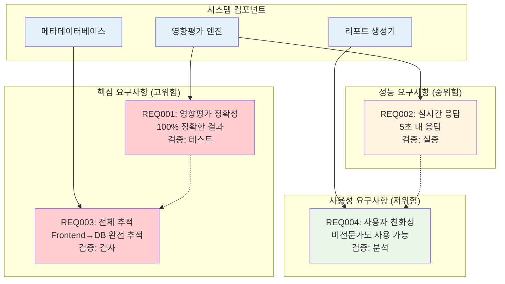
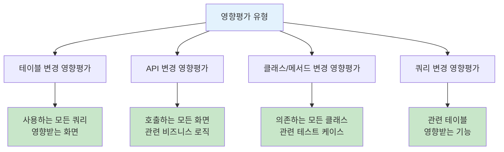
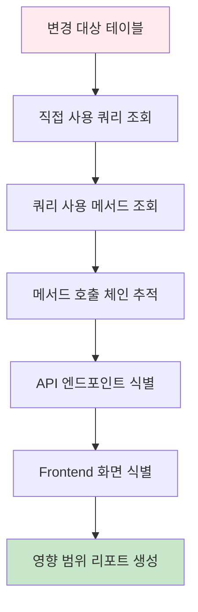
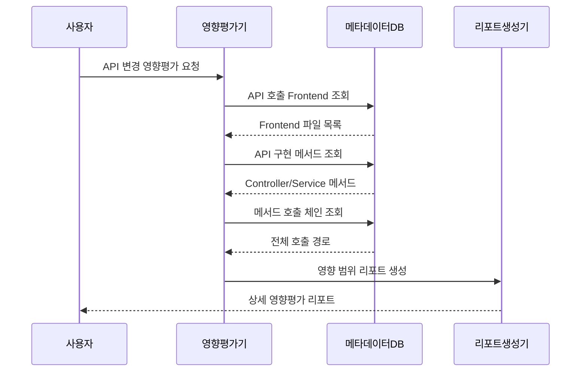
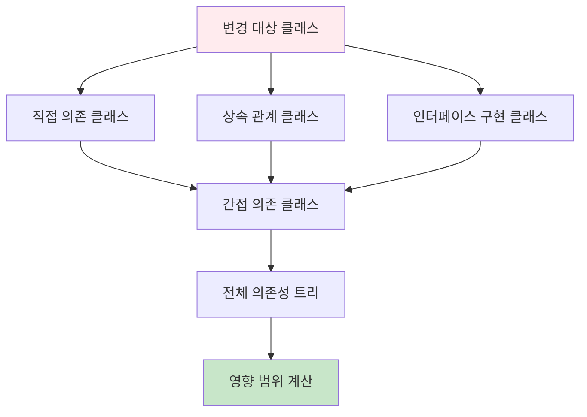
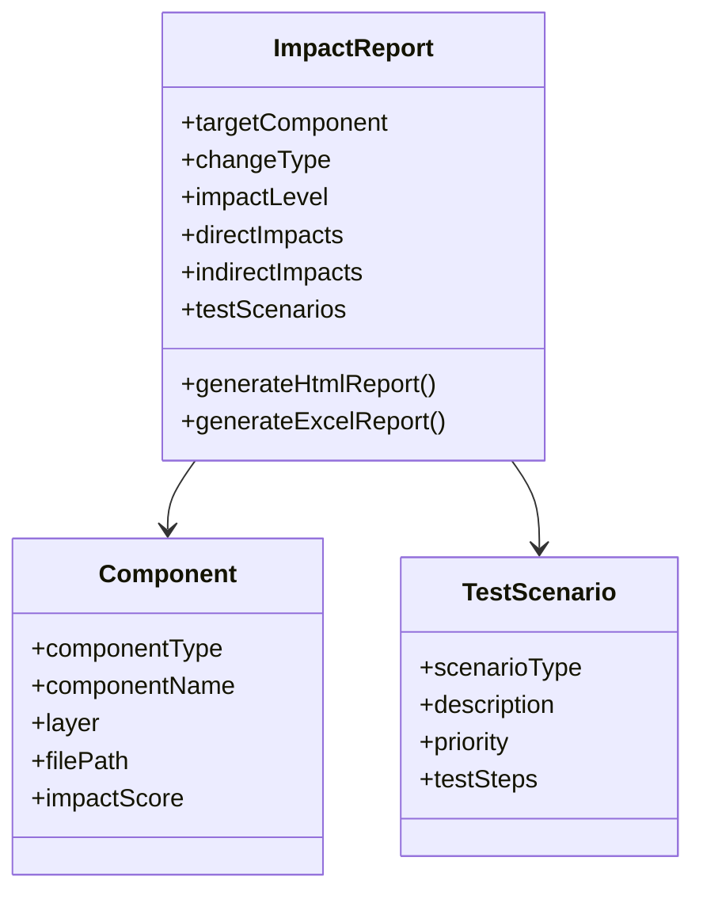
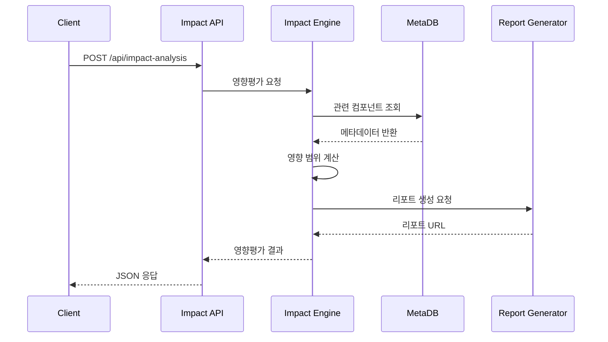

# 영향평가 활용 가이드

## 문서 정보
- **작성일**: 2025-09-19
- **버전**: v1.0
- **목적**: 구축된 메타데이터를 활용한 영향평가 수행 방법

## 영향평가 요구사항



## 1. 영향평가 개요

### 1.1 영향평가 목적
- 변경 사항이 시스템에 미치는 영향 범위 파악
- 테스트 대상 식별 및 우선순위 결정
- 리스크 평가 및 변경 계획 수립

### 1.2 영향평가 유형



## 2. 테이블 변경 영향평가

### 2.1 테이블 영향평가 플로우



### 2.2 테이블 영향평가 구현

```python
def analyze_table_impact(table_name: str, project_id: int) -> dict:
    """테이블 변경 영향평가"""
    
    impact_result = {
        'target_table': table_name,
        'direct_queries': [],
        'affected_methods': [],
        'affected_apis': [],
        'affected_frontends': [],
        'join_related_tables': [],
        'impact_level': 'LOW'
    }
    
    # 1. 직접 사용하는 쿼리 조회
    direct_queries = find_queries_using_table(table_name, project_id)
    impact_result['direct_queries'] = direct_queries
    
    # 2. 쿼리를 호출하는 메서드 조회
    affected_methods = []
    for query in direct_queries:
        methods = find_methods_calling_query(query['component_id'], project_id)
        affected_methods.extend(methods)
    impact_result['affected_methods'] = affected_methods
    
    # 3. 메서드 호출 체인을 통한 API 추적
    affected_apis = []
    for method in affected_methods:
        apis = trace_method_to_apis(method['component_id'], project_id)
        affected_apis.extend(apis)
    impact_result['affected_apis'] = affected_apis
    
    # 4. API를 호출하는 Frontend 조회
    affected_frontends = []
    for api in affected_apis:
        frontends = find_frontends_calling_api(api['component_id'], project_id)
        affected_frontends.extend(frontends)
    impact_result['affected_frontends'] = affected_frontends
    
    # 5. 조인 관계 테이블 조회
    join_tables = find_join_related_tables(table_name, project_id)
    impact_result['join_related_tables'] = join_tables
    
    # 6. 영향 수준 결정
    impact_result['impact_level'] = determine_impact_level(impact_result)
    
    return impact_result

def find_queries_using_table(table_name: str, project_id: int) -> List[dict]:
    """테이블을 사용하는 쿼리 조회"""
    
    query = """
    SELECT DISTINCT 
        q.component_id,
        q.component_name,
        q.component_type,
        q.layer,
        f.file_name,
        f.file_path
    FROM components q
    INNER JOIN relationships r ON q.component_id = r.src_id
    INNER JOIN components t ON r.dst_id = t.component_id
    INNER JOIN files f ON q.file_id = f.file_id
    WHERE q.project_id = ?
      AND q.component_type IN ('SQL_SELECT', 'SQL_INSERT', 'SQL_UPDATE', 'SQL_DELETE', 'QUERY')
      AND r.rel_type = 'USE_TABLE'
      AND t.component_type = 'TABLE'
      AND UPPER(t.component_name) = UPPER(?)
      AND q.del_yn = 'N'
      AND r.del_yn = 'N'
      AND t.del_yn = 'N'
    ORDER BY q.component_name
    """
    
    return execute_query(query, [project_id, table_name])
```

### 2.3 영향 수준 결정

```python
def determine_impact_level(impact_result: dict) -> str:
    """영향 수준 결정"""
    
    # 영향받는 컴포넌트 수 계산
    query_count = len(impact_result['direct_queries'])
    method_count = len(impact_result['affected_methods'])
    api_count = len(impact_result['affected_apis'])
    frontend_count = len(impact_result['affected_frontends'])
    join_table_count = len(impact_result['join_related_tables'])
    
    total_impact_score = (
        query_count * 1 +
        method_count * 2 +
        api_count * 3 +
        frontend_count * 4 +
        join_table_count * 2
    )
    
    # 영향 수준 분류
    if total_impact_score >= 50:
        return 'CRITICAL'
    elif total_impact_score >= 20:
        return 'HIGH'
    elif total_impact_score >= 5:
        return 'MEDIUM'
    else:
        return 'LOW'
```

## 3. API 변경 영향평가

### 3.1 API 영향평가 시퀀스



### 3.2 API 영향평가 구현

```python
def analyze_api_impact(api_url: str, http_method: str, project_id: int) -> dict:
    """API 변경 영향평가"""
    
    impact_result = {
        'target_api': f"{http_method} {api_url}",
        'calling_frontends': [],
        'implementation_chain': [],
        'affected_tables': [],
        'related_apis': [],
        'test_scenarios': []
    }
    
    # 1. API 컴포넌트 조회
    api_component = find_api_component(api_url, http_method, project_id)
    if not api_component:
        impact_result['error'] = 'API not found'
        return impact_result
    
    # 2. API를 호출하는 Frontend 조회
    calling_frontends = find_frontends_calling_api(
        api_component['component_id'], project_id
    )
    impact_result['calling_frontends'] = calling_frontends
    
    # 3. API 구현 체인 추적 (Controller -> Service -> Repository)
    implementation_chain = trace_api_implementation_chain(
        api_component['component_id'], project_id
    )
    impact_result['implementation_chain'] = implementation_chain
    
    # 4. 영향받는 테이블 조회
    affected_tables = find_tables_in_implementation_chain(
        implementation_chain, project_id
    )
    impact_result['affected_tables'] = affected_tables
    
    # 5. 관련 API 조회 (같은 테이블 사용)
    related_apis = find_related_apis_by_tables(
        affected_tables, project_id, exclude_api_id=api_component['component_id']
    )
    impact_result['related_apis'] = related_apis
    
    # 6. 테스트 시나리오 생성
    test_scenarios = generate_test_scenarios(impact_result)
    impact_result['test_scenarios'] = test_scenarios
    
    return impact_result

def trace_api_implementation_chain(api_component_id: int, project_id: int) -> List[dict]:
    """API 구현 체인 추적"""
    
    chain = []
    current_id = api_component_id
    
    # 재귀적으로 호출 관계를 따라가며 구현 체인 구성
    while True:
        # 현재 컴포넌트에서 호출하는 다음 컴포넌트 조회
        next_component = find_next_in_call_chain(current_id, project_id)
        
        if not next_component:
            break
        
        chain.append(next_component)
        current_id = next_component['component_id']
        
        # 무한 루프 방지
        if len(chain) > 10:
            break
    
    return chain
```

## 4. 클래스/메서드 변경 영향평가

### 4.1 클래스 의존성 분석



### 4.2 메서드 변경 영향평가

```python
def analyze_method_impact(class_name: str, method_name: str, project_id: int) -> dict:
    """메서드 변경 영향평가"""
    
    impact_result = {
        'target_method': f"{class_name}.{method_name}",
        'direct_callers': [],
        'indirect_callers': [],
        'affected_apis': [],
        'affected_tests': [],
        'dependency_depth': 0
    }
    
    # 1. 대상 메서드 컴포넌트 조회
    method_component = find_method_component(class_name, method_name, project_id)
    if not method_component:
        impact_result['error'] = 'Method not found'
        return impact_result
    
    # 2. 직접 호출자 조회
    direct_callers = find_direct_method_callers(
        method_component['component_id'], project_id
    )
    impact_result['direct_callers'] = direct_callers
    
    # 3. 간접 호출자 조회 (재귀적 추적)
    indirect_callers = find_indirect_method_callers(
        method_component['component_id'], project_id, max_depth=5
    )
    impact_result['indirect_callers'] = indirect_callers
    impact_result['dependency_depth'] = calculate_max_dependency_depth(indirect_callers)
    
    # 4. 영향받는 API 조회
    all_callers = direct_callers + indirect_callers
    affected_apis = find_apis_from_method_chain(all_callers, project_id)
    impact_result['affected_apis'] = affected_apis
    
    # 5. 관련 테스트 케이스 추정
    affected_tests = estimate_affected_test_cases(
        class_name, method_name, all_callers, project_id
    )
    impact_result['affected_tests'] = affected_tests
    
    return impact_result

def find_indirect_method_callers(method_id: int, project_id: int, 
                               max_depth: int = 5) -> List[dict]:
    """간접 호출자 재귀 조회"""
    
    all_callers = []
    visited = set()
    
    def trace_callers_recursive(current_method_id: int, depth: int):
        if depth > max_depth or current_method_id in visited:
            return
        
        visited.add(current_method_id)
        
        # 현재 메서드를 호출하는 메서드들 조회
        callers = find_direct_method_callers(current_method_id, project_id)
        
        for caller in callers:
            caller['depth'] = depth
            all_callers.append(caller)
            
            # 재귀 호출
            trace_callers_recursive(caller['component_id'], depth + 1)
    
    # 초기 호출
    trace_callers_recursive(method_id, 1)
    
    return all_callers
```

## 5. 영향평가 리포트 생성

### 5.1 리포트 구조



### 5.2 HTML 리포트 생성

```python
def generate_impact_html_report(impact_result: dict, output_path: str) -> str:
    """영향평가 HTML 리포트 생성"""
    
    html_template = """
    <!DOCTYPE html>
    <html>
    <head>
        <title>영향평가 리포트 - {target}</title>
        <meta charset="utf-8">
        <style>
            body {{ font-family: 'Malgun Gothic', sans-serif; margin: 20px; }}
            .header {{ background: #2196F3; color: white; padding: 20px; border-radius: 5px; }}
            .impact-level {{ 
                display: inline-block; padding: 5px 15px; border-radius: 3px; 
                color: white; font-weight: bold;
            }}
            .level-critical {{ background: #f44336; }}
            .level-high {{ background: #ff9800; }}
            .level-medium {{ background: #ffeb3b; color: black; }}
            .level-low {{ background: #4caf50; }}
            .section {{ margin: 20px 0; padding: 15px; border: 1px solid #ddd; border-radius: 5px; }}
            .component-list {{ max-height: 300px; overflow-y: auto; }}
            .component-item {{ 
                padding: 8px; margin: 5px 0; background: #f5f5f5; 
                border-left: 4px solid #2196F3; 
            }}
            .layer-tag {{ 
                display: inline-block; padding: 2px 8px; border-radius: 3px; 
                font-size: 12px; color: white; margin-right: 5px;
            }}
            .layer-controller {{ background: #e91e63; }}
            .layer-service {{ background: #9c27b0; }}
            .layer-repository {{ background: #673ab7; }}
            .layer-query {{ background: #3f51b5; }}
            .layer-table {{ background: #009688; }}
        </style>
    </head>
    <body>
        <div class="header">
            <h1>영향평가 리포트</h1>
            <p><strong>대상:</strong> {target}</p>
            <p><strong>분석일시:</strong> {analysis_date}</p>
            <p><strong>영향 수준:</strong> 
                <span class="impact-level level-{impact_level_lower}">{impact_level}</span>
            </p>
        </div>
        
        <div class="section">
            <h2>📊 영향 요약</h2>
            <table border="1" style="width: 100%; border-collapse: collapse;">
                <tr>
                    <th>구분</th>
                    <th>영향받는 컴포넌트 수</th>
                    <th>주요 영향 영역</th>
                </tr>
                {summary_rows}
            </table>
        </div>
        
        <div class="section">
            <h2>🔍 직접 영향 컴포넌트</h2>
            <div class="component-list">
                {direct_components}
            </div>
        </div>
        
        <div class="section">
            <h2>🌐 간접 영향 컴포넌트</h2>
            <div class="component-list">
                {indirect_components}
            </div>
        </div>
        
        <div class="section">
            <h2>🧪 권장 테스트 시나리오</h2>
            {test_scenarios}
        </div>
        
        <div class="section">
            <h2>⚠️ 주의사항 및 권장사항</h2>
            {recommendations}
        </div>
    </body>
    </html>
    """
    
    # 템플릿 데이터 준비
    template_data = prepare_html_template_data(impact_result)
    
    # HTML 생성
    html_content = html_template.format(**template_data)
    
    # 파일 저장
    with open(output_path, 'w', encoding='utf-8') as f:
        f.write(html_content)
    
    return output_path
```

## 6. 실시간 영향평가 API

### 6.1 영향평가 API 구조



### 6.2 영향평가 API 구현

```python
from flask import Flask, request, jsonify
from datetime import datetime

app = Flask(__name__)

@app.route('/api/impact-analysis', methods=['POST'])
def analyze_impact():
    """영향평가 API"""
    
    try:
        # 요청 데이터 파싱
        data = request.json
        target_type = data.get('target_type')  # table, api, method, query
        target_name = data.get('target_name')
        project_id = data.get('project_id')
        
        # 영향평가 수행
        if target_type == 'table':
            result = analyze_table_impact(target_name, project_id)
        elif target_type == 'api':
            api_url = data.get('api_url')
            http_method = data.get('http_method', 'GET')
            result = analyze_api_impact(api_url, http_method, project_id)
        elif target_type == 'method':
            class_name = data.get('class_name')
            method_name = data.get('method_name')
            result = analyze_method_impact(class_name, method_name, project_id)
        else:
            return jsonify({'error': 'Invalid target_type'}), 400
        
        # 리포트 생성
        report_path = generate_impact_html_report(
            result, 
            f"./reports/impact_{target_type}_{datetime.now().strftime('%Y%m%d_%H%M%S')}.html"
        )
        
        # 응답 생성
        response = {
            'success': True,
            'target': f"{target_type}: {target_name}",
            'impact_level': result.get('impact_level', 'UNKNOWN'),
            'analysis_time': datetime.now().isoformat(),
            'report_url': report_path,
            'summary': generate_impact_summary(result)
        }
        
        return jsonify(response)
        
    except Exception as e:
        return jsonify({
            'success': False,
            'error': str(e)
        }), 500

def generate_impact_summary(impact_result: dict) -> dict:
    """영향평가 요약 생성"""
    
    summary = {
        'total_affected_components': 0,
        'by_layer': {},
        'critical_paths': [],
        'recommendations': []
    }
    
    # 레이어별 영향 컴포넌트 집계
    all_components = []
    
    # 각 영향평가 결과에서 컴포넌트 추출
    for key, components in impact_result.items():
        if isinstance(components, list) and components:
            all_components.extend(components)
    
    # 레이어별 집계
    layer_counts = {}
    for comp in all_components:
        layer = comp.get('layer', 'UNKNOWN')
        layer_counts[layer] = layer_counts.get(layer, 0) + 1
    
    summary['by_layer'] = layer_counts
    summary['total_affected_components'] = len(all_components)
    
    # 권장사항 생성
    impact_level = impact_result.get('impact_level', 'LOW')
    summary['recommendations'] = generate_recommendations_by_impact_level(impact_level)
    
    return summary

if __name__ == '__main__':
    app.run(debug=True, port=5000)
```

## 7. 성능 최적화 및 확장성

### 7.1 성능 최적화 방안

```python
def optimize_impact_analysis():
    """영향평가 성능 최적화"""
    
    # 1. 인덱스 최적화
    create_impact_analysis_indexes()
    
    # 2. 쿼리 캐싱
    setup_query_cache()
    
    # 3. 결과 캐싱
    setup_result_cache()
    
    # 4. 병렬 처리
    setup_parallel_processing()

def create_impact_analysis_indexes():
    """영향평가용 인덱스 생성"""
    
    indexes = [
        "CREATE INDEX IF NOT EXISTS idx_rel_src_type_del ON relationships(src_id, rel_type, del_yn)",
        "CREATE INDEX IF NOT EXISTS idx_rel_dst_type_del ON relationships(dst_id, rel_type, del_yn)",
        "CREATE INDEX IF NOT EXISTS idx_comp_type_name ON components(component_type, component_name, del_yn)",
        "CREATE INDEX IF NOT EXISTS idx_comp_layer_type ON components(layer, component_type, del_yn)"
    ]
    
    for index_sql in indexes:
        execute_query(index_sql)
```

---

## 다음 단계
- [08_리포트_생성_구현서.md](08_리포트_생성_구현서.md): 분석 결과 리포트 생성
- [10_성능_최적화_가이드.md](10_성능_최적화_가이드.md): 시스템 성능 최적화 방안
