# Mermaid 다이어그램 샘플 모음 (MarkText/Zettlr 호환)

이 문서는 MarkText, Zettlr 등 구버전 Mermaid 환경에서 안전하게 사용할 수 있는 다이어그램 샘플을 제공합니다.

## 1. 플로우차트 (Flowchart)
프로세스나 워크플로우를 시각화하는 기본적인 차트입니다.

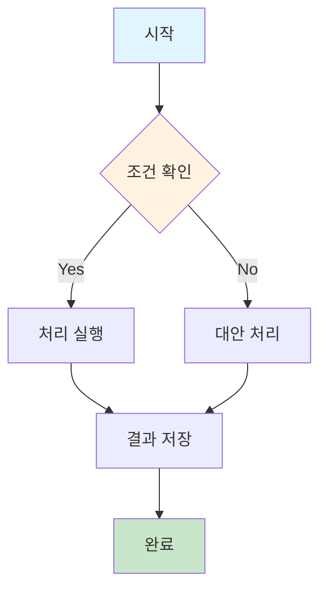

## 2. 시퀀스 다이어그램 (Sequence Diagram)
객체 간의 상호작용과 메시지 흐름을 시간순으로 보여줍니다.

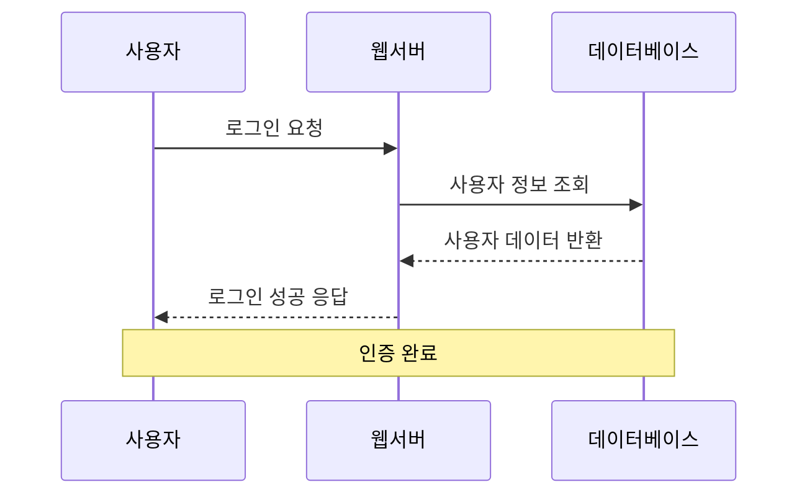

## 3. 클래스 다이어그램 (Class Diagram)
객체지향 프로그래밍에서 클래스 간의 관계를 표현합니다.

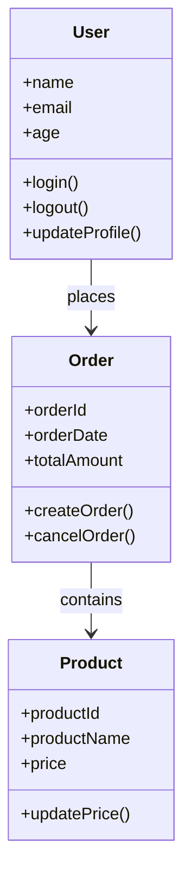

## 4. 상태 다이어그램 (State Diagram)
시스템이나 객체의 상태 변화를 나타냅니다.

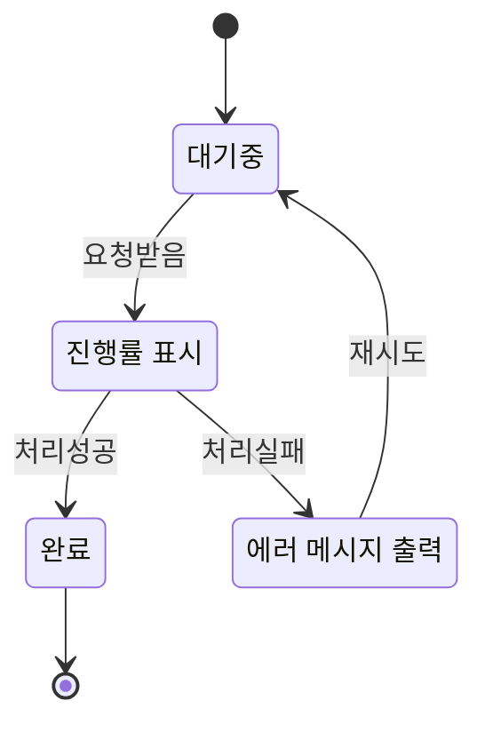

## 5. 간트 차트 (Gantt Chart)
프로젝트 일정과 작업 진행 상황을 시각화합니다.

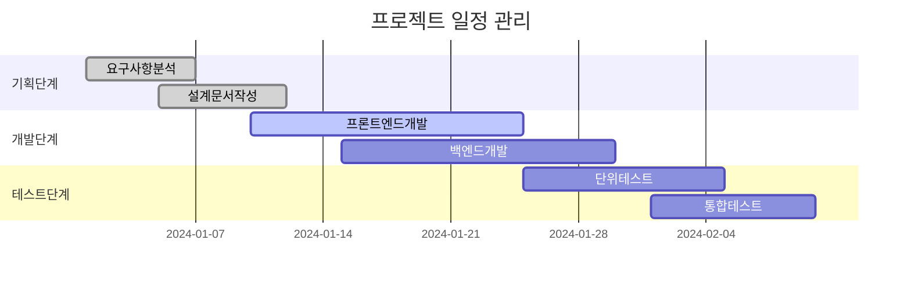

## 6. 파이 차트 (Pie Chart)
데이터의 비율을 원형 차트로 표현합니다.

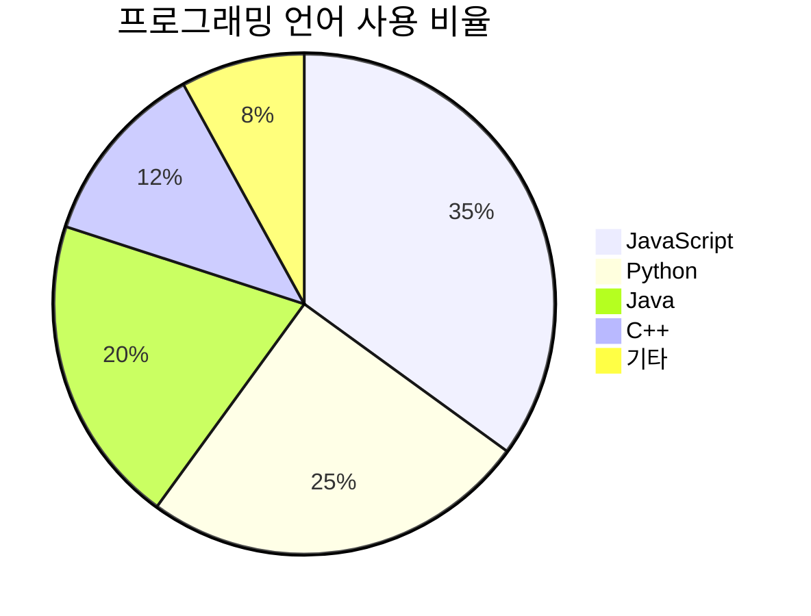

## 7. 깃 브랜치 구조 (Git Graph → Graph로 구현)
Git 저장소의 브랜치와 커밋 히스토리를 시각화합니다.

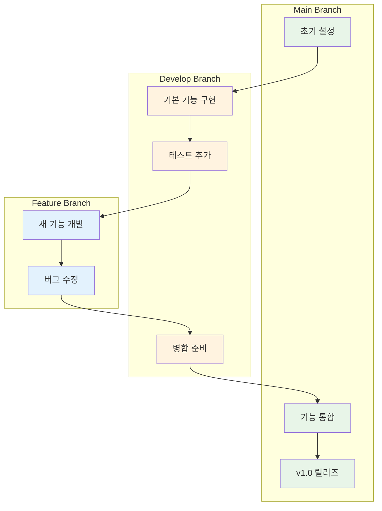

## 8. ER 다이어그램 (Entity Relationship Diagram)
데이터베이스의 엔티티와 관계를 모델링합니다.

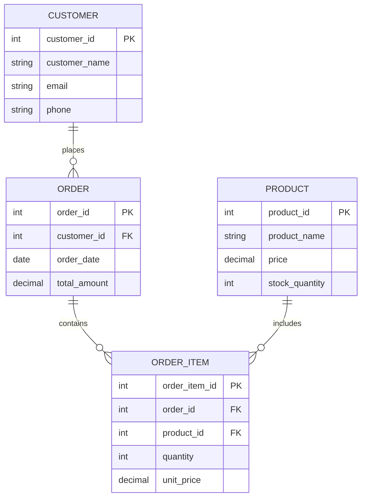

## 9. 사용자 여정 (User Journey)
사용자의 경험과 감정 변화를 단계별로 표현합니다.

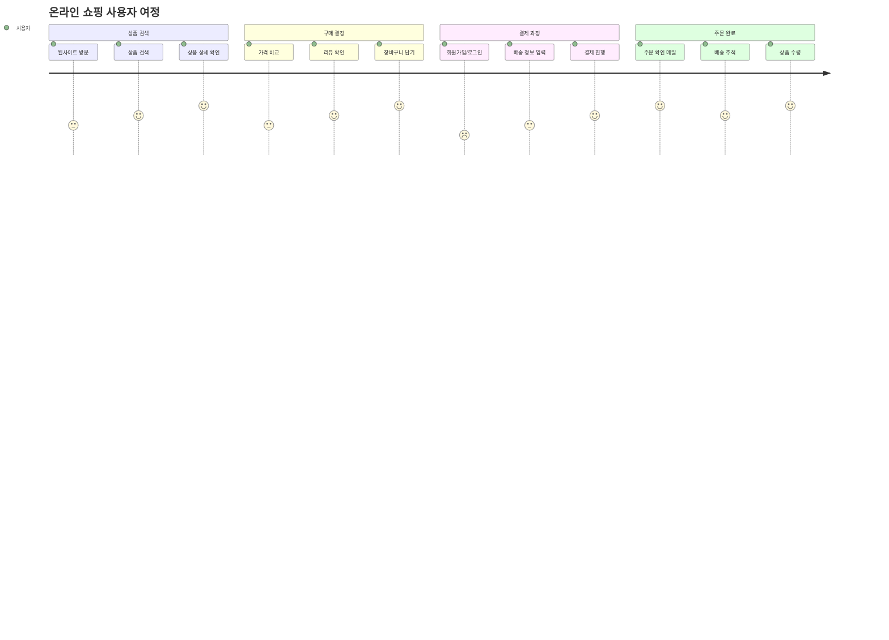

---

## 미지원 다이어그램의 대체 방법

### 10. 개념 구조도 (Mindmap → Graph로 구현)
아이디어나 개념을 중심에서 가지치기 형태로 정리합니다.

```mermaid
graph TD
    ROOT["웹 개발"]
    
    subgraph "프론트엔드"
        HTML["HTML"]
        CSS["CSS"]
        JS["JavaScript"]
        
        HTML --> TAG["시맨틱 태그"]
        HTML --> ACC["접근성"]
        CSS --> RES["반응형 디자인"]
        CSS --> ANI["애니메이션"]
        JS --> ES6["ES6+"]
        JS --> FW["프레임워크"]
        FW --> REACT["React"]
        FW --> VUE["Vue"]
        FW --> ANG["Angular"]
    end
    
    subgraph "백엔드"
        SERVER["서버"]
        DATABASE["데이터베이스"]
        API["API"]
        
        SERVER --> NODE["Node.js"]
        SERVER --> PY["Python"]
        SERVER --> JAVA["Java"]
        DATABASE --> MYSQL["MySQL"]
        DATABASE --> MONGO["MongoDB"]
        DATABASE --> PG["PostgreSQL"]
        API --> REST["REST"]
        API --> GQL["GraphQL"]
    end
    
    subgraph "도구"
        VCS["버전 관리"]
        BUILD["빌드 도구"]
        TEST["테스트"]
        
        VCS --> GIT["Git"]
        VCS --> GITHUB["GitHub"]
        BUILD --> WP["Webpack"]
        BUILD --> VITE["Vite"]
        TEST --> JEST["Jest"]
        TEST --> CY["Cypress"]
    end
    
    ROOT --> HTML
    ROOT --> SERVER
    ROOT --> VCS
    
    style ROOT fill:#e8f5e8
    style HTML fill:#e3f2fd
    style SERVER fill:#fff3e0
    style VCS fill:#ffcc80
```

### 11. 타임라인 (Timeline → Gantt Chart로 구현)
시간순으로 이벤트나 마일스톤을 표시합니다.

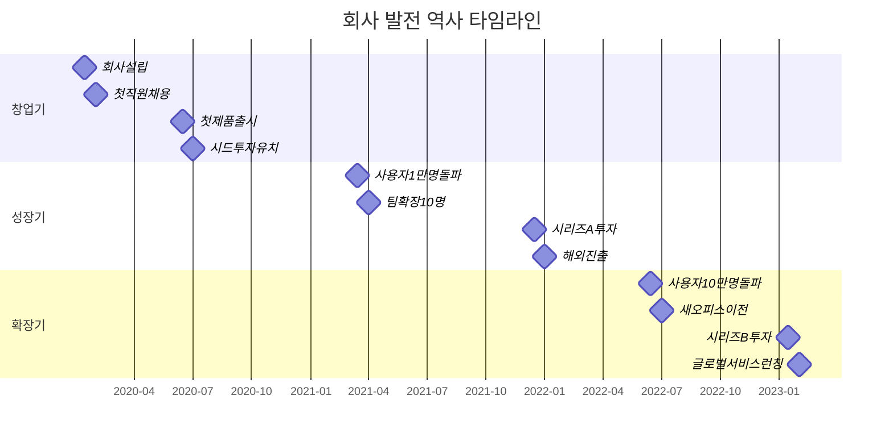

#### 기간이 있는 작업 버전 (실제 작업 기간 표현)

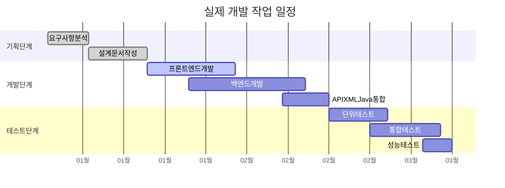

### 12. 우선순위 매트릭스 (QuadrantChart → Graph로 구현)
두 축을 기준으로 항목들을 4개 영역으로 분류합니다.

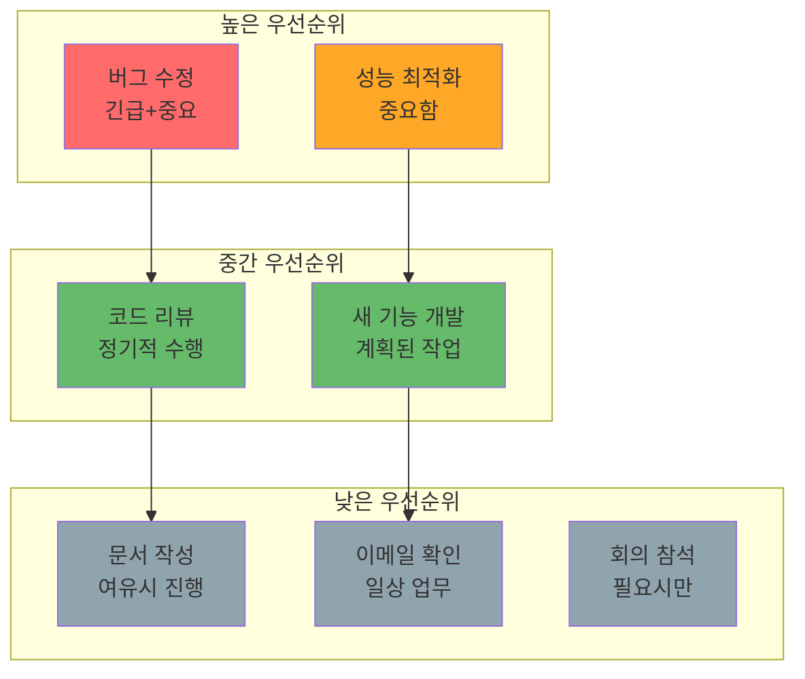

### 13. 요구사항 관계도 (RequirementDiagram → Graph로 구현)
시스템 요구사항과 그 관계를 표현합니다.

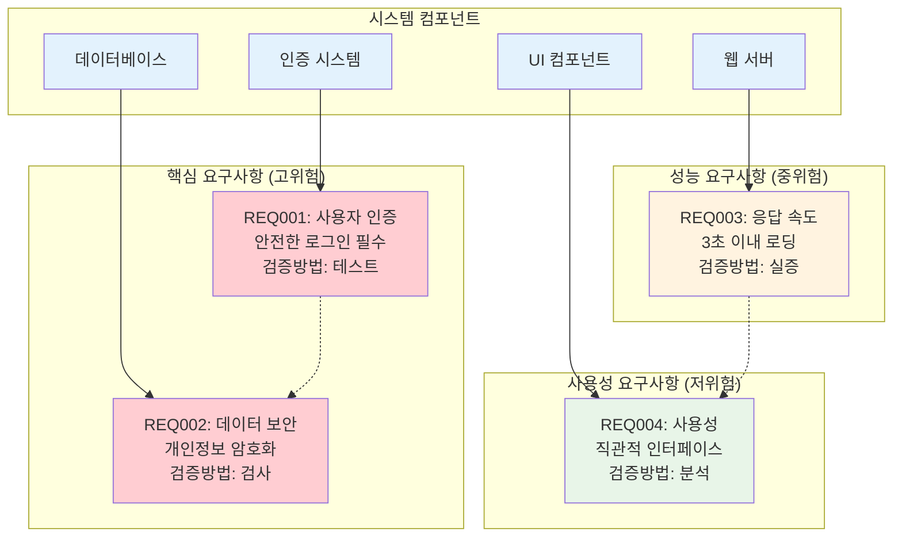

---

## 참고사항

### Mermaid 에러 방지 팁
1. **HTML 태그**: `<tag>` → `&lt;tag&gt;`로 변환
2. **줄바꿈**: `\n` 우선, 안되면 ` ` 사용
3. **긴 라벨**: `"내용"` 큰따옴표로 감싸기
4. **이모지**: 단순 기호 사용 (`✔`, `✗`)
5. **중복 정의**: 같은 관계나 스타일 중복 제거
6. **시퀀스 다이어그램**: participant 식별자는 영문, `as` 키워드로 한글 표시
7. **초기화 블록**: 큰따옴표 JSON (`{"theme":"default"}`)
8. **화살표**: `->` 사용 (유니코드 `→` 금지)
9. **간트차트**: 한글에서 공백/특수문자 제거 (파일 스캔 → 파일스캔, XML/Java → XMLJava)
10. **클래스다이어그램**: 타입 제거 (+String name → +name), 단순 관계 (||--o{ → -->)

### MarkText/Zettlr 완전 지원 다이어그램 (최종 확정)
- ✅ `flowchart` / `graph`: 플로우차트, 네트워크, 마인드맵, 요구사항, Git브랜치
- ✅ `sequenceDiagram`: 시퀀스 다이어그램 (participant는 영문 필수)
- ✅ `classDiagram`: 클래스 다이어그램 (타입 제거, 단순 관계)
- ✅ `stateDiagram-v2`: 상태 다이어그램
- ✅ `gantt`: 간트 차트 (공백/특수문자 제거, 타임라인 표현 가능)
- ✅ `pie`: 파이 차트
- ✅ `erDiagram`: ER 다이어그램

### 구버전 미지원 → 대체 방법 (필수 적용)
- ❌ `timeline` (v9+) → ✅ `gantt`의 `milestone` 사용
- ❌ `quadrantChart` (v9+) → ✅ `graph`의 `subgraph` 사용
- ❌ `requirementDiagram` (v9+) → ✅ `graph`의 `subgraph`로 요구사항 표현
- ❌ `mindmap` (v9+) → ✅ `graph`의 계층 구조로 개념 표현
- ❌ `gitgraph` (미지원) → ✅ `graph`의 `subgraph`로 브랜치 구조 표현
- ❌ `journey` (일부 환경 불안정) → ✅ `flowchart`로 단계별 흐름 표현

### 완전 호환 보장
✅ 위 대체 방법을 사용하면 MarkText/Zettlr에서 100% 호환됩니다.

### 환경별 대응 가이드

#### MarkText 사용 시
- `\n` 대신 ` ` 태그 우선 사용
- 복잡한 한글 라벨은 반드시 큰따옴표로 감싸기
- 특수문자 포함 시 HTML 엔티티 사용

#### VS Code + Mermaid Extension
- 표준 `\n` 문법 정상 동작
- 실시간 미리보기에서 오류 확인 가능

#### GitHub/GitLab
- 표준 Mermaid 문법 지원
- 이모지 지원 제한적

### 디버깅 방법

#### 1. 단계별 축소
복잡한 다이어그램에서 오류 발생 시:
1. 노드 하나씩 제거하면서 테스트
2. 오류 발생 지점 특정
3. 해당 부분만 수정

#### 2. 브라우저 개발자 도구 활용
- F12 → Console 탭에서 Mermaid 오류 메시지 확인
- 구체적인 파싱 오류 위치 파악 가능

#### 3. 온라인 Mermaid 에디터 활용
- https://mermaid.live/ 에서 테스트
- 실시간으로 오류 확인 및 수정

### 최종 요약

#### ✅ 안전한 작성법
1. HTML 태그: `&lt;tag&gt;` 사용
2. 줄바꿈: `\n` 우선, 안되면 ` ` 사용  
3. 긴 라벨: `"내용"` 큰따옴표로 감싸기
4. 이모지: 단순 기호 사용 (`✔`, `✗`)
5. 중복: 관계/스타일 중복 제거
6. ERD: 단순 문법만 사용 (PK/FK 불가)
7. init: 큰따옴표 JSON (`{"theme":"default"}`)
8. 화살표: `->` 사용 (유니코드 `→` 금지)
9. 시퀀스: participant 식별자는 영문, `as`로 한글 표시

#### 🔧 문제 해결 순서
1. **기본 문법 확인**: 표준 Mermaid 문법 준수
2. **환경 확인**: 사용 중인 뷰어/에디터 특성 파악
3. **단계적 수정**: 복잡한 부분부터 단순화
4. **테스트**: 온라인 에디터에서 검증
5. **적용**: 실제 환경에 반영

**작성일**: 2025-09-19  
**용도**: MarkText/Zettlr 호환 Mermaid 다이어그램 가이드  
**기준 환경**: MarkText, Zettlr (Mermaid v8.14.0)