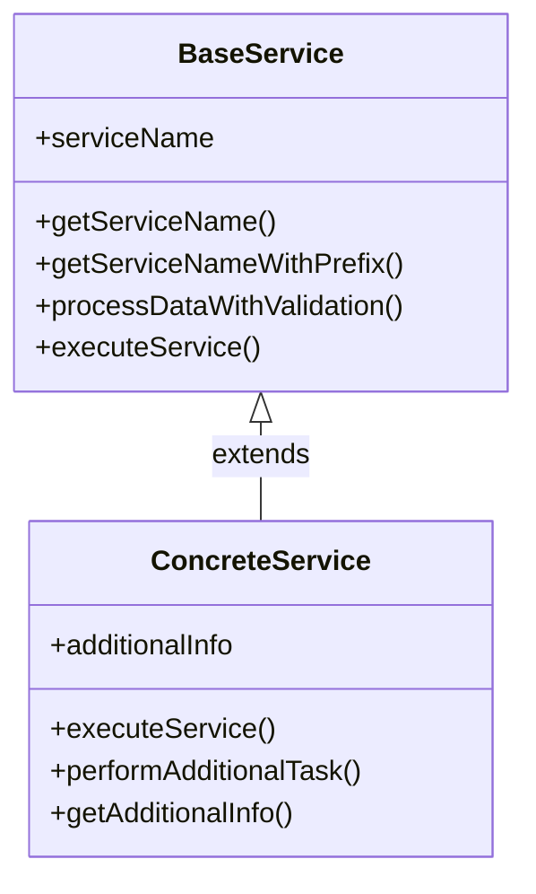
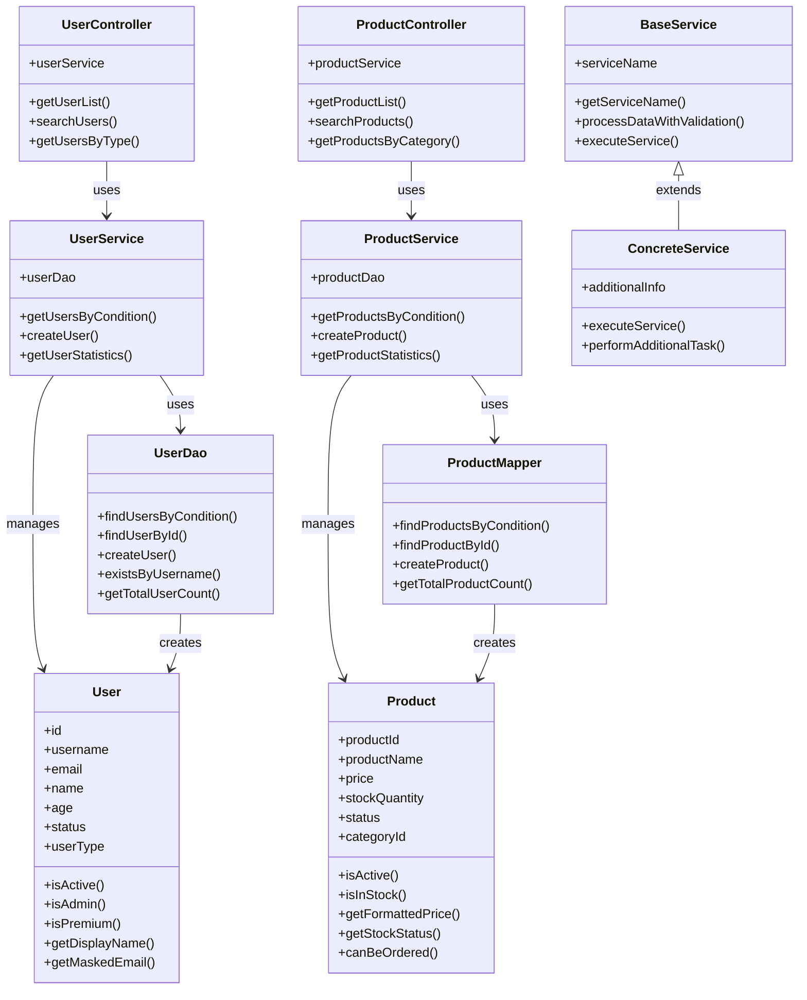
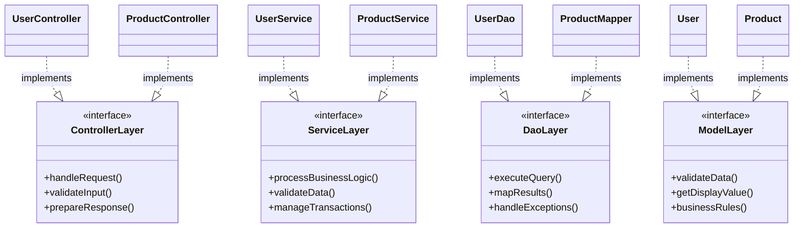
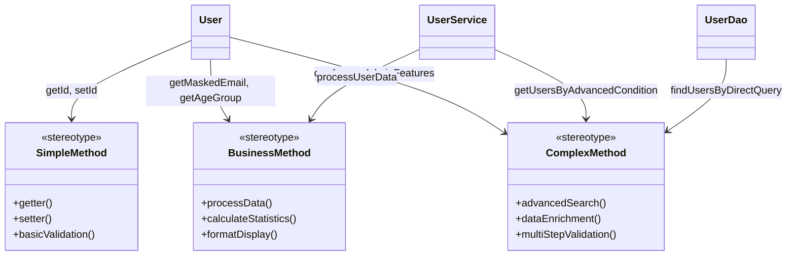

# SampleSrc 프로젝트 클래스다이어그램 샘플

## 1. 사용자 관리 모듈 클래스다이어그램

```mermaid
classDiagram
    class User {
        +id
        +username
        +email
        +password
        +name
        +age
        +status
        +userType
        +createdDate
        +updatedDate
        +phone
        +address
        +getId()
        +setId()
        +getUsername()
        +setUsername()
        +getEmail()
        +setEmail()
        +isActive()
        +isAdmin()
        +isPremium()
        +isAdult()
        +getDisplayName()
        +getMaskedEmail()
        +getMaskedPhone()
        +getAccountAgeInDays()
        +getStatusDisplayName()
        +getUserTypeDisplayName()
        +hasValidEmail()
        +hasValidPhone()
        +getAgeGroup()
        +canAccessAdminFeatures()
        +canAccessPremiumFeatures()
        +getLastUpdateInfo()
    }
    
    class UserController {
        +userService
        +getUserList()
        +searchUsers()
        +getUsersByType()
        +validateSearchParameters()
        +validateAdvancedSearchParameters()
        +calculateUserStatistics()
        +analyzeSearchResults()
        +calculateTypeStatistics()
        +applyPaging()
        +isValidUserType()
        +calculateAgeRange()
        +calculateStatusDistribution()
        +logUserListAccess()
        +logAdvancedSearch()
        +logTypeBasedAccess()
    }
    
    class UserService {
        +userDao
        +getUsersByCondition()
        +getUsersByAdvancedCondition()
        +getUsersByType()
        +createUser()
        +getUserStatistics()
        +validateSearchParams()
        +processUserData()
        +processAdvancedSearchParams()
        +enrichUserData()
        +isValidUserType()
        +processUserTypeSpecific()
        +validateUserData()
        +checkUserDuplication()
        +processUserCreationData()
        +postCreateUserProcessing()
        +processStatisticsData()
        +getUserTypeDisplayName()
        +getStatusDisplayName()
        +validateDateFormat()
        +hashPassword()
    }
    
    class UserDao {
        +findUsersByCondition()
        +findUsersByAdvancedCondition()
        +findUsersByType()
        +findUserById()
        +createUser()
        +updateUser()
        +deleteUser()
        +existsByUsername()
        +existsByEmail()
        +isEmailVerified()
        +isPhoneVerified()
        +getTotalUserCount()
        +getActiveUserCount()
        +getNewUsersTodayCount()
        +getPremiumUserCount()
        +findUsersByDirectQuery()
        +generateSampleUsers()
        +generateAdvancedSampleUsers()
        +generateUsersByType()
        +generateUserById()
        +generateNewUser()
        +generateUpdatedUser()
    }
    
    UserController --> UserService : uses
    UserService --> UserDao : uses
    UserService --> User : manages
    UserDao --> User : creates
```



## 2. 상품 관리 모듈 클래스다이어그램

```mermaid
classDiagram
    class Product {
        +productId
        +productName
        +description
        +price
        +stockQuantity
        +status
        +categoryId
        +brandId
        +supplierId
        +warehouseId
        +createdDate
        +updatedDate
        +delYn
        +getProductId()
        +setProductId()
        +getProductName()
        +setProductName()
        +getDescription()
        +setDescription()
        +getPrice()
        +setPrice()
        +getStockQuantity()
        +setStockQuantity()
        +isActive()
        +isInStock()
        +isLowStock()
        +isOutOfStock()
        +isDeleted()
        +getStockStatus()
        +getFormattedPrice()
        +getCategoryDisplayName()
        +getStatusDisplayName()
        +isExpensive()
        +isCheap()
        +getPriceRange()
        +getDaysSinceCreated()
        +isNewProduct()
        +isOldProduct()
        +getProductAge()
        +hasValidPrice()
        +hasValidStock()
        +getDisplayName()
        +canBeOrdered()
        +getStockPercentage()
        +getStockLevel()
    }
    
    class ProductController {
        +productService
        +getProductList()
        +searchProducts()
        +getProductsByCategory()
        +validateSearchParameters()
        +calculateProductStatistics()
        +analyzeSearchResults()
        +logProductAccess()
    }
    
    class ProductService {
        +productDao
        +getProductsByCondition()
        +getProductsByCategory()
        +createProduct()
        +updateProduct()
        +deleteProduct()
        +getProductStatistics()
        +validateProductData()
        +processProductData()
        +enrichProductData()
    }
    
    class ProductMapper {
        +findProductsByCondition()
        +findProductsByCategory()
        +findProductById()
        +createProduct()
        +updateProduct()
        +deleteProduct()
        +getTotalProductCount()
        +getActiveProductCount()
    }
    
    ProductController --> ProductService : uses
    ProductService --> ProductMapper : uses
    ProductService --> Product : manages
    ProductMapper --> Product : creates
```



## 3. 상속 관계 클래스다이어그램



## 4. 전체 시스템 아키텍처 클래스다이어그램



## 5. 레이어별 클래스 분류



## 6. 복잡도별 메서드 분류



---

## 클래스다이어그램 생성 방법

### 1. 메타데이터베이스 기반 자동 생성
```python
def generate_class_diagram_from_metadata(project_id: int) -> str:
    """메타데이터베이스에서 클래스다이어그램 생성"""
    
    # 1. 클래스 정보 조회
    classes = get_classes_from_db(project_id)
    
    # 2. 메서드 정보 조회 (components 테이블)
    methods = get_methods_from_db(project_id)
    
    # 3. 상속 관계 조회 (relationships 테이블)
    inheritances = get_inheritance_relationships(project_id)
    
    # 4. 의존성 관계 조회 (CALL_METHOD 관계)
    dependencies = get_dependency_relationships(project_id)
    
    # 5. Mermaid classDiagram 생성
    diagram_lines = ["classDiagram"]
    
    # 클래스 정의
    for cls in classes:
        diagram_lines.append(f"    class {cls.class_name} {{")
        
        # 메서드 추가 (MarkText 호환: 타입 제거)
        class_methods = [m for m in methods if m.parent_id == cls.class_id]
        for method in class_methods:
            diagram_lines.append(f"        +{method.component_name}()")
        
        diagram_lines.append("    }")
    
    # 상속 관계 추가
    for inherit in inheritances:
        src_class = get_class_by_id(inherit.src_id)
        dst_class = get_class_by_id(inherit.dst_id)
        diagram_lines.append(f"    {dst_class.class_name} <|-- {src_class.class_name} : extends")
    
    # 의존성 관계 추가 (단순 화살표)
    for dep in dependencies:
        src_class = get_class_by_component_id(dep.src_id)
        dst_class = get_class_by_component_id(dep.dst_id)
        if src_class and dst_class:
            diagram_lines.append(f"    {src_class.class_name} --> {dst_class.class_name} : uses")
    
    return "\n".join(diagram_lines)
```

### 2. 레이어별 클래스 분류
```python
def generate_layer_class_diagram(project_id: int) -> str:
    """레이어별 클래스 분류 다이어그램 생성"""
    
    # 레이어별 클래스 조회
    controllers = get_classes_by_layer(project_id, 'CONTROLLER')
    services = get_classes_by_layer(project_id, 'SERVICE')
    daos = get_classes_by_layer(project_id, 'REPOSITORY')
    models = get_classes_by_layer(project_id, 'MODEL')
    
    diagram_lines = ["classDiagram"]
    
    # 각 레이어별 클래스 정의
    for layer_name, classes in [
        ("Controller", controllers),
        ("Service", services), 
        ("Dao", daos),
        ("Model", models)
    ]:
        for cls in classes:
            diagram_lines.append(f"    class {cls.class_name} {{")
            diagram_lines.append(f"        <<{layer_name}>>")
            
            # 주요 메서드만 표시 (최대 5개)
            main_methods = get_main_methods(cls.class_id, limit=5)
            for method in main_methods:
                diagram_lines.append(f"        +{method.component_name}()")
            
            diagram_lines.append("    }")
    
    # 레이어 간 관계 추가
    layer_relationships = get_layer_relationships(project_id)
    for rel in layer_relationships:
        src_class = get_class_by_id(rel.src_id)
        dst_class = get_class_by_id(rel.dst_id)
        diagram_lines.append(f"    {src_class.class_name} --> {dst_class.class_name} : uses")
    
    return "\n".join(diagram_lines)
```

### 3. 상속 관계 중심 클래스다이어그램
```python
def generate_inheritance_class_diagram(project_id: int) -> str:
    """상속 관계 중심 클래스다이어그램 생성"""
    
    # 상속 관계가 있는 클래스들만 조회
    inheritance_relationships = get_inheritance_relationships(project_id)
    
    diagram_lines = ["classDiagram"]
    
    # 관련 클래스들 정의
    related_classes = set()
    for rel in inheritance_relationships:
        related_classes.add(rel.src_id)  # 자식 클래스
        related_classes.add(rel.dst_id)  # 부모 클래스
    
    for class_id in related_classes:
        cls = get_class_by_id(class_id)
        diagram_lines.append(f"    class {cls.class_name} {{")
        
        # 주요 메서드만 표시
        methods = get_methods_by_class_id(class_id, limit=8)
        for method in methods:
            diagram_lines.append(f"        +{method.component_name}()")
        
        diagram_lines.append("    }")
    
    # 상속 관계 표시
    for rel in inheritance_relationships:
        parent_class = get_class_by_id(rel.dst_id)
        child_class = get_class_by_id(rel.src_id)
        diagram_lines.append(f"    {parent_class.class_name} <|-- {child_class.class_name} : extends")
    
    return "\n".join(diagram_lines)
```

## 리포트 생성기에 클래스다이어그램 추가 방안

### 1. 새로운 리포트 타입 추가
- **파일명**: `class_diagram_report_generator.py`
- **기능**: 메타데이터베이스에서 클래스 정보를 읽어 Mermaid classDiagram 생성
- **출력**: HTML 파일로 클래스다이어그램 리포트 생성

### 2. 리포트 종류
1. **전체 클래스다이어그램**: 모든 클래스와 관계
2. **레이어별 클래스다이어그램**: Controller, Service, DAO, Model 레이어별
3. **상속 관계 다이어그램**: 상속 관계가 있는 클래스들만
4. **패키지별 클래스다이어그램**: 패키지 단위로 분류
5. **복잡도별 클래스다이어그램**: 메서드 복잡도에 따른 분류

### 3. 구현 예시
```python
class ClassDiagramReportGenerator:
    def __init__(self, project_id):
        self.project_id = project_id
    
    def generate_all_reports(self):
        """모든 클래스다이어그램 리포트 생성"""
        
        reports = {
            'full': self.generate_full_class_diagram(),
            'layer': self.generate_layer_class_diagram(),
            'inheritance': self.generate_inheritance_diagram(),
            'package': self.generate_package_diagram(),
            'complexity': self.generate_complexity_diagram()
        }
        
        return reports
    
    def save_html_report(self, diagram_content, report_type):
        """HTML 리포트 파일 저장"""
        
        html_template = """
        <!DOCTYPE html>
        <html>
        <head>
            <title>SampleSrc 클래스다이어그램 - {report_type}</title>
            <script src="https://cdn.jsdelivr.net/npm/mermaid/dist/mermaid.min.js"></script>
        </head>
        <body>
            <h1>SampleSrc 프로젝트 클래스다이어그램</h1>
            <div class="mermaid">
{diagram_content}
            </div>
            <script>
                mermaid.initialize({{startOnLoad: true}});
            </script>
        </body>
        </html>
        """
        
        html_content = html_template.format(
            report_type=report_type,
            diagram_content=diagram_content
        )
        
        filename = f"[SampleSrc]_ClassDiagram_{report_type}_{timestamp}.html"
        with open(filename, 'w', encoding='utf-8') as f:
            f.write(html_content)
        
        return filename
```

---

**작성일**: 2025-09-19  
**기반 프로젝트**: SampleSrc  
**용도**: 클래스다이어그램 리포트 생성 참조용


