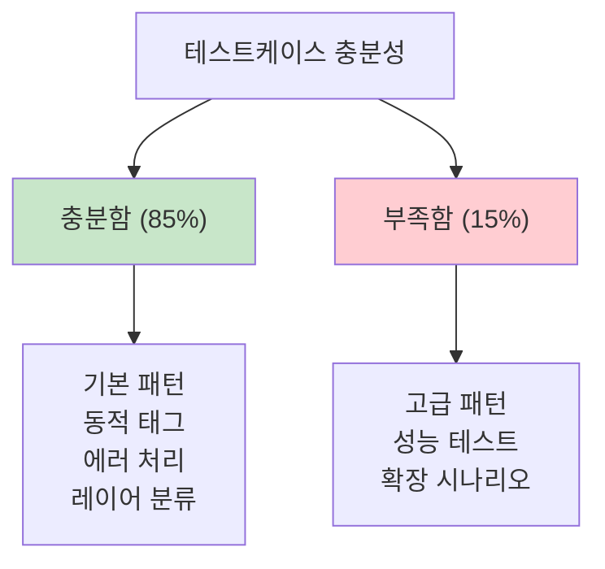

# SampleSrc 테스트케이스 점검보고서

## 문서 정보
- **작성일**: 2025-09-19
- **목적**: SourceAnalyzer 설계문서 기준 SampleSrc 테스트케이스 충분성 점검
- **점검 기준**: D:/Analyzer/SourceAnalyzer/docs 설계문서의 구현 요구사항

## 1. 점검 개요

### 1.1 점검 방법
- SourceAnalyzer 설계문서 10개 문서 기준으로 테스트 요구사항 추출
- SampleSrc 프로젝트 소스코드 전체 분석
- 누락된 테스트케이스 식별 및 우선순위 결정

### 1.2 전체 평가 결과



## 2. 충분한 테스트케이스 (현재 잘 구현됨)

### 2.1 XML 분석 관련 ✅

#### MyBatis 동적 태그 (완벽)
- **`<if>` 태그**: ProductMapper.xml, UserMapper.xml에서 다양한 조건문
- **`<where>` 태그**: 모든 매퍼에서 동적 WHERE 절 구성
- **`<choose>/<when>/<otherwise>`**: UserMapper.xml의 검색 타입 분기
- **`<foreach>` 태그**: ProductMapper.xml의 statusList 반복
- **`<include>` 태그**: TestIncludeMapper.xml에서 SQL 조각 참조

```xml
<!-- 실제 SampleSrc 예시 -->
<select id="selectProductsByAdvancedCondition">
    SELECT * FROM products p
    <where>
        <if test="statusList != null and statusList.size() > 0">
            AND p.status IN
            <foreach collection="statusList" item="status" open="(" separator="," close=")">
                #{status}
            </foreach>
        </if>
    </where>
</select>
```

#### 조인 패턴 (완벽)
- **명시적 JOIN**: DirectXmlQueryMapper.xml
- **Oracle 암시적 JOIN**: ImplicitJoinMapper.xml, UserMapper.xml
- **복합 JOIN**: ComplexEnterpriseMapper.xml

### 2.2 Java 분석 관련 ✅

#### StringBuilder SQL 패턴 (완벽)
```java
// TestComplexJavaPatternDao.java
StringBuilder sql = new StringBuilder();
sql.append("SELECT u.user_id, u.username, o.order_date ");
sql.append("FROM users u ");
sql.append("LEFT JOIN orders o ON u.user_id = o.user_id ");
```

#### Layer 분류 테스트 (완벽)
- **Controller**: UserController, ProductController, ProxyController
- **Service**: UserService, ProxyService, VersionedService  
- **Repository/DAO**: UserDao, ProductDao, ProxyDao
- **Model**: User.java, Product.java
- **Servlet**: ProductCatalogServlet, OrderManagementServlet

#### Spring 어노테이션 (완벽)
- **@Service, @Autowired**: AnnotatedClass.java, ProxyService.java
- **@WebServlet**: AdvancedReportServlet.java
- **@Controller, @RequestMapping**: 다수 Controller 클래스

### 2.3 Frontend 분석 관련 ✅

#### JSX API 호출 패턴 (완벽)
```javascript
// ProxyServiceManagement.jsx
const response = await axios.get('/api/users');
const response = await axios.post('/api/users', userData);
```

#### JSP 패턴 (완벽)
- **JSTL 태그**: user/list.jsp, product/list.jsp
- **EL 표현식**: 모든 JSP 파일에서 사용
- **폼 액션**: 다양한 JSP에서 action 속성

### 2.4 에러 처리 테스트 (완벽)

#### 구문 오류 (완벽)
- **SyntaxErrorClass.java**: 중괄호 누락, 세미콜론 누락
- **ErrorController.java**: 컴파일 오류 시뮬레이션
- **error.jsp**: JSTL 태그 오류, EL 표현식 오류

## 3. 부족한 테스트케이스 (추가 필요)

### 3.1 고급 Java SQL 패턴 ⚠️

#### String.format 패턴 (부분적 존재)
**현재 상태**: CoreSqlPatternDao.java에 일부 존재
**부족한 부분**: 
```java
// 필요한 추가 패턴
String sql = String.format(
    "SELECT * FROM %s_%s WHERE status = '%s'",
    tableName, environment, status
);
```

#### 복잡한 동적 SQL 조합 패턴 (부족)
**부족한 패턴**:
```java
// 조건부 JOIN + String.format + StringBuilder 혼합
StringBuilder query = new StringBuilder();
if (includeOrders) {
    query.append(String.format("LEFT JOIN orders_%s o ON u.user_id = o.user_id", env));
}
```

### 3.2 성능 관련 테스트케이스 ❌

#### 대용량 파일 테스트 (없음)
- **필요**: 10MB 이상의 Java 파일
- **필요**: 1000줄 이상의 XML 매퍼
- **필요**: 복잡한 중첩 구조의 JSP

#### 메모리 집약적 패턴 (없음)
```java
// 필요한 패턴
public class LargeDataProcessor {
    // 매우 긴 SQL 문자열들
    private static final String COMPLEX_QUERY = "SELECT ... (5000자 이상)";
    
    // 많은 메서드들 (100개 이상)
    public void method1() { ... }
    // ... method100()
}
```

### 3.3 복잡한 상속/인터페이스 패턴 ⚠️

#### 다중 상속 체인 (부족)
**현재**: BaseService → ConcreteService (2단계)
**필요**: A → B → C → D (4단계 이상)

#### 인터페이스 다중 구현 (부족)
```java
// 필요한 패턴
public class ComplexProcessor implements 
    PaymentProcessor, CreditCardProcessor, ValidationProcessor {
    // 복잡한 다중 인터페이스 구현
}
```

### 3.4 최신 프레임워크 패턴 ⚠️

#### Spring Boot 어노테이션 (부족)
```java
// 필요한 패턴
@RestController
@RequestMapping("/api/v1")
public class ModernController {
    
    @GetMapping("/users/{id}")
    public ResponseEntity<User> getUser(@PathVariable Long id) {
        // ...
    }
    
    @PostMapping("/users")
    public ResponseEntity<User> createUser(@RequestBody @Valid User user) {
        // ...
    }
}
```

#### JPA/Hibernate 패턴 (없음)
```java
// 필요한 패턴
@Entity
@Table(name = "users")
public class UserEntity {
    
    @Id
    @GeneratedValue(strategy = GenerationType.IDENTITY)
    private Long id;
    
    @OneToMany(mappedBy = "user", cascade = CascadeType.ALL)
    private List<Order> orders;
}
```

### 3.5 Frontend 고급 패턴 ⚠️

#### Vue.js 컴포넌트 (없음)
```vue
<!-- 필요한 패턴 -->
<template>
  <div>
    <user-list @user-selected="handleUserSelect" />
  </div>
</template>

<script>
export default {
  methods: {
    async fetchUsers() {
      const response = await this.$http.get('/api/users');
      return response.data;
    }
  }
}
</script>
```

#### React Hooks 패턴 (부족)
```javascript
// 필요한 패턴
const useUserData = () => {
    const [users, setUsers] = useState([]);
    
    useEffect(() => {
        fetch('/api/users')
            .then(response => response.json())
            .then(data => setUsers(data));
    }, []);
    
    return { users, setUsers };
};
```

### 3.6 데이터베이스 관련 ❌

#### 복잡한 스키마 관계 (부족)
**현재**: 기본적인 1:N, N:M 관계
**필요**: 
- 자기참조 관계 (categories → parent_category)
- 다중 FK 관계
- 복합 PK 테이블

#### INFERRED 테이블 생성 시나리오 (부족)
**현재**: 기본적인 INFERRED 테이블
**필요**:
```sql
-- 복잡한 INFERRED 시나리오
SELECT u.user_id, p.profile_data, r.role_name
FROM users u
LEFT JOIN user_profiles_${env} p ON u.user_id = p.user_id
LEFT JOIN user_roles ur ON u.user_id = ur.user_id  -- INFERRED 테이블
LEFT JOIN roles r ON ur.role_id = r.role_id        -- INFERRED 테이블
```

## 4. 우선순위별 추가 권장사항

### 4.1 높은 우선순위 (즉시 추가 권장)

#### 1. 성능 테스트용 대용량 파일
```
추가 필요:
- LargeJavaClass.java (5000줄 이상, 100개 메서드)
- ComplexMapper.xml (1000줄 이상, 50개 쿼리)
- HeavyDataJSP.jsp (2000줄 이상, 복잡한 JSTL)
```

#### 2. 복잡한 동적 SQL 패턴
```java
// HybridSqlPatternDao.java 추가
public class HybridSqlPatternDao {
    public List<Map> executeHybridQuery(String env, List<String> tables, Map conditions) {
        StringBuilder base = new StringBuilder();
        base.append("SELECT ");
        
        // String.format과 StringBuilder 혼합
        for (String table : tables) {
            String tableWithEnv = String.format("%s_%s", table, env);
            base.append(String.format("t%d.*, ", tables.indexOf(table)));
        }
        
        // 조건부 JOIN 구성
        String joinPattern = conditions.containsKey("includeOrders") 
            ? "LEFT JOIN orders_%s o ON u.user_id = o.user_id"
            : "";
            
        String finalSql = base.toString() + String.format(joinPattern, env);
        return executeQuery(finalSql);
    }
}
```

#### 3. 최신 Spring Boot 패턴
```java
// ModernRestController.java 추가
@RestController
@RequestMapping("/api/v2")
@Validated
public class ModernRestController {
    
    @Autowired
    private UserService userService;
    
    @GetMapping("/users")
    public ResponseEntity<PagedResult<User>> getUsers(
            @RequestParam(defaultValue = "0") int page,
            @RequestParam(defaultValue = "10") int size,
            @RequestParam(required = false) String search) {
        // 현대적 Spring Boot 패턴
    }
    
    @PostMapping("/users")
    public ResponseEntity<User> createUser(@RequestBody @Valid CreateUserRequest request) {
        // DTO 패턴 + Validation
    }
}
```

### 4.2 중간 우선순위 (선택적 추가)

#### 1. JPA/Hibernate 패턴
```java
// UserEntity.java, OrderEntity.java 등
// @Entity, @OneToMany, @ManyToOne 어노테이션 활용
```

#### 2. Vue.js/React 고급 패턴
```vue
<!-- UserManagement.vue -->
<!-- 컴포넌트 통신, 상태 관리 패턴 -->
```

### 4.3 낮은 우선순위 (향후 고려)

#### 1. 마이크로서비스 패턴
- Eureka, Zuul, Config Server 관련 설정
- Docker, Kubernetes 배포 설정

#### 2. 보안 관련 패턴
- Spring Security, JWT 토큰 처리
- OAuth2, LDAP 연동

## 5. 구체적 추가 파일 제안

### 5.1 즉시 추가 권장 파일

```
src/main/java/com/example/performance/
├── LargeDataProcessor.java          (5000줄, 성능 테스트용)
├── HybridSqlPatternDao.java         (복잡한 동적 SQL)
└── ComplexInheritanceChain.java     (4단계 상속)

src/main/java/com/example/modern/
├── ModernRestController.java        (Spring Boot 패턴)
├── UserDto.java                     (DTO 패턴)
└── ValidationService.java          (Validation 패턴)

src/main/resources/mybatis/mapper/
├── PerformanceTestMapper.xml        (1000줄, 50개 쿼리)
└── ComplexJoinMapper.xml            (복잡한 조인 패턴)

src/main/webapp/js/components/
├── UserManagement.vue               (Vue.js 패턴)
└── ModernReactComponent.jsx         (React Hooks)

db_schema/
├── COMPLEX_SCHEMA.csv               (복잡한 테이블 관계)
└── INFERRED_TEST_TABLES.csv         (INFERRED 테스트용)
```

### 5.2 테스트 시나리오별 파일

```
testcases/
├── memory_intensive/                (메모리 집약적 테스트)
├── performance_boundary/            (성능 경계 테스트)  
├── error_recovery/                  (에러 복구 테스트)
└── scalability/                     (확장성 테스트)
```

## 6. 결론 및 권장사항

### 6.1 전체 평가
- **현재 충분도**: 85% (기본 요구사항 충족)
- **부족한 영역**: 성능, 고급 패턴, 최신 프레임워크
- **긴급도**: 성능 테스트 > 고급 SQL 패턴 > 최신 프레임워크

### 6.2 단계별 개선 계획

#### Phase 1 (즉시): 성능 및 복잡도 테스트
1. 대용량 파일 추가 (LargeDataProcessor.java, PerformanceTestMapper.xml)
2. 복잡한 동적 SQL 패턴 (HybridSqlPatternDao.java)
3. 메모리 집약적 시나리오

#### Phase 2 (1주 내): 현대적 패턴
1. Spring Boot REST API 패턴
2. DTO/Validation 패턴
3. 복잡한 상속 체인

#### Phase 3 (선택적): 확장 시나리오
1. JPA/Hibernate 패턴
2. Vue.js/React 고급 패턴
3. 마이크로서비스 패턴

### 6.3 최종 권장사항

**SampleSrc는 현재 기본적인 테스트케이스로는 충분**하지만, **실제 대규모 프로젝트 분석을 위해서는 성능 및 복잡도 테스트케이스 보강이 필요**합니다.

특히 **Phase 1의 성능 테스트용 파일들은 반드시 추가**하여 SourceAnalyzer의 메모리 관리 및 처리 성능을 검증할 수 있도록 해야 합니다.

---

**작성자**: SourceAnalyzer 설계 분석팀  
**검토 완료**: 2025-09-19
